# Standard Model Diagnostics

This vignette will demonstrate `pmxhelpr` functions for generating
standard model diagnostics.

First, we will load the required packages.

``` r
options(scipen = 999, rmarkdown.html_vignette.check_title = FALSE)
library(pmxhelpr)
library(dplyr, warn.conflicts =  FALSE)
library(ggplot2, warn.conflicts =  FALSE)
library(Hmisc, warn.conflicts = FALSE)
library(patchwork, warn.conflicts = FALSE)
```

For this vignette, we will generate model diagnostics for a PK model
(`model`) fit to `data_sad` dataset using the `data_sad_pkfit` dataset
internal to `pmxhelpr`. We can take a quick look at the dataset using
[`glimpse()`](https://pillar.r-lib.org/reference/glimpse.html) from the
dplyr package. Dataset definitions can also be viewed by calling
[`?data_sad_pkfit`](https://ryancrass.github.io/pmxhelpr/reference/data_sad_pkfit.md),
as one would to view the documentation for a package function.

``` r
glimpse(data_sad_pkfit)
#> Rows: 720
#> Columns: 25
#> $ LINE    <dbl> 1, 2, 3, 4, 5, 6, 7, 8, 9, 10, 11, 12, 13, 14, 15, 16, 17, 18,…
#> $ ID      <dbl> 1, 1, 1, 1, 1, 1, 1, 1, 1, 1, 1, 1, 1, 1, 1, 1, 1, 1, 1, 1, 2,…
#> $ TIME    <dbl> 0.00, 0.00, 0.48, 0.81, 1.49, 2.11, 3.05, 4.14, 5.14, 7.81, 12…
#> $ NTIME   <dbl> 0.0, 0.0, 0.5, 1.0, 1.5, 2.0, 3.0, 4.0, 5.0, 8.0, 12.0, 16.0, …
#> $ NDAY    <dbl> 1, 1, 1, 1, 1, 1, 1, 1, 1, 1, 1, 1, 2, 2, 3, 4, 5, 6, 7, 8, 1,…
#> $ DOSE    <dbl> 10, 10, 10, 10, 10, 10, 10, 10, 10, 10, 10, 10, 10, 10, 10, 10…
#> $ AMT     <dbl> NA, 10, NA, NA, NA, NA, NA, NA, NA, NA, NA, NA, NA, NA, NA, NA…
#> $ EVID    <dbl> 0, 1, 0, 0, 0, 0, 0, 0, 0, 0, 0, 0, 0, 0, 0, 0, 0, 0, 0, 0, 0,…
#> $ ODV     <dbl> NA, NA, NA, 2.02, 4.02, 3.50, 7.18, 9.31, 12.46, 13.43, 12.11,…
#> $ LDV     <dbl> NA, NA, NA, 0.7031, 1.3913, 1.2528, 1.9713, 2.2311, 2.5225, 2.…
#> $ CMT     <dbl> 2, 1, 2, 2, 2, 2, 2, 2, 2, 2, 2, 2, 2, 2, 2, 2, 2, 2, 2, 2, 2,…
#> $ MDV     <dbl> 1, NA, 1, 0, 0, 0, 0, 0, 0, 0, 0, 0, 0, 0, 1, 1, 1, 1, 1, 1, 1…
#> $ BLQ     <dbl> -1, NA, 1, 0, 0, 0, 0, 0, 0, 0, 0, 0, 0, 0, 1, 1, 1, 1, 1, 1, …
#> $ LLOQ    <dbl> 1, NA, 1, 1, 1, 1, 1, 1, 1, 1, 1, 1, 1, 1, 1, 1, 1, 1, 1, 1, 1…
#> $ FOOD    <dbl> 0, 0, 0, 0, 0, 0, 0, 0, 0, 0, 0, 0, 0, 0, 0, 0, 0, 0, 0, 0, 0,…
#> $ SEXF    <dbl> 1, 1, 1, 1, 1, 1, 1, 1, 1, 1, 1, 1, 1, 1, 1, 1, 1, 1, 1, 1, 1,…
#> $ RACE    <dbl> 2, 2, 2, 2, 2, 2, 2, 2, 2, 2, 2, 2, 2, 2, 2, 2, 2, 2, 2, 2, 1,…
#> $ AGEBL   <int> 25, 25, 25, 25, 25, 25, 25, 25, 25, 25, 25, 25, 25, 25, 25, 25…
#> $ WTBL    <dbl> 82.1, 82.1, 82.1, 82.1, 82.1, 82.1, 82.1, 82.1, 82.1, 82.1, 82…
#> $ SCRBL   <dbl> 0.87, 0.87, 0.87, 0.87, 0.87, 0.87, 0.87, 0.87, 0.87, 0.87, 0.…
#> $ CRCLBL  <dbl> 128, 128, 128, 128, 128, 128, 128, 128, 128, 128, 128, 128, 12…
#> $ USUBJID <chr> "STUDYNUM-SITENUM-1", "STUDYNUM-SITENUM-1", "STUDYNUM-SITENUM-…
#> $ PART    <chr> "Part 1-SAD", "Part 1-SAD", "Part 1-SAD", "Part 1-SAD", "Part …
#> $ IPRED   <dbl> 0.0000000000, 0.0000000000, 0.2399127105, 0.5809776251, 1.4434…
#> $ PRED    <dbl> 0.0000000000, 0.0000000000, 1.0373644222, 2.4699025938, 5.8692…
```

This dataset contains two additional variables relative to the observed
dataset used in model development (`data_sad`):

- `PRED`: population model predicted values accounting only for fixed
  effects (THETAs)
- `IPRED`: individual model predicted values accounting for fixed
  effects (THETAs) and level 1 (inter-individual) random effects (ETAs)

Let’s add some additional derived character variables, which may be
useful for plotting.

``` r
plot_data <- data_sad_pkfit %>% 
  mutate(FoodStatus = ifelse(FOOD == 0, "Fasted", "Fed"), 
         DoseGroup = paste0(DOSE, " mg ", FoodStatus), 
         DoseGroup = factor(DoseGroup, levels = c("10 mg Fasted", "50 mg Fasted", "100 mg Fasted", "100 mg Fed", 
                                                  "200 mg Fasted", "400 mg Fasted")))
```

## Population Overlay Goodness of Fit Plots

### Overview of `plot_popgof`

`pmxhelpr` includes a function for generating population overlay
goodness-of-fit (GOF) plots for model evaluation: `plot_popgof`.

*NOTE* `plot_popgof` inherits dataset variable handling functionality
and arguments from `df_mrgsim_replicate`.

Variable processing requires specification of two named lists of time
and output variables:

- `time_vars`: This argument provides a named vector of actual and
  nominal time variables. `NTIME` must be an exact binning variable.
  - Default is: c(`TIME`=`"TIME"`, `NTIME`=`"NTIME"`).
- `output_vars` This argument provides a named vector of input
  (observations) and output (model prediction) variables.
  - Default is: c(`PRED`= `"PRED"`, `IPRED` = `"IPRED"`, `DV`= `"DV"`).

The example dataset `data_sad_pkfit` only differs from these defaults in
the variable nname for the dependenrt variable, `"ODV"`. Thus, the most
basic population GOF plot can be obtained with:

``` r
plot_popgof(data = plot_data, output_vars = c(DV ="ODV")) +
  facet_wrap(~PART)
```

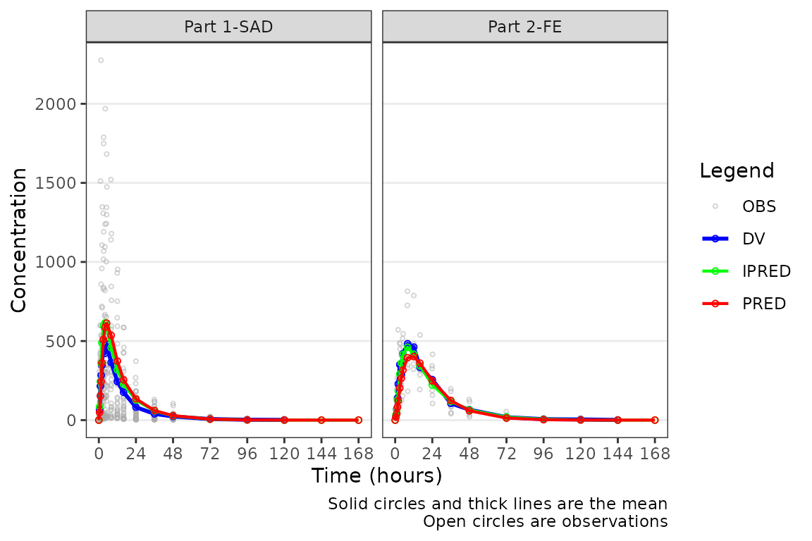

The pooled analysis population includes multiple dose levels in a single
plot, which is probably not optimal as a population PK model diagnostic.
A better minimal plot representation of these data can be obtained by
dose-normalizing and stratifying by study part to separate out the fast
and food effect portions:

``` r
plot_popgof(data = plot_data, output_vars = c(DV ="ODV"), dosenorm = TRUE, 
            ylab = "Dose-normalized Conc. (ng/mL)") +
  facet_wrap(~PART)
```

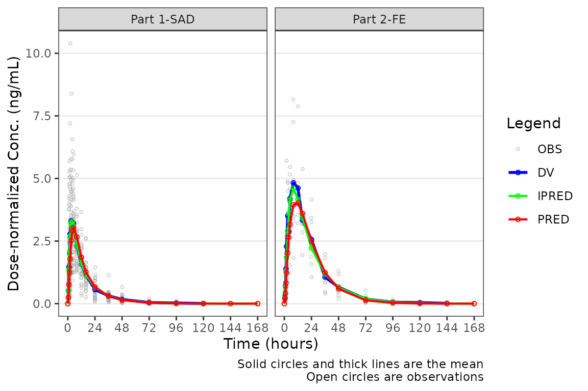

Although, generally population goodness-of-fit plots are stratified by
study design (extrinsic) factors (e.g., Dose and Food Status) in order
to assess the adequacy of model fit in each unique study condition.

``` r
plot_popgof(data = plot_data, output_vars = c(DV ="ODV"), 
            ylab = "Concentration (ng/mL)") +
  facet_wrap(~DoseGroup, scales = "free")
```

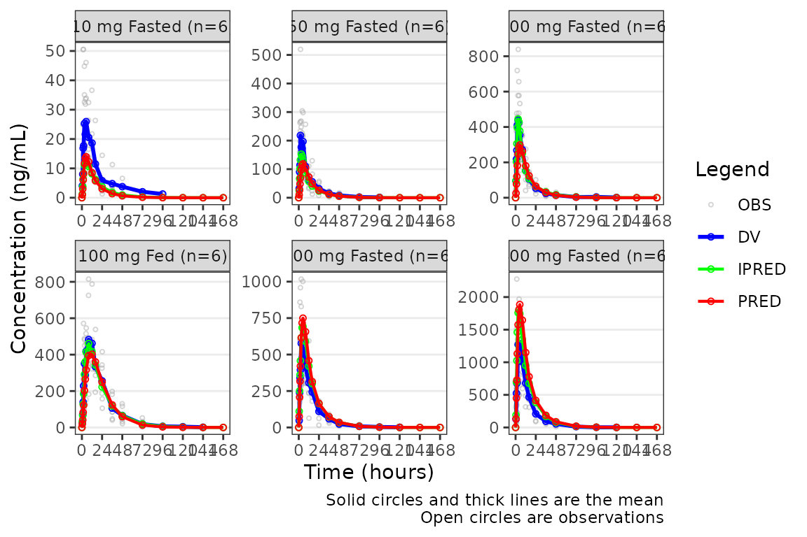

*NOTE* `plot_popgof` plot aesthetic functionality from `plot_dvtime`.

This vignette will assume familiarity with the Exploratory Data Analysis
Vignette and `plot_dvtime`. The arguments and functionality inherited
from `plot_dvtime` will not be reviewed in detail here, except where
critical to interpretation of model diagnostics.

### Plot Elements and Colors

There is only one new argument to `plot_popgof` that is not present in
`df_mrgsim_replicate` or `plot_dvtime`. This argument is
`output_colors`, a named vector of pre-defined plot element and color
pairs:

- `PRED= "red"`
- `IPRED`=`"green"`,
- `DV`=`"blue"`.
- `OBS`=`"darkgrey"`

The default plot elements are:

- `PRED` - summary statistics for central tendency in the population
  model predictions (`output_vars["PRED"]`)
- `IPRED` = summary statistics for central tendency in the individual
  model predictions (`output_vars["IPRED"]`)
- `OBS` = observed data points for the dependent variable
  (`output_vars["DV"]`)
- `DV` = summary statistics for central tendency (+/- variability) in
  the dependent variable (`output_vars["DV"]`)

`OBS` and `DV` represent the same data and both map back to the variable
in `data` specified in `output_vars["DV"]`. They are differentiated only
to allow visual distinction between individual observation concentration
data and summary statistics of observed and model-predicted
concentration data.

If one wanted to clarify that all the data mapping back to the dataset
variable specified in `output_vars["DV]` with color, then the default
for `output_colors["OBS"]` can be updated to to blue to align with `DV`.

``` r
plot_popgof(data = plot_data, output_vars = c(DV ="ODV"), 
            ylab = "Concentration (ng/mL)", output_colors = c(OBS = "blue")) +
  facet_wrap(~DoseGroup, scales = "free")
```

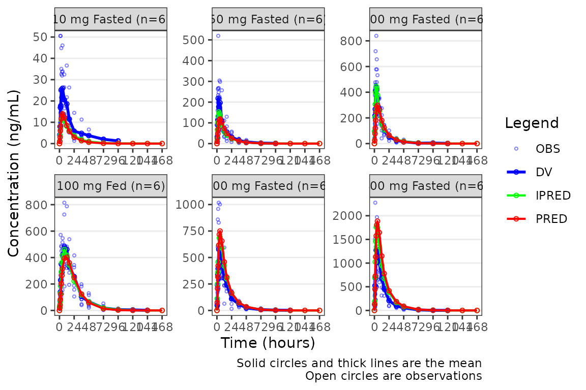

Alternatively, the observed data points could be removed with only the
summary metrics plotted. Notice how different this plot appears when
only visualizing central tendency!

``` r
plot_popgof(data = plot_data, output_vars = c(DV ="ODV"), 
            ylab = "Concentration (ng/mL)", obs_dv = FALSE) +
  facet_wrap(~DoseGroup, scales = "free")
```

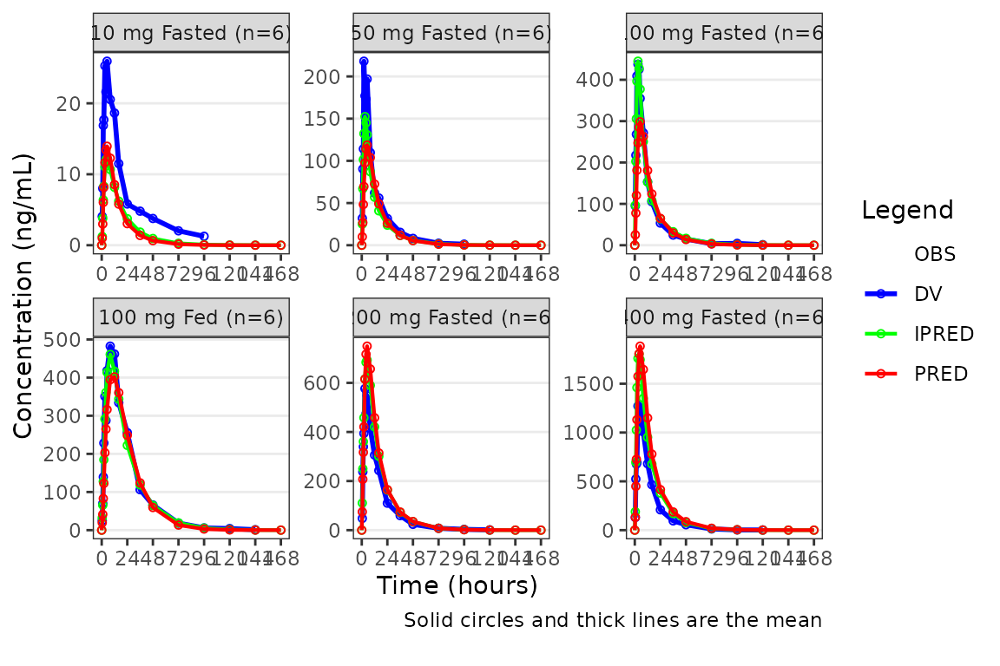

A better plot that still emphasizes central tendency, but includes some
visualization of variability in the observed data, could also be
obtained by specifying one of ““.

``` r
plot_popgof(data = plot_data, output_vars = c(DV ="ODV"), 
            ylab = "Concentration (ng/mL)", obs_dv = FALSE, cent = "median_iqr") +
  facet_wrap(~DoseGroup, scales = "free")
```

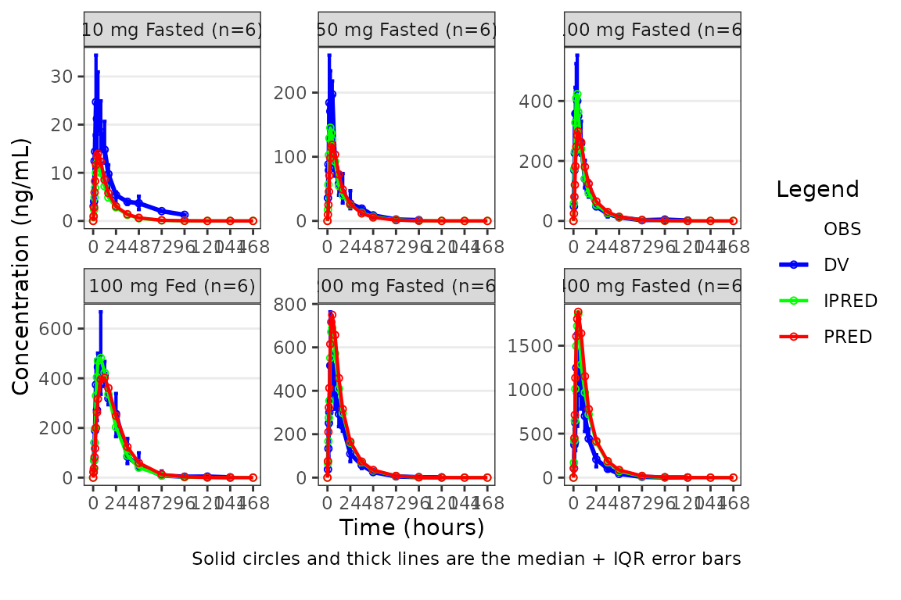

### Specifying the Central Tendency

`plot_popgof` (and `plot_dvtime`) uses the `stat_summary` function from
`ggplot2` to calculate and plot the central tendency measures and error
bars. The summary statistics calculated are specified by the `cent`
argument. Options include:

- `"mean"` = arithmetic mean (linear y-axis), geometric mean (log
  y-axis)
- `"median"` = median (50th percentile)
- `"mean_sdl"` = arithmetic mean +/- arithmetic SD (linear y-axis),
  geometric mean +/- geometric SC (log y-axis)
- `"median_iqr"` = median +/- interquartile range (25th to 75th
  percentiles)

Variability statistics (SD, IQR) are plotted for the observed data when
requested and only the central tendency measures are calculated and
returned for model predictions (PRED, IPRED).

An often overlooked feature of `stat_summary`, is that it calculates the
summary statistics *after* any transformations to the data performed by
changing the scales. This means that when
[`scale_y_log10()`](https://ggplot2.tidyverse.org/reference/scale_continuous.html)
is applied to the plot, the data are log-transformed for plotting and
the central tendency measure returned with `"mean"` is the *geometric
mean*.

If the `log_y` argument is used to generate semi-log plots along with
`show_captions = TRUE`, then the caption will delineate where arithmetic
and geometric means are being returned.

On the linear scale, the `"mean_sdl"` option produces unrealistic error
bars that cross zero given the small sample size, variability, and
log-normal distribution of concentration-time data.

``` r
plot_popgof(data = plot_data, output_vars = c(DV ="ODV"), cent = "mean_sdl" ,
            ylab = "Concentration (ng/mL)", log_y = FALSE) +
  facet_wrap(~DoseGroup, scales = "free")
```

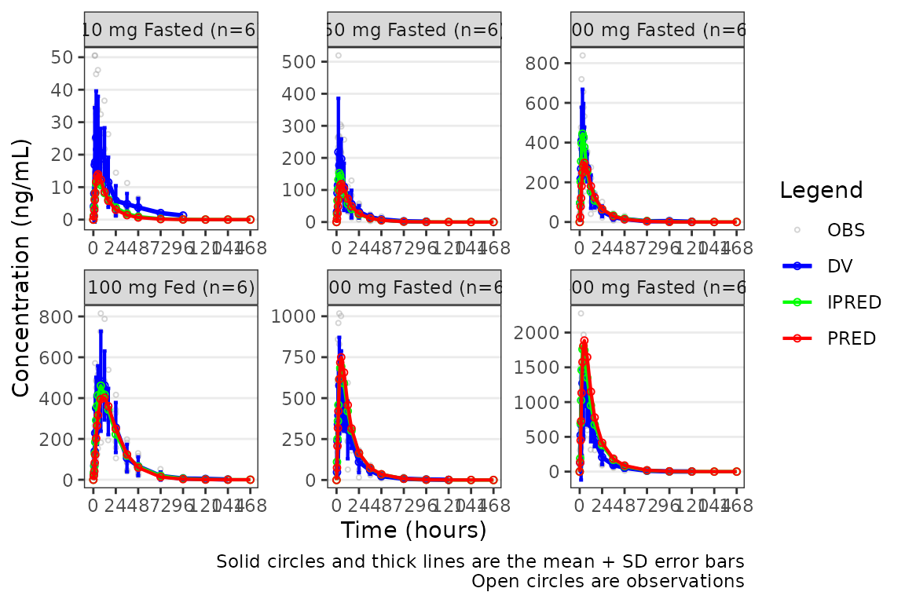

However, when transformed to a semi-log scale with `log_y = TRUE`, the
error bars now reflect the geometric standard deviation and are
displayed correctly for lognormally distributed data and the caption
updates to reflect this.

``` r
plot_popgof(data = plot_data, output_vars = c(DV ="ODV"), cent = "mean_sdl", 
            ylab = "Concentration (ng/mL)", log_y = TRUE) +
  facet_wrap(~DoseGroup, scales = "free")
```

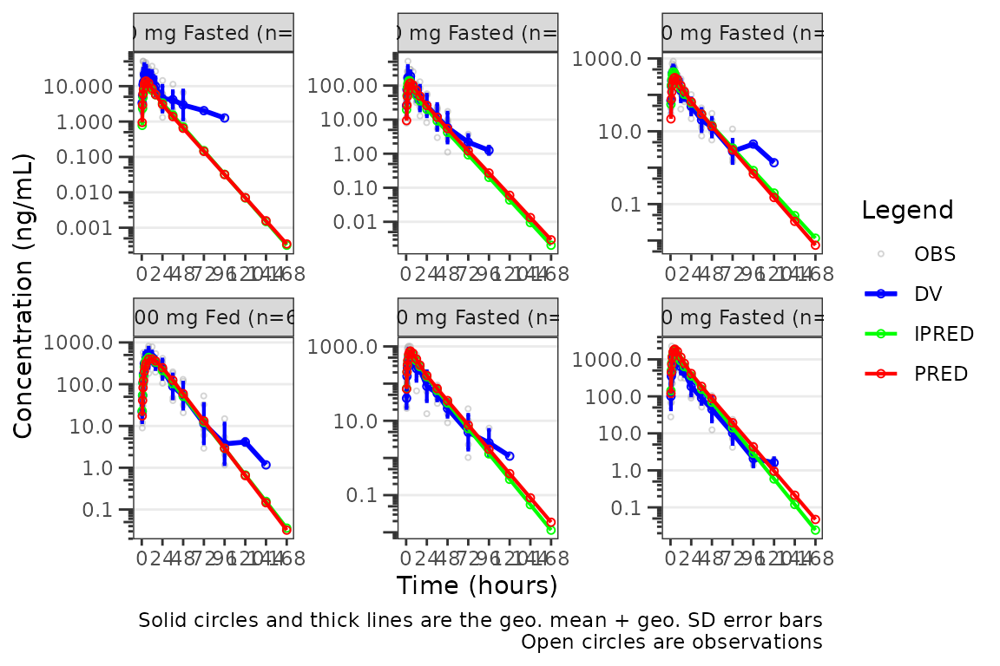

The caption will *NOT* update if a new axis is added to the plot object
outside of `plot_popgof` with `scale_y_log10`.

``` r
plot_popgof(data = plot_data, output_vars = c(DV ="ODV"), cent = "mean_sdl",
            ylab = "Concentration (ng/mL)") +
  facet_wrap(~DoseGroup, scales = "free") + 
  scale_y_log10()
```

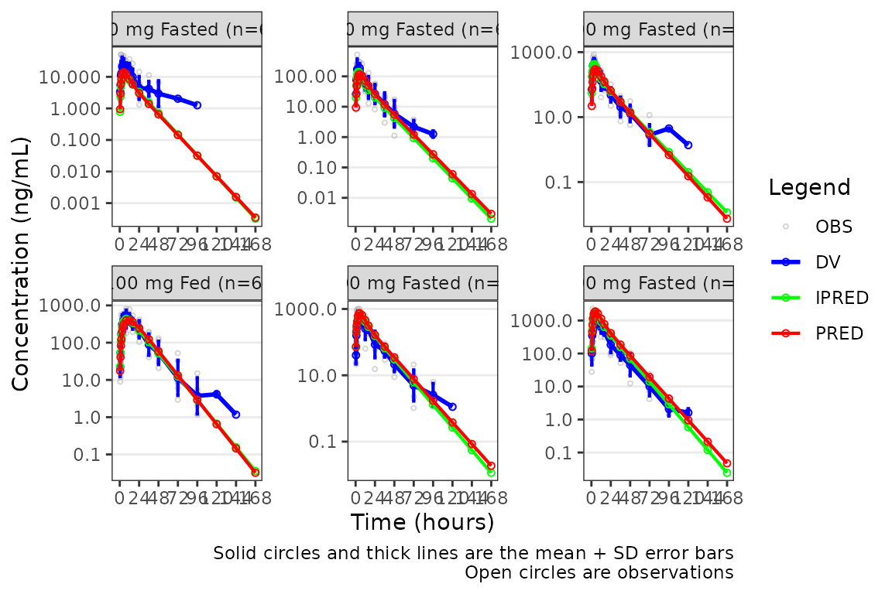

Transformation of the plot to a semi-log scale (log-scale y-axis only)
is recommended to be performed using the `log_y` argument for the
following benefits:

- Includes log tick marks on the y-axis
- Updates the caption with the correct central tendency measure if
  `show_captions = TRUE`.

### Defining imputations for BLQ data

There are some potential missfit in the model in the late terminal
phase, with the observed geometric mean values skewing higher than the
corresponding model predictions, particularly at lower doses. Is this
real? Let’s use imputation to assess the potential impact of the data
missing due to assay sensitivity on assessment of model
misspecification. The `loq_method` argument from `plot_dvtime` was
extended in `plot_popgof` to also include model predictions.

Options are:

- `0` : No handling. Plot input dataset `DV` vs `TIME` as is. (default)
- `1` : Impute all BLQ data at `TIME` \<= 0 to 0 and all BLQ data at
  `TIME` \> 0 to 1/2 x `loq`. Useful for plotting concentration-time
  data with some data BLQ on the linear scale
- `2` : Impute all BLQ data at `TIME` \<= 0 to 1/2 x `loq` and all BLQ
  data at `TIME` \> 0 to 1/2 x `loq`.

The `loq` argument species the value of the LLOQ. The `loq` argument
must be specified when `loq_method` is `1` or `2`, but can be `NULL`
*if* the variable `LLOQ` is present in the dataset.

Let’s take a look at our data stratified by dosing regimen. In general,
it is good practice to use `loq_method = 1` for linear scale plots and
`loq_method = 2` for log-scale plots, in which zero is not a valid
value.

``` r
plot_popgof(data = plot_data, output_vars = c(DV ="ODV"), cent = "mean", grp_dv = TRUE,
            ylab = "Concentration (ng/mL)", log_y = TRUE, loq_method = 2) +
  facet_wrap(~DoseGroup, scales = "free")
```

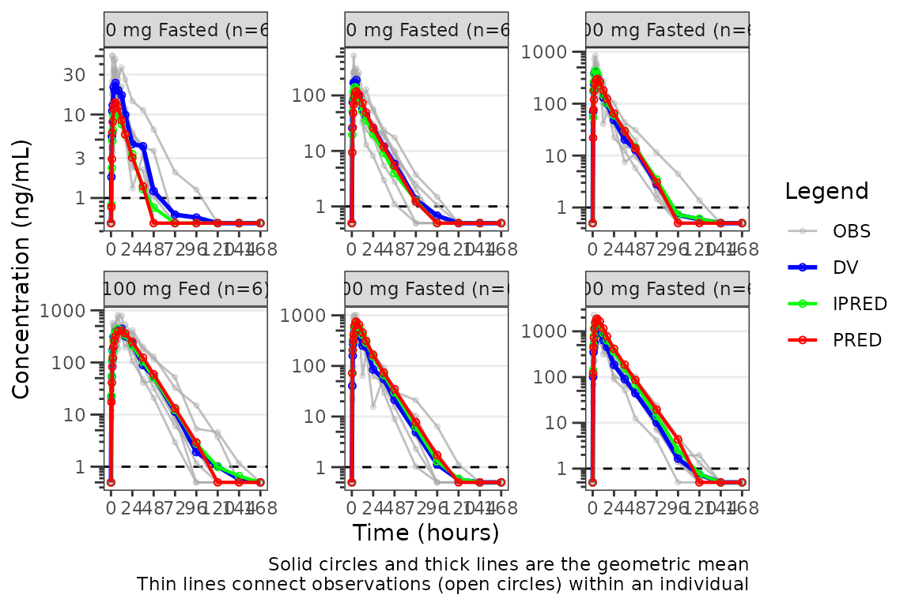

Interesting! It looks like the potential misspecification in the late
terminal phase was in fact an artifact in the observed profile due to
censoring of data below the LLOQ. This is a common finding in SAD
studies and is usually dose dependent and more apparent at lower doses
where a larger proportion of samples will be BLQ.

## Individual Concentration-time plots

The previous section provides an overview of how to generate population
overlay GOF plots using `plot_popgof`; however, we can also use
`plot_popgof` to generate subject-level visualizations with a little
pre-processing of the input dataset.

We can plot an individual subject by filtering the input dataset. This
could be extended generate plots for all individuals using `for` loops,
`lapply`,
[`purrr::map()`](https://purrr.tidyverse.org/reference/map.html)
functions, or other methods.

``` r

ids <- sort(unique(plot_data$ID)) #vector of unique subject ids
n_ids <- length(ids) #count of unique subject ids
plots_per_pg <- 4
n_pgs <- ceiling(n_ids/plots_per_pg) #Total number of pages needed

plist<- list()
for(i in 1:n_ids){
  plist[[i]] <- plot_popgof(filter(plot_data, ID == ids[i]), 
                            output_vars = c(DV = "ODV"), 
                            ylab = "Concentration (ng/mL)", 
                            log_y = TRUE,
                            grp_dv = TRUE,
                            show_caption = FALSE) +
  facet_wrap(~DoseGroup)+
  labs(title = paste0("ID = ", ids[i]))+
  theme(legend.position="none")
}

lapply(1:n_pgs, function(n_pg) {
      i <-  (n_pg-1)*plots_per_pg+1
      j <- n_pg*plots_per_pg
      wrap_plots(plist[i:j])
})
#> [[1]]
```

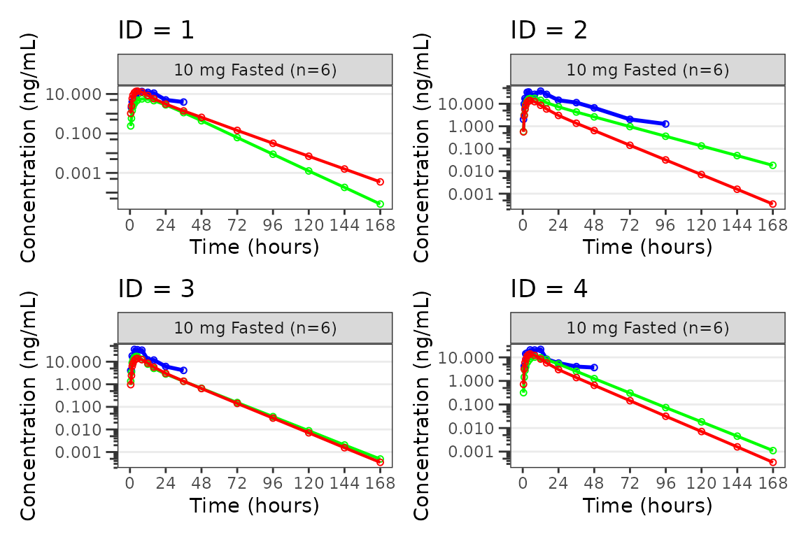

    #> 
    #> [[2]]

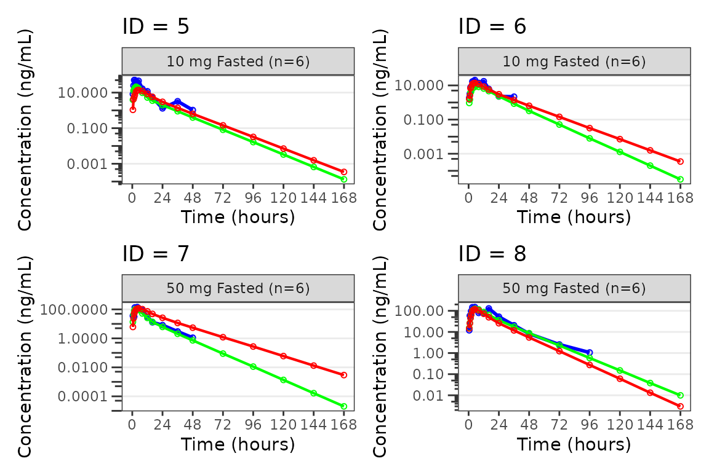

    #> 
    #> [[3]]

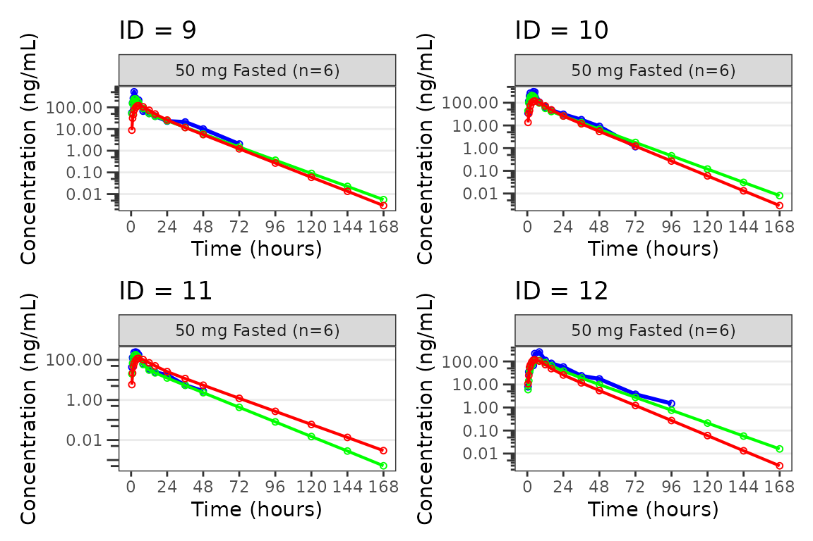

    #> 
    #> [[4]]

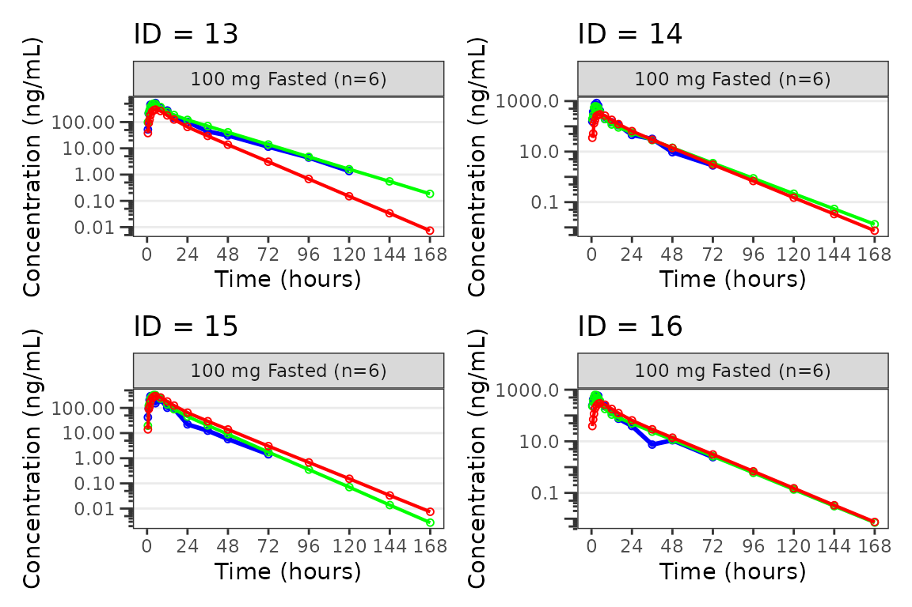

    #> 
    #> [[5]]

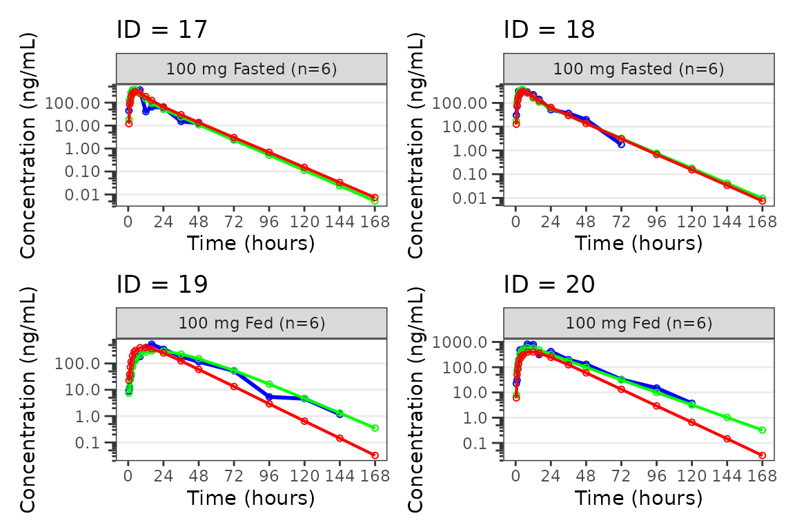

    #> 
    #> [[6]]

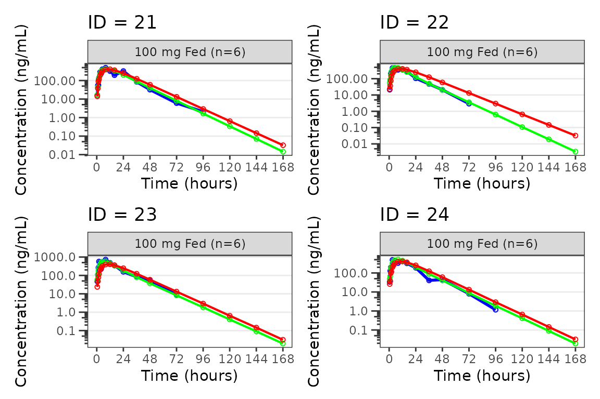

    #> 
    #> [[7]]

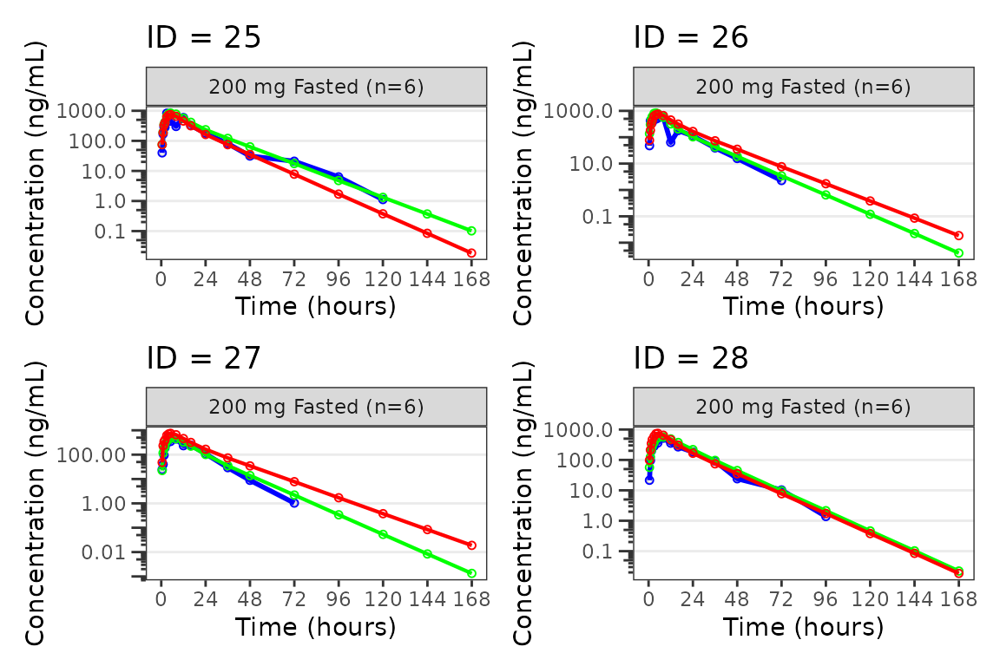

    #> 
    #> [[8]]

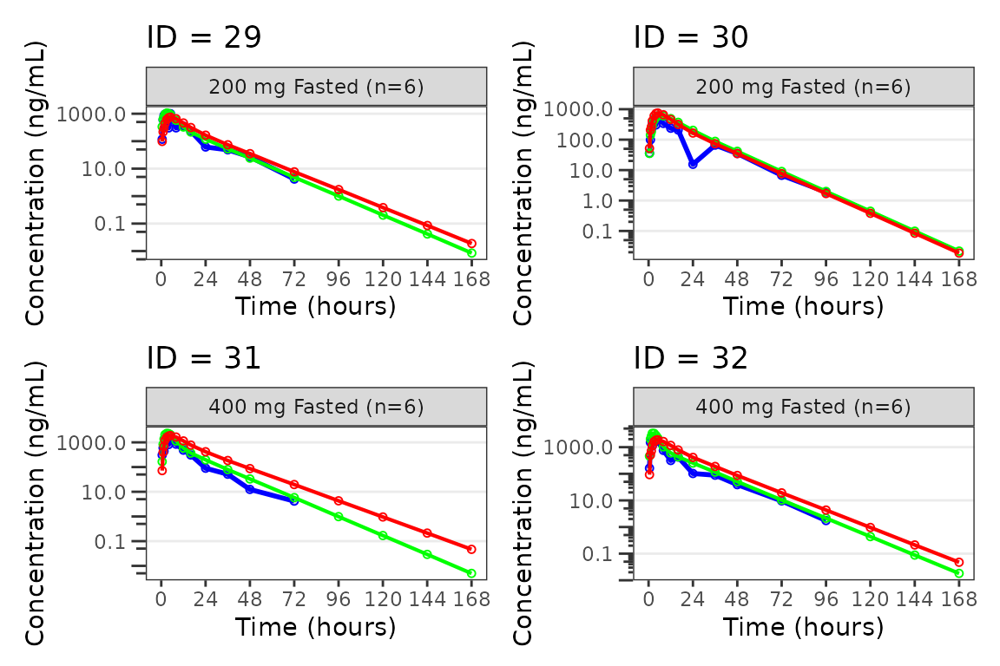

    #> 
    #> [[9]]

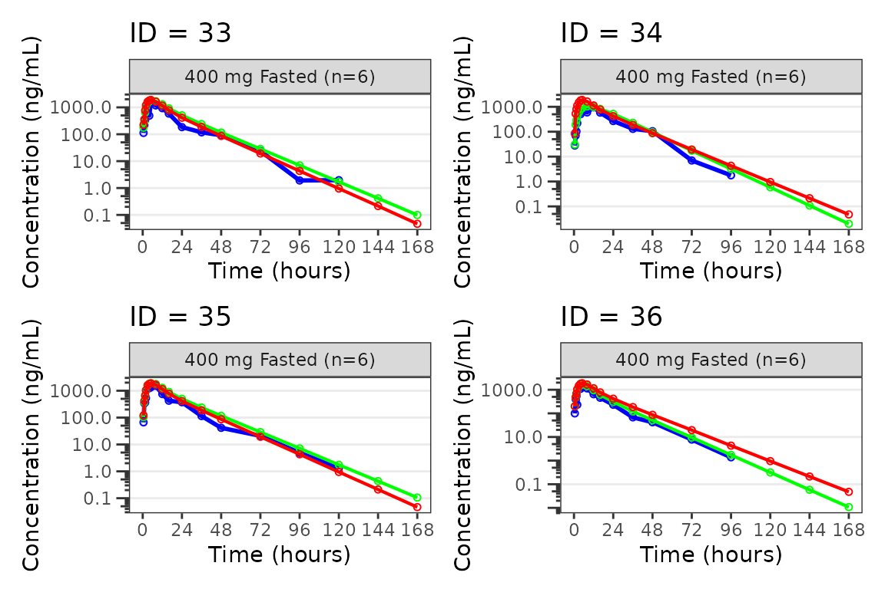
