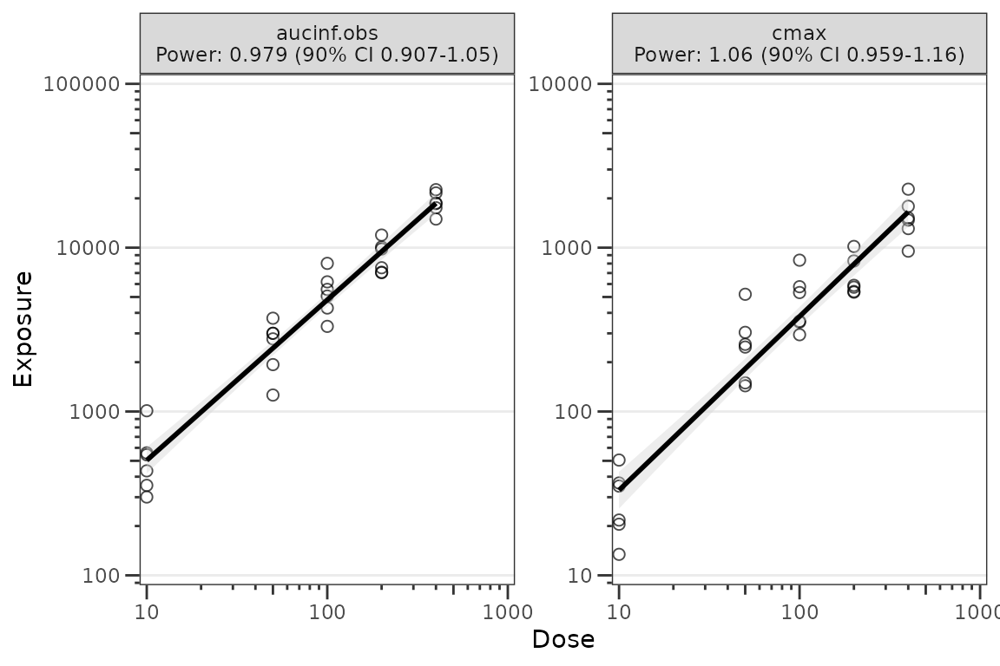
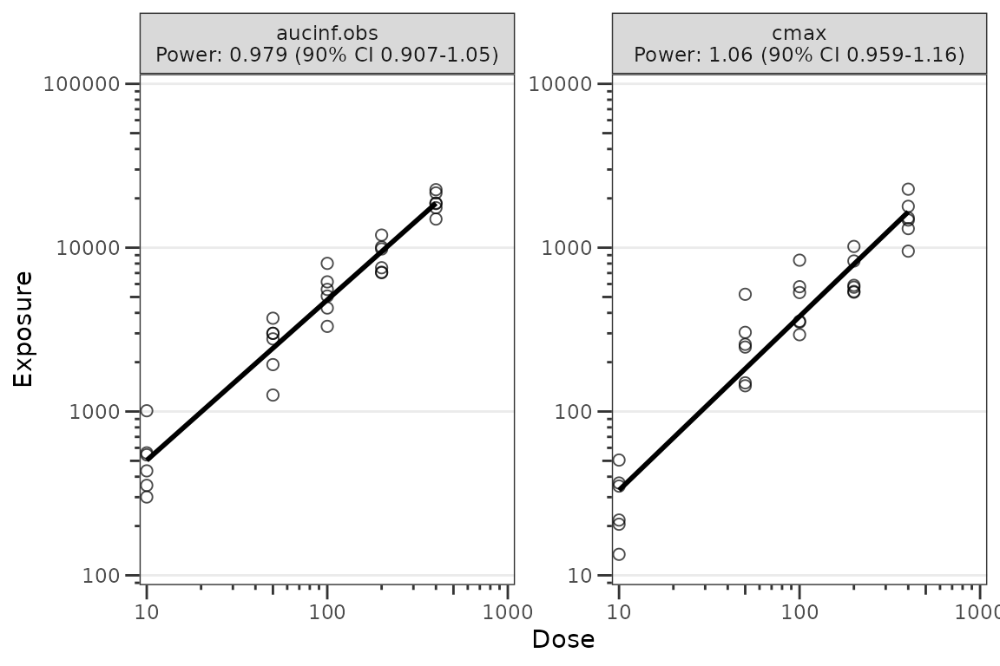
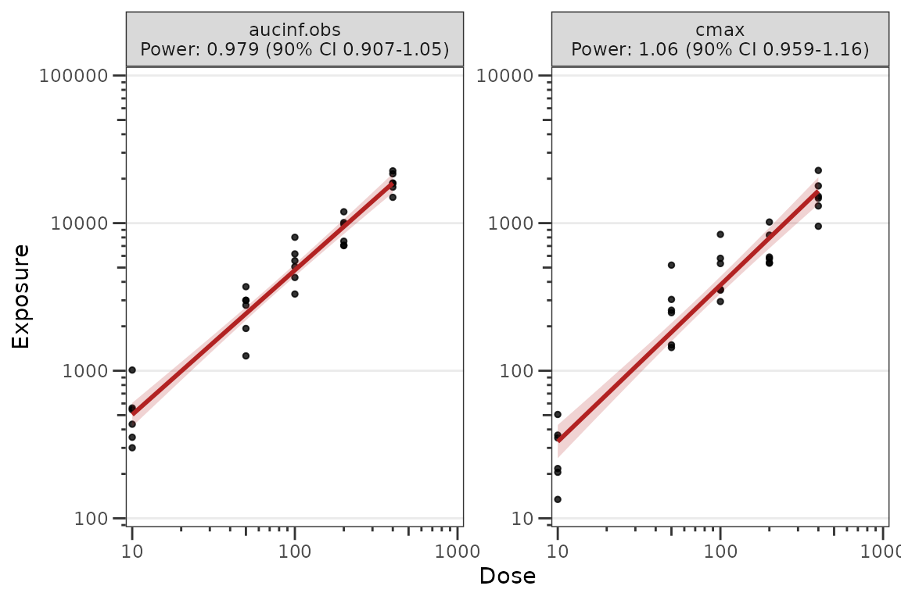

# Dose-Proportionality Workflow

This vignette demonstrates the `pmxhelpr` dose-proportionality
assessment workflow using power law (log-log) regression of exposure
versus dose.

The pipeline mirrors the [VPC
workflow](https://ryancrass.github.io/pmxhelpr/articles/vpc-workflow.md):
a stats function
([`df_doseprop()`](https://ryancrass.github.io/pmxhelpr/reference/df_doseprop.md))
returns a class-tagged object, a public renderer
([`plot_build_doseprop()`](https://ryancrass.github.io/pmxhelpr/reference/plot_build_doseprop.md))
draws plots from that object, and a top-level wrapper
([`plot_doseprop()`](https://ryancrass.github.io/pmxhelpr/reference/plot_doseprop.md))
bundles both for one-shot use.

``` r

options(scipen = 999, rmarkdown.html_vignette.check_title = FALSE)
library(pmxhelpr)
library(dplyr, warn.conflicts =  FALSE)
library(ggplot2, warn.conflicts =  FALSE)
```

## Background

Dose proportionality assessment evaluates whether exposure increases
proportionally with dose. The standard approach is power law regression
on the relationship

``` math
Exposure = \alpha \cdot DOSE^\gamma
```

which linearizes via log transformation to

``` math
\log(Exposure) = intercept + \gamma \cdot \log(DOSE)
```

Hypothesis testing proceeds via the confidence interval around the power
estimate ($`\gamma`$): the null is dose-proportional ($`\gamma = 1`$);
the alternative is non-proportional ($`\gamma \ne 1`$). Interpretation
rules of thumb:

- CI includes 1: dose-proportional
- CI excludes 1, upper bound below 1: less than dose-proportional
- CI excludes 1, lower bound above 1: greater than dose-proportional

This assessment is typically performed on both Cmax and AUC. The
combination informs which phase of the PK profile is contributing most
to non-linearity (absorption rate, absorption extent, or elimination).

## Data

This vignette uses the internal `data_sad_nca` dataset, which is the NCA
parameter output for the `data_sad` SAD + food-effect study. The dataset
is formatted in the SDTM `PP` (Pharmacokinetic Parameters) domain
conventions, with one row per subject per parameter.

``` r

glimpse(data_sad_nca)
#> Rows: 648
#> Columns: 11
#> $ ID         <dbl> 1, 1, 1, 1, 1, 1, 1, 1, 1, 1, 1, 1, 1, 1, 1, 1, 1, 1, 2, 2,…
#> $ DOSE       <dbl> 10, 10, 10, 10, 10, 10, 10, 10, 10, 10, 10, 10, 10, 10, 10,…
#> $ PART       <chr> "Part 1-SAD", "Part 1-SAD", "Part 1-SAD", "Part 1-SAD", "Pa…
#> $ start      <dbl> 0, 0, 0, 0, 0, 0, 0, 0, 0, 0, 0, 0, 0, 0, 0, 0, 0, 0, 0, 0,…
#> $ end        <dbl> Inf, Inf, Inf, Inf, Inf, Inf, Inf, Inf, Inf, Inf, Inf, Inf,…
#> $ PPTESTCD   <chr> "auclast", "cmax", "tmax", "tlast", "clast.obs", "lambda.z"…
#> $ PPORRES    <dbl> 277.7701457207, 13.4300000000, 7.8100000000, 35.9500000000,…
#> $ exclude    <chr> NA, NA, NA, NA, NA, NA, NA, NA, NA, NA, NA, NA, NA, NA, NA,…
#> $ units_dose <chr> "mg", "mg", "mg", "mg", "mg", "mg", "mg", "mg", "mg", "mg",…
#> $ units_conc <chr> "ng/mL", "ng/mL", "ng/mL", "ng/mL", "ng/mL", "ng/mL", "ng/m…
#> $ units_time <chr> "hours", "hours", "hours", "hours", "hours", "hours", "hour…
```

For dose-proportionality assessment we want to focus on the SAD cohort
and exclude the food-effect arm — food can also influence exposure and
may confound dose-proportionality interpretation.

``` r

data_nca1 <- filter(data_sad_nca, PART == "Part 1-SAD")
unique(data_nca1$PART)
#> [1] "Part 1-SAD"
```

## Computing summary statistics with `df_doseprop()`

The required arguments are:

- `data` — a `data.frame` of NCA parameters (typically `PKNCA::pk.nca()`
  output)
- `metrics` — character vector of exposure metric names to evaluate

``` r

dose_prop_obj <- df_doseprop(data_nca1, metrics = c("aucinf.obs", "cmax"))
dose_prop_obj
#> <doseprop_stats>
#>   stats: 2 rows x 10 columns
#>   obs:   60 rows
#>   config: metric_name_var = PPTESTCD, metric_value_var = PPORRES, dose_var = DOSE, ci = 0.9, method = normal
#> 
#>   stats body:
#>   Intercept StandardError  CI Power   LCL  UCL Proportional
#> 1      3.97        0.0438 90% 0.979 0.907 1.05         TRUE
#> 2      1.06        0.0616 90% 1.060 0.959 1.16         TRUE
#>                            PowerCI    Interpretation   PPTESTCD
#> 1 Power: 0.979 (90% CI 0.907-1.05) Dose-proportional aucinf.obs
#> 2  Power: 1.06 (90% CI 0.959-1.16) Dose-proportional       cmax
#> 
#>   Use `x$obs` for the observation overlay.
```

Optional arguments must be specified if input dataset defaults differ
from SDTM formatting and `PKNCA` defaults:

- `metric_name_var`: variable in `data` containing metric names
  requested in `metrics`, default `PPTESTCD`.
- `metric_value_var`: variable in `data` containing exposure metric
  values, default `PPORRES`.

The default argument for the numeric dose variable `dose_var` is `DOSE`.

``` r

stats <- dose_prop_obj$stats
stats
#>   Intercept StandardError  CI Power   LCL  UCL Proportional
#> 1      3.97        0.0438 90% 0.979 0.907 1.05         TRUE
#> 2      1.06        0.0616 90% 1.060 0.959 1.16         TRUE
#>                            PowerCI    Interpretation   PPTESTCD
#> 1 Power: 0.979 (90% CI 0.907-1.05) Dose-proportional aucinf.obs
#> 2  Power: 1.06 (90% CI 0.959-1.16) Dose-proportional       cmax
```

The `stats` slot holds the per-metric estimates from the log log
regression, which contains all the information needed to format an
output table.

### Adjusting the summary statistics

The summary statistics calculated from the log-log regression of
exposure versus dose can be customized using the following arguments:

- `method`: distribution used to calculate the confidence interval:
  Default is `"normal"`. Alternative is `"tdist"`, which may be
  preferred for analysis with a small sample size where normality cannot
  be assumed (e.g, \< 30).
- `ci`: confidence interval to return expressed as a proportion. Default
  is `"0.9"` based on the CI recommended for the bioequivalence
  assessment.
- `sigdigits`: number of significant digits to return in outputs

The example below modifies the previous calculation by requesting the
`tdist` method, 95%, and rounding to only 2 significant digits.

``` r

dose_prop_obj_95ci_tdist <- df_doseprop(data_nca1, 
                                        metrics = c("aucinf.obs", "cmax"), 
                                        method = "tdist", 
                                        ci = 0.95, 
                                        sigdigits = 2)
dose_prop_obj_95ci_tdist
#> <doseprop_stats>
#>   stats: 2 rows x 10 columns
#>   obs:   60 rows
#>   config: metric_name_var = PPTESTCD, metric_value_var = PPORRES, dose_var = DOSE, ci = 0.95, method = tdist
#> 
#>   stats body:
#>   Intercept StandardError  CI Power  LCL UCL Proportional
#> 1       4.0         0.044 95%  0.98 0.89 1.1         TRUE
#> 2       1.1         0.062 95%  1.10 0.93 1.2         TRUE
#>                         PowerCI    Interpretation   PPTESTCD
#> 1 Power: 0.98 (95% CI 0.89-1.1) Dose-proportional aucinf.obs
#> 2  Power: 1.1 (95% CI 0.93-1.2) Dose-proportional       cmax
#> 
#>   Use `x$obs` for the observation overlay.
```

## Plotting with `plot_doseprop()`

[`plot_doseprop()`](https://ryancrass.github.io/pmxhelpr/reference/plot_doseprop.md)
is the top-level wrapper that bundles
[`df_doseprop()`](https://ryancrass.github.io/pmxhelpr/reference/df_doseprop.md)
and
[`plot_build_doseprop()`](https://ryancrass.github.io/pmxhelpr/reference/plot_build_doseprop.md).
The required arguments are the same as
[`df_doseprop()`](https://ryancrass.github.io/pmxhelpr/reference/df_doseprop.md).
The output is a `ggplot` object with one panel per metric, where the
facet label includes the metric name and the `PowerCI` text.

``` r

plot_doseprop(data_nca1, metrics = c("aucinf.obs", "cmax"))
```



The default appearance uses open circles at `alpha = 0.7` for the
observation points and a black regression line with a grey SE ribbon.
This matches the package design language for exploratory plots. To
restore filled black circles with full opacity, override `obs_point` via
the `theme` argument (see [Theming](#theming) below).

### Adjusting the summary statistics

The summary statistics calculated from the log-log regression of
exposure versus dose can be customized using the following arguments:

- `method`: distribution used to calculate the confidence interval:
  Default is `"normal"`. Alternative is `"tdist"`, which may be
  preferred for analysis with a small sample size where normality cannot
  be assumed (e.g, \< 30).
- `ci`: confidence interval to return expressed as a proportion. Default
  is `"0.9"` based on the CI recommended for the bioequivalence
  assessment.
- `sigdigits`: number of significant digits to return in outputs

``` r

plot_doseprop(data_nca1, 
              metrics = c("aucinf.obs", "cmax"),
              method = "tdist", 
              ci = 0.95, 
              sigdigits = 2)
```


### Reusing precomputed stats

[`plot_doseprop()`](https://ryancrass.github.io/pmxhelpr/reference/plot_doseprop.md)
also accepts a `doseprop_stats` object directly. This skips the
regression refit and is useful when you want to inspect the stats object
and then render the same data multiple times — for example, with and
without the SE ribbon, or with different aesthetic overrides — without
paying the regression cost again.

``` r

# With the SE ribbon (default)
plot_doseprop(dose_prop_obj)
```


``` r


# Without the SE ribbon
plot_doseprop(dose_prop_obj, se = FALSE)
```



When `data` is a precomputed `doseprop_stats` result, the pipeline
arguments (`metrics`, `metric_name_var`, `metric_value_var`, `dose_var`,
`method`, `ci`, `sigdigits`) **cannot** be honored — those decisions
were already made when
[`df_doseprop()`](https://ryancrass.github.io/pmxhelpr/reference/df_doseprop.md)
ran, and re-passing them on the cached path would silently shadow the
original values. Passing any of them aborts with a message pointing the
caller back at
[`df_doseprop()`](https://ryancrass.github.io/pmxhelpr/reference/df_doseprop.md).
Only plot-only arguments (`theme`, `se`) are accepted on this path; to
change a regression setting, re-run
[`df_doseprop()`](https://ryancrass.github.io/pmxhelpr/reference/df_doseprop.md)
and pass the new result.

## Inspecting the `doseprop_stats` object

[`df_doseprop()`](https://ryancrass.github.io/pmxhelpr/reference/df_doseprop.md)
performs the per-metric log-log regression and returns a
`doseprop_stats` \[`pmx_stats`\]\[is_pmx_stats\] object with three
slots:

- `stats` (one row per metric),
- `obs` (the observation rows used for the scatter overlay)
- `config` (the regression configuration). Downstream plot builders read
  directly from these slots to render without a refit.

The returned object is class-tagged `c("doseprop_stats", "pmx_stats")`,
which provides three S3 methods designed for interactive inspection.

[`print()`](https://rdrr.io/r/base/print.html) shows a focused summary —
object dimensions, the regression configuration values
(`metric_name_var`, `metric_value_var`, `dose_var`, `ci`, `method`), the
count of observation rows attached for the scatter overlay, and the
per-metric stats body.

``` r

print(dose_prop_obj)
#> <doseprop_stats>
#>   stats: 2 rows x 10 columns
#>   obs:   60 rows
#>   config: metric_name_var = PPTESTCD, metric_value_var = PPORRES, dose_var = DOSE, ci = 0.9, method = normal
#> 
#>   stats body:
#>   Intercept StandardError  CI Power   LCL  UCL Proportional
#> 1      3.97        0.0438 90% 0.979 0.907 1.05         TRUE
#> 2      1.06        0.0616 90% 1.060 0.959 1.16         TRUE
#>                            PowerCI    Interpretation   PPTESTCD
#> 1 Power: 0.979 (90% CI 0.907-1.05) Dose-proportional aucinf.obs
#> 2  Power: 1.06 (90% CI 0.959-1.16) Dose-proportional       cmax
#> 
#>   Use `x$obs` for the observation overlay.
```

[`summary()`](https://rdrr.io/r/base/summary.html) shares the header but
condenses the body to one line per metric using the `PowerCI` and
`Interpretation` columns. This is the most compact way to scan the
assessment.

``` r

summary(dose_prop_obj)
#> <doseprop_stats>
#>   stats: 2 rows x 10 columns
#>   obs:   60 rows
#>   config: metric_name_var = PPTESTCD, metric_value_var = PPORRES, dose_var = DOSE, ci = 0.9, method = normal
#> 
#>   per-metric:
#>     aucinf.obs: Power: 0.979 (90% CI 0.907-1.05) -- Dose-proportional
#>     cmax: Power: 1.06 (90% CI 0.959-1.16) -- Dose-proportional
```

[`as.data.frame()`](https://rdrr.io/r/base/as.data.frame.html) returns
the `stats` slot as a plain `data.frame` — useful when downstream
tooling expects a flat tabular result. The observation overlay and run
configuration remain accessible via `dose_prop_obj$obs` and
`dose_prop_obj$config`.

``` r

plain <- as.data.frame(dose_prop_obj)
class(plain)
#> [1] "data.frame"
dose_prop_obj$config$metric_name_var
#> [1] "PPTESTCD"
```

Use
[`is_doseprop_stats()`](https://ryancrass.github.io/pmxhelpr/reference/is_doseprop_stats.md)
to test class membership programmatically — for example, in user code
that should accept either a precomputed `doseprop_stats` object or a raw
NCA data.frame. Pass `strict = TRUE` to additionally validate structural
integrity.

``` r

is_doseprop_stats(dose_prop_obj)
#> [1] TRUE
is_doseprop_stats(plain)  # FALSE -- coerced to a plain data.frame
#> [1] FALSE
```

## Theming

Plot aesthetics are customized via the `theme` argument and the
[`plot_doseprop_theme()`](https://ryancrass.github.io/pmxhelpr/reference/plot_doseprop_theme.md)
constructor. The factory exposes two keys:

- `obs_point` — observation point aesthetics (constructed via
  [`pmx_point()`](https://ryancrass.github.io/pmxhelpr/reference/pmx_point.md))
- `linear` — regression line and SE ribbon aesthetics (constructed via
  [`pmx_trend()`](https://ryancrass.github.io/pmxhelpr/reference/pmx_trend.md))

It also accepts an `obs` role-level shortcut via
[`pmx_style()`](https://ryancrass.github.io/pmxhelpr/reference/pmx_style.md)
for setting shared aesthetics on the points.

``` r

plot_doseprop_theme()
#> <plot_doseprop_theme>
#>   obs_point <pmx_point>: shape = 1, size = 2, alpha = 0.7
#>   linear    <pmx_trend>: linewidth = 1, linetype = 1, color = black, se_color = lightgrey, se_alpha = 0.4
```

A typical override:

``` r

plot_doseprop(
  dose_prop_obj,
  theme = plot_doseprop_theme(
    obs_point = pmx_point(shape = 19, color = "black", alpha = 0.8, size = 1),
    linear    = pmx_trend(color = "firebrick", se_color = "firebrick", se_alpha = 0.2))
)
```



For a deeper treatment of the theme system — element constructors, role
shortcuts, the `pmx_element` / `pmx_theme` class system, and predicates
for theme validation — see the [Plot Themes and
Aesthetics](https://ryancrass.github.io/pmxhelpr/articles/plot-themes.md)
vignette.

## See also

- [PK and PK/PD EDA
  workflow](https://ryancrass.github.io/pmxhelpr/articles/eda-pk-pkpd-workflow.md)
  — exploratory analysis of continuous longitudinal concentration-time
  data, response-time, and response-concentration data.
- [Plot Themes and
  Aesthetics](https://ryancrass.github.io/pmxhelpr/articles/plot-themes.md)
  — element constructors, theme factories, and class system for
  customizing plot output.
