# Exploratory Analyses of PK and PK/PD Data

This vignette will demonstrate `pmxhelpr` functions for exploratory data
analysis of dose-concentration-time data to inform population PK
modeling analysis. This includes package functions to visualize
concentration-time data and to assess dose-proportionality of exposure.

``` r

options(scipen = 999, rmarkdown.html_vignette.check_title = FALSE)
library(pmxhelpr)
library(dplyr, warn.conflicts =  FALSE)
library(ggplot2, warn.conflicts =  FALSE)
library(Hmisc, warn.conflicts = FALSE)
library(patchwork, warn.conflicts = FALSE)
```

## Data

The example dataset used in this vignette is based on a single ascending
dose (SAD) study of an orally administered drug product with a parallel
group food effect (FE) cohort.

### data_sad

Dataset definitions can be viewed by calling
[`?data_sad`](https://ryancrass.github.io/pmxhelpr/reference/data_sad.md).
A quick summary of variables and types is printed below.

``` r

glimpse(data_sad)
#> Rows: 1,404
#> Columns: 25
#> $ ID      <dbl> 1, 1, 1, 1, 1, 1, 1, 1, 1, 1, 1, 1, 1, 1, 1, 1, 1, 1, 1, 1, 1,…
#> $ TIME    <dbl> 0.00, 0.00, 0.00, 0.48, 0.48, 0.81, 0.81, 1.49, 1.49, 2.11, 2.…
#> $ NTIME   <dbl> 0.0, 0.0, 0.0, 0.5, 0.5, 1.0, 1.0, 1.5, 1.5, 2.0, 2.0, 3.0, 3.…
#> $ NDAY    <dbl> 1, 1, 1, 1, 1, 1, 1, 1, 1, 1, 1, 1, 1, 1, 1, 1, 1, 1, 1, 1, 1,…
#> $ DOSE    <dbl> 10, 10, 10, 10, 10, 10, 10, 10, 10, 10, 10, 10, 10, 10, 10, 10…
#> $ AMT     <dbl> 10, NA, NA, NA, NA, NA, NA, NA, NA, NA, NA, NA, NA, NA, NA, NA…
#> $ EVID    <dbl> 1, 0, 0, 0, 0, 0, 0, 0, 0, 0, 0, 0, 0, 0, 0, 0, 0, 0, 0, 0, 0,…
#> $ ODV     <dbl> NA, NA, 100.00000, NA, 99.87700, 2.02000, 99.44932, 4.02000, 9…
#> $ LDV     <dbl> NA, NA, 100.00000, NA, 99.87700, 0.70310, 99.44932, 1.39130, 9…
#> $ CFB     <dbl> NA, NA, 0.0000000, NA, -0.1229974, NA, -0.5506789, NA, -2.3928…
#> $ CONC    <dbl> NA, NA, 0.00, NA, 0.00, NA, 2.02, NA, 4.02, NA, 3.50, NA, 7.18…
#> $ LINE    <dbl> 2, 1, 1, 3, 3, 4, 4, 5, 5, 6, 6, 7, 7, 8, 8, 9, 9, 10, 10, 11,…
#> $ CMT     <dbl> 1, 2, 3, 2, 3, 2, 3, 2, 3, 2, 3, 2, 3, 2, 3, 2, 3, 2, 3, 2, 3,…
#> $ MDV     <dbl> NA, 1, 1, 1, 1, 0, 0, 0, 0, 0, 0, 0, 0, 0, 0, 0, 0, 0, 0, 0, 0…
#> $ BLQ     <dbl> NA, -1, -1, 1, 1, 0, 0, 0, 0, 0, 0, 0, 0, 0, 0, 0, 0, 0, 0, 0,…
#> $ LLOQ    <dbl> NA, 1, 1, 1, 1, 1, 1, 1, 1, 1, 1, 1, 1, 1, 1, 1, 1, 1, 1, 1, 1…
#> $ FOOD    <dbl> 0, 0, 0, 0, 0, 0, 0, 0, 0, 0, 0, 0, 0, 0, 0, 0, 0, 0, 0, 0, 0,…
#> $ SEXF    <dbl> 1, 1, 1, 1, 1, 1, 1, 1, 1, 1, 1, 1, 1, 1, 1, 1, 1, 1, 1, 1, 1,…
#> $ RACE    <dbl> 2, 2, 2, 2, 2, 2, 2, 2, 2, 2, 2, 2, 2, 2, 2, 2, 2, 2, 2, 2, 2,…
#> $ AGEBL   <int> 25, 25, 25, 25, 25, 25, 25, 25, 25, 25, 25, 25, 25, 25, 25, 25…
#> $ WTBL    <dbl> 82.1, 82.1, 82.1, 82.1, 82.1, 82.1, 82.1, 82.1, 82.1, 82.1, 82…
#> $ SCRBL   <dbl> 0.87, 0.87, 0.87, 0.87, 0.87, 0.87, 0.87, 0.87, 0.87, 0.87, 0.…
#> $ CRCLBL  <dbl> 128, 128, 128, 128, 128, 128, 128, 128, 128, 128, 128, 128, 12…
#> $ USUBJID <chr> "STUDYNUM-SITENUM-1", "STUDYNUM-SITENUM-1", "STUDYNUM-SITENUM-…
#> $ PART    <chr> "Part 1-SAD", "Part 1-SAD", "Part 1-SAD", "Part 1-SAD", "Part …
```

The study design consists of two parts.

- Part 1 was a sequential single ascending dose study covering a 10 to
  400 mg dose range.
- Part 2 was a parallel 100 mg single dose food effect (FE) study.

``` r

distinct(data_sad, DOSE, PART, FOOD)
#> # A tibble: 6 × 3
#>    DOSE PART        FOOD
#>   <dbl> <chr>      <dbl>
#> 1    10 Part 1-SAD     0
#> 2    50 Part 1-SAD     0
#> 3   100 Part 1-SAD     0
#> 4   100 Part 2-FE      1
#> 5   200 Part 1-SAD     0
#> 6   400 Part 1-SAD     0
```

The dataset is formatted for population pharmacokinetic (PopPK) and
pharmacokinetic/pharmacodynamic (PK/PD) modeling in NONMEM with the
following compartments and data types:

- `CMT=1`: oral dose events (`EVID=1`)
- `CMT=2`: drug concentration observations (`EVID=0`)
- `CMT=3`: pharmacodynamic response observations (`EVID=0`)

Dose events are input based on `AMT`. The nominal (e.g. protocol
assigned) dose associated with each observation is captured in `DOSE`.

Plasma drug concentration and pharmacodynamic response observations are
expressed in multiple units:  
- `ODV`: original units of the dependent variable \[`CMT=2` ng/mL,
`CMT=3` % baseline activity\] - `LDV`: log-transformed drug
concentration \[`CMT = 2` log(ng/mL), `CMT = 3` % baseline activity\] -
`CFB`: percentage change from baseline \[`CMT=2` missing, `CMT=3` %
change from baseline\]

Time is expressed as actual time of dose input or observation and
nominal time of observations:

- `TIME`: Actual time since first dose administration \[hours\]
- `NTIME`: Nominal time dose event or sample collection per protocol
  \[hours\]
- `NDAY`: Nominal day on study \[day\]

The nominal time variables are *exact binning variables*, which are
useful for grouping data for exploratory data analysis or model
evaluation.

``` r

##Unique values of time variables
unique(data_sad$NDAY)
#> [1] 1 2 3 4 5 6 7 8
unique(data_sad$NTIME)
#>  [1]   0.0   0.5   1.0   1.5   2.0   3.0   4.0   5.0   8.0  12.0  16.0  24.0
#> [13]  36.0  48.0  72.0  96.0 120.0 144.0 168.0
```

### var_addn

Now let’s pre-process these data for visualization. Often, it is useful
to assign study design variables to the color aesthetic in plots to
visualize data stratified by these study design elements. One way to
extract even more information from the plots is to include the sample
size within each level of the variable mapped to the color aesthetic.
`pmxhelpr` provides a useful vectorized helper function for this
purpose:
[`var_addn()`](https://ryancrass.github.io/pmxhelpr/reference/var_addn.md)

The helper function
[`var_addn()`](https://ryancrass.github.io/pmxhelpr/reference/var_addn.md)
takes two vector variables as arguments: a grouping variable (`grp_var`)
and an identifier variable (`id_var`). The function counts unique values
of `id_var` per level of `grp_var` and returns a factor vector with
group labels appended with counts of unique identifiers. It can be used
inside [`mutate()`](https://dplyr.tidyverse.org/reference/mutate.html)
to transform columns in place.

A string constant separator can be added between the values in `grp_var`
and the count of `id_var` using the optional `sep` argument. A common
use is to specify the dose units when linking dose and count of unique
individuals assigned to that dose level.

Let’s define some new variables and count unique subjects in each for
use in plotting. Useful study design variables for stratifying plots
include: dose (DOSE), food status (FOOD), and their interaction.

``` r

plot_data <- data_sad %>% 
  filter(EVID == 0) %>% 
  mutate(`Food Status` = ifelse(FOOD == 0, "Fasted", "Fed"), 
         `Dose and Food` = paste(DOSE, "mg", `Food Status`)) %>% 
  mutate(Dose = var_addn(DOSE, ID, sep = "mg"),
         `Food Status` = var_addn(`Food Status`, ID),
         `Dose and Food` = var_addn(`Dose and Food`, ID))

unique(plot_data$Dose)
#> [1] 10 mg (n=6)   50 mg (n=6)   100 mg (n=12) 200 mg (n=6)  400 mg (n=6) 
#> Levels: 10 mg (n=6) 50 mg (n=6) 100 mg (n=12) 200 mg (n=6) 400 mg (n=6)
unique(plot_data$`Food Status`)
#> [1] Fasted (n=30) Fed (n=6)    
#> Levels: Fasted (n=30) Fed (n=6)
unique(plot_data$`Dose and Food`)
#> [1] 10 mg Fasted (n=6)  50 mg Fasted (n=6)  100 mg Fasted (n=6)
#> [4] 100 mg Fed (n=6)    200 mg Fasted (n=6) 400 mg Fasted (n=6)
#> 6 Levels: 10 mg Fasted (n=6) 50 mg Fasted (n=6) ... 400 mg Fasted (n=6)
```

[`var_addn()`](https://ryancrass.github.io/pmxhelpr/reference/var_addn.md)
preserves the order in which values first appear in `grp_var`, so a
numerically-sorted input dataset yields factor levels in numeric order
without further reordering. If a custom order is needed,
[`forcats::fct_relevel()`](https://forcats.tidyverse.org/reference/fct_relevel.html)
can be applied afterward.

Finally, let’s filter down only to PK observations for this exploratory
analysis, which is focused on assessing the informational content of the
data and trends for population PK analysis.

``` r

plot_data_pk <- filter(plot_data, CMT == 2)
plot_data_pd <- filter(plot_data, CMT == 3)
```

## Population Concentration-time Plots with `plot_dvtime()`

### Overview

`pmxhelpr` includes a function for common visualizations of observed
concentration-time data in exploratory data analysis:
[`plot_dvtime()`](https://ryancrass.github.io/pmxhelpr/reference/plot_dvtime.md)

Let’s try passing in our PK dataset with no other arguments.

``` r

plot_dvtime(plot_data_pk)
#> Error in `check_varsindf()`:
#> ! argument `dv_var` must be variable(s) in `data` (not found: 'DV').
#> Available columns: ID, TIME, NTIME, NDAY, DOSE, AMT, EVID, ODV, LDV, CFB, CONC, LINE, CMT, MDV, BLQ, LLOQ, FOOD, SEXF, RACE, AGEBL, WTBL, SCRBL, CRCLBL, USUBJID, PART, Food Status, Dose and Food, Dose
```

The function with no arguments other than the input dataset returns an
error with a helpful error message letting us know the additional
argument required to be specified.

### Specifying Dependent and Independent Variables

[`plot_dvtime()`](https://ryancrass.github.io/pmxhelpr/reference/plot_dvtime.md)
has 3 arguments that specify the dependent variable to be mapped to the
y-axis:

- `dv_var` = DV (default), the dependent variable to be mapped to the
  y-axis
- `time_var` = TIME (default), the independent variable to be mapped to
  the x-axis
- `ntime_var` = NTIME (default), the exact bin version of the x-axis
  variable for calculation of summary statistics

These arguments all support non-standard evaluation and these arguments
may be passed as bare names or strings. Since `data_sad` has the
dependent variable mapped to the name `ODV`, this name must be passed to
the function.

``` r

plot_dvtime(plot_data_pk, dv_var = ODV)
```

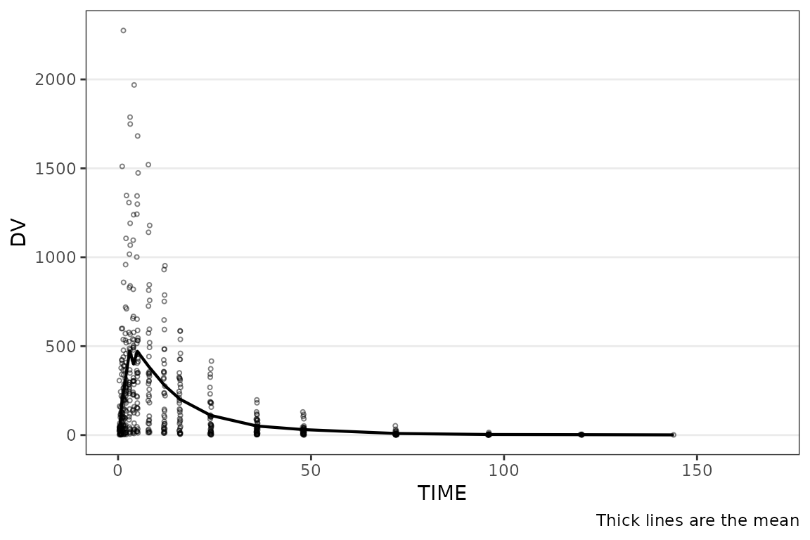

Now the function returns a plot! Conveniently, the time variables in
`data_sad` had names aligned with the default arguments and did not have
to be specified as arguments; however, this may not always be the case.

The same variable name can be passed to both `time_var` and `ntime_var`
arguments for the special case where only nominal times are known.

``` r

plot_dvtime(plot_data_pk, dv_var = ODV, time_var = NTIME, ntime_var = NTIME)
```


### Suppressing the Caption

A caption prints by default describing the plot elements. The caption
can be suppressed by specifying `show_caption = FALSE`.

``` r

plot_dvtime(data = plot_data_pk, dv_var = ODV, show_caption = FALSE) 
```

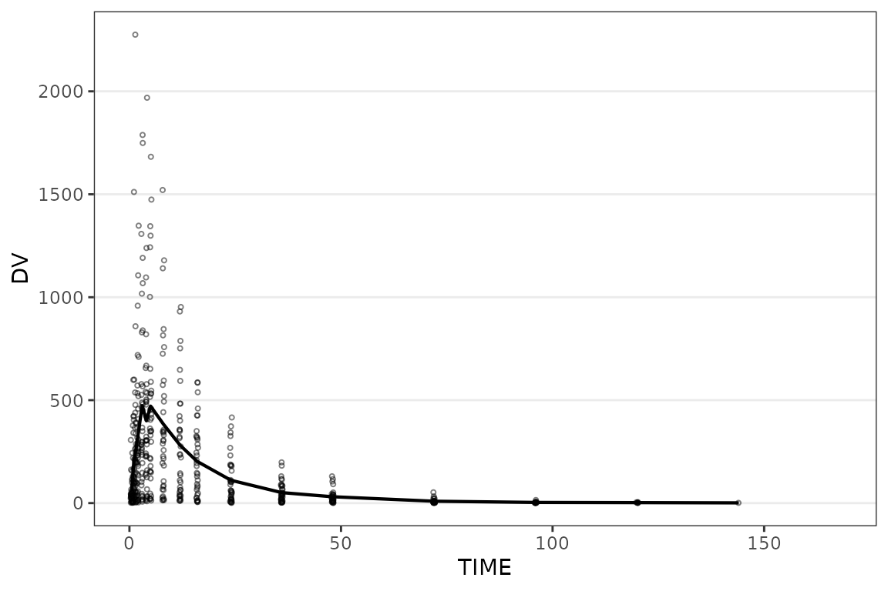

### Setting Axis Scales, Breaks, and Labels

[`plot_dvtime()`](https://ryancrass.github.io/pmxhelpr/reference/plot_dvtime.md)
includes one argument (`log_y`), which performs a log10 transformation
of the y-axis with some additional formatting benefits over manually
adding the layer to the returned object with
[`scale_y_log10()`](https://ggplot2.tidyverse.org/reference/scale_continuous.html).

- Includes log tick marks on the y-axis
- Updates the caption with the correct central tendency measure if
  `show_captions = TRUE`.

[`plot_dvtime()`](https://ryancrass.github.io/pmxhelpr/reference/plot_dvtime.md)
uses the
[`stat_summary()`](https://ggplot2.tidyverse.org/reference/stat_summary.html)
function from `ggplot2` to calculate and plot the central tendency
measures and error bars. An often overlooked feature of
[`stat_summary()`](https://ggplot2.tidyverse.org/reference/stat_summary.html),
is that it calculates the summary statistics *after* any transformations
to the data performed by changing the scales. This means that when
[`scale_y_log10()`](https://ggplot2.tidyverse.org/reference/scale_continuous.html)
is applied to the plot, the data are log-transformed for plotting and
the central tendency measure returned when requesting `"mean"` from
[`stat_summary()`](https://ggplot2.tidyverse.org/reference/stat_summary.html)
is the *geometric mean*. If the `log_y` argument is used to generate
semi-log plots along with `show_captions = TRUE`, then the caption will
delineate where arithmetic and geometric means are being returned.

``` r

plot_dvtime(data = plot_data_pk, dv_var = ODV, log_y = TRUE) 
```

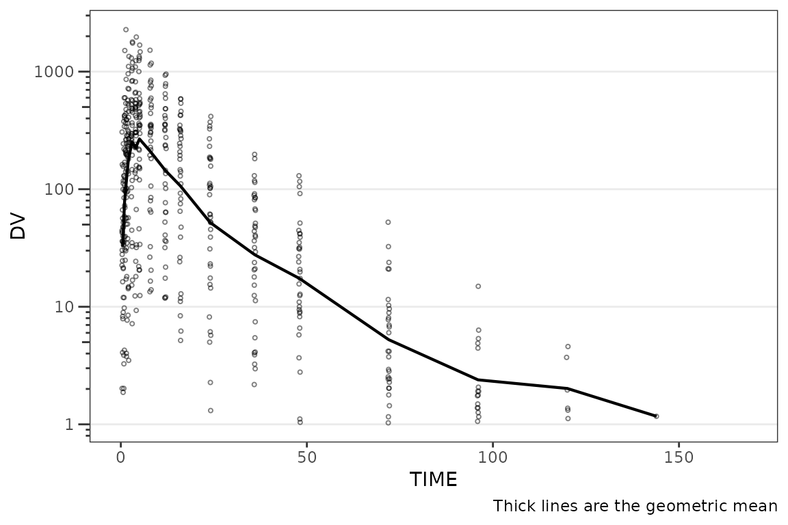

The x-axis breaks and axis labels can always be customized by adding
[`scale_x_continuous()`](https://ggplot2.tidyverse.org/reference/scale_continuous.html)
and/or [`labs()`](https://ggplot2.tidyverse.org/reference/labs.html)
layers to the returned `ggplot` object. The default for ggplot is to
break the x-axis in units divisible by 5, which do not often map well to
time units and should routinely be overwritten.

``` r

plot_dvtime(data = plot_data_pk, dv_var = ODV, log_y = TRUE) + 
  scale_x_continuous(breaks = seq(0, 168, 24)) + 
  labs(y = "Concentration (ng/mL)", x = "Time Since First Dose (hours)")
```

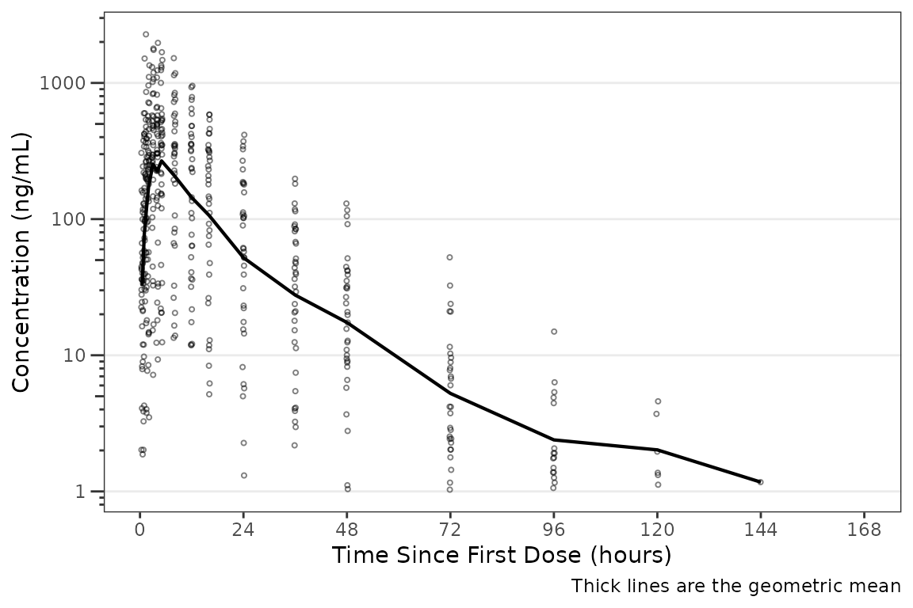

### Specifying the Color Aesthetic

The color aesthetic can be mapped to a dataset variable using the
`col_var` argument. This argument uses non-standard evaluation and can
be passed as a bare column name or as a string.

This can be demonstrated using the `Dose and Food` variable we defined
earlier with sample size counts using
[`var_addn()`](https://ryancrass.github.io/pmxhelpr/reference/var_addn.md).

``` r

plot_dvtime(data = plot_data_pk, dv_var = ODV, log_y = TRUE, 
            col_var = `Dose and Food`) + 
  scale_x_continuous(breaks = seq(0, 168, 24)) + 
  labs(y = "Concentration (ng/mL)", x = "Time Since First Dose (hours)")
```

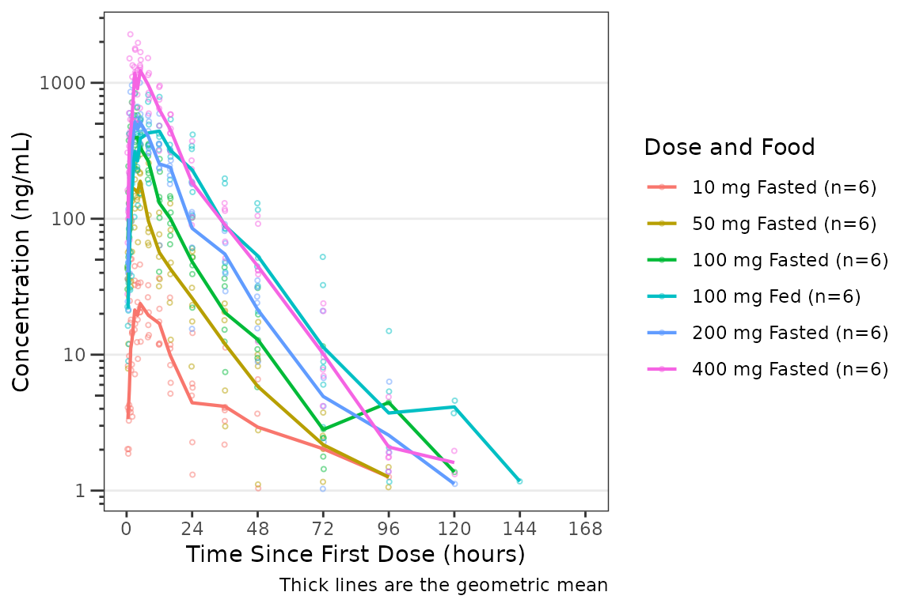

### Specifying the Central Tendency

The argument `cent` specifies the method of calculating the central
tendency (+/- variability) within levels of the variable passed to the
`col_var`. The default is `cent = "mean"`; however, note that the
calculation is performed *after* any transformations to the data and
this option will return the geometric mean when `log_y=TRUE`.

If the `log_y` argument is used to generate semi-log plots along with
`show_captions = TRUE`, then the caption will automatically delineate
where arithmetic and geometric means are being returned.

``` r

plot_dvtime(data = plot_data_pk, dv_var = ODV, col_var = `Dose and Food`, cent = "mean") +
  scale_x_continuous(breaks = seq(0, 168, 24)) + 
  labs(y = "Concentration (ng/mL)", x = "Time Since First Dose (hours)")
```

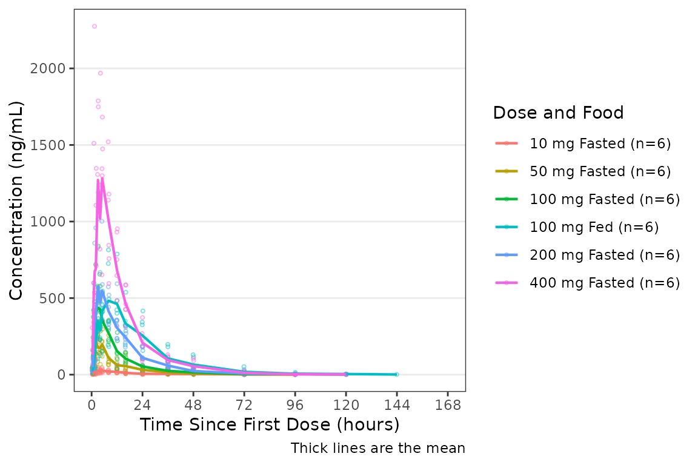

[`plot_dvtime()`](https://ryancrass.github.io/pmxhelpr/reference/plot_dvtime.md)
returns a `ggplot` object which we can be further modified using native
`ggplot` functions. Therefore, we can facet by PART by simply adding in
another layer to our `ggplot` object.

``` r

plot_dvtime(data = plot_data_pk, dv_var = ODV, col_var = `Dose and Food`, cent = "mean",
            log_y = TRUE) +
  scale_x_continuous(breaks = seq(0, 168, 24)) + 
  labs(y = "Concentration (ng/mL)", x = "Time Since First Dose (hours)") +
  facet_wrap(~PART)
```

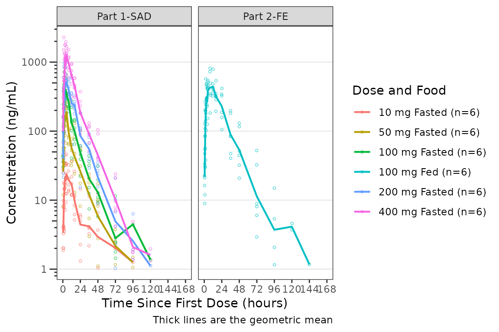

The plot can be simplified to show mean +/- standard deviation by
specifying `cent = "mean_sdl"`. The observed points just add noise when
combined with error bars and can be hidden by setting
`obs_point = pmx_point(alpha = 0)` in the theme.

``` r

plot_dvtime(data = plot_data_pk, dv_var = ODV, col_var = `Dose and Food`, 
            cent = "mean_sdl",log_y = TRUE,
            theme = plot_dvtime_theme(obs_point = pmx_point(alpha = 0))) +
  scale_x_continuous(breaks = seq(0, 168, 24)) + 
  labs(y = "Concentration (ng/mL)", x = "Time Since First Dose (hours)") +
  facet_wrap(~PART)
```

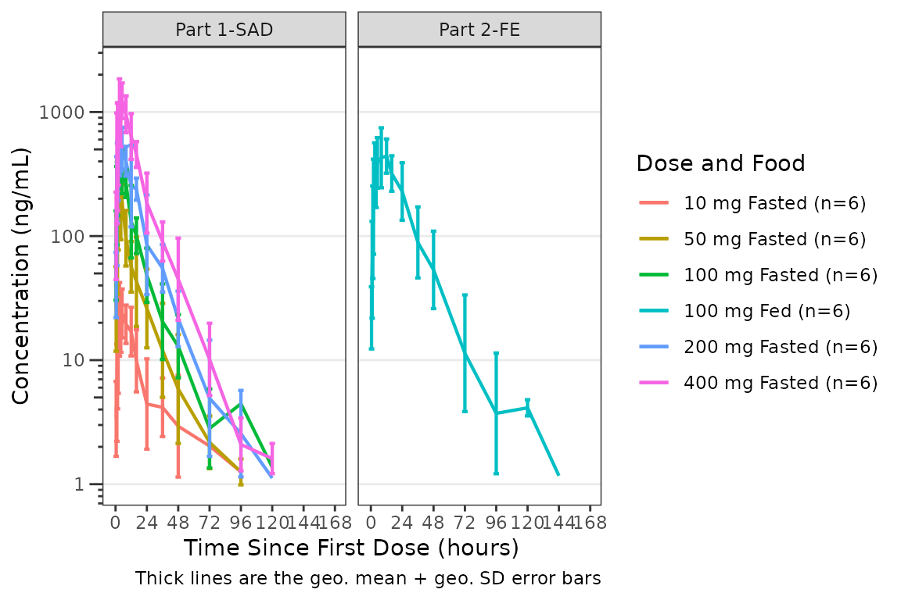

For data with high variability visualized on a linear y-axis, the error
bars may drop below zero. In this case, the upper error bar only may be
requested by specifying `cent = "mean_sdl_upper"`.

``` r

plot_dvtime(data = plot_data_pk, dv_var = ODV, col_var = `Dose and Food`, 
            cent = "mean_sdl_upper",
            theme = plot_dvtime_theme(obs_point = pmx_point(alpha = 0))) +
  scale_x_continuous(breaks = seq(0, 168, 24)) + 
  labs(y = "Concentration (ng/mL)", x = "Time Since First Dose (hours)") +
  facet_wrap(~PART)
```

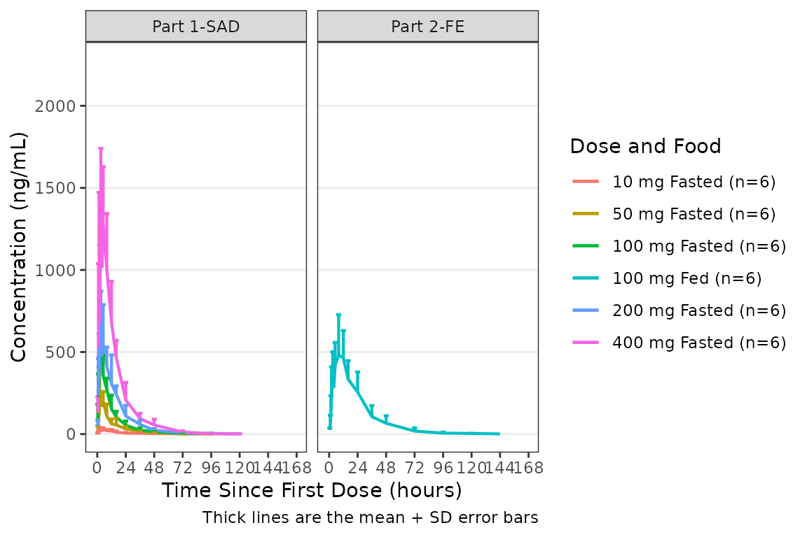

For small samples or non-normally (or log-normally) distributed data,
the median and inter-quartile range (IQR) error bars may be requested by
specifying `cent = "median_iqr"`.

``` r

plot_dvtime(data = plot_data_pk, dv_var = ODV, col_var = `Dose and Food`, 
            cent = "median_iqr",log_y = TRUE,
            theme = plot_dvtime_theme(obs_point = pmx_point(alpha = 0))) +
  scale_x_continuous(breaks = seq(0, 168, 24)) + 
  labs(y = "Concentration (ng/mL)", x = "Time Since First Dose (hours)") +
  facet_wrap(~PART)
```


### Connecting Repeated Measures at the Individual Level

Data points may be connected longitudinally within an individual by
specifying `id_var` (e.g., `id_var = ID`). The grouping variable
inherits the variable mapped to the color aesthetic with `col_var`. The
central tendency may be removed by specifying `cent ="none"` or the
median may be plotted by specifying `cent="median"`.

This argument supports non-standard evaluation, and may be passed as
bare names or strings.

``` r

plot_dvtime(data = plot_data_pk, dv_var = ODV, col_var = `Dose and Food`, cent = "median",
            log_y = TRUE,id_var = ID) +
  scale_x_continuous(breaks = seq(0, 168, 24)) + 
  labs(y = "Concentration (ng/mL)", x = "Time Since First Dose (hours)") +
  facet_wrap(~PART)
```

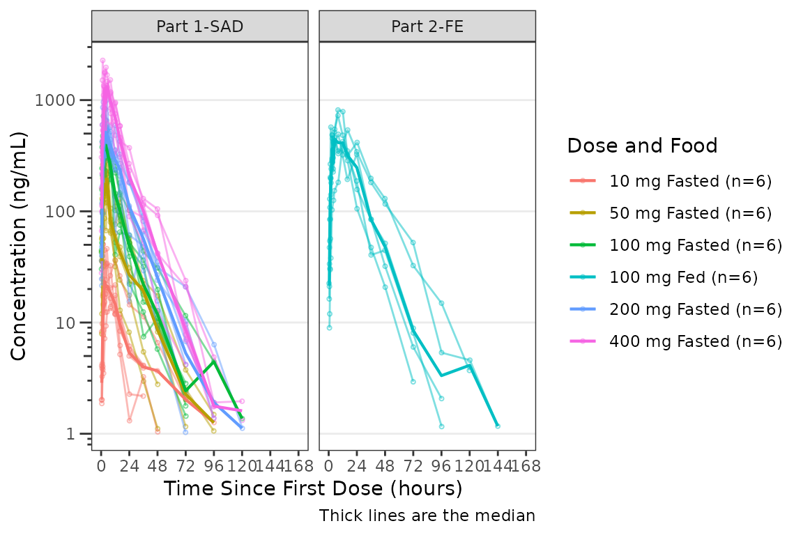

### Handling of BLQ Data

[`plot_dvtime()`](https://ryancrass.github.io/pmxhelpr/reference/plot_dvtime.md)
includes functionality to automatically handle imputation of PK data
censored due to assay limitations. This requires specification of two
arguments: `loq` and `loq_method`.

The `loq_method` argument specifies how BLQ imputation should be
performed. Options are:

- `0` or `"none"`: No handling. Plot input dataset `DV` vs `TIME` as is.
  (default)
- `1` or `"postdose"`: Impute all BLQ data at `TIME` \<= 0 to 0 and all
  BLQ data at `TIME` \> 0 to 1/2 x `loq`. Useful for plotting
  concentration-time data with some data BLQ on a linear scale
- `2` or `"all"`: Impute all BLQ data to 1/2 x `loq`. Useful for
  plotting concentration-time data with some data BLQ on a log scale

The `loq` argument specifies the numeric value of the LLOQ. The `loq`
argument must be specified when `loq_method` is non-zero, but can be
`NULL` *if* the variable `LLOQ` is present in the dataset and the value
of `loq` will be inherited from the data.

``` r

plot_dvtime(plot_data_pk, dv_var = ODV, col_var = `Dose and Food`, 
            cent = "mean",log_y = TRUE,loq_method = "all") +
  scale_x_continuous(breaks = seq(0, 168, 24)) + 
  labs(y = "Concentration (ng/mL)", x = "Time Since First Dose (hours)") +
  facet_wrap(~PART)
```

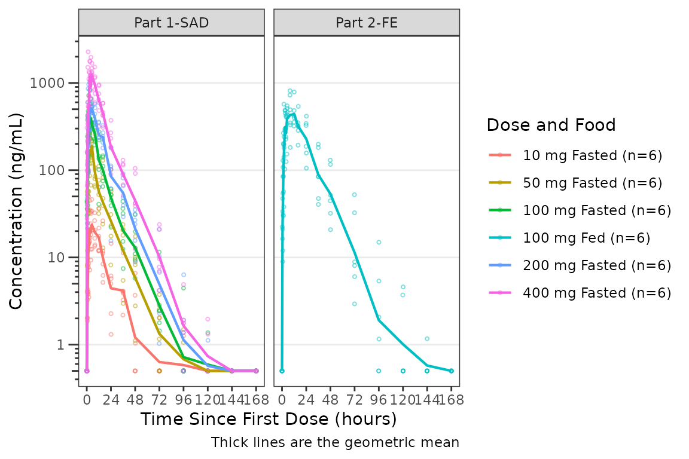

The same plot is obtained by specifying `loq_method = 2` and `loq = 1`

``` r

plot_dvtime(plot_data_pk, dv_var = ODV, col_var = `Dose and Food`, 
            cent = "mean", log_y = TRUE,loq_method = 2, loq = 1) +
  scale_x_continuous(breaks = seq(0, 168, 24)) + 
  labs(y = "Concentration (ng/mL)", x = "Time Since First Dose (hours)") +
  facet_wrap(~PART)
```

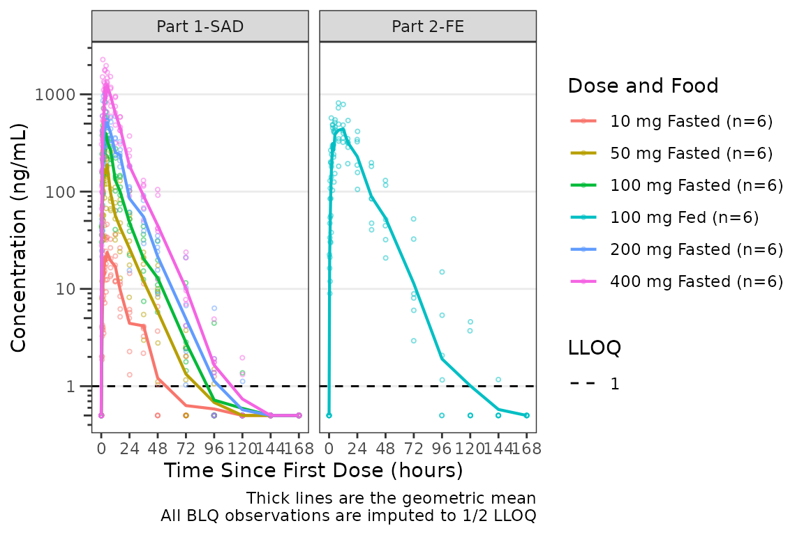

A reference line is drawn to denote the LLOQ and all observations with
`EVID=0` and `MDV=1` are imputed as LLOQ/2. The numeric value of LLOQ is
printed in the legend and a caption is added to indicate the imputation
method for BLQ data.

### Applying Dose-normalization

[`plot_dvtime()`](https://ryancrass.github.io/pmxhelpr/reference/plot_dvtime.md)
also has functionality to generate dose-normalized concentration-time
plots by specifying `dosenorm = TRUE`.

``` r

plot_dvtime(plot_data_pk, dv_var = ODV, col_var = `Dose and Food`, cent = "mean",
            log_y = TRUE,
            dosenorm = TRUE) +
  scale_x_continuous(breaks = seq(0, 168, 24)) + 
  labs(y = "Dose-normalized Conc. (ng/mL/mg)", x = "Time Since First Dose (hours)") +
  facet_wrap(~PART)
```

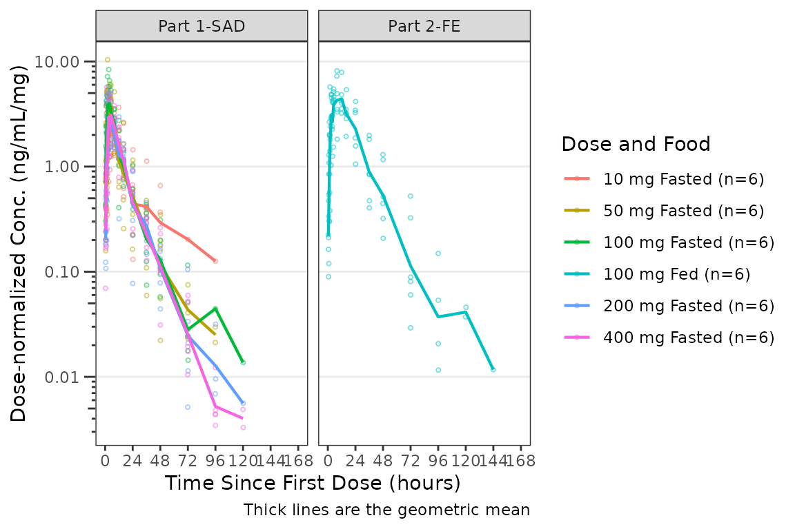

When `dosenorm = TRUE`, the variable specified in `dose_var` (default =
DOSE) needs to be present in the input dataset `data`. If `dose_var` is
not present in `data`, the function will return an *Error* with an
informative error message. This argument uses non-standard evaluation
and can be passed as a bare column name or as a string.

``` r

plot_dvtime(select(plot_data_pk, -DOSE),
            dv_var = ODV, col_var = `Dose and Food`, 
            cent = "mean", log_y = TRUE,dosenorm = TRUE) +
  labs(y = "Dose-normalized Conc. (ng/mL/mg)", x = "Time Since First Dose (hours)") +
  facet_wrap(~PART)
#> Error in `check_varsindf()`:
#> ! argument `dose_var` must be variable(s) in `data` (not found: 'DOSE').
#> Available columns: ID, TIME, NTIME, NDAY, AMT, EVID, ODV, LDV, CFB, CONC, LINE, CMT, MDV, BLQ, LLOQ, FOOD, SEXF, RACE, AGEBL, WTBL, SCRBL, CRCLBL, USUBJID, PART, Food Status, Dose and Food, Dose
```

Dose-normalization is performed *AFTER* BLQ imputation in the case in
which both options are requested. The reference line for the LLOQ will
not be plotted when dose-normalized concentration is the dependent
variable.

``` r

plot_dvtime(plot_data_pk, dv_var = ODV, col_var = `Dose and Food`, cent = "mean",
            log_y = TRUE,
            loq_method = 2, dosenorm = TRUE) +
  labs(y = "Dose-normalized Conc. (ng/mL/mg)", x = "Time Since First Dose (hours)") +
  facet_wrap(~PART)
```

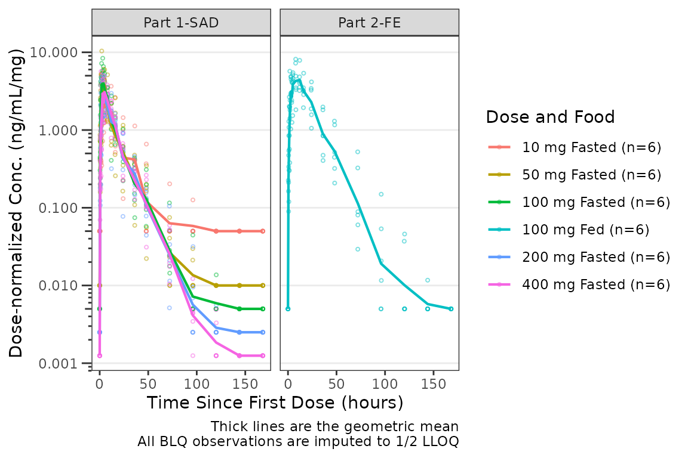

### Adjusting the Plot Theme with `plot_dvtime_theme()`

The default aesthetics for Response-Time plots are controlled via
[`plot_dvtime_theme()`](https://ryancrass.github.io/pmxhelpr/reference/plot_dvtime_theme.md).
See the [Plot Themes and
Aesthetics](https://ryancrass.github.io/pmxhelpr/articles/plot-themes.md)
vignette for details on the theme system, element constructors, and
examples of customizing Response-Time aesthetics.

``` r

plot_dvtime_theme()
#> <plot_dvtime_theme>
#>   obs_point     <pmx_point>: shape = 1, size = 0.75, alpha = 0.5
#>   obs_line      <pmx_line>: linewidth = 0.5, linetype = 1, alpha = 0.5
#>   cent_point    <pmx_point>: shape = 16, size = 1.25, alpha = 0
#>   cent_line     <pmx_line>: linewidth = 0.75, linetype = 1, alpha = 1
#>   cent_errorbar <pmx_errorbar>: linewidth = 0.75, linetype = 1, alpha = 1, width = NULL
#>   ref_line      <pmx_line>: linewidth = 0.5, linetype = 2, alpha = 1
#>   loq_line      <pmx_line>: linewidth = 0.5, linetype = 2, alpha = 1
```

Say we want to update the errorbar cap width to be more visible in our
prior geometric mean +/- geometric SD plot with the interaction of dose
and food passed to the color aesthetic. This can be done by defining a
new theme and passing that to the `theme` argument of
[`plot_dvtime()`](https://ryancrass.github.io/pmxhelpr/reference/plot_dvtime.md).

``` r

dvtime_new_theme <- plot_dvtime_theme(
  obs_point = pmx_point(alpha = 0),
  cent_errorbar  = pmx_errorbar(width = 10)
)
```

``` r

plot_dvtime(data = plot_data_pk, dv_var = ODV, col_var = `Dose and Food`, 
            cent = "mean_sdl",log_y = TRUE,
            theme = dvtime_new_theme) +
  scale_x_continuous(breaks = seq(0, 168, 24)) + 
  labs(y = "Concentration (ng/mL)", x = "Time Since First Dose (hours)") +
  facet_wrap(~PART)
```


## Individual Concentration-time plots with `plot_dvtime()`

The previous section provides an overview of how to generate population
concentration-time profiles by dose using
[`plot_dvtime()`](https://ryancrass.github.io/pmxhelpr/reference/plot_dvtime.md);
however, we can also use
[`plot_dvtime()`](https://ryancrass.github.io/pmxhelpr/reference/plot_dvtime.md)
to generate subject-level visualizations with a little pre-processing of
the input dataset.

We can specify `cent = "none"` to remove the central tendency layer when
plotting individual subject data.

``` r

plot_dvtime(plot_data_pk, dv_var = ODV, col_var = `Dose and Food`, 
            cent = "none",log_y = TRUE, id_var = ID,
            loq_method = 2, loq = 1) +
  labs(y = "Concentration (ng/mL)") +
  facet_wrap(~PART)
```

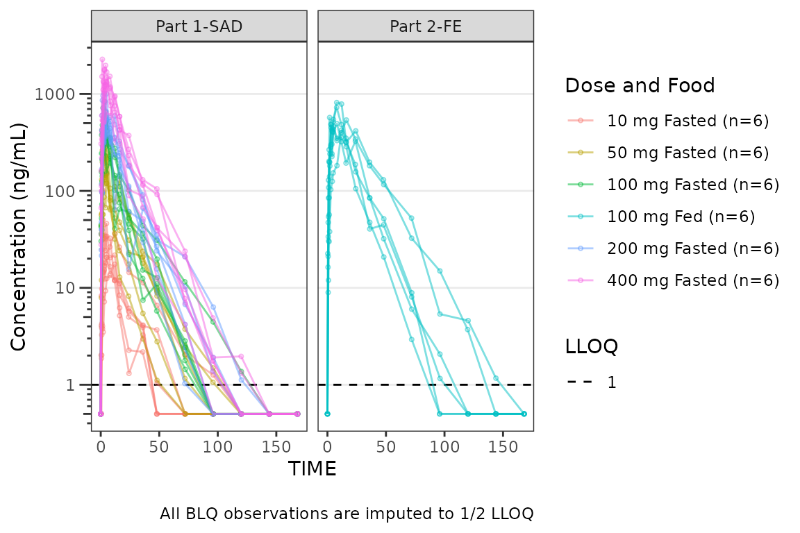
We can plot an individual subject by filtering the input dataset. This
could be extended to generate plots for all individuals using `for`
loops, [`lapply()`](https://rdrr.io/r/base/lapply.html),
[`purrr::map()`](https://purrr.tidyverse.org/reference/map.html)
functions, or other methods.

``` r


ids <- sort(unique(plot_data_pk$ID)) #vector of unique subject ids
n_ids <- length(ids) #count of unique subject ids
plots_per_pg <- 4
n_pgs <- ceiling(n_ids/plots_per_pg) #Total number of pages needed

plist<- list()
for(i in 1:n_ids){
  plist[[i]] <- plot_dvtime(filter(plot_data_pk, ID == ids[i]),
                               dv_var = ODV, cent = "none",
            log_y = TRUE,
            id_var = ID,
            loq_method = 2, loq = 1, show_caption = FALSE) +
  labs(y = "Concentration (ng/mL)", x = "Time Since First Dose (hours)") +
  facet_wrap(~PART)+
  labs(title = paste0("ID = ", ids[i], " | Dose = ", unique(plot_data_pk$DOSE[plot_data_pk$ID==ids[i]]), " mg"))+
  theme(legend.position="none")
}

lapply(1:n_pgs, function(n_pg) {
      i <-  (n_pg-1)*plots_per_pg+1
      j <- n_pg*plots_per_pg
      wrap_plots(plist[i:j])
})
#> [[1]]
```

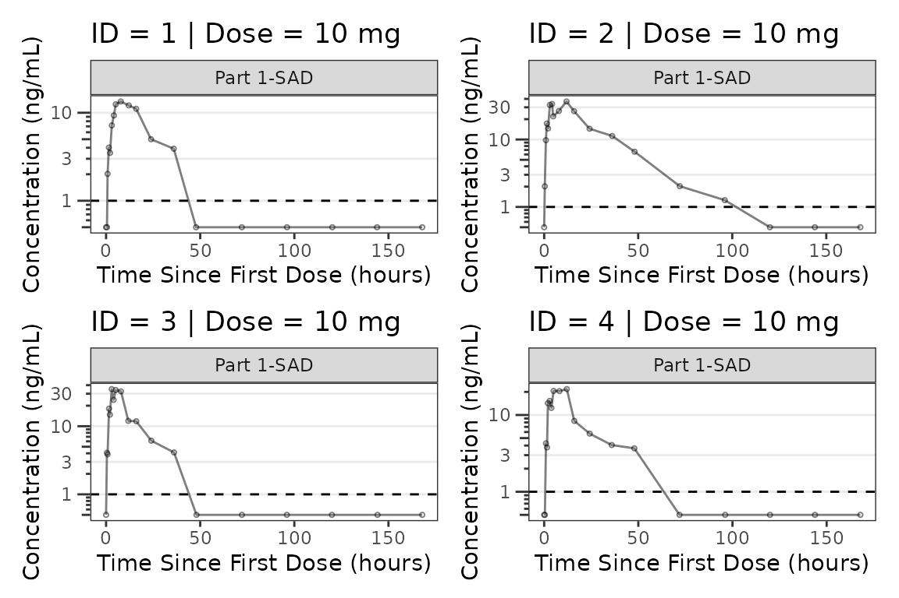

    #> 
    #> [[2]]

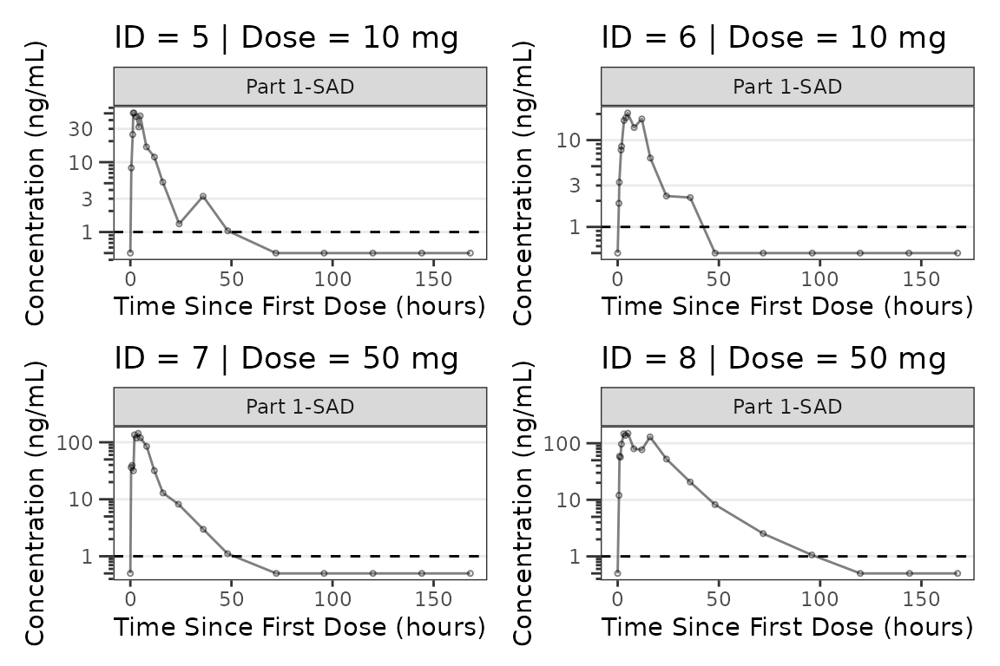

    #> 
    #> [[3]]

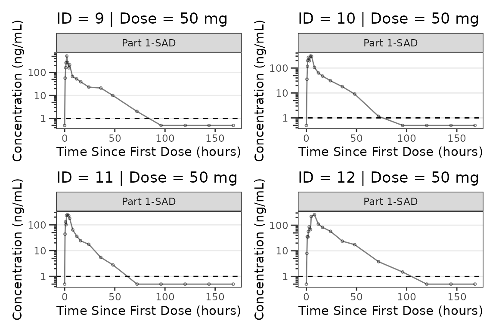

    #> 
    #> [[4]]

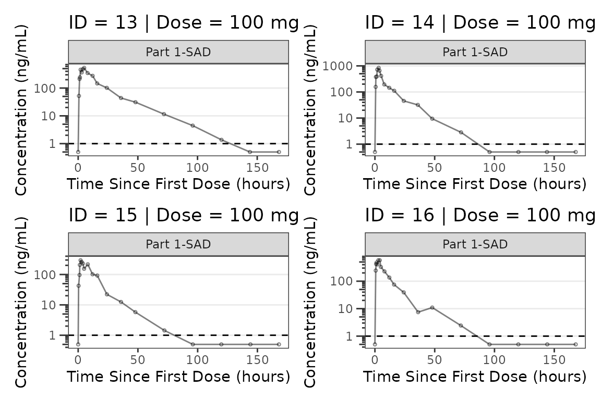

    #> 
    #> [[5]]

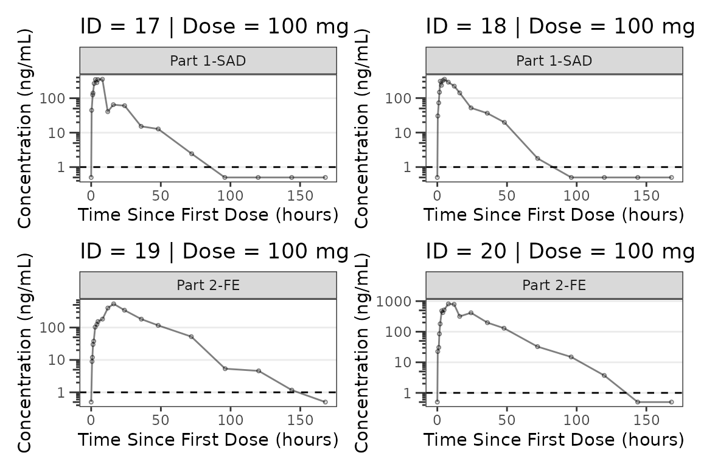

    #> 
    #> [[6]]

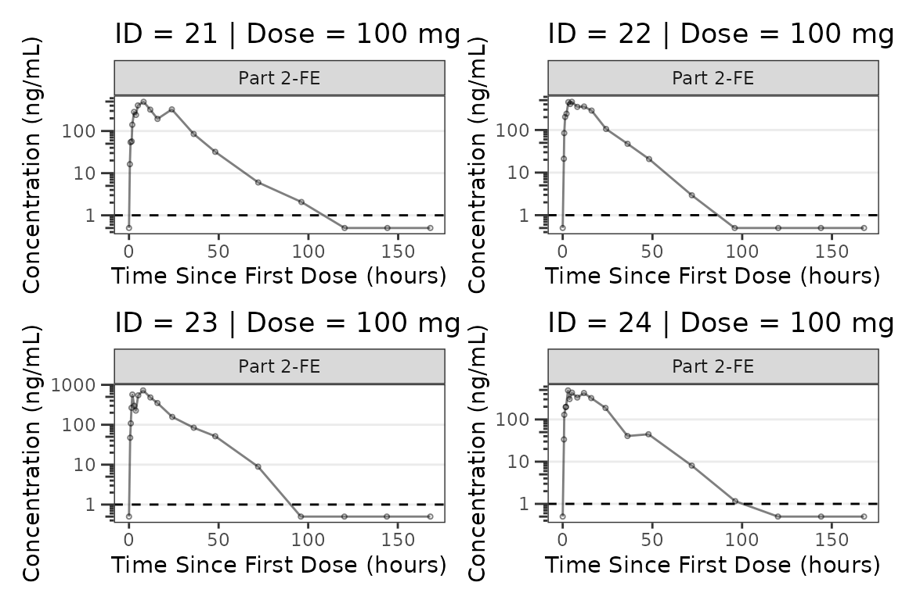

    #> 
    #> [[7]]

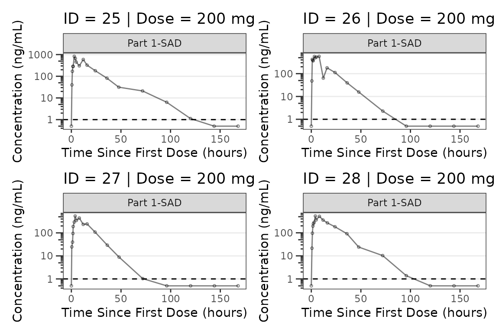

    #> 
    #> [[8]]

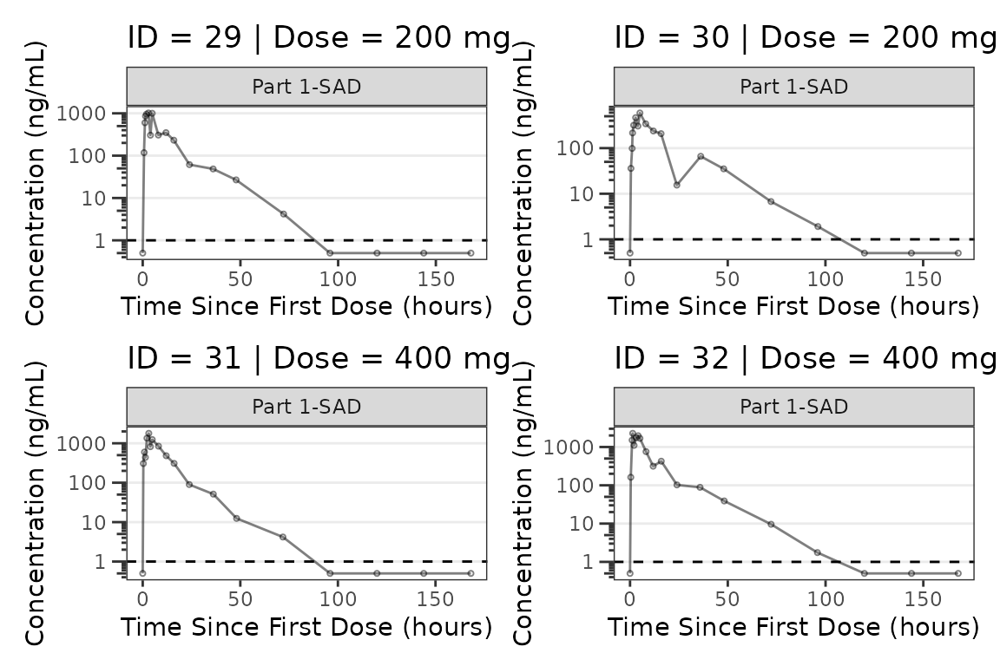

    #> 
    #> [[9]]

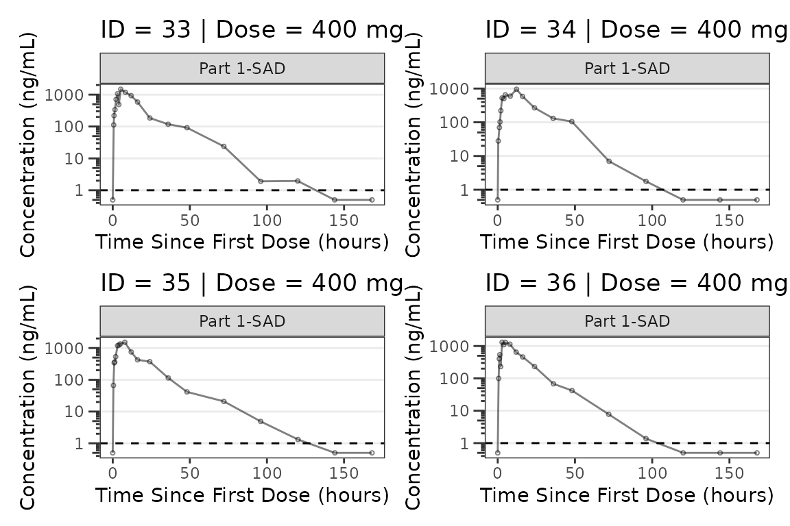

## Population Response-time Plots with `plot_dvtime()`

Longitudinal pharmacodynamic response data can also be visualized over
time using
[`plot_dvtime()`](https://ryancrass.github.io/pmxhelpr/reference/plot_dvtime.md).
This function is designed to visualize a dependent variable versus time
and can be used for PK and/or PD data!

``` r

plot_dvtime(data = plot_data_pd, dv_var = ODV, col_var = `Dose and Food`) +
  labs(y = "Response (% of Baseline)", x = "Time Since First Dose (hours)")
```

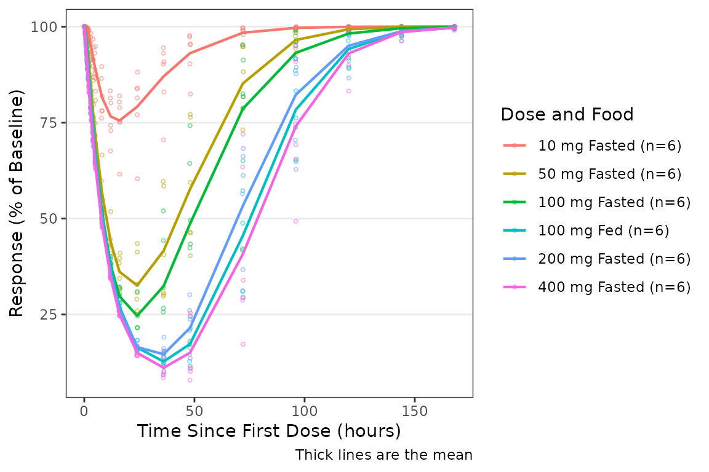

### Specifying a Reference Value for Change Metrics

A horizontal reference line can be added by specifying the `ref`
argument with a numeric y-intercept value. For example, `ref = 100` adds
a reference line at y = 100:

``` r

plot_dvtime(data = plot_data_pd, dv_var = ODV,col_var = `Dose and Food`,
            ref = 100) +
  labs(y = "Response (% of Baseline)", x = "Time Since First Dose (hours)")
```


When the response variable is expressed as change from baseline,
`ref = 0` provides the appropriate reference line:

``` r

plot_dvtime(data = plot_data_pd, dv_var = CFB,col_var = `Dose and Food`,
            ref = 0) +
   labs(y = "Response (% of Baseline)", x = "Time Since First Dose (hours)")
```

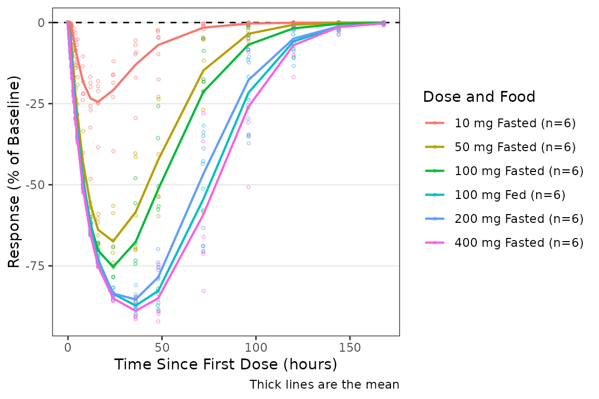

### Combining PK and PD Panels

Simultaneous visualization of the time-course of drug concentration and
response can be achieved by combining two
[`plot_dvtime()`](https://ryancrass.github.io/pmxhelpr/reference/plot_dvtime.md)
calls with the `patchwork` package. This approach provides full control
over the content and aesthetics of each panel.

``` r

p_pk <- plot_dvtime(data = plot_data_pk, dv_var = ODV, col_var = `Dose and Food`, 
                    log_y = TRUE) +
  labs(x = "Time Since First Dose (hours)", y = "Concentration (ng/mL)")

p_pd <- plot_dvtime(data = plot_data_pd, dv_var = ODV, col_var = `Dose and Food`,
                    ref = 100) +
  labs(x = "Time Since First Dose (hours)", y = "Response (% of Baseline)")

p_pk / p_pd + plot_layout(guides = "collect")
```

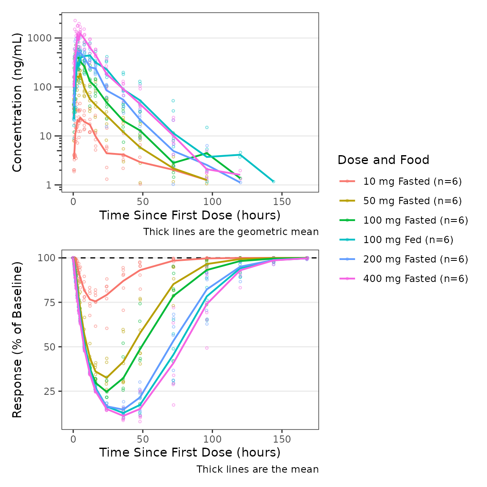

Each panel can be customized independently. For example, BLQ imputation
can be applied to the PK panel while the PD panel uses change from
baseline with its own central tendency specification with captions
removed from both panels.

``` r

p_pk <- plot_dvtime(data = plot_data_pk, dv_var = ODV,col_var = Dose, 
                    log_y = TRUE,loq_method = 2, show_caption = FALSE) +
  labs(x = "Time Since First Dose (hours)", y = "Concentration (ng/mL)")

p_pd <- plot_dvtime(data = plot_data_pd, dv_var = CFB,
                    col_var = Dose, cent = "median", show_caption = FALSE) +
  labs(x = "Time Since First Dose (hours)", y = "Response (% Change from Baseline)")

p_pk / p_pd + plot_layout(guides = "collect")
```

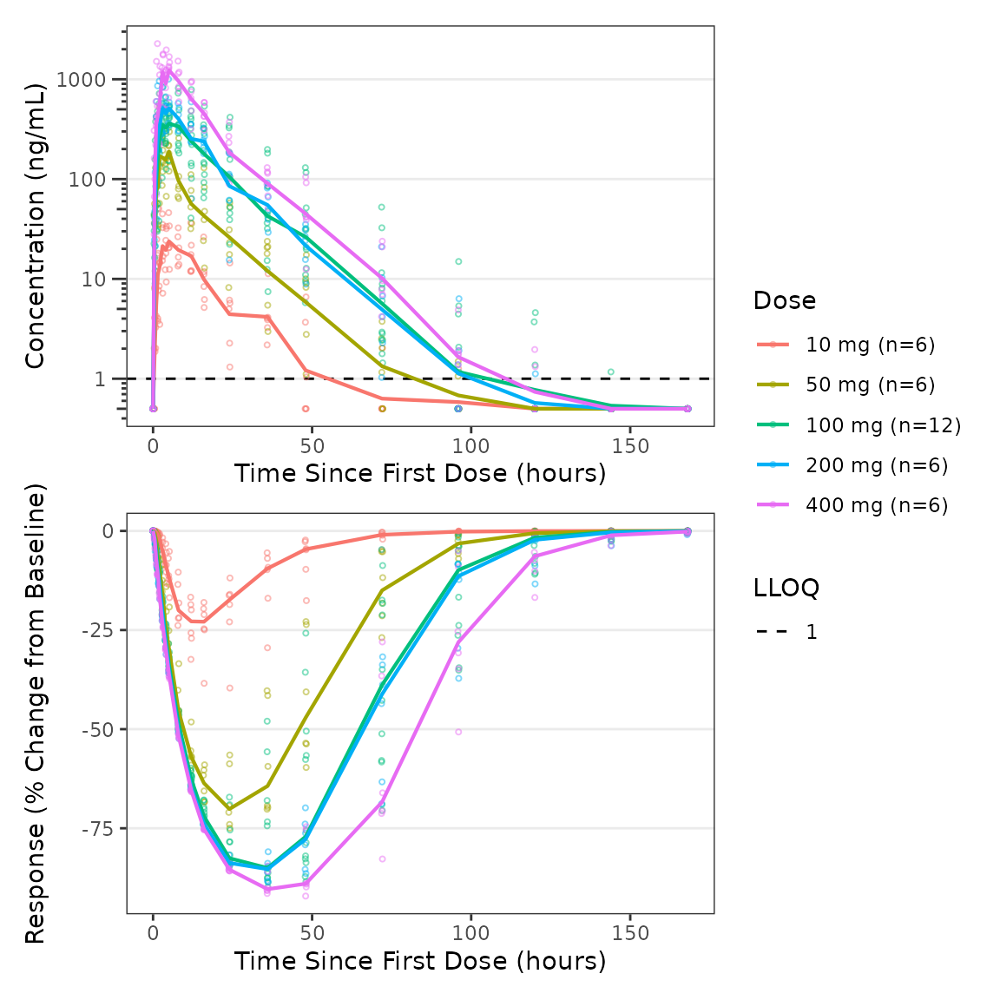

## Population Response-Concentration Plots with `plot_dvconc()`

### Overview

[`plot_dvconc()`](https://ryancrass.github.io/pmxhelpr/reference/plot_dvconc.md)
is a plotting function intended to help with visualization of the
relationship between a dependent variable for response and drug
concentration.

### Specifying Dependent and Independent Variables

[`plot_dvconc()`](https://ryancrass.github.io/pmxhelpr/reference/plot_dvconc.md)
has 2 arguments that specify the dependent variable to be mapped to the
y-axis `dv_var` and the independent variable to be mapped to the x-axis
(`idv_var`). The defaults are as follows:

- `dv_var` = DV, character string specifying the dependent variable to
  map to the y-axis.
- `idv_var`= CONC, character string specifying the independent variable
  to map to the x-axis.

Both arguments use non-standard evaluation and can be passed as bare
column names or strings.

``` r

plot_dvconc(data = plot_data_pd, dv_var = ODV, idv_var = CONC) +
  labs(x = "Drug Concentration (ng/mL)", y = "Response (% of Baseline)")
```

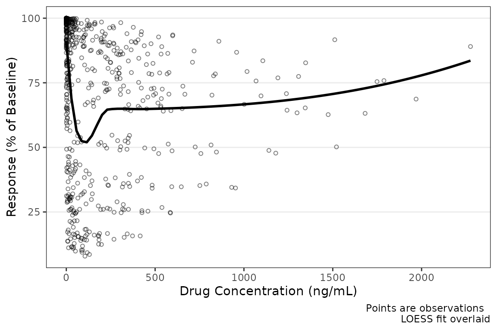

### Specifying Change from Baseline

Like
[`plot_dvtime()`](https://ryancrass.github.io/pmxhelpr/reference/plot_dvtime.md),
we can add a horizontal reference line by specifying `ref` with a
numeric y-intercept.

``` r

plot_dvconc(data = plot_data_pd, dv_var = CFB, idv_var = CONC,
            ref = 0) +
  labs(x = "Drug Concentration (ng/mL)", y = "Response (% Change from Baseline)")
```

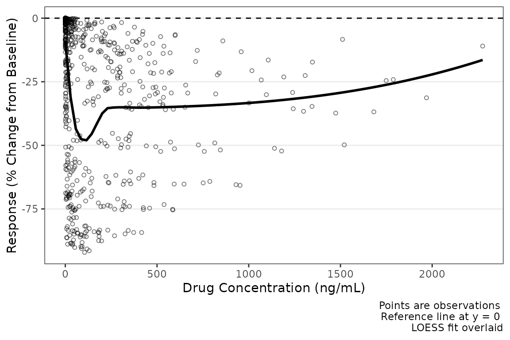

### Specifying the Color Aesthetic

[`plot_dvconc()`](https://ryancrass.github.io/pmxhelpr/reference/plot_dvconc.md)
includes two arguments for controlling the color aesthetic, `col_var`
and `col_trend`. If a variable is passed to the `col_var` argument, the
data points are colored based on this variable; however, by default
`col_trend = FALSE` and the trend line is fit to the totality of the
data without stratifying the trend lines by the variable mapped to the
color aesthetic.

The `col_var` argument uses non-standard evaluation and can be passed as
a bare column name or as a string.

``` r

plot_dvconc(data = plot_data_pd, dv_var = CFB, idv_var = CONC,
            ref = 0,
            col_var = `Dose and Food`, col_trend = FALSE) +
  labs(x = "Drug Concentration (ng/mL)", y = "Response (% Change from Baseline)")
```

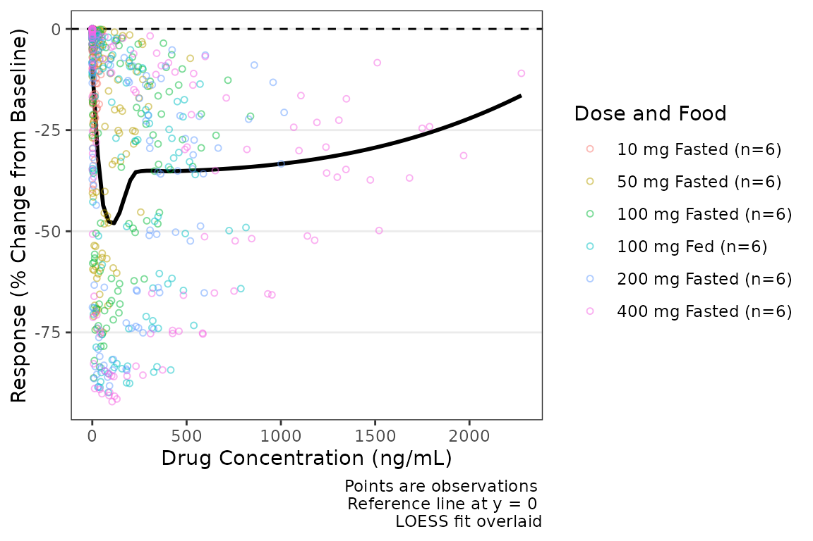

Trend lines stratified by the variable mapped to the color aesthetic are
requested by setting `col_trend = TRUE`.

``` r

plot_dvconc(data = plot_data_pd, dv_var = CFB, idv_var = CONC,ref = 0,
           col_var = `Dose and Food`, col_trend = TRUE) +
  labs(x = "Drug Concentration (ng/mL)", y = "Response (% Change from Baseline)")
```

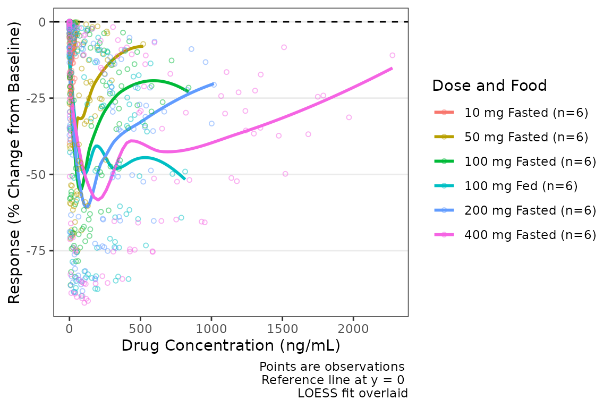

### Specifying the Central Tendency

There are two trend line types supported by
[`plot_dvconc()`](https://ryancrass.github.io/pmxhelpr/reference/plot_dvconc.md)

- locally estimated scatter plot smoothing (LOESS) fit
- linear regression.

The central tendency trend lines visualized are controlled by logical
arguments `loess` and `linear`. The default is `loess = TRUE` and
`linear = FALSE`

``` r

plot_dvconc(data = plot_data_pd, dv_var = CFB, idv_var = CONC, ref = 0, 
            col_var = `Dose and Food`, col_trend = FALSE, loess = TRUE, linear = TRUE) +
   labs(x = "Drug Concentration (ng/mL)", y = "Response (% Change from Baseline)")
```

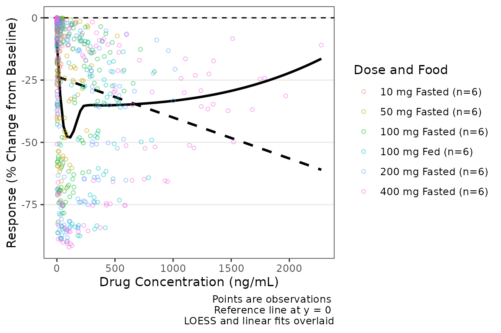

The confidence intervals of the trend lines are suppressed by default in
order to facilitate visualization of the central tendency and spread of
observed data points simultaneously. Confidence intervals can be added
to the plot using the logical arguments `se_loess` and `se_linear`.

``` r

plot_dvconc(data = plot_data_pd, dv_var = CFB, idv_var = CONC,ref = 0, 
            col_var = `Dose and Food`, col_trend = FALSE,
            loess = FALSE, linear = TRUE, se_loess = FALSE, se_linear = TRUE) +
  labs(x = "Drug Concentration (ng/mL)", y = "Response (% Change from Baseline)")
```

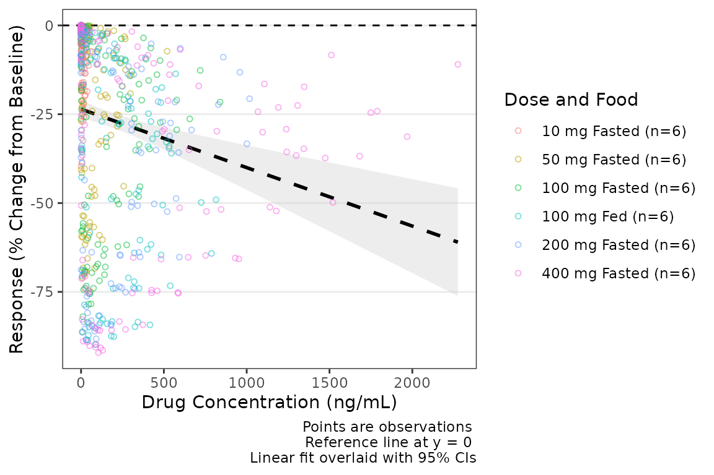

Additional arguments can be passed to `geom_smooth(method = "loess")`,
such as increasing the span of the smoothing fit.

``` r

plot_dvconc(data = plot_data_pd, dv_var = CFB, idv_var = CONC,ref = 0, 
            col_var = `Dose and Food`, col_trend = FALSE,
            loess = TRUE, linear = FALSE, se_loess = TRUE, se_linear = FALSE,
            span = 1) +
  labs(x = "Drug Concentration (ng/mL)", y = "Response (% Change from Baseline)")
```

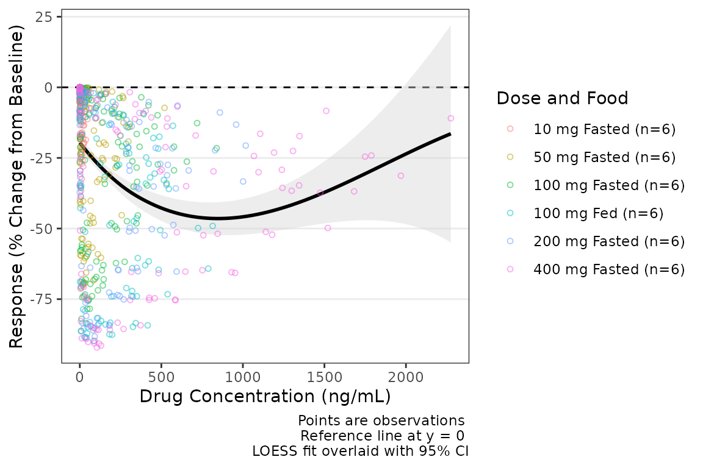
If the color aesthetic is mapped to the trendlines with
`col_trend = TRUE`, it will also map to the ribbons defining the CIs of
the trend lines.

``` r

plot_dvconc(data = plot_data_pd, dv_var = CFB, idv_var = CONC,ref = 0, 
            col_var = `Dose and Food`, col_trend = TRUE,se_loess = TRUE) +
  labs(x = "Drug Concentration (ng/mL)", y = "Response (% Change from Baseline)")
```

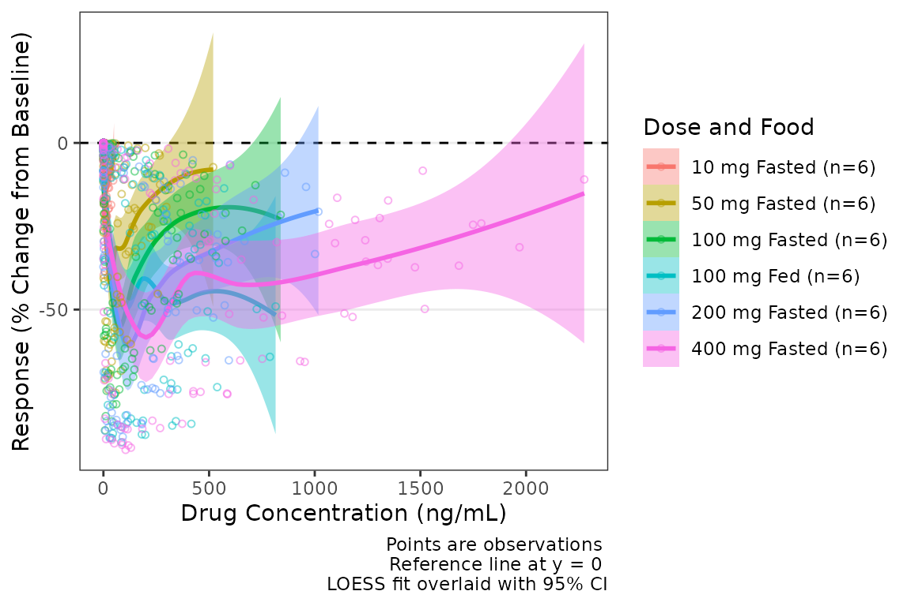

### Adjusting the Plot Theme with `plot_dvconc_theme()`

The default aesthetics for Response-Concentration plots are controlled
via
[`plot_dvconc_theme()`](https://ryancrass.github.io/pmxhelpr/reference/plot_dvconc_theme.md).
See the [Plot Themes and
Aesthetics](https://ryancrass.github.io/pmxhelpr/articles/plot-themes.md)
vignette for details on the theme system, element constructors, and
examples of customizing Response-Concentration aesthetics.

``` r

plot_dvconc_theme()
#> <plot_dvconc_theme>
#>   obs_point <pmx_point>: shape = 1, size = 1.25, alpha = 0.5
#>   ref_line  <pmx_line>: linewidth = 0.5, linetype = 2, alpha = 1
#>   loess     <pmx_trend>: linewidth = 1, linetype = 1, color = black, se_color = lightgrey, se_alpha = 0.4
#>   linear    <pmx_trend>: linewidth = 1, linetype = 2, color = black, se_color = lightgrey, se_alpha = 0.4
```

Say we want to update the color of the trend line and standard error.
This can be done by defining a new theme and passing that to the `theme`
argument of
[`plot_dvconc()`](https://ryancrass.github.io/pmxhelpr/reference/plot_dvconc.md).

``` r

dvconc_new_theme <- plot_dvconc_theme(
  loess = pmx_trend(color = "darkred", se_color = "darkred")
)
```

``` r

plot_dvconc(data = plot_data_pd, dv_var = CFB, idv_var = CONC,ref = 0,
            loess = TRUE, linear = FALSE, se_loess = TRUE, se_linear = FALSE,
            theme = dvconc_new_theme) +
  labs(x = "Drug Concentration (ng/mL)", y = "Response (% Change from Baseline)")
```

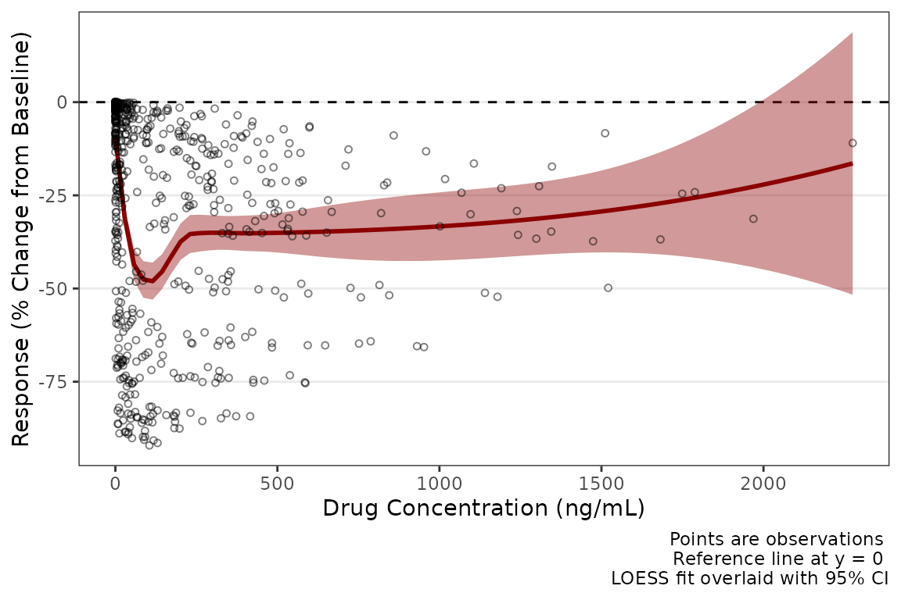

## See also

- [Dose-proportionality Assessment
  workflow](https://ryancrass.github.io/pmxhelpr/articles/doseprop-workflow.md)
  — statistical assessment of dose-proportionality of exposure using
  power law (log-log) regression
- [Plot Themes and
  Aesthetics](https://ryancrass.github.io/pmxhelpr/articles/plot-themes.md)
  — element constructors, theme factories, and class system for
  customizing plot output.
