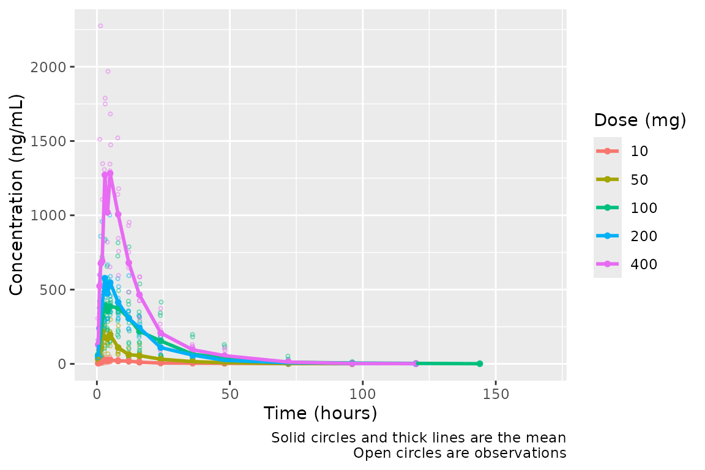
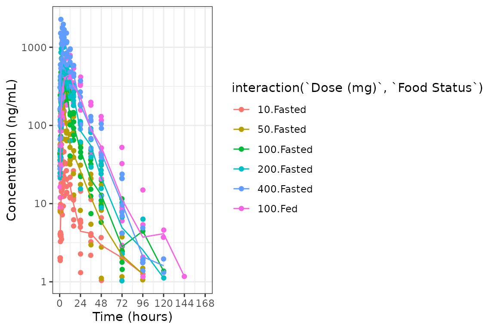
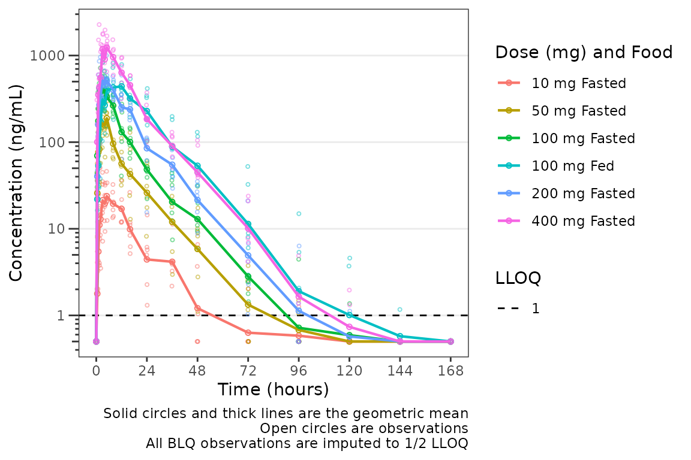
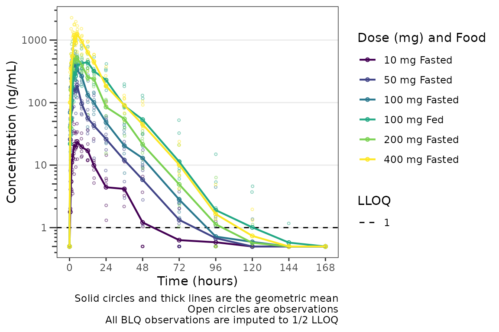
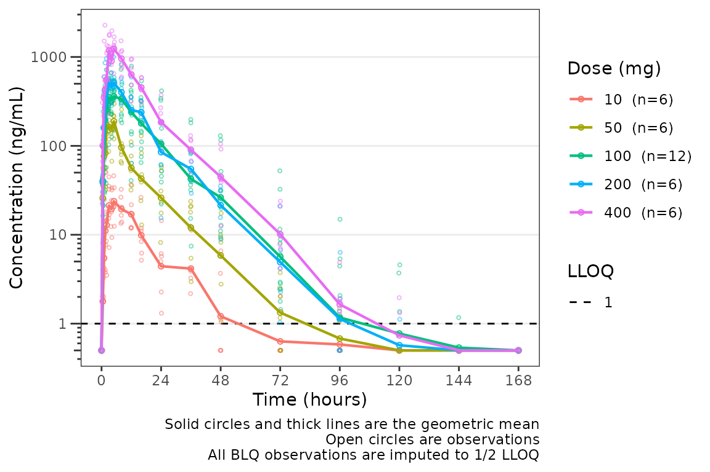
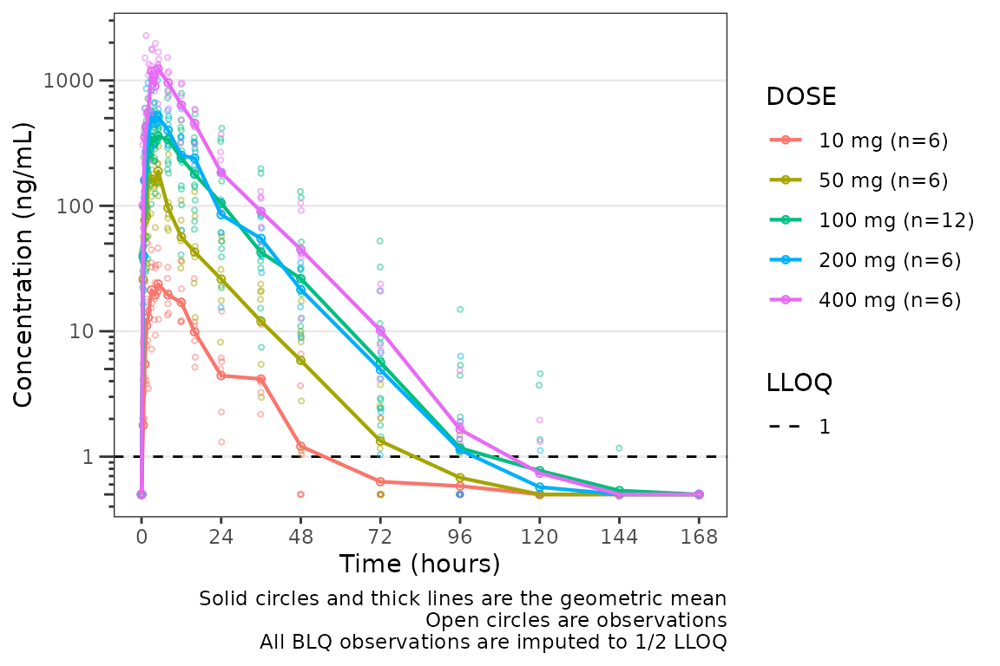
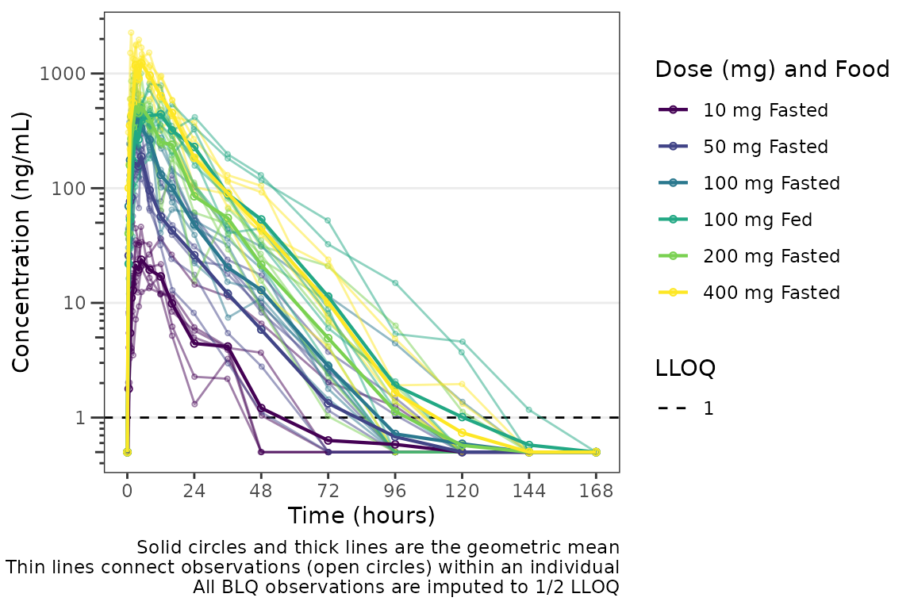

# Exploratory Data Analysis

This vignette will demonstrate `pmxhelpr` functions for exploratory data
analysis.

First, we will load the required packages.

``` r
options(scipen = 999, rmarkdown.html_vignette.check_title = FALSE)
library(pmxhelpr)
library(dplyr, warn.conflicts =  FALSE)
library(ggplot2, warn.conflicts =  FALSE)
library(Hmisc, warn.conflicts = FALSE)
library(patchwork, warn.conflicts = FALSE)
library(PKNCA, warn.conflicts = FALSE)
```

For this vignette, we will perform exploratory data analysis on the
`data_sad` dataset internal to `pmxhelpr`. We can take a quick look at
the dataset using
[`glimpse()`](https://pillar.r-lib.org/reference/glimpse.html) from the
dplyr package. Dataset definitions can also be viewed by calling
[`?data_sad`](https://ryancrass.github.io/pmxhelpr/reference/data_sad.md),
as one would to view the documentation for a package function.

``` r
glimpse(data_sad)
#> Rows: 720
#> Columns: 23
#> $ LINE    <dbl> 1, 2, 3, 4, 5, 6, 7, 8, 9, 10, 11, 12, 13, 14, 15, 16, 17, 18,…
#> $ ID      <dbl> 1, 1, 1, 1, 1, 1, 1, 1, 1, 1, 1, 1, 1, 1, 1, 1, 1, 1, 1, 1, 2,…
#> $ TIME    <dbl> 0.00, 0.00, 0.48, 0.81, 1.49, 2.11, 3.05, 4.14, 5.14, 7.81, 12…
#> $ NTIME   <dbl> 0.0, 0.0, 0.5, 1.0, 1.5, 2.0, 3.0, 4.0, 5.0, 8.0, 12.0, 16.0, …
#> $ NDAY    <dbl> 1, 1, 1, 1, 1, 1, 1, 1, 1, 1, 1, 1, 2, 2, 3, 4, 5, 6, 7, 8, 1,…
#> $ DOSE    <dbl> 10, 10, 10, 10, 10, 10, 10, 10, 10, 10, 10, 10, 10, 10, 10, 10…
#> $ AMT     <dbl> NA, 10, NA, NA, NA, NA, NA, NA, NA, NA, NA, NA, NA, NA, NA, NA…
#> $ EVID    <dbl> 0, 1, 0, 0, 0, 0, 0, 0, 0, 0, 0, 0, 0, 0, 0, 0, 0, 0, 0, 0, 0,…
#> $ ODV     <dbl> NA, NA, NA, 2.02, 4.02, 3.50, 7.18, 9.31, 12.46, 13.43, 12.11,…
#> $ LDV     <dbl> NA, NA, NA, 0.7031, 1.3913, 1.2528, 1.9713, 2.2311, 2.5225, 2.…
#> $ CMT     <dbl> 2, 1, 2, 2, 2, 2, 2, 2, 2, 2, 2, 2, 2, 2, 2, 2, 2, 2, 2, 2, 2,…
#> $ MDV     <dbl> 1, NA, 1, 0, 0, 0, 0, 0, 0, 0, 0, 0, 0, 0, 1, 1, 1, 1, 1, 1, 1…
#> $ BLQ     <dbl> -1, NA, 1, 0, 0, 0, 0, 0, 0, 0, 0, 0, 0, 0, 1, 1, 1, 1, 1, 1, …
#> $ LLOQ    <dbl> 1, NA, 1, 1, 1, 1, 1, 1, 1, 1, 1, 1, 1, 1, 1, 1, 1, 1, 1, 1, 1…
#> $ FOOD    <dbl> 0, 0, 0, 0, 0, 0, 0, 0, 0, 0, 0, 0, 0, 0, 0, 0, 0, 0, 0, 0, 0,…
#> $ SEXF    <dbl> 1, 1, 1, 1, 1, 1, 1, 1, 1, 1, 1, 1, 1, 1, 1, 1, 1, 1, 1, 1, 1,…
#> $ RACE    <dbl> 2, 2, 2, 2, 2, 2, 2, 2, 2, 2, 2, 2, 2, 2, 2, 2, 2, 2, 2, 2, 1,…
#> $ AGEBL   <int> 25, 25, 25, 25, 25, 25, 25, 25, 25, 25, 25, 25, 25, 25, 25, 25…
#> $ WTBL    <dbl> 82.1, 82.1, 82.1, 82.1, 82.1, 82.1, 82.1, 82.1, 82.1, 82.1, 82…
#> $ SCRBL   <dbl> 0.87, 0.87, 0.87, 0.87, 0.87, 0.87, 0.87, 0.87, 0.87, 0.87, 0.…
#> $ CRCLBL  <dbl> 128, 128, 128, 128, 128, 128, 128, 128, 128, 128, 128, 128, 12…
#> $ USUBJID <chr> "STUDYNUM-SITENUM-1", "STUDYNUM-SITENUM-1", "STUDYNUM-SITENUM-…
#> $ PART    <chr> "Part 1-SAD", "Part 1-SAD", "Part 1-SAD", "Part 1-SAD", "Part …
```

We can see that this dataset is already formatted for modeling. It
contains NONMEM reserved variables (e.g., ID, TIME, AMT, EVID, MDV), as
well as, dependent variables of drug concentration in original units
(ODV) and natural logarithm transformed units (LDV).

In addition to the numeric variables, there are two character variables:
USUBJID and PART.

PART specifies the two study cohorts:

- Single Ascending Dose (SAD)
- Food Effect (FE).

``` r
unique(data_sad$PART)
#> [1] "Part 1-SAD" "Part 2-FE"
```

This dataset also contains an exact binning variable:

- Nominal Time (NTIME).

This variable represents the nominal time of sample collection relative
to first dose per study protocol whereas Actual Time (TIME) represents
the actual time the sample was collected.

``` r
##Unique values of NTIME
ntimes <- unique(data_sad$NTIME)
ntimes
#>  [1]   0.0   0.5   1.0   1.5   2.0   3.0   4.0   5.0   8.0  12.0  16.0  24.0
#> [13]  36.0  48.0  72.0  96.0 120.0 144.0 168.0

##Comparison of number of unique values of NTIME and TIME
length(unique(data_sad$NTIME))
#> [1] 19
length(unique(data_sad$TIME))
#> [1] 449
```

## Population Concentration-time plots

### Overview of `plot_dvtime`

Let’s visualize the data. First, we will filter to observation records
only and derive some factor variables, which can be passed to the color
aesthetic in our plots.

``` r
plot_data <- data_sad %>% 
  filter(EVID == 0) %>% 
  mutate(`Dose (mg)` = factor(DOSE, levels = c(10, 50, 100, 200, 400)), 
         `Food Status` = factor(FOOD, levels = c(0, 1), labels = c("Fasted", "Fed")))
```

Now let’s visualize the concentration-time data. `pmxhelpr` includes a
function for common visualizations of observed concentration-time data
in exploratory data analysis: `plot_dvtime`

In our visualizations, we will leverage the following dataset variables:

- `ODV`: the original dependent variable (drug concentration) in
  untransformed units (ng/mL)
- `TIME` : actual time since first dose (hours)
- `NTIME`: nominal time since first dose (hours)
- `LLOQ` : lower limit of quantification for drug concentration

`plot_dvtime` requires a dependent variable, specified as string via the
`dv_var` argument, and time variables for actual and nominal time,
specified as a named vector using the `time_vars`. The default names for
the `time_vars` are `"TIME"` and `"NTIME"`. The color aesthetic is
specified using the `col_var` argument. The `cent` argument specifies
which central tendency measure is plotted.

``` r
plot_dvtime(data = plot_data, dv_var = "ODV", col_var = "Dose (mg)", cent = "mean", 
            ylab = "Concentration (ng/mL)") 
```



Not a bad plot with minimal arguments! We can see the mean for each dose
as a colored thick line and observed data points as colored open circles
with some alpha added. A caption also prints by default describing the
plot elements.

The caption can be removed by specifying `show_caption = FALSE`.

``` r
plot_dvtime(data = plot_data, dv_var = "ODV", col_var = "Dose (mg)", cent = "mean", 
            ylab = "Concentration (ng/mL)", show_caption = FALSE) 
```


### Adjusting Time Breaks

`plot_dvtime` includes uses a helper function (`breaks_time`) to
automatically determine x-axis breaks based on the units of the time
variable! Two arguments in `plot_dvtime` are passed to `breaks_time`:

- `timeu` character string specifying time units. Options include:

  - “hours” (default), “hrs”, “hr”, “h”
  - “days”, “dys”, “dy”, “d”
  - “weeks”, “wks”, “wk”, “w”
  - “months”, “mons”, “mos”, “mo”, “m”

- `n_breaks` number breaks requested from the algorithm. Default = 8.

Let’s pass the vector of nominal times we defined earlier into the
`breaks_time` function and see what we get with different requested
numbers of breaks!

``` r
breaks_time(ntimes, unit = "hours")
#> [1]   0  24  48  72  96 120 144 168
breaks_time(ntimes, unit = "hours", n = 5)
#> [1]   0  48  96 144
breaks_time(ntimes, unit = "hours", n = length(ntimes))
#>  [1]   0.0   9.6  19.2  28.8  38.4  48.0  57.6  67.2  76.8  86.4  96.0 105.6
#> [13] 115.2 124.8 134.4 144.0 153.6 163.2
```

We can see that the default (n = 8) gives an optimal number of breaks in
this case whereas reducing the number of breaks (n=5) gives a less
optimal distribution of values. Requesting breaks equal to the length of
the vector of unique `NTIMES` will generally produce too many breaks.
The default axes breaks behavior can always be overwritten by specifying
the axis breaks manually using
[`scale_x_continuous()`](https://ggplot2.tidyverse.org/reference/scale_continuous.html).

The default `n_breaks = 8` is a good value for `data_sad`, and
`data_sad` uses the default time units (`"hours"`); therefore, explicit
specification of the `n_breaks` and `timeu` arguments is not required.

``` r
plot_dvtime(data = plot_data, dv_var = "ODV", col_var = "Dose (mg)", cent = "mean", 
            ylab = "Concentration (ng/mL)") 
```


However, perhaps someone on the team would prefer the x-axis breaks in
units of `days`. The x-axis breaks will transform to the new units
automatically as long as we specify the new time unit with
`timeu = "days"`.

``` r
plot_data_days <- plot_data %>% 
  mutate(TIME = TIME/24, 
         NTIME = NTIME/24)

plot_dvtime(data = plot_data_days, dv_var = "ODV", col_var = "Dose (mg)", cent = "mean", 
            ylab = "Concentration (ng/mL)", timeu = "days") 
```


Nice! However, someone else on the team would prefer to see the first 24
hours of treatment in greater detail to visualize the absorption phase.
We can either truncate the x-axis range using
[`scale_x_continuous()`](https://ggplot2.tidyverse.org/reference/scale_continuous.html),
or filter the input data and allow the x-axis breaks to adjust
automatically with the new time range in the input data!

``` r
plot_data_24 <- plot_data %>% 
  filter(NTIME <= 24)

plot_dvtime(data = plot_data_24, dv_var = "ODV", col_var = "Dose (mg)", cent = "mean", 
            ylab = "Concentration (ng/mL)") 
```


### Specifying the Central Tendency

These data are probably best visualized on a log-scale y-axis upweight
the terminal phase profile. `plot_dvtime` includes an argument `log_y`
which performs this operation with some additional formatting benefits
over manually adding the layer to the returned object with
`scale_y_log10`.

- Includes log tick marks on the y-axis
- Updates the caption with the correct central tendency measure if
  `show_captions = TRUE`.

`plot_dvtime` uses the `stat_summary` function from `ggplot2` to
calculate and plot the central tendency measures and error bars. An
often overlooked feature of `stat_summary`, is that it calculates the
summary statistics *after* any transformations to the data performed by
changing the scales. This means that when
[`scale_y_log10()`](https://ggplot2.tidyverse.org/reference/scale_continuous.html)
is applied to the plot, the data are log-transformed for plotting and
the central tendency measure returned when requesting `"mean"` from
`stat_summary` is the *geometric mean*. If the `log_y` argument is used
to generate semi-log plots along with `show_captions = TRUE`, then the
caption will delineate where arithmetic and gemoetric means are being
returned.

``` r
plot_dvtime(data = plot_data, dv_var = "ODV", col_var = "Dose (mg)", cent = "mean", 
            ylab = "Concentration (ng/mL)", log_y = TRUE) 
```


But wait…this plot is potentially misleading! The food effect portion of
the study is being pooled together with the fasted data within the 100
mg dose.

Luckily, `plot_dvtime` returns a `ggplot` object which we can modify
like any other `ggplot`! Therefore, we can facet by PART by simply
adding in another layer to our `ggplot` object.

``` r
plot_dvtime(data = plot_data, dv_var = "ODV", col_var = "Dose (mg)", cent = "mean", 
            ylab = "Concentration (ng/mL)", log_y = TRUE) +
  facet_wrap(~PART)
```


The clinical team would like a simpler plot that clearly displays the
central tendency. We can use the argument `cent = "mean_sdl"` to plot
the mean with error bars and remove the observed points by specifying
`obs_dv = FALSE`.

``` r
plot_dvtime(data = plot_data, dv_var = "ODV", col_var = "Dose (mg)", cent = "mean_sdl", 
            ylab = "Concentration (ng/mL)", log_y = TRUE,
            obs_dv = FALSE) +
  facet_wrap(~PART)
```


We may want to only show the upper error bar, especially when computing
the arithmetic mean +/- arithmetic SD on the linear scale. This can be
accomplished by changing the `cent` argument to `mean_sdl_upper`.

``` r
plot_dvtime(data = plot_data, dv_var = "ODV", col_var = "Dose (mg)", cent = "mean_sdl_upper", 
            ylab = "Concentration (ng/mL)", obs_dv = FALSE) +
  facet_wrap(~PART)
```


We could also plot these data as median + interquartile range (IQR)
using, if we do not feel the sample size is sufficient for parametric
summary statistics. This can be accomplished by changing the `cent`
argument to `median_iqr`.

``` r
plot_dvtime(data = plot_data, dv_var = "ODV", col_var = "Dose (mg)", cent = "median_iqr", 
            ylab = "Concentration (ng/mL)", log_y = TRUE,
            obs_dv = FALSE) +
  facet_wrap(~PART)
```


Hmm…there is some noise at the late terminal phase. This is likely
artifact introduced by censoring of data at the assay LLOQ; however,
let’s confirm there are no weird individual subject profiles by
connecting observed data points longitudinally within a subject - in
other words, let’s make spaghetti plots!

We will change the central tendency measure to the median and add the
spaghetti lines. Data points within an individual value of `grp_var`
will be connected by a narrow line when `grp_dv = TRUE`. The default is
`grp_var = "ID"`.

``` r
plot_dvtime(data = plot_data, dv_var = "ODV", col_var = "Dose (mg)", cent = "median", 
            ylab = "Concentration (ng/mL)", log_y = TRUE, 
            grp_dv = TRUE) +
  facet_wrap(~PART)
```


It does not seem like there are outlier individuals driving the noise in
the late terminal phase; therefore, this is almost certainly artifact
introduced by data missing due to assay sensitivity and censoring at the
lower limit of quantification (LLOQ).

### Defining imputations for BLQ data

Let’s use imputation to assess the potential impact of the data missing
due to assay sensitivity. `plot_dvtime` includes some functionality to
do this imputation for us using the `loq` and `loq_method` arguments.

The `loq_method` argument species how BLQ imputation should be
performed. Options are:

- `0` : No handling. Plot input dataset `DV` vs `TIME` as is. (default)
- `1` : Impute all BLQ data at `TIME` \<= 0 to 0 and all BLQ data at
  `TIME` \> 0 to 1/2 x `loq`. Useful for plotting concentration-time
  data with some data BLQ on the linear scale
- `2` : Impute all BLQ data at `TIME` \<= 0 to 1/2 x `loq` and all BLQ
  data at `TIME` \> 0 to 1/2 x `loq`.

The `loq` argument species the value of the LLOQ. The `loq` argument
must be specified when `loq_method` is `1` or `2`, but can be `NULL`
*if* the variable `LLOQ` is present in the dataset. In our case, `LLOQ`
is a variable in `plot_data`, so we do not need to specify the `loq`
argument (default is `loq = NULL`).

``` r
plot_dvtime(plot_data, dv_var = "ODV", col_var = "Dose (mg)", cent = "mean",
            ylab = "Concentration (ng/mL)", log_y = TRUE,
            loq_method = 2) +
  facet_wrap(~PART)
```


The same plot is obtained by specifying `loq = 1`

``` r
plot_dvtime(plot_data, dv_var = "ODV", col_var = "Dose (mg)", cent = "mean",
            ylab = "Concentration (ng/mL)",  log_y = TRUE,
            loq_method = 2, loq = 1) +
  facet_wrap(~PART)
```


A reference line is drawn to denote the LLOQ and all observations with
`EVID=0` and `MDV=1` are imputed as LLOQ/2. The numeric value of LLOQ is
printed in the legend and a caption is added to indicate the imputation
method for BLQ data.

Imputing post-dose concentrations below the lower limit of
quantification as 1/2 x LLOQ normalizes the late terminal phase of the
concentration-time profile. This is confirmatory evidence for our
hypothesis that the noise in the late terminal phase is due to censoring
of observations below the LLOQ.

### Dose-normalization

We can also generate dose-normalized concentration-time plots by
specifying `dosenorm = TRUE`.

``` r
plot_dvtime(plot_data, dv_var = "ODV", col_var = "Dose (mg)", cent = "mean",
            ylab = "Dose-normalized Conc. (ng/mL per mg Drug)", log_y = TRUE,
            dosenorm = TRUE) +
  facet_wrap(~PART)
```


When `dosenorm = TRUE`, the variable specified in `dose_var` (default =
“DOSE”) needs to be present in the input dataset `data`. If `dose_var`
is not present in `data`, the function will return an *Error* with an
informative error message.

``` r
plot_dvtime(select(plot_data, -DOSE), 
            dv_var = "ODV", col_var = "Dose (mg)", cent = "mean",
            ylab = "Dose-normalized Conc. (ng/mL per mg Drug)", log_y = TRUE,
            dosenorm = TRUE) +
  facet_wrap(~PART)
#> Error in `check_varsindf()`:
#> ! argument `dose_var` must be variables in `data`
```

Dose-normalization is performed *AFTER* BLQ imputation in the case in
which both options are requested. The reference line for the LLOQ will
not be plotted when dose-normalized concentration is the dependent
variable.

``` r
plot_dvtime(plot_data, dv_var = "ODV", col_var = "Dose (mg)", cent = "mean",
            ylab = "Dose-normalized Conc. (ng/mL per mg Drug)", log_y = TRUE,
            loq_method = 2, dosenorm = TRUE) +
  facet_wrap(~PART)
```


### Adjusting the Color and Group Aesthetics

Only a single variable can be passed to the `col_var` argument of
`plot_dvtime`. Suppose we want to look at the interaction between two
variables in the color aesthetic. This can be accomplished using the
`interaction` function within the `aes` call, which computes an
unordered factor representing the interaction between the two variables.
Let’s visualize the interaction between the factor versions of the
variables `DOSE` and `FOOD`.

``` r
ggplot(plot_data, aes(x = TIME, y = ODV, col = interaction(`Dose (mg)`, `Food Status`))) +
  geom_point()+
  stat_summary(data = plot_data, aes(x = NTIME, y = ODV, col = interaction(`Dose (mg)`, `Food Status`)),
               fun.y = "mean", geom = "line") + 
  scale_x_continuous(breaks = seq(0,168,24)) +
  scale_y_log10()+
  theme_bw() + 
  labs(y = "Concentration (ng/mL)", x = "Time (hours)")
```



The functionality of
[`interaction()`](https://rdrr.io/r/base/interaction.html) cannot be
used within `plot_dvtime`; however, we can reproduce it by formally
creating a variable for the interaction we want to visualize. This also
affords us the opportunity to define the factor labels, levels, and
order, which will affect how the interaction is displayed on the plot.

``` r
plot_data_int <- plot_data %>%  
  mutate(`Dose (mg) and Food` = ifelse(FOOD == 0, paste(DOSE, "mg", "Fasted"), paste(DOSE, "mg", "Fed")), 
         `Dose (mg) and Food` = factor(`Dose (mg) and Food`, levels = c("10 mg Fasted", 
                                                                         "50 mg Fasted", 
                                                                         "100 mg Fasted", 
                                                                         "100 mg Fed", 
                                                                         "200 mg Fasted", 
                                                                         "400 mg Fasted")))

plot_dvtime(plot_data_int, dv_var = "ODV", col_var = "Dose (mg) and Food", cent = "mean",
            ylab = "Concentration (ng/mL)", log_y = TRUE,
            loq_method = 2)
```



This looks pretty nice! The legend is formatted cleanly and the colors
are assigned to each unique condition of the interaction. However, we
can actually take this one step further, and define our interaction
variable as an *ordered* factor, which results `ggplot2` applying the
*viridis* color scale from the `viridisLite` package.

``` r
plot_data_int_ordered <- plot_data %>%  
  mutate(`Dose (mg) and Food` = ifelse(FOOD == 0, paste(DOSE, "mg", "Fasted"), paste(DOSE, "mg", "Fed")), 
         `Dose (mg) and Food` = factor(`Dose (mg) and Food`, levels = c("10 mg Fasted", 
                                                                         "50 mg Fasted", 
                                                                         "100 mg Fasted", 
                                                                         "100 mg Fed", 
                                                                         "200 mg Fasted", 
                                                                         "400 mg Fasted"),
                                       ordered = TRUE))

plot_dvtime(plot_data_int_ordered, dv_var = "ODV", col_var = "Dose (mg) and Food", cent = "mean",
            ylab = "Concentration (ng/mL)", log_y = TRUE,
            loq_method = 2)
```



`pmxhelpr` also includes a helper function `df_addn`, which will add
counts of a identifier variable passed to the `id_var` argument to the
variable specified in `grp_var`. If a numeric variable is passed to
`grp_var`, the factor variable returned will be correctly sorted in
increasing order of values.

``` r
plot_data_int <- plot_data %>%  
  mutate(`Dose (mg)` = DOSE)

plot_data_int_addn <- df_addn(plot_data_int, grp_var = "Dose (mg)", id_var = "ID")


plot_dvtime(plot_data_int_addn, dv_var = "ODV", col_var = "Dose (mg)", cent = "mean",
            ylab = "Concentration (ng/mL)", log_y = TRUE,
            loq_method = 2)
```

 A character
separator can also be passed to the `sep` argument, which will be
printed between the values of `grp_var` and the counts. A common use
case is when dose is expressed as a numeric variable and the dose units
are passed to `sep`

``` r
plot_data_int_addn_sep <- df_addn(plot_data, grp_var = "DOSE", id_var = "ID", sep = "mg")

plot_dvtime(plot_data_int_addn_sep, dv_var = "ODV", col_var = "DOSE", cent = "mean",
            ylab = "Concentration (ng/mL)", log_y = TRUE,
            loq_method = 2)
```



The same approach can be used to define an interaction variable to be
assigned to the group aesthetic using the `grp_var` argument to
`plot_dvtime`. Such an approach may be used if we wanted to visualize
the data for a cross-over study condition separately for each period
within an individual. In this case, the default `grp_var = "ID"` would
connect all data points within an individual across both periods whereas
we actually want to visualize points connected within the individual
`"ID"` separately by cross-over period.

To explore this, we will modify `data_sad` such that the same subjects
are included in `"PART1-SAD"` and `"PART2-FE` (e.g., modify from a
parallel group design to a crossover design).

``` r
plot_data_crossover <- plot_data %>% 
  mutate(ID = ifelse(FOOD == 1, ID - 6, ID))

plot_data_crossover %>% 
  select(ID, DOSE, FOOD) %>% 
  distinct() %>% 
  group_by(ID) %>% 
  filter(max(FOOD) == 1) %>% 
  arrange(ID, FOOD)
#> # A tibble: 12 × 3
#> # Groups:   ID [6]
#>       ID  DOSE  FOOD
#>    <dbl> <dbl> <dbl>
#>  1    13   100     0
#>  2    13   100     1
#>  3    14   100     0
#>  4    14   100     1
#>  5    15   100     0
#>  6    15   100     1
#>  7    16   100     0
#>  8    16   100     1
#>  9    17   100     0
#> 10    17   100     1
#> 11    18   100     0
#> 12    18   100     1
```

Now we have a dataset with a cross-over design for the Food Effect
protion of the study. We can define a factor variable that is the
interaction between `"ID"` and `"FOOD"`. Now when we visualize the data,
the data points will be connected within the group defined by both
variables.

``` r
plot_data_crossover_fid <- plot_data_crossover %>% 
  mutate(FID = interaction(ID, FOOD),
         `Dose (mg) and Food` = ifelse(FOOD == 0, paste(DOSE, "mg", "Fasted"), paste(DOSE, "mg", "Fed")), 
         `Dose (mg) and Food` = factor(`Dose (mg) and Food`, levels = c("10 mg Fasted", 
                                                                         "50 mg Fasted", 
                                                                         "100 mg Fasted", 
                                                                         "100 mg Fed", 
                                                                         "200 mg Fasted", 
                                                                         "400 mg Fasted"),
                                       ordered = TRUE))

plot_dvtime(plot_data_crossover_fid, dv_var = "ODV", col_var = "Dose (mg) and Food", cent = "mean",
            grp_var = "FID", grp_dv = TRUE,
            ylab = "Concentration (ng/mL)", log_y = TRUE,
            loq_method = 2)
```



### Adjusting the Attributes for Points and Lines

The default attributes of data points and lines are controlled by the
`theme` argument. The defaults

``` r
plot_dvtime_theme()
#> $linewidth_ref
#> [1] 0.5
#> 
#> $linetype_ref
#> [1] 2
#> 
#> $alpha_line_ref
#> [1] 1
#> 
#> $shape_point_obs
#> [1] 1
#> 
#> $size_point_obs
#> [1] 0.75
#> 
#> $alpha_point_obs
#> [1] 0.5
#> 
#> $linewidth_obs
#> [1] 0.5
#> 
#> $linetype_obs
#> [1] 1
#> 
#> $alpha_line_obs
#> [1] 0.5
#> 
#> $shape_point_cent
#> [1] 1
#> 
#> $size_point_cent
#> [1] 1.25
#> 
#> $alpha_point_cent
#> [1] 1
#> 
#> $linewidth_cent
#> [1] 0.75
#> 
#> $linetype_cent
#> [1] 1
#> 
#> $alpha_line_cent
#> [1] 1
#> 
#> $linewidth_errorbar
#> [1] 0.75
#> 
#> $linetype_errorbar
#> [1] 1
#> 
#> $alpha_errorbar
#> [1] 1
#> 
#> $width_errorbar
#> NULL
```

These attributes can be updated by passing a named list to the `theme`
argument. Say we want to reduce the linewidth of the error bars and
reduce the size of the mean summary points to only visualize the lines.
This can be accomplished for an individual plot as follows:

``` r
plot_dvtime(data = plot_data, dv_var = "ODV", col_var = "Dose (mg)", cent = "mean_sdl", 
            ylab = "Concentration (ng/mL)", log_y = TRUE,
            obs_dv = FALSE, 
            theme = list(linewidth_errorbar = 0.5, size_point_cent = 0.1)) +
  facet_wrap(~PART)
```


One could also globally set a new theme by updating the default using
`plot_dvtime_theme` and pass the new theme list object to the `theme`
argument. This is useful if generating multiple plots using the same
modified theme.

``` r
new_theme <- plot_dvtime_theme(list(linewidth_errorbar = 0.5, size_point_cent = 0.1))

plot_dvtime(data = plot_data, dv_var = "ODV", col_var = "Dose (mg)", cent = "mean_sdl", 
            ylab = "Concentration (ng/mL)", log_y = TRUE,
            obs_dv = FALSE, 
            theme = new_theme) +
  facet_wrap(~PART)
```


The default error bar width is 2.5% of the maximum nominal time in the
dataset. This can be overwritten to a user-specified value using the
`width_errorbar` attribute of `plot_dvtime_theme`. This value is passed
to the `width` argument of `geom_errorbar`.

``` r
plot_dvtime(data = plot_data, dv_var = "ODV", col_var = "Dose (mg)", cent = "mean_sdl", 
            ylab = "Concentration (ng/mL)", log_y = TRUE,
            obs_dv = FALSE, 
            theme = list(width_errorbar = 8)) +
  facet_wrap(~PART)
```


## Individual Concentration-time plots

The previous section provides an overview of how to generate population
concentration-time profiles by dose using `plot_dvtime`; however, we can
also use `plot_dvtime` to generate subject-level visualizations with a
little pre-processing of the input dataset.

We can specify `cent = "none"` to remove the central tendency layer when
plotting individual subject data.

``` r
plot_dvtime(plot_data, dv_var = "ODV", col_var = "Dose (mg)", cent = "none",
            ylab = "Concentration (ng/mL)", log_y = TRUE,
            grp_dv = TRUE,
            loq_method = 2, loq = 1) +
  facet_wrap(~PART)
```


We can plot an individual subject by filtering the input dataset. This
could be extended generate plots for all individuals using `for` loops,
`lapply`,
[`purrr::map()`](https://purrr.tidyverse.org/reference/map.html)
functions, or other methods.

``` r

ids <- sort(unique(plot_data$ID)) #vector of unique subject ids
n_ids <- length(ids) #count of unique subject ids
plots_per_pg <- 4
n_pgs <- ceiling(n_ids/plots_per_pg) #Total number of pages needed

plist<- list()
for(i in 1:n_ids){
  plist[[i]] <- plot_dvtime(filter(plot_data, ID == ids[i]), 
                               dv_var = "ODV", col_var = "Dose (mg)", cent = "none",
            ylab = "Concentration (ng/mL)", log_y = TRUE,
            grp_dv = TRUE,
            loq_method = 2, loq = 1, show_caption = FALSE) +
  facet_wrap(~PART)+
  labs(title = paste0("ID = ", ids[i], " | Dose = ", unique(plot_data$DOSE[plot_data$ID==ids[i]]), " mg"))+
  theme(legend.position="none")
}

lapply(1:n_pgs, function(n_pg) {
      i <-  (n_pg-1)*plots_per_pg+1
      j <- n_pg*plots_per_pg
      wrap_plots(plist[i:j])
})
#> [[1]]
```


    #> 
    #> [[2]]


    #> 
    #> [[3]]


    #> 
    #> [[4]]


    #> 
    #> [[5]]


    #> 
    #> [[6]]


    #> 
    #> [[7]]


    #> 
    #> [[8]]


    #> 
    #> [[9]]


## Dose-proportionality Assessment: Power Law Regression

Another assessment that is commonly performed for pharmacokinetic data
is dose proportionality (e.g., does exposure increase proportionally
with dose). This is an important assessment prior to population PK
modeling, as it informs whether non-linearity is an important
consideration in model development.

The industry standard approach to assessing dose proportionality is
power law regression. Power law regression is based on the following
relationship:

$$Exposure = \alpha*(DOSE)^{\gamma}$$

This power relationship can be transformed to a linear relationship to
support quantitative estimation of the power ($\gamma$) via simple
linear regression by taking the logarithm of both sides:

$$log(Exposure) = intercept + \gamma*log(DOSE)$$

`NOTE`: Use of natural logarithm and log10 transformations will not
impact the assessment of the power and will only shift the intercept.

This approach facilitates hypothesis testing via assessment of the 95%
CI around the power ($\gamma$) estimated from the log-log regression.
The null hypothesis is that exposure increases proportionally to dose
(e.g., $\gamma = 1$) and the alternative hypothesis is that exposure
does *NOT* increase proportionally to dose (e.g., $\gamma \neq 1$).

Interpretation of the relationship is based on the 95% CI of the
$\gamma$ estimate as follows:

- 95% CI includes one (1): exposure increases proportionally to dose
- 95% CI excludes one (1) & is less than 1: exposure increases
  less-than-proportionally to dose
- 95% CI excludes one (1) & is greater than 1: exposure increases
  greater-than-proportionally to dose

This assessment is generally performed based on both maximum
concentration (Cmax) and area under the concentration-time curve (AUC).
While not a hard and fast rule, some inference can be drawn about which
phase of the pharmacokinetic profile is most likely contributing the
majority of the non-linearity of exposure with dose.

- AUC = *NOT* dose-proportional \| Cmax = dose-proportional =
  elimination phase
- AUC = dose-proportional \| Cmax = *NOT* dose-proportional = absorption
  phase (rate)
- AUC = *NOT* dose-proportional \| Cmax = *NOT* dose-proportional =
  absorption phase (extent)

These exploratory assessments provide quantitative support for
structural PK model decision-making. Practically speaking,
non-linearities in absorption rate are rarely impactful, and the modeler
is really deciding between dose-dependent bioavailability and
concentration-dependent elimination (e.g., Michaelis-Menten kinetics,
target-mediated drug disposition \[TMDD\])

### Step 1: Derive NCA Parameters

The first step in performing this assessment is deriving the necessary
NCA PK parameters. NCA software (e.g., Phoenix WinNonlin) is quite
expensive; however, thankfully there is an excellent R package for
performing NCA analyses - `PKNCA`.

Refer to the documentation for the `PKNCA` packge for details. This
vignette will not provide a detailed overview of `PKNCA` functions and
workflows.

First, let’s set the options for our NCA analysis and define the
intervals over which we want to obtain the NCA parameters. The
`data_sad` dataset internal to `pmxhelpr` is a single ascending dose
(SAD) design with a parallel food effect (FE) cohort; therefore, our
interval is \[0, $\infty$\]

``` r
##Set NCA options
PKNCA.options(conc.blq = list("first" = "keep", 
                              "middle" = unique(data_sad$LLOQ[!is.na(data_sad$LLOQ)]), 
                              "last" = "drop"),
              allow.tmax.in.half.life = FALSE,
              min.hl.r.squared = 0.9)

##Calculation Intervals and Requested Parameters
intervals <-
  data.frame(start = 0,
             end = Inf,
             auclast = TRUE,
             aucinf.obs = TRUE,
             aucpext.obs = TRUE,
             half.life = TRUE,
             cmax = TRUE,
             vz.obs = TRUE, 
             cl.obs = TRUE 
             )  
```

Next, we will set up our dose and concentration objects and perform the
NCA using `PKNCA`

``` r
#Impute BLQ concentrations to 0 (PKNCA formatting)
data_sad_nca_input <- data_sad %>% 
  mutate(CONC = ifelse(is.na(ODV), 0, ODV), 
         AMT = AMT/1000) #Convert from mg to ug (concentration is ng/mL = ug/L)

#Build PKNCA objects for concentration and dose including relevant strata
conc_obj <- PKNCAconc(filter(data_sad_nca_input, EVID==0), CONC~TIME|ID+DOSE+PART)
dose_obj <- PKNCAdose(filter(data_sad_nca_input, EVID==1), AMT~TIME|ID+PART)
nca_data_obj <- PKNCAdata(conc_obj, dose_obj, intervals = intervals)
nca_results_obj <- as.data.frame(pk.nca(nca_data_obj))
glimpse(nca_results_obj)
#> Rows: 648
#> Columns: 8
#> $ ID       <dbl> 1, 1, 1, 1, 1, 1, 1, 1, 1, 1, 1, 1, 1, 1, 1, 1, 1, 1, 2, 2, 2…
#> $ DOSE     <dbl> 10, 10, 10, 10, 10, 10, 10, 10, 10, 10, 10, 10, 10, 10, 10, 1…
#> $ PART     <chr> "Part 1-SAD", "Part 1-SAD", "Part 1-SAD", "Part 1-SAD", "Part…
#> $ start    <dbl> 0, 0, 0, 0, 0, 0, 0, 0, 0, 0, 0, 0, 0, 0, 0, 0, 0, 0, 0, 0, 0…
#> $ end      <dbl> Inf, Inf, Inf, Inf, Inf, Inf, Inf, Inf, Inf, Inf, Inf, Inf, I…
#> $ PPTESTCD <chr> "auclast", "cmax", "tmax", "tlast", "clast.obs", "lambda.z", …
#> $ PPORRES  <dbl> 277.7701457207, 13.4300000000, 7.8100000000, 35.9500000000, 3…
#> $ exclude  <chr> NA, NA, NA, NA, NA, NA, NA, NA, NA, NA, NA, NA, NA, NA, NA, N…
```

The NCA results object output from `PKNCA` is formatted using the
variable names in `SDTM` standards for the `PP` domain (Pharmacokinetic
Parameters). This NCA output dataset is also available internally within
`pmxhelpr` as `data_sad_nca` with a few additional columns specifying
units.

``` r
glimpse(data_sad_nca)
#> Rows: 612
#> Columns: 11
#> $ ID         <dbl> 1, 1, 1, 1, 1, 1, 1, 1, 1, 1, 1, 1, 1, 1, 1, 1, 1, 2, 2, 2,…
#> $ DOSE       <dbl> 10, 10, 10, 10, 10, 10, 10, 10, 10, 10, 10, 10, 10, 10, 10,…
#> $ PART       <chr> "Part 1-SAD", "Part 1-SAD", "Part 1-SAD", "Part 1-SAD", "Pa…
#> $ start      <dbl> 0, 0, 0, 0, 0, 0, 0, 0, 0, 0, 0, 0, 0, 0, 0, 0, 0, 0, 0, 0,…
#> $ end        <dbl> Inf, Inf, Inf, Inf, Inf, Inf, Inf, Inf, Inf, Inf, Inf, Inf,…
#> $ PPTESTCD   <chr> "auclast", "cmax", "tmax", "tlast", "clast.obs", "lambda.z"…
#> $ PPORRES    <dbl> 277.7701457207, 13.4300000000, 7.8100000000, 35.9500000000,…
#> $ exclude    <chr> NA, NA, NA, NA, NA, NA, NA, NA, NA, NA, NA, NA, NA, NA, NA,…
#> $ units_dose <chr> "mg", "mg", "mg", "mg", "mg", "mg", "mg", "mg", "mg", "mg",…
#> $ units_conc <chr> "ng/mL", "ng/mL", "ng/mL", "ng/mL", "ng/mL", "ng/mL", "ng/m…
#> $ units_time <chr> "hours", "hours", "hours", "hours", "hours", "hours", "hour…
```

We will need to select the relevant PK parameters from this dataset for
input into our power law regression analysis of dose-proportionality.
Thankfully, `pmxhelpr` handles the filtering and power law regression in
one step with functions for outputting either tables or plots of
results!

### Step 2: Perform Power Law Regression

The `df_doseprop` function is a wrapper function which bundles two other
`pmxhelpr` functions:

- `mod_loglog` a function to perform log-log regression which returns a
  `lm` object
- `df_loglog` a function to tabulate the power estimate and CI which
  returns a `data.frame`

There are two required arguments to `df_doseprop`.

- `data` a `data.frame` containing NCA parameter estimates
- `metrics` a character vector of NCA parameters to evaluate in log-log
  regression

``` r
power_table <- df_doseprop(data_sad_nca, metrics = c("aucinf.obs", "cmax"))
power_table
#>   Intercept StandardError  CI Power   LCL  UCL Proportional
#> 1      4.04        0.0663 95% 0.997 0.867 1.13         TRUE
#> 2      1.09        0.0616 95% 1.070 0.947 1.19         TRUE
#>                            PowerCI    Interpretation   PPTESTCD
#> 1 Power: 0.997 (95% CI 0.867-1.13) Dose-proportional aucinf.obs
#> 2  Power: 1.07 (95% CI 0.947-1.19) Dose-proportional       cmax
```

The table includes the relevant estimates from the power law regression
(intercept, standard error, power, lower confidence limit, upper
confidence limit), as well as, a logical flag for dose-proportionality
and text interpretation.

Based on this assessment, these data appear dose-proportional for both
Cmax and AUC! However, we should not include the food effect part of the
study in this assessment, as food could also influence these parameters,
and confounds the assessment of dose proportionality. The most important
thing is to understand the input data!

Let’s run it again, but this time only include `Part 1-SAD`.

``` r
power_table <- df_doseprop(filter(data_sad_nca, PART == "Part 1-SAD"), metrics = c("aucinf.obs", "cmax"))
power_table
#>   Intercept StandardError  CI Power   LCL  UCL Proportional
#> 1      3.97        0.0438 95% 0.979 0.893 1.07         TRUE
#> 2      1.06        0.0616 95% 1.060 0.939 1.18         TRUE
#>                            PowerCI    Interpretation   PPTESTCD
#> 1 Power: 0.979 (95% CI 0.893-1.07) Dose-proportional aucinf.obs
#> 2  Power: 1.06 (95% CI 0.939-1.18) Dose-proportional       cmax
```

In this case, the interpretation is unchanged with and without inclusion
of the food effect cohort. `df_doseprop` provides two arguments for
defining the confidence interval.

- `method`: method to derive the upper and lower confidence limits. The
  default is `"normal"`, specifying use of the normal distribution, with
  `"tdist"` as an alternative, specifying use of the t-distribution. The
  t-distribution is preferred for analyses with smaller sample sizes
- `ci`: width of the confidence interval. The default is `0.95` (95% CI)
  with `0.90` (90% CI) as an alternative

### Step 3: Visualize the Power Law Regression

We can also visualize these data using the `plot_doseprop` function.
This function leverages the linear regression option within
[`ggplot2::geom_smooth()`](https://ggplot2.tidyverse.org/reference/geom_smooth.html)
to perform the log-log regression for visualization and pulls in the
functionality of `df_doseprop` to extract the power estimate and CI into
the facet label.

The required arguments to `plot_doseprop` are the same as `df_doseprop`!

``` r
plot_doseprop(filter(data_sad_nca, PART == "Part 1-SAD"), metrics = c("aucinf.obs", "cmax"))
```


