# Exploratory Data Analysis

This vignette will demonstrate `pmxhelpr` functions for exploratory data
analysis.

First load the required packages.

``` r
options(scipen = 999, rmarkdown.html_vignette.check_title = FALSE)
library(pmxhelpr)
library(dplyr, warn.conflicts =  FALSE)
library(ggplot2, warn.conflicts =  FALSE)
library(forcats, warn.conflicts = FALSE)
library(Hmisc, warn.conflicts = FALSE)
library(patchwork, warn.conflicts = FALSE)
library(PKNCA, warn.conflicts = FALSE)
```

## Data

The datasets used in this vignette are based on a simple ascending dose
(SAD) study of an orally drug product with a parallel group food effect
(FE) cohort.

### data_sad

Dataset definitions can be viewed by calling
[`?data_sad`](https://ryancrass.github.io/pmxhelpr/reference/data_sad.md).
We can take a quick look at the primary dataset for this analysis
(`data_ssad`) using
[`glimpse()`](https://pillar.r-lib.org/reference/glimpse.html) from the
`dplyr` package.

``` r
glimpse(data_sad)
#> Rows: 720
#> Columns: 23
#> $ LINE    <dbl> 1, 2, 3, 4, 5, 6, 7, 8, 9, 10, 11, 12, 13, 14, 15, 16, 17, 18,…
#> $ ID      <dbl> 1, 1, 1, 1, 1, 1, 1, 1, 1, 1, 1, 1, 1, 1, 1, 1, 1, 1, 1, 1, 2,…
#> $ TIME    <dbl> 0.00, 0.00, 0.48, 0.81, 1.49, 2.11, 3.05, 4.14, 5.14, 7.81, 12…
#> $ NTIME   <dbl> 0.0, 0.0, 0.5, 1.0, 1.5, 2.0, 3.0, 4.0, 5.0, 8.0, 12.0, 16.0, …
#> $ NDAY    <dbl> 1, 1, 1, 1, 1, 1, 1, 1, 1, 1, 1, 1, 2, 2, 3, 4, 5, 6, 7, 8, 1,…
#> $ DOSE    <dbl> 10, 10, 10, 10, 10, 10, 10, 10, 10, 10, 10, 10, 10, 10, 10, 10…
#> $ AMT     <dbl> NA, 10, NA, NA, NA, NA, NA, NA, NA, NA, NA, NA, NA, NA, NA, NA…
#> $ EVID    <dbl> 0, 1, 0, 0, 0, 0, 0, 0, 0, 0, 0, 0, 0, 0, 0, 0, 0, 0, 0, 0, 0,…
#> $ ODV     <dbl> NA, NA, NA, 2.02, 4.02, 3.50, 7.18, 9.31, 12.46, 13.43, 12.11,…
#> $ LDV     <dbl> NA, NA, NA, 0.7031, 1.3913, 1.2528, 1.9713, 2.2311, 2.5225, 2.…
#> $ CMT     <dbl> 2, 1, 2, 2, 2, 2, 2, 2, 2, 2, 2, 2, 2, 2, 2, 2, 2, 2, 2, 2, 2,…
#> $ MDV     <dbl> 1, NA, 1, 0, 0, 0, 0, 0, 0, 0, 0, 0, 0, 0, 1, 1, 1, 1, 1, 1, 1…
#> $ BLQ     <dbl> -1, NA, 1, 0, 0, 0, 0, 0, 0, 0, 0, 0, 0, 0, 1, 1, 1, 1, 1, 1, …
#> $ LLOQ    <dbl> 1, NA, 1, 1, 1, 1, 1, 1, 1, 1, 1, 1, 1, 1, 1, 1, 1, 1, 1, 1, 1…
#> $ FOOD    <dbl> 0, 0, 0, 0, 0, 0, 0, 0, 0, 0, 0, 0, 0, 0, 0, 0, 0, 0, 0, 0, 0,…
#> $ SEXF    <dbl> 1, 1, 1, 1, 1, 1, 1, 1, 1, 1, 1, 1, 1, 1, 1, 1, 1, 1, 1, 1, 1,…
#> $ RACE    <dbl> 2, 2, 2, 2, 2, 2, 2, 2, 2, 2, 2, 2, 2, 2, 2, 2, 2, 2, 2, 2, 1,…
#> $ AGEBL   <int> 25, 25, 25, 25, 25, 25, 25, 25, 25, 25, 25, 25, 25, 25, 25, 25…
#> $ WTBL    <dbl> 82.1, 82.1, 82.1, 82.1, 82.1, 82.1, 82.1, 82.1, 82.1, 82.1, 82…
#> $ SCRBL   <dbl> 0.87, 0.87, 0.87, 0.87, 0.87, 0.87, 0.87, 0.87, 0.87, 0.87, 0.…
#> $ CRCLBL  <dbl> 128, 128, 128, 128, 128, 128, 128, 128, 128, 128, 128, 128, 12…
#> $ USUBJID <chr> "STUDYNUM-SITENUM-1", "STUDYNUM-SITENUM-1", "STUDYNUM-SITENUM-…
#> $ PART    <chr> "Part 1-SAD", "Part 1-SAD", "Part 1-SAD", "Part 1-SAD", "Part …
```

The study design consisted of two parts. Part 1 was a SAD study over a
10 to 400 mg dose range and Part 2 was a parallel 100 mg single dose
food effect (FE) study.

``` r
distinct(data_sad, DOSE, PART, FOOD)
#> # A tibble: 6 × 3
#>    DOSE PART        FOOD
#>   <dbl> <chr>      <dbl>
#> 1    10 Part 1-SAD     0
#> 2    50 Part 1-SAD     0
#> 3   100 Part 1-SAD     0
#> 4   100 Part 2-FE      1
#> 5   200 Part 1-SAD     0
#> 6   400 Part 1-SAD     0
```

The dataset is formatted for population pharmacokinetic (PopPK) modeling
in NONMEM with oral dose events (`EVID=1`) input into `CMT=1` and drug
concentration observations (`EVID=0`) in`CMT=2`. Dose events are input
in `AMT` with the nominal dose associated with each observation captured
in `DOSE`.

Plasma drug concentration observations are expressed in multiple units:

- `ODV`: original units of the dependent variable \[ng/mL\[\]
- `LDV`: natural logarithm-transformed units of drug concentration
  \[log(ng/mL)\]

The dataset also contains multiple variables for time:

- `TIME`: Actual time since first dose administration \[hours\]
- `NTIME`: Nominal time dose event or sample collection per protocol
  \[hours\]
- `NDAY`: Nominal day on study \[day\]

The actual time since first dose administration is assigned to the
NONMEM reserved variable for time (`TIME`), as this represents the most
accurate description of the time order of the repeated-measures data.
The nominal time varibles are *exact binning variables*, which are
useful for grouping data for exploratory data analysis or model
evaluation….but more on that later.

``` r
##Unique values of time variables
times <- unique(data_sad$TIME)
ntimes <- unique(data_sad$NTIME)
ntimes
#>  [1]   0.0   0.5   1.0   1.5   2.0   3.0   4.0   5.0   8.0  12.0  16.0  24.0
#> [13]  36.0  48.0  72.0  96.0 120.0 144.0 168.0

##Comparison of number of unique values of NTIME and TIME
length(ntimes)
#> [1] 19
length(times)
#> [1] 449
```

### data_sad_pd

The companion dataset, `data_sad_pd`, is `data_sad` with an additional
pharmacodynamic (PD) response biomarker observation type (`EVID=0`) in
an additional compartment`CMT=3`. These response data are expressed as
percentage of baseline activity (%) in both `ODV` and `LDV` and as
percentage change from baseline activity in `CFB`.

``` r
glimpse(data_sad_pd)
#> Rows: 1,404
#> Columns: 26
#> $ ID      <dbl> 1, 1, 1, 1, 1, 1, 1, 1, 1, 1, 1, 1, 1, 1, 1, 1, 1, 1, 1, 1, 1,…
#> $ TIME    <dbl> 0.00, 0.00, 0.00, 0.48, 0.48, 0.81, 0.81, 1.49, 1.49, 2.11, 2.…
#> $ NTIME   <dbl> 0.0, 0.0, 0.0, 0.5, 0.5, 1.0, 1.0, 1.5, 1.5, 2.0, 2.0, 3.0, 3.…
#> $ NDAY    <dbl> 1, 1, 1, 1, 1, 1, 1, 1, 1, 1, 1, 1, 1, 1, 1, 1, 1, 1, 1, 1, 1,…
#> $ DOSE    <dbl> 10, 10, 10, 10, 10, 10, 10, 10, 10, 10, 10, 10, 10, 10, 10, 10…
#> $ AMT     <dbl> 10, NA, NA, NA, NA, NA, NA, NA, NA, NA, NA, NA, NA, NA, NA, NA…
#> $ EVID    <dbl> 1, 0, 0, 0, 0, 0, 0, 0, 0, 0, 0, 0, 0, 0, 0, 0, 0, 0, 0, 0, 0,…
#> $ ODV     <dbl> NA, NA, 100.00000, NA, 99.87700, 2.02000, 99.44932, 4.02000, 9…
#> $ LDV     <dbl> NA, NA, 100.00000, NA, 99.87700, 0.70310, 99.44932, 1.39130, 9…
#> $ CFB     <dbl> NA, NA, 0.0000000, NA, -0.1229974, NA, -0.5506789, NA, -2.3928…
#> $ PCFB    <dbl> NA, NA, 0.000000000, NA, -0.001229974, NA, -0.005506789, NA, -…
#> $ CONC    <dbl> NA, NA, 0.00, NA, 0.00, NA, 2.02, NA, 4.02, NA, 3.50, NA, 7.18…
#> $ LINE    <dbl> 2, 1, 1, 3, 3, 4, 4, 5, 5, 6, 6, 7, 7, 8, 8, 9, 9, 10, 10, 11,…
#> $ CMT     <dbl> 1, 2, 3, 2, 3, 2, 3, 2, 3, 2, 3, 2, 3, 2, 3, 2, 3, 2, 3, 2, 3,…
#> $ MDV     <dbl> NA, 1, 1, 1, 1, 0, 0, 0, 0, 0, 0, 0, 0, 0, 0, 0, 0, 0, 0, 0, 0…
#> $ BLQ     <dbl> NA, -1, -1, 1, 1, 0, 0, 0, 0, 0, 0, 0, 0, 0, 0, 0, 0, 0, 0, 0,…
#> $ LLOQ    <dbl> NA, 1, 1, 1, 1, 1, 1, 1, 1, 1, 1, 1, 1, 1, 1, 1, 1, 1, 1, 1, 1…
#> $ FOOD    <dbl> 0, 0, 0, 0, 0, 0, 0, 0, 0, 0, 0, 0, 0, 0, 0, 0, 0, 0, 0, 0, 0,…
#> $ SEXF    <dbl> 1, 1, 1, 1, 1, 1, 1, 1, 1, 1, 1, 1, 1, 1, 1, 1, 1, 1, 1, 1, 1,…
#> $ RACE    <dbl> 2, 2, 2, 2, 2, 2, 2, 2, 2, 2, 2, 2, 2, 2, 2, 2, 2, 2, 2, 2, 2,…
#> $ AGEBL   <int> 25, 25, 25, 25, 25, 25, 25, 25, 25, 25, 25, 25, 25, 25, 25, 25…
#> $ WTBL    <dbl> 82.1, 82.1, 82.1, 82.1, 82.1, 82.1, 82.1, 82.1, 82.1, 82.1, 82…
#> $ SCRBL   <dbl> 0.87, 0.87, 0.87, 0.87, 0.87, 0.87, 0.87, 0.87, 0.87, 0.87, 0.…
#> $ CRCLBL  <dbl> 128, 128, 128, 128, 128, 128, 128, 128, 128, 128, 128, 128, 12…
#> $ USUBJID <chr> "STUDYNUM-SITENUM-1", "STUDYNUM-SITENUM-1", "STUDYNUM-SITENUM-…
#> $ PART    <chr> "Part 1-SAD", "Part 1-SAD", "Part 1-SAD", "Part 1-SAD", "Part …
```

### df_addn

One should make sure to only pass the data of interest for visualization
into any plotting function. Let’s filter to only observations, and
define some grouping variables with summative information for subsequent
exploratory analysis.

The helper function `df_addn` takes an input dataset `data` and returns
a dataset with the variable specified in `grp_var` transformed to a
factor including the count of unique values of the identifier variable
specified in `id_var` (default `"ID"`). A string constant separator can
be added between the values in `grp_var` and the count of `id_var` using
`sep`. A common use is to specify the dose units when linking dose and
count of unique individuals receiving that dose.

``` r
plot_data_pk <- data_sad %>% 
  filter(EVID == 0) %>% 
  mutate(`Food Status` = ifelse(FOOD == 0, "Fasted", "Fed"), 
         `Dose and Food` = paste(DOSE, "mg", `Food Status`),
         Dose = DOSE) %>% 
  df_addn(grp_var = "Dose", sep = "mg") %>% 
  df_addn(grp_var = "Dose and Food")

plot_data_pd <- data_sad_pd %>% 
  filter(EVID == 0) %>% 
  mutate(`Food Status` = ifelse(FOOD == 0, "Fasted", "Fed"), 
         `Dose and Food` = paste(DOSE, "mg", `Food Status`),
         Dose = DOSE) %>% 
  df_addn(grp_var = "Dose", sep = "mg") %>% 
  df_addn(grp_var = "Dose and Food")

unique(plot_data_pk$Dose)
#> [1] 10 mg (n=6)   50 mg (n=6)   100 mg (n=12) 200 mg (n=6)  400 mg (n=6) 
#> Levels: 10 mg (n=6) 100 mg (n=12) 200 mg (n=6) 400 mg (n=6) 50 mg (n=6)
unique(plot_data_pk$`Dose and Food`)
#> [1] 10 mg Fasted (n=6)  50 mg Fasted (n=6)  100 mg Fasted (n=6)
#> [4] 100 mg Fed (n=6)    200 mg Fasted (n=6) 400 mg Fasted (n=6)
#> 6 Levels: 10 mg Fasted (n=6) 100 mg Fasted (n=6) ... 50 mg Fasted (n=6)
```

Unfortunately, often our factors will not be ordered in ascending
numerical order due ordering of strings. In this case, the 50 mg dose
group is sorted at the end. We can use the `forcats` package in the
`tidyverse` to quickly reorder our new variables

``` r
plot_data_pk <- plot_data_pk %>% 
  mutate(Dose = fct_relevel(Dose, "50 mg (n=6)", after = 1), 
         `Dose and Food` = fct_relevel(`Dose and Food`, "50 mg Fasted (n=6)", after = 1))

plot_data_pd <- plot_data_pd %>% 
  mutate(Dose = fct_relevel(Dose, "50 mg (n=6)", after = 1), 
         `Dose and Food` = fct_relevel(`Dose and Food`, "50 mg Fasted (n=6)", after = 1))
  
unique(plot_data_pk$Dose)
#> [1] 10 mg (n=6)   50 mg (n=6)   100 mg (n=12) 200 mg (n=6)  400 mg (n=6) 
#> Levels: 10 mg (n=6) 50 mg (n=6) 100 mg (n=12) 200 mg (n=6) 400 mg (n=6)
unique(plot_data_pk$`Dose and Food`)
#> [1] 10 mg Fasted (n=6)  50 mg Fasted (n=6)  100 mg Fasted (n=6)
#> [4] 100 mg Fed (n=6)    200 mg Fasted (n=6) 400 mg Fasted (n=6)
#> 6 Levels: 10 mg Fasted (n=6) 50 mg Fasted (n=6) ... 400 mg Fasted (n=6)
```

## Population Concentration-time plots

### Overview of `plot_dvtime`

Now let’s visualize the concentration-time data! `pmxhelpr` includes a
function for common visualizations of observed concentration-time data
in exploratory data analysis: `plot_dvtime`

Let’s run it!

``` r
plot_dvtime(plot_data_pk)
#> Error in `check_varsindf()`:
#> ! argument `dv_var` must be variables in `data`
```

Hmm…that didn’t work. Hmm…well checking `?plot_dvtime()` it seems that
the argument `dv_var` specifies the dependent variable in the dataset
and the default is `"DV"`. Since `data_sad` has the original units of
the dependent variable as `ODV`, this name must be passed to the
function.

``` r
plot_dvtime(plot_data_pk, dv_var = "ODV")
```

 Hey a plot!
Conveniently, time variables in `data_sad` had names aligned with the
default argument; however, this may not always be the case. A caption
prints by default describing the plot elements. The caption can be
removed by specifying `show_caption = FALSE`.

``` r
plot_dvtime(data = plot_data_pk, dv_var = "ODV", show_caption = FALSE) 
```

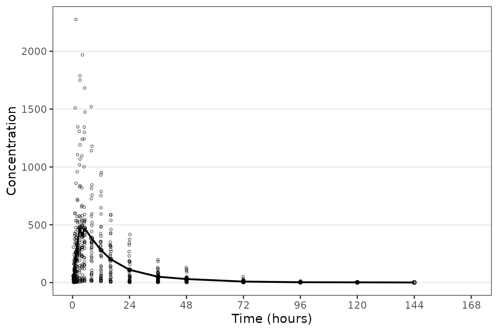

These data are probably best visualized on a log-scale y-axis upweight
the terminal phase profile. `plot_dvtime` includes an argument `log_y`
which performs this operation with some additional formatting benefits
over manually adding the layer to the returned object with
`scale_y_log10`.

- Includes log tick marks on the y-axis
- Updates the caption with the correct central tendency measure if
  `show_captions = TRUE`.

`plot_dvtime` uses the `stat_summary` function from `ggplot2` to
calculate and plot the central tendency measures and error bars. An
often overlooked feature of `stat_summary`, is that it calculates the
summary statistics *after* any transformations to the data performed by
changing the scales. This means that when
[`scale_y_log10()`](https://ggplot2.tidyverse.org/reference/scale_continuous.html)
is applied to the plot, the data are log-transformed for plotting and
the central tendency measure returned when requesting `"mean"` from
`stat_summary` is the *geometric mean*. If the `log_y` argument is used
to generate semi-log plots along with `show_captions = TRUE`, then the
caption will delineate where arithmetic and geometric means are being
returned.

``` r
plot_dvtime(data = plot_data_pk, dv_var = "ODV", log_y = TRUE) 
```

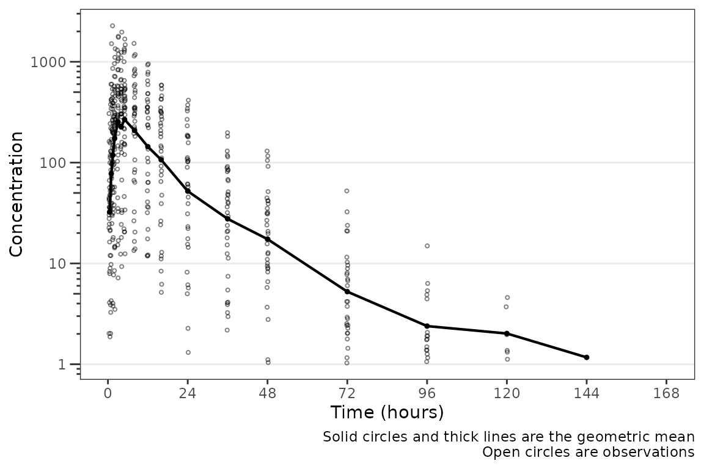

### Adjusting Time Variables and Breaks

The names of the actual and nominal time variables can be passed as a
named character vector with default
`time_vars=c(TIME=TIME", NTIME="NTIME")`. These elements of the argument
may be specified one at a time, as in the example below showing all
nominal values, or both together.

``` r
plot_dvtime(plot_data_pk, dv_var = "ODV", time_vars = c(TIME = "NTIME"))
```


`plot_dvtime` includes uses a helper function (`breaks_time`) to
automatically determine x-axis breaks based on the units of the time
variable! Two arguments in `plot_dvtime` are passed to `breaks_time`:

- `timeu` character string specifying time units. Options include:

  - “hours” (default), “hrs”, “hr”, “h”
  - “days”, “dys”, “dy”, “d”
  - “weeks”, “wks”, “wk”, “w”
  - “months”, “mons”, “mos”, “mo”, “m”

- `n_breaks` number breaks requested from the algorithm. Default = 8.

Let’s pass the vector of nominal times we defined earlier into the
`breaks_time` function and see what we get with different requested
numbers of breaks!

``` r
breaks_time(ntimes, unit = "hours")
#> [1]   0  24  48  72  96 120 144 168
breaks_time(ntimes, unit = "hours", n = 5)
#> [1]   0  48  96 144
breaks_time(ntimes, unit = "hours", n = length(ntimes))
#>  [1]   0.0   9.6  19.2  28.8  38.4  48.0  57.6  67.2  76.8  86.4  96.0 105.6
#> [13] 115.2 124.8 134.4 144.0 153.6 163.2
```

We can see that the default (n = 8) gives an optimal number of breaks in
this case whereas reducing the number of breaks (n=5) gives a less
optimal distribution of values. Requesting breaks equal to the length of
the vector of unique `NTIMES` will generally produce too many breaks.
The default axes breaks behavior can always be overwritten by specifying
the axis breaks manually using
[`scale_x_continuous()`](https://ggplot2.tidyverse.org/reference/scale_continuous.html).

The default `n_breaks = 8` is a good value for `data_sad`, and
`data_sad` uses the default time units (`"hours"`); therefore, explicit
specification of the `n_breaks` and `timeu` arguments is not required.

``` r
plot_dvtime(data = plot_data_pk, dv_var = "ODV") 
```

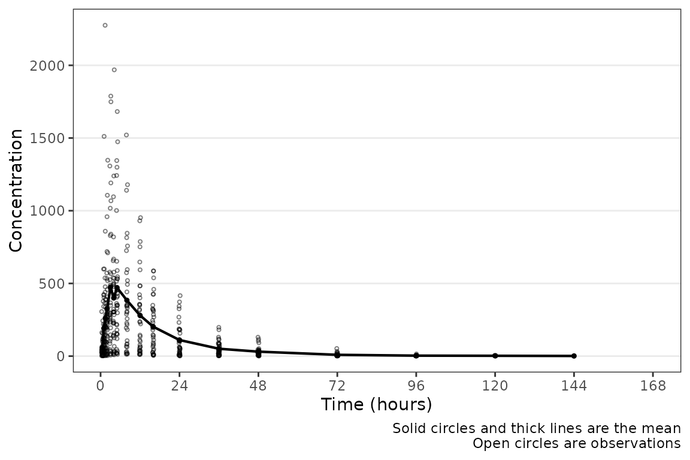 However,
perhaps someone on the team would prefer the x-axis breaks in units of
`days`. The x-axis breaks will transform to the new units automatically
as long as we specify the new time unit with `timeu = "days"`.

``` r
plot_data_pk_days <- plot_data_pk %>% 
  mutate(TIME = TIME/24, 
         NTIME = NTIME/24)

plot_dvtime(data = plot_data_pk_days, dv_var = "ODV", timeu = "days") 
```


Nice! However, someone else on the team would prefer to see the first 24
hours of treatment in greater detail to visualize the absorption phase.
We can either truncate the x-axis range using
[`scale_x_continuous()`](https://ggplot2.tidyverse.org/reference/scale_continuous.html),
or filter the input data and allow the x-axis breaks to adjust
automatically with the new time range in the input data!

``` r
plot_data_24 <- plot_data_pk %>% 
  filter(NTIME <= 24)

plot_dvtime(data = plot_data_24, dv_var = "ODV") 
```

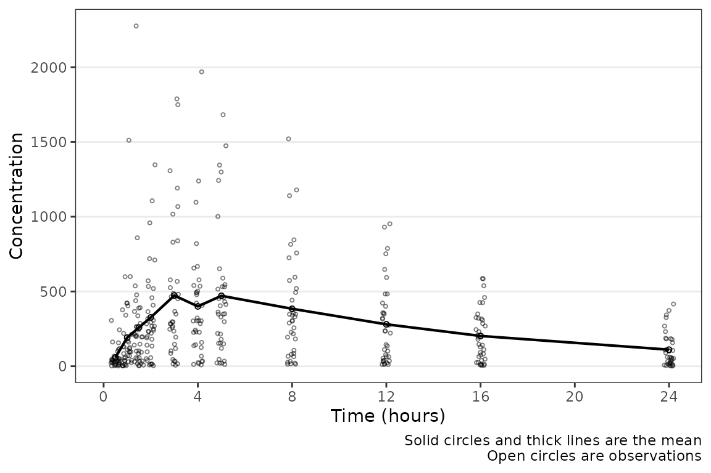

### Color Aesthetic and Central Trendency

The color aesthetic can be mapped to a dataset variable using the the
`col_var` argument. Let’s use a variable we defined earlier using
`df_addn` to list unique study conditions.

``` r
plot_dvtime(data = plot_data_pk, dv_var = "ODV", log_y = TRUE, col_var = "Dose and Food", )
```

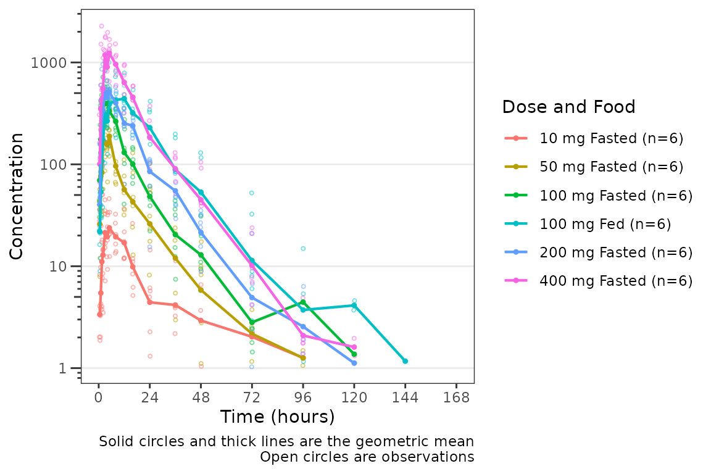 The argument
`cent` specifies the method of calculating the central tendency (+/-
variability) within levels of the variable passed to the `col_var`. The
default is `cent = "mean"`; however, note that the calculation performed
are *after* any transformations to the data and this option will return
the geometric mean when `log_y=TRUE`. If the `log_y` argument is used to
generate semi-log plots along with `show_captions = TRUE`, then the
caption will automatically delineate where arithmetic and geometric
means are being returned.

``` r
plot_dvtime(data = plot_data_pk, dv_var = "ODV", col_var = "Dose and Food", cent = "mean", 
            ylab = "Concentration (ng/mL)") 
```

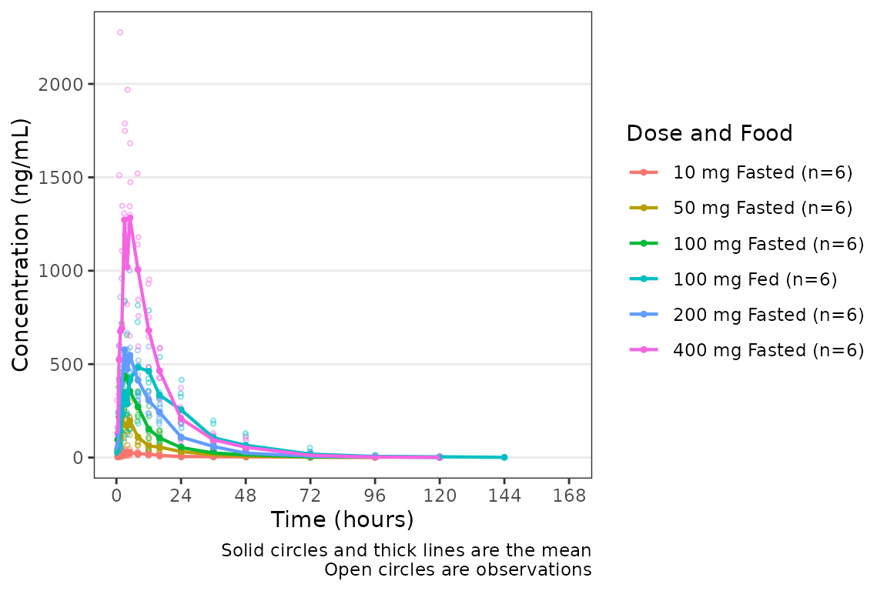

It looks like coadministration with food may impact the absorption
profile. Luckily, `plot_dvtime` returns a `ggplot` object which we can
modify like any other `ggplot`! Therefore, we can facet by PART by
simply adding in another layer to our `ggplot` object.

``` r
plot_dvtime(data = plot_data_pk, dv_var = "ODV", col_var = "Dose and Food", cent = "mean", 
            ylab = "Concentration (ng/mL)", log_y = TRUE) +
  facet_wrap(~PART)
```

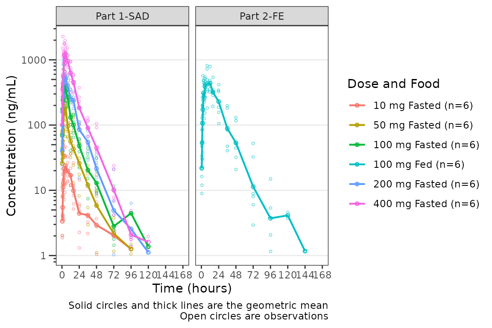

The clinical team would like a simpler plot that clearly displays the
central tendency. We can use the argument `cent = "mean_sdl"` to plot
the mean with error bars and remove the observed points by specifying
`obs_dv = FALSE`.

``` r
plot_dvtime(data = plot_data_pk, dv_var = "ODV", col_var = "Dose and Food", cent = "mean_sdl", 
            ylab = "Concentration (ng/mL)", log_y = TRUE,
            obs_dv = FALSE) +
  facet_wrap(~PART)
```

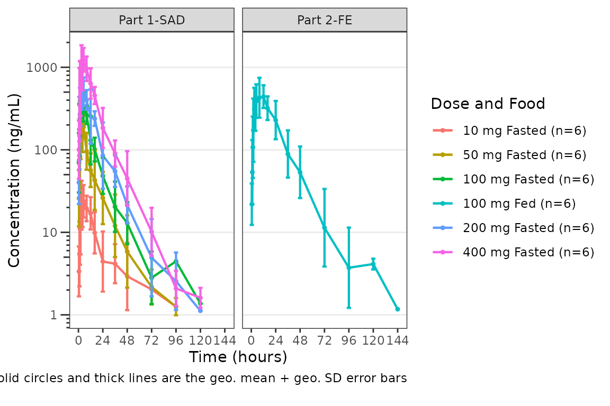

We may want to only show the upper error bar, especially when computing
the arithmetic mean +/- arithmetic SD on the linear scale. This can be
accomplished by changing the `cent` argument to `mean_sdl_upper`.

``` r
plot_dvtime(data = plot_data_pk, dv_var = "ODV", col_var = "Dose and Food", cent = "mean_sdl_upper", 
            ylab = "Concentration (ng/mL)", obs_dv = FALSE) +
  facet_wrap(~PART)
```

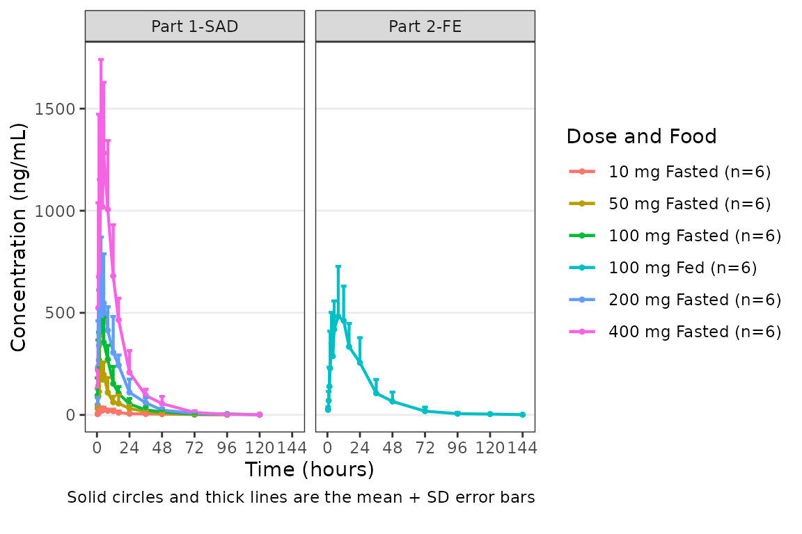

We could also plot these data as median + interquartile range (IQR), if
we do not feel the sample size is sufficient for parametric summary
statistics. This can be accomplished by changing the `cent` argument to
`median_iqr`.

``` r
plot_dvtime(data = plot_data_pk, dv_var = "ODV", col_var = "Dose and Food", cent = "median_iqr", 
            ylab = "Concentration (ng/mL)", log_y = TRUE,
            obs_dv = FALSE) +
  facet_wrap(~PART)
```

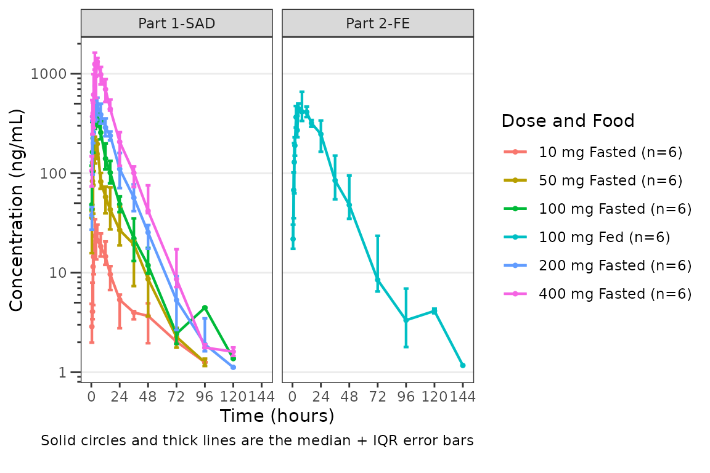

Hmm…there is some noise at the late terminal phase. This is likely
artifact introduced by censoring of data at the assay LLOQ; however,
let’s confirm there are no weird individual subject profiles by
connecting observed data points longitudinally within a subject - in
other words, let’s make spaghetti plots!

We will change the central tendency measure to the median and add the
spaghetti lines. Data points within an individual value of `grp_var`
will be connected by a narrow line when `grp_dv = TRUE`. The default is
`grp_var = "ID"`.

``` r
plot_dvtime(data = plot_data_pk, dv_var = "ODV", col_var = "Dose and Food", cent = "median", 
            ylab = "Concentration (ng/mL)", log_y = TRUE, 
            grp_dv = TRUE) +
  facet_wrap(~PART)
```

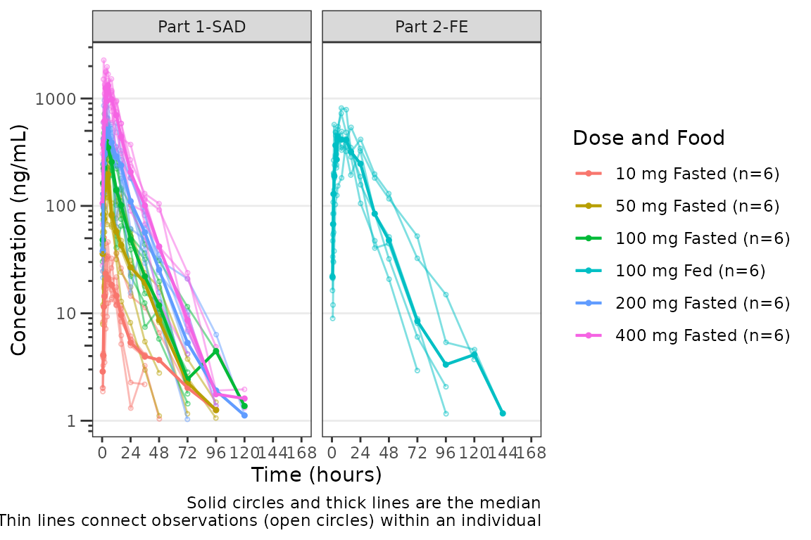 It does
not seem like there are outlier individuals driving the noise in the
late terminal phase; therefore, this is almost certainly artifact
introduced by data missing due to assay sensitivity and censoring at the
lower limit of quantification (LLOQ).

### Defining imputations for BLQ data

Let’s use imputation to assess the potential impact of the data missing
due to assay sensitivity. `plot_dvtime` includes some functionality to
do this imputation for us using the `loq` and `loq_method` arguments.

The `loq_method` argument species how BLQ imputation should be
performed. Options are:

- `0` : No handling. Plot input dataset `DV` vs `TIME` as is. (default)
- `1` : Impute all BLQ data at `TIME` \<= 0 to 0 and all BLQ data at
  `TIME` \> 0 to 1/2 x `loq`. Useful for plotting concentration-time
  data with some data BLQ on the linear scale
- `2` : Impute all BLQ data at `TIME` \<= 0 to 1/2 x `loq` and all BLQ
  data at `TIME` \> 0 to 1/2 x `loq`.

The `loq` argument species the value of the LLOQ. The `loq` argument
must be specified when `loq_method` is `1` or `2`, but can be `NULL`
*if* the variable `LLOQ` is present in the dataset. In our case, `LLOQ`
is a variable in `plot_data`, so we do not need to specify the `loq`
argument (default is `loq = NULL`).

``` r
plot_dvtime(plot_data_pk, dv_var = "ODV", col_var = "Dose and Food", cent = "mean",
            ylab = "Concentration (ng/mL)", log_y = TRUE,
            loq_method = 2) +
  facet_wrap(~PART)
```

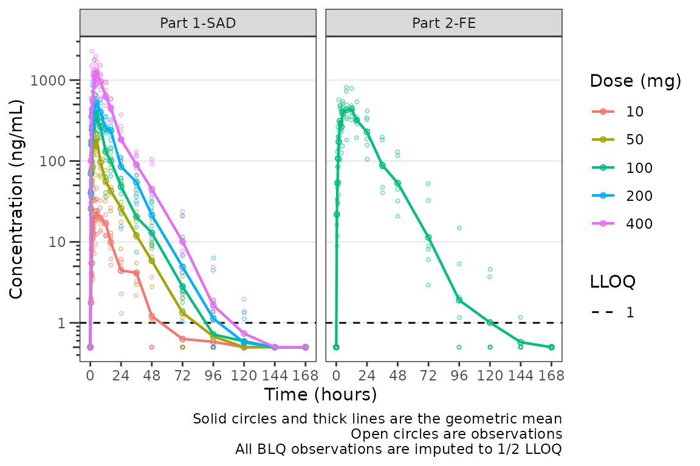 The same plot
is obtained by specifying `loq = 1`

``` r
plot_dvtime(plot_data_pk, dv_var = "ODV", col_var = "Dose and Food", cent = "mean",
            ylab = "Concentration (ng/mL)",  log_y = TRUE,
            loq_method = 2, loq = 1) +
  facet_wrap(~PART)
```


A reference line is drawn to denote the LLOQ and all observations with
`EVID=0` and `MDV=1` are imputed as LLOQ/2. The numeric value of LLOQ is
printed in the legend and a caption is added to indicate the imputation
method for BLQ data.

Imputing post-dose concentrations below the lower limit of
quantification as 1/2 x LLOQ normalizes the late terminal phase of the
concentration-time profile. This is confirmatory evidence for our
hypothesis that the noise in the late terminal phase is due to censoring
of observations below the LLOQ.

### Dose-normalization

We can also generate dose-normalized concentration-time plots by
specifying `dosenorm = TRUE`.

``` r
plot_dvtime(plot_data_pk, dv_var = "ODV", col_var = "Dose and Food", cent = "mean",
            ylab = "Dose-normalized Conc. (ng/mL per mg Drug)", log_y = TRUE,
            dosenorm = TRUE) +
  facet_wrap(~PART)
```

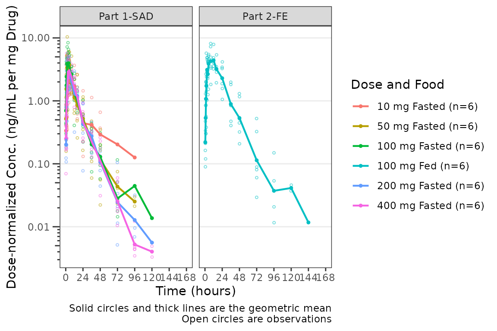

When `dosenorm = TRUE`, the variable specified in `dose_var` (default =
“DOSE”) needs to be present in the input dataset `data`. If `dose_var`
is not present in `data`, the function will return an *Error* with an
informative error message.

``` r
plot_dvtime(select(plot_data_pk, -DOSE), 
            dv_var = "ODV", col_var = "Dose and Food", cent = "mean",
            ylab = "Dose-normalized Conc. (ng/mL per mg Drug)", log_y = TRUE,
            dosenorm = TRUE) +
  facet_wrap(~PART)
#> Error in `check_varsindf()`:
#> ! argument `dose_var` must be variables in `data`
```

Dose-normalization is performed *AFTER* BLQ imputation in the case in
which both options are requested. The reference line for the LLOQ will
not be plotted when dose-normalized concentration is the dependent
variable.

``` r
plot_dvtime(plot_data_pk, dv_var = "ODV", col_var = "Dose and Food", cent = "mean",
            ylab = "Dose-normalized Conc. (ng/mL per mg Drug)", log_y = TRUE,
            loq_method = 2, dosenorm = TRUE) +
  facet_wrap(~PART)
```

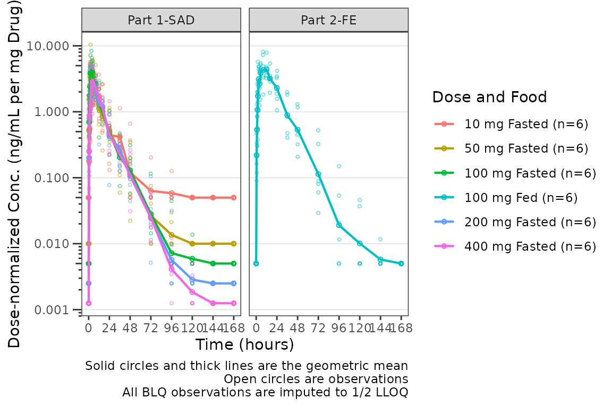

### Adjusting the Attributes for Points and Lines

The default attributes of data points and lines are controlled by the
`theme` argument. The defaults

``` r
plot_dvtime_theme()
#> $linewidth_ref
#> [1] 0.5
#> 
#> $linetype_ref
#> [1] 2
#> 
#> $alpha_line_ref
#> [1] 1
#> 
#> $shape_point_obs
#> [1] 1
#> 
#> $size_point_obs
#> [1] 0.75
#> 
#> $alpha_point_obs
#> [1] 0.5
#> 
#> $linewidth_obs
#> [1] 0.5
#> 
#> $linetype_obs
#> [1] 1
#> 
#> $alpha_line_obs
#> [1] 0.5
#> 
#> $shape_point_cent
#> [1] 16
#> 
#> $size_point_cent
#> [1] 1.25
#> 
#> $alpha_point_cent
#> [1] 1
#> 
#> $linewidth_cent
#> [1] 0.75
#> 
#> $linetype_cent
#> [1] 1
#> 
#> $alpha_line_cent
#> [1] 1
#> 
#> $linewidth_errorbar
#> [1] 0.75
#> 
#> $linetype_errorbar
#> [1] 1
#> 
#> $alpha_errorbar
#> [1] 1
#> 
#> $width_errorbar
#> NULL
```

These attributes can be updated by passing a named list to the `theme`
argument. Say we want to reduce the linewidth of the error bars and
reduce the size of the mean summary points to only visualize the lines.
This can be accomplished for an individual plot as follows:

``` r
plot_dvtime(data = plot_data_pk, dv_var = "ODV", col_var = "Dose and Food", cent = "mean_sdl", 
            ylab = "Concentration (ng/mL)", log_y = TRUE,
            obs_dv = FALSE, 
            theme = list(linewidth_errorbar = 0.5, size_point_cent = 0.1)) +
  facet_wrap(~PART)
```


One could also globally set a new theme by updating the default using
`plot_dvtime_theme` and pass the new theme list object to the `theme`
argument. This is useful if generating multiple plots using the same
modified theme.

``` r
new_theme <- plot_dvtime_theme(list(linewidth_errorbar = 0.5, size_point_cent = 0.1))

plot_dvtime(data = plot_data_pk, dv_var = "ODV", col_var = "Dose and Food", cent = "mean_sdl", 
            ylab = "Concentration (ng/mL)", log_y = TRUE,
            obs_dv = FALSE, 
            theme = new_theme) +
  facet_wrap(~PART)
```

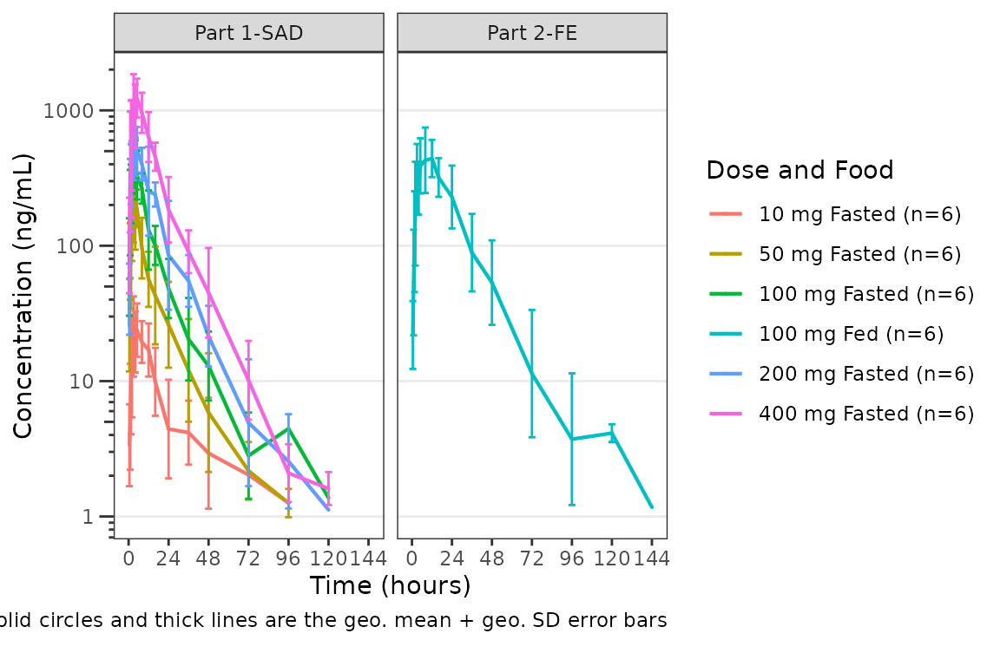

The default error bar width is 2.5% of the maximum nominal time in the
dataset. This can be overwritten to a user-specified value using the
`width_errorbar` attribute of `plot_dvtime_theme`. This value is passed
to the `width` argument of `geom_errorbar`.

``` r
plot_dvtime(data = plot_data_pk, dv_var = "ODV", col_var = "Dose and Food", cent = "mean_sdl", 
            ylab = "Concentration (ng/mL)", log_y = TRUE,
            obs_dv = FALSE, 
            theme = list(width_errorbar = 8)) +
  facet_wrap(~PART)
```

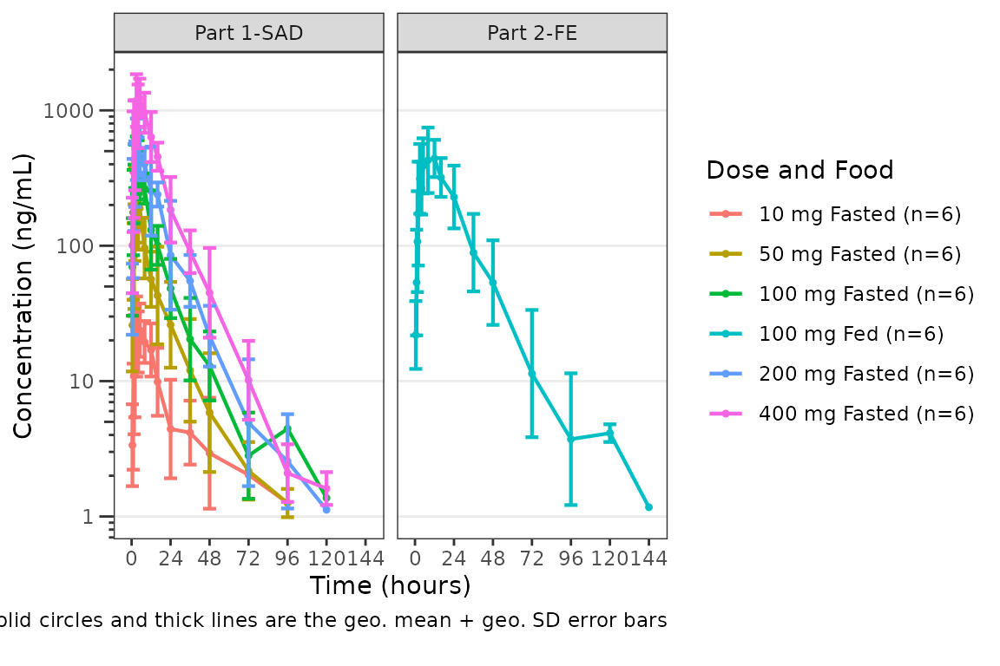

## Individual Concentration-time plots

The previous section provides an overview of how to generate population
concentration-time profiles by dose using `plot_dvtime`; however, we can
also use `plot_dvtime` to generate subject-level visualizations with a
little pre-processing of the input dataset.

We can specify `cent = "none"` to remove the central tendency layer when
plotting individual subject data.

``` r
plot_dvtime(plot_data_pk, dv_var = "ODV", col_var = "Dose and Food", cent = "none",
            ylab = "Concentration (ng/mL)", log_y = TRUE,
            grp_dv = TRUE,
            loq_method = 2, loq = 1) +
  facet_wrap(~PART)
```

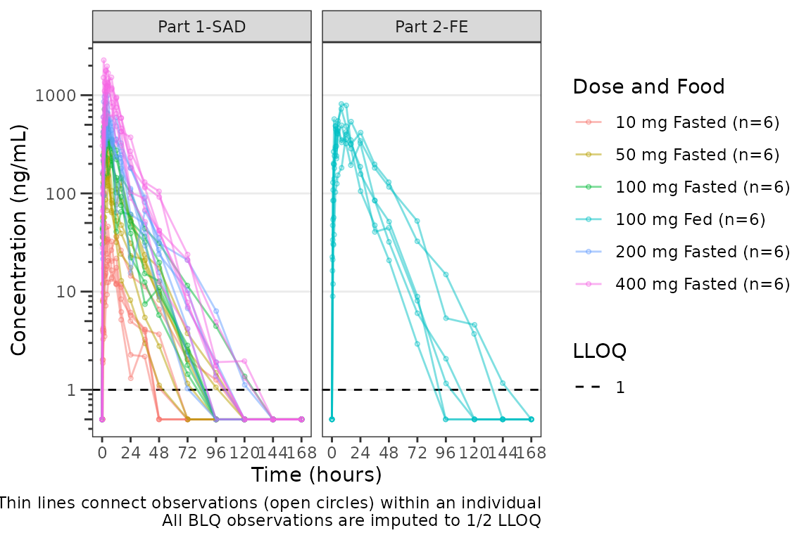 We
can plot an individual subject by filtering the input dataset. This
could be extended generate plots for all individuals using `for` loops,
`lapply`,
[`purrr::map()`](https://purrr.tidyverse.org/reference/map.html)
functions, or other methods.

``` r

ids <- sort(unique(plot_data_pk$ID)) #vector of unique subject ids
n_ids <- length(ids) #count of unique subject ids
plots_per_pg <- 4
n_pgs <- ceiling(n_ids/plots_per_pg) #Total number of pages needed

plist<- list()
for(i in 1:n_ids){
  plist[[i]] <- plot_dvtime(filter(plot_data_pk, ID == ids[i]), 
                               dv_var = "ODV", cent = "none",
            ylab = "Concentration (ng/mL)", log_y = TRUE,
            grp_dv = TRUE,
            loq_method = 2, loq = 1, show_caption = FALSE) +
  facet_wrap(~PART)+
  labs(title = paste0("ID = ", ids[i], " | Dose = ", unique(plot_data_pk$DOSE[plot_data_pk$ID==ids[i]]), " mg"))+
  theme(legend.position="none")
}

lapply(1:n_pgs, function(n_pg) {
      i <-  (n_pg-1)*plots_per_pg+1
      j <- n_pg*plots_per_pg
      wrap_plots(plist[i:j])
})
#> [[1]]
```

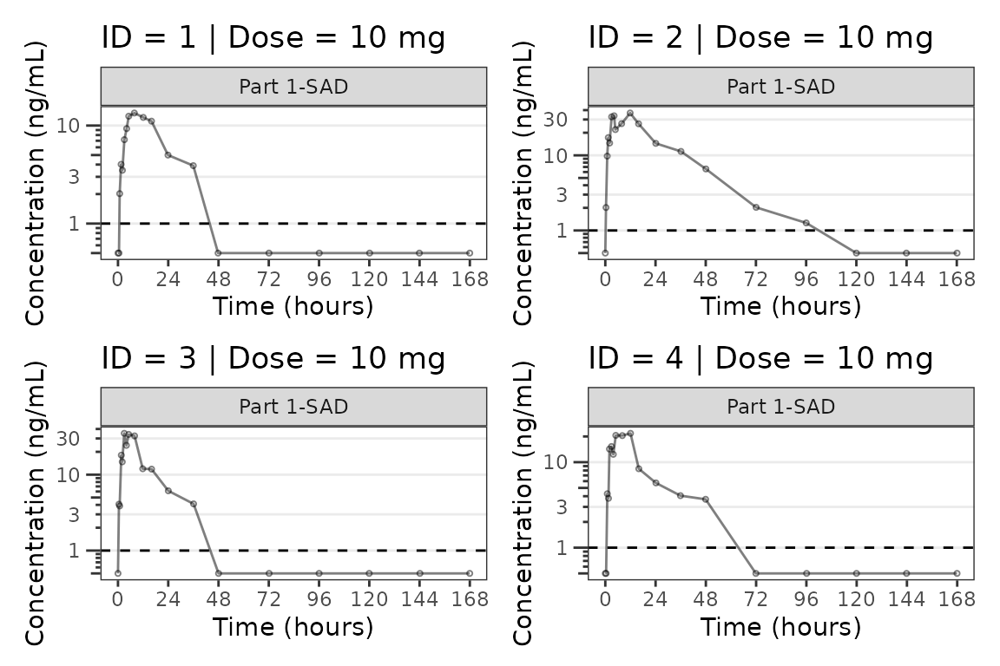

    #> 
    #> [[2]]

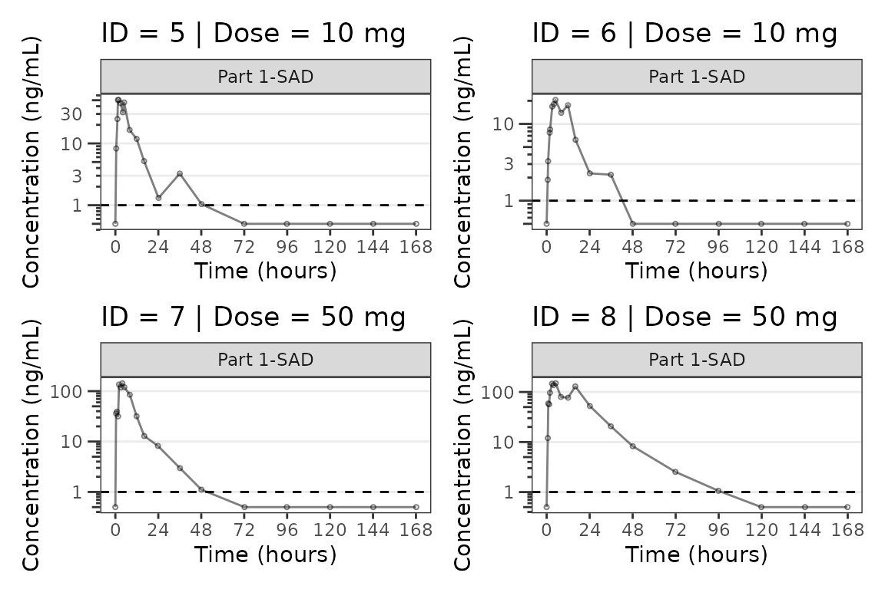

    #> 
    #> [[3]]

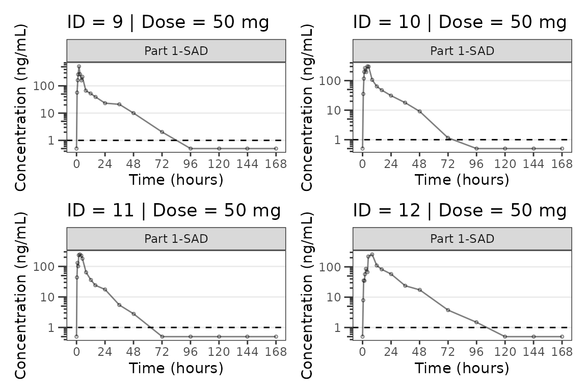

    #> 
    #> [[4]]

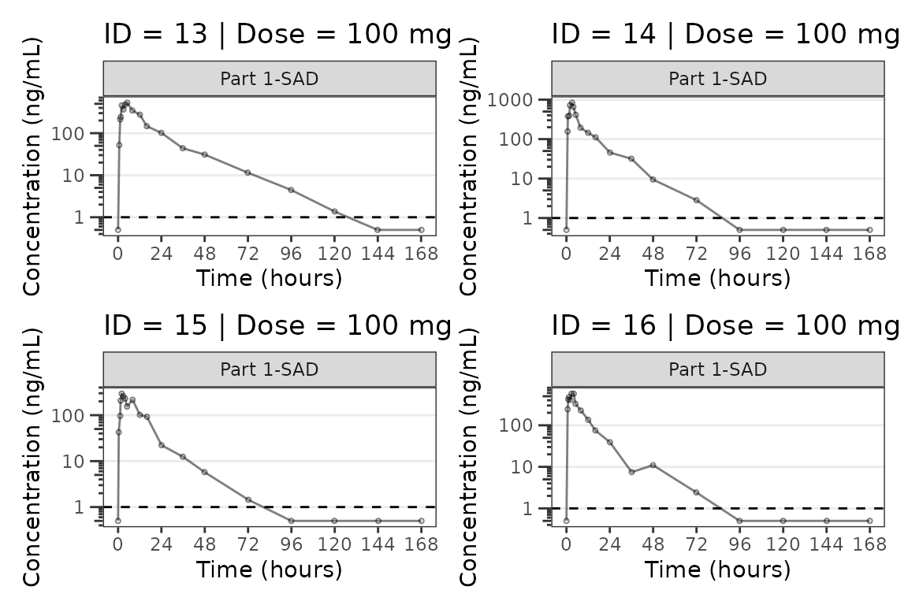

    #> 
    #> [[5]]

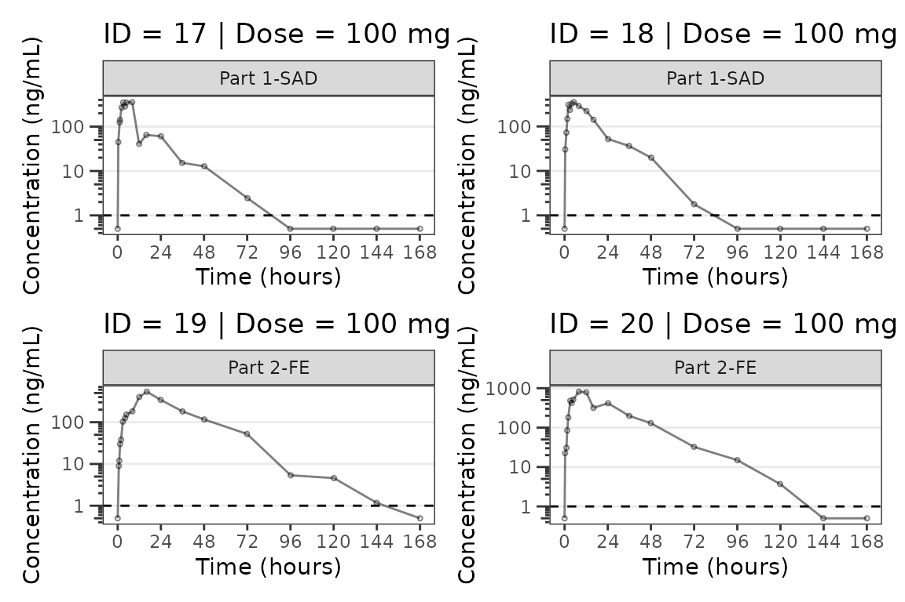

    #> 
    #> [[6]]

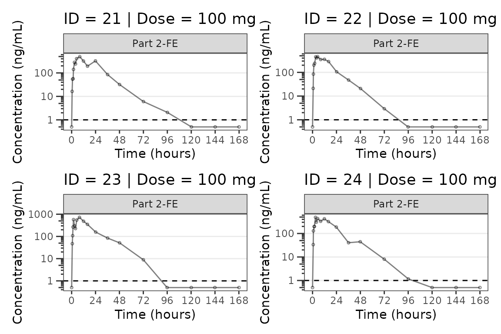

    #> 
    #> [[7]]

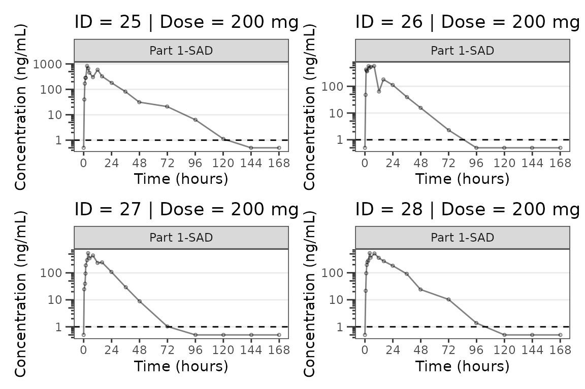

    #> 
    #> [[8]]

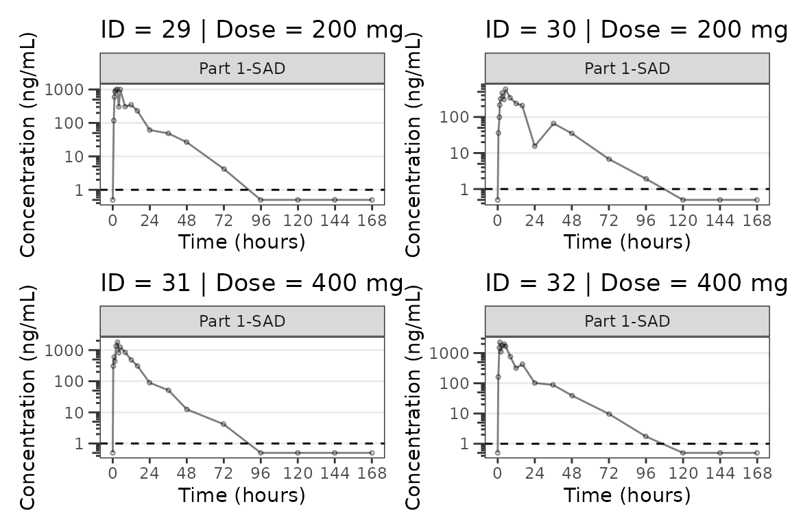

    #> 
    #> [[9]]

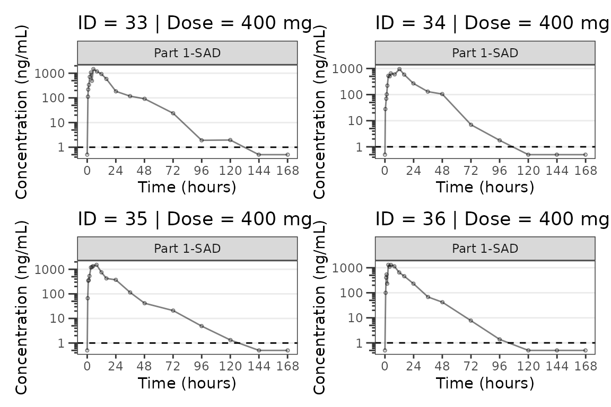

## Population Concentration and Response-Time Plots

Now let’s take a look at the pharmacodynamic (PD) data! We can visualize
the response-time profile using `plot_dvtime`, just as we did to
visualize the concentration-time profile previously, by filtering our
PK/PD dataset to the compartment with the biomarker observations
(`CMT=3`).

``` r
plot_dvtime(data = filter(plot_data_pd, CMT == 3), dv_var = "ODV", col_var = "Dose and Food", ylab = "Response") 
```

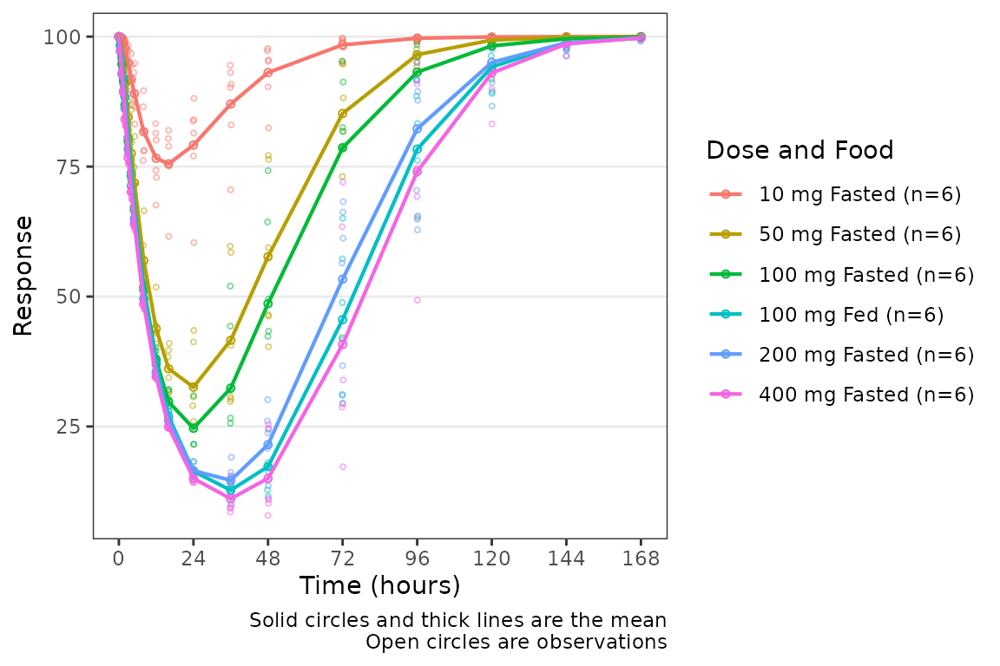

We can add a reference line to our plot using the `plot_dvtime` argument
`cfb=TRUE`, which by default plots a reference line at y=0. The location
of the reference line can be modified by specifying a y-intercept value
using the argument`cfb_base`.

``` r
plot_dvtime(data = filter(plot_data_pd, CMT == 3), dv_var = "ODV", col_var = "Dose and Food", ylab = "Response", 
            cfb = TRUE, cfb_base = 100) 
```

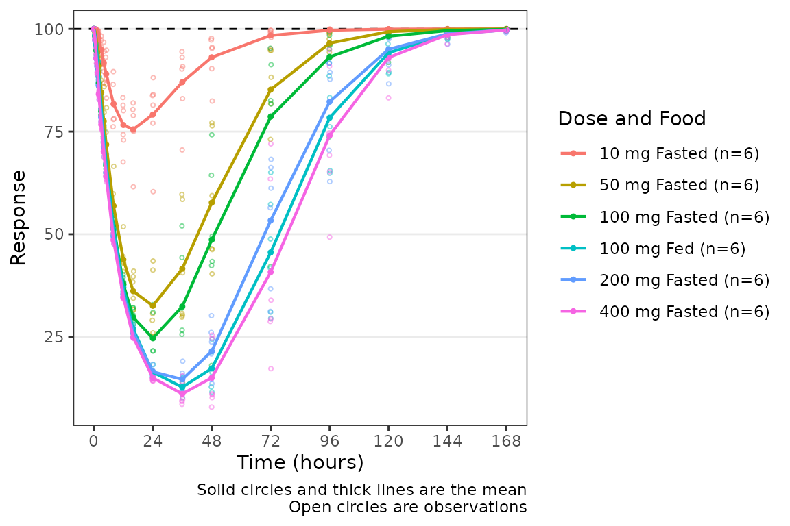

We can add a reference line to our plot using the `plot_dvtime` argument
`cfb=TRUE`, which by default plots a reference line at y=0. The location
of the reference line can be modified by specifying a y-intercept value
using the argument`cfb_base`.

``` r
plot_dvtime(data = filter(plot_data_pd, CMT == 3), dv_var = "CFB", col_var = "Dose and Food", ylab = "Response", 
            cfb=TRUE)
```


### Overview of `plot_dvtime_dual`

The wrapper function `plot_dvtime_dual` supports simultaneous
visualization of the time-course of drug concentration and response.
This function uses the `patchwork` package to plot the PK and PD
profiles in two vertically arranged panels. `plot_dvtime_dual` includes
the following arguments to specify elements of the panels:

- `dv_var1` and `dv_var2` arguments to specify the dependent variable
  (y-axis) to plot in the top (1) and bottom (2) panels. The default is
  `"DV".`
- `dvid_var` argument to specify the variable that contains the
  identifiers for each dependent variable to be plotted. The default is
  `"CMT"`.
- `dvid_val1` and `dvid_val2` arguments to specify the values of the
  variable in `dvid_var` to identify the dependent variables to plot in
  the top (1) and bottom (2) panel. The defaults are `2` and `3`,
  respectively.

``` r
plot_dvtime_dual(plot_data_pd, dv_var1 = "ODV",dv_var2 = "ODV",
                 dvid_var = "CMT", dvid_val1 = 2, dvid_val2 = 3,
                 col_var = "Dose and Food")
```

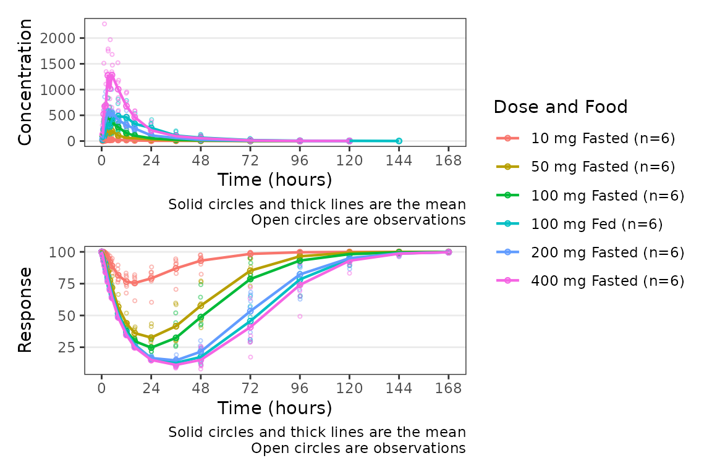

The following arguments are available to specify y-axis labels and
transformations:

- `ylab1`: Character string specifying the label for the top panel
  y-axis. Default is `"Concentration"`.
- `ylab2`: Character string specifying the label for the bottom panel
  y-axis. Default is `"Response"`.
- `log_y1`: Logical specifying if the top panel y-axis should be
  transformed to a log scale. Default is `FALSE`.
- `log_y2`: Logical specifying if the bottom panel y-axis should be
  transformed to a log scale. Default is `FALSE`.

``` r
plot_dvtime_dual(plot_data_pd, dv_var1 = "ODV", dv_var2 = "ODV",
                 dvid_var = "CMT", dvid_val1 = 2, dvid_val2 = 3,
                 col_var = "Dose and Food",
                 log_y1 = TRUE, ylab1 = "Drug Conc. (ng/mL)", ylab2 = "Response (% of Base)") 
```

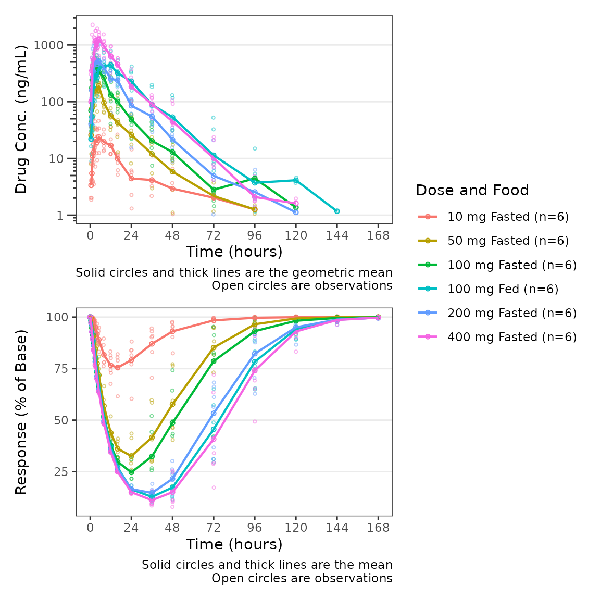

This wrapper function expects that the top panel will display drug
concentration (PK) and the bottom panel will display response (PD).
Thus, BLQ imputation and dose-normalization options specified using the
standard arguments to `plot_dvtime` are only applied to the top panel.

``` r
plot_dvtime_dual(plot_data_pd, dv_var1 = "ODV", dv_var2 = "ODV",
                 dvid_var = "CMT", dvid_val1 = 2, dvid_val2 = 3,
                 col_var = "Dose and Food", loq_method = 2, dosenorm = T,dose_var = "DOSE",
                 log_y1 = TRUE, ylab1 = "Dose-norm Drug Conc. (ng/mL)", ylab2 = "Response (% of Base)") 
```

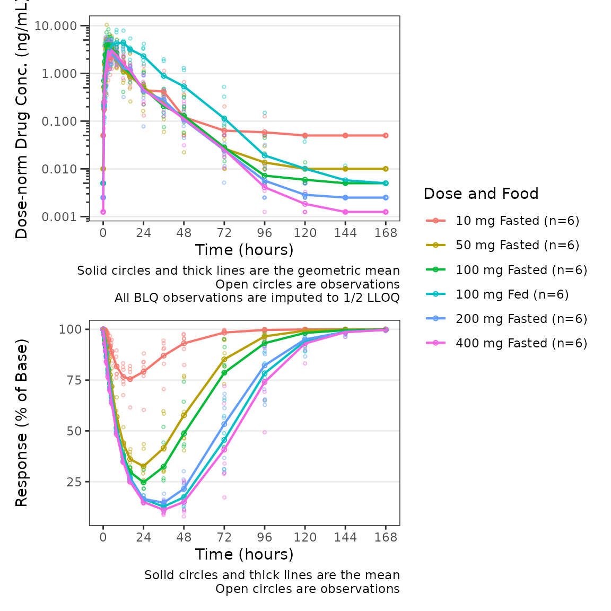

Similarly, since function expects that the bottom panel displays
response (PD), a reference line at y=`cfb_base` is only added to the
bottom panel when `cfb=TRUE`.

``` r
plot_dvtime_dual(plot_data_pd, dv_var1 = "ODV", dv_var2 = "ODV",
                 dvid_var = "CMT", dvid_val1 = 2, dvid_val2 = 3,
                 col_var = "Dose", cfb=TRUE, cfb_base = 100,
                 log_y1 = TRUE, ylab1 = "Drug Conc. (ng/mL)", ylab2 = "Response (% of Baseline)") 
```

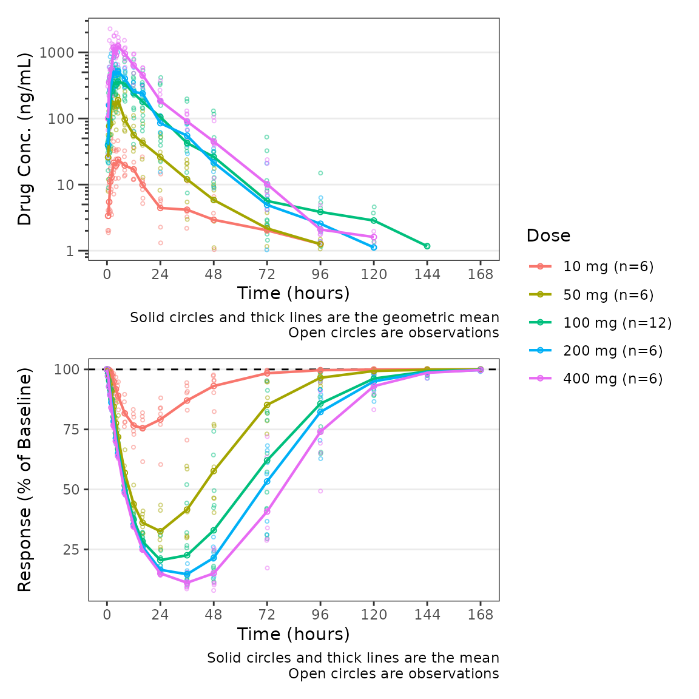

The default value of `cfb_base` is `0`, which is the reference condition
for when we express our response variable in units of change from
baseline or percentage change from baseline. We can modify our plot to
use change from baseline as the dependent variable for the PD panel but
updating the variable passed to `dv_var2`.

``` r
plot_dvtime_dual(plot_data_pd, dv_var1 = "ODV", dv_var2 = "CFB",
                 dvid_var = "CMT", dvid_val1 = 2, dvid_val2 = 3,
                 col_var = "Dose", cfb=TRUE, 
                 log_y1 = TRUE, ylab1 = "Drug Conc. (ng/mL)", ylab2 = "Response (% Change from Baseline)") 
```

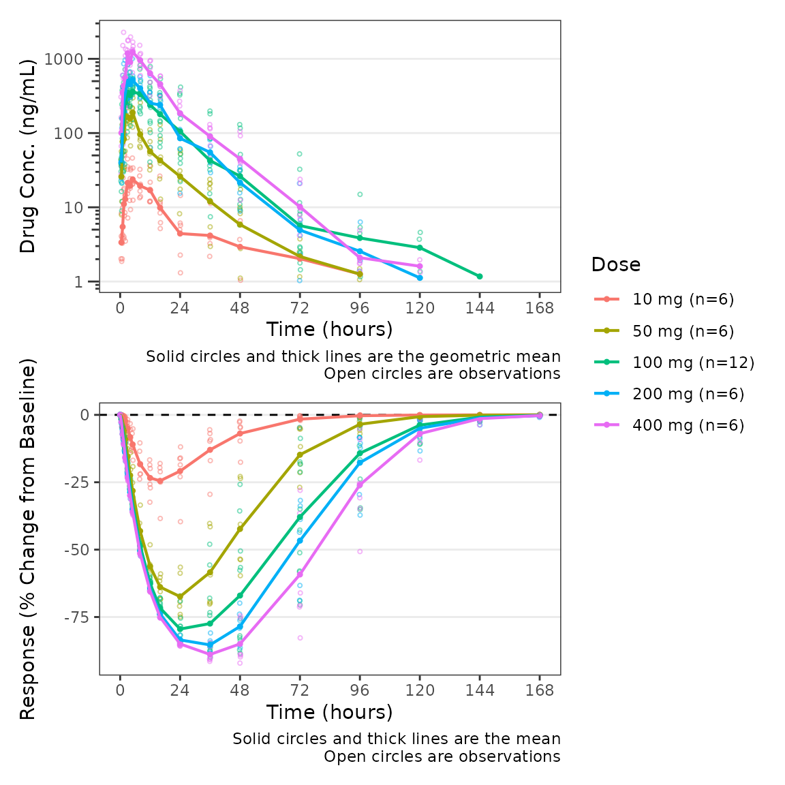

Finally, we can modify both of the captions separately using the logical
arguments `show_caption1` and `show_caption2`. Their default values are
`TRUE`. Since both panels of this plot have the same elements, we can
turn the caption off in the top panel and print a single caption under
the bottom panel to represent both panels in the plot.

``` r
plot_dvtime_dual(plot_data_pd, dv_var1 = "ODV", dv_var2 = "CFB",
                 dvid_var = "CMT", dvid_val1 = 2, dvid_val2 = 3,
                 col_var = "Dose", cfb=TRUE, 
                 log_y1 = TRUE, ylab1 = "Drug Conc. (ng/mL)", ylab2 = "Response (% Change from Baseline)", 
                 show_caption1 = FALSE, show_caption2 = TRUE) 
```

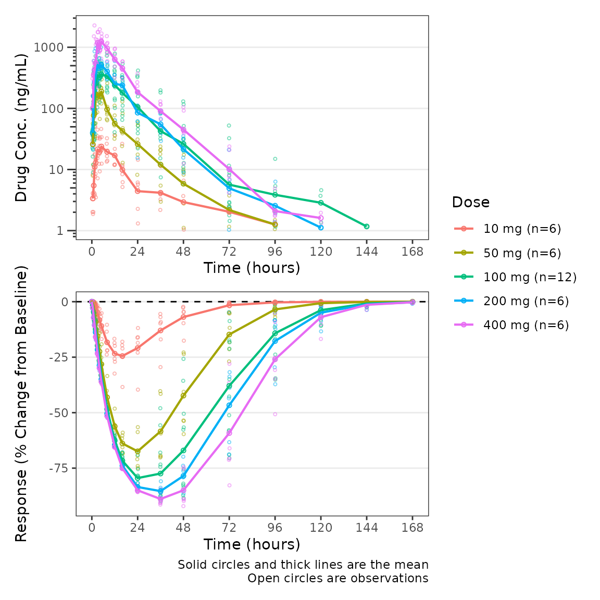

## Population Response-Concentration Plots

### Overview of `plot_dvconc`

Now that we have visualized our longitudinal PK and PD profiles, let’s
visualize the PD data versus drug concentration! `plot_dvconc` is a
plotting function for visualizing the relationship between a dependent
variable for response and drug concentration.

`plot_dvconc` requires the following arguments which specify the
variables to be plotted:

- `dv_var`: character string specifying the dependent variable to map to
  the y-axis. Default is `"DV"`.
- `idv_var`: character string specifying the dependent variable to map
  to the y-axis. Default is `"CONC"`.

``` r
plot_dvconc(data = filter(plot_data_pd, CMT==3), dv_var = "ODV", idv_var = "CONC", 
            xlab = "Drug Conc. (ng/mL)", ylab = "Response (% of Baseline)") 
```

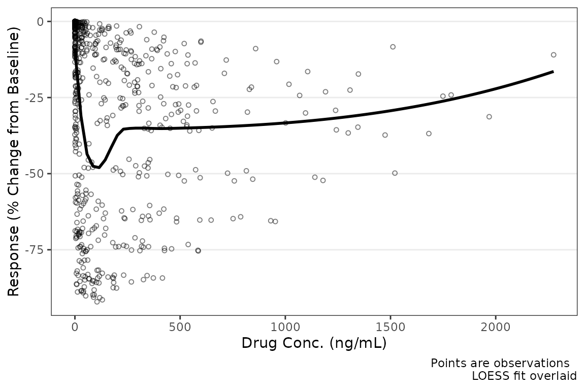

Like `plot_dvtime`, we can specify a reference line using `cfb = TRUE`,
which is plotted at `cfb_base` (default = 0).

``` r
plot_dvconc(data = filter(plot_data_pd, CMT==3), dv_var = "CFB", idv_var = "CONC", 
            xlab = "Drug Conc. (ng/mL)", ylab = "Response (% Change from Baseline)", 
            cfb = TRUE) 
```

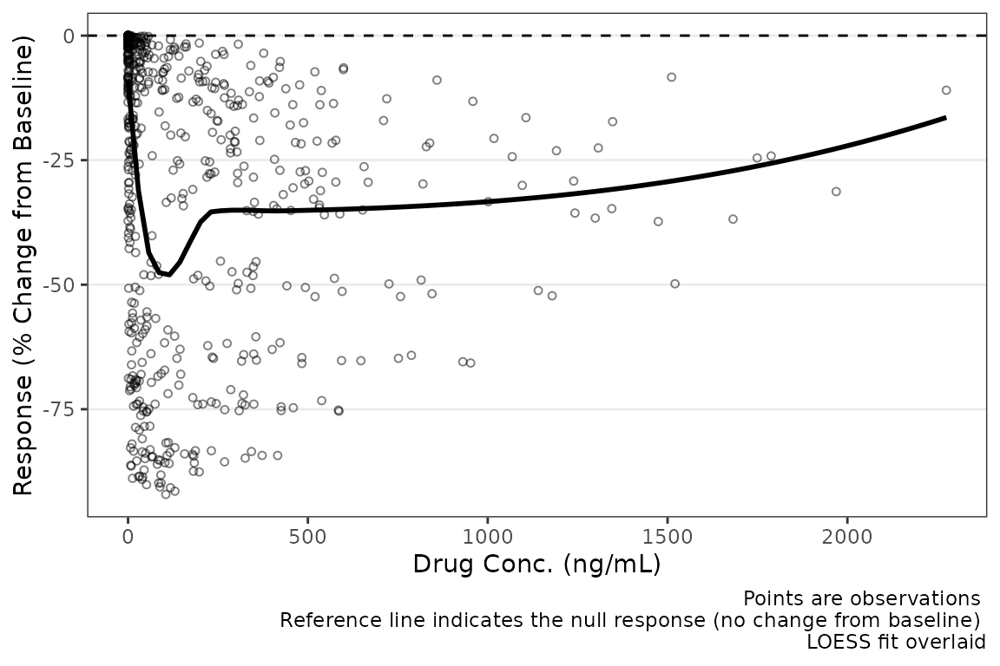

### Color Aesthetic

`plot_dvconc` includes two arguments for controlling the color
aesthetic, `col_var` and `col_trend`. If a variable is passed as a
string to the `col_var` argument, the data points are colored based on
this variable; however, by default `col_trend = FALSE` and the trend
line is fit to the totality of the data without stratifying the trend
lines by the variable mapped to the color aesthetic.

``` r
plot_dvconc(data = filter(plot_data_pd, CMT == 3), dv_var = "CFB", idv_var = "CONC", 
            cfb = TRUE, xlab = "Drug Conc. (ng/mL)", ylab = "Response (% Change from of Baseline)", 
            col_var = "Dose and Food", col_trend = FALSE) 
```

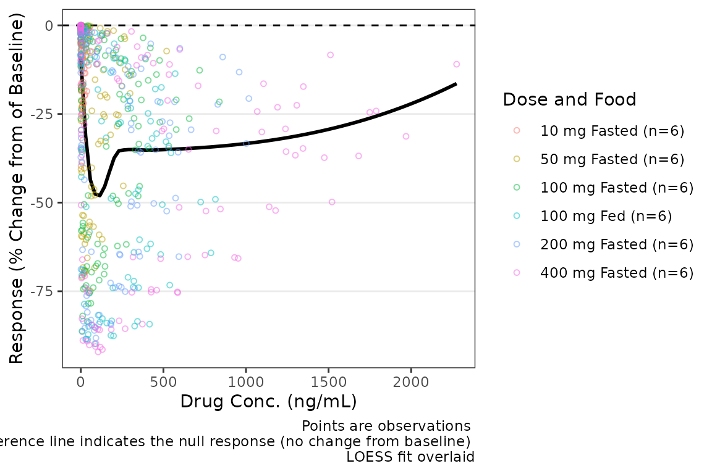

Trend lines stratified by the variable mapped to the color aesthetic are
requested by setting `col_trend = TRUE`.

``` r
plot_dvconc(data = filter(plot_data_pd, CMT == 3), dv_var = "CFB", idv_var = "CONC", 
           cfb = TRUE,  xlab = "Drug Conc. (ng/mL)", ylab = "Response (% Change from  Baseline)", 
            col_var = "Dose and Food", col_trend = TRUE) 
```

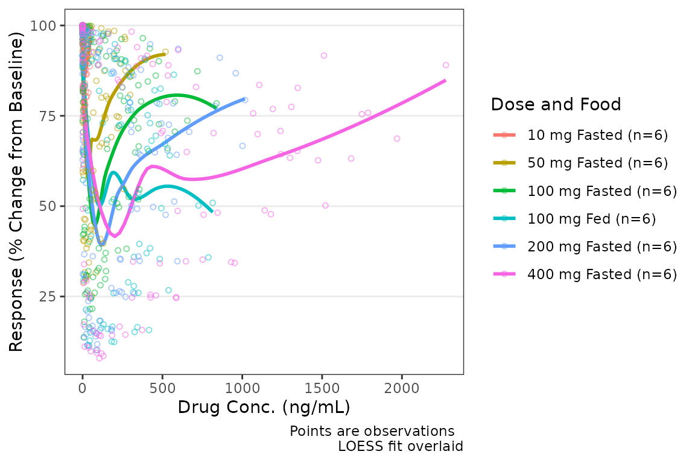

### Central Tendency

There are two trend line types supported by `plot_dvconc`: locally
estimated scatter plot smoothing (LOESS) fit and linear regression. The
central tendency trend lines visualized are controlled by logical
arguments `loess` and `linear`. The default is `loess = TRUE` and
`linear = FALSE`

``` r
plot_dvconc(data = filter(plot_data_pd, CMT == 3), dv_var = "CFB", idv_var = "CONC", 
            xlab = "Drug Conc. (ng/mL)", ylab = "Response (% Change from Baseline)", 
            cfb = TRUE,  col_var = "Dose and Food", col_trend = FALSE, loess = TRUE, linear = TRUE) 
```

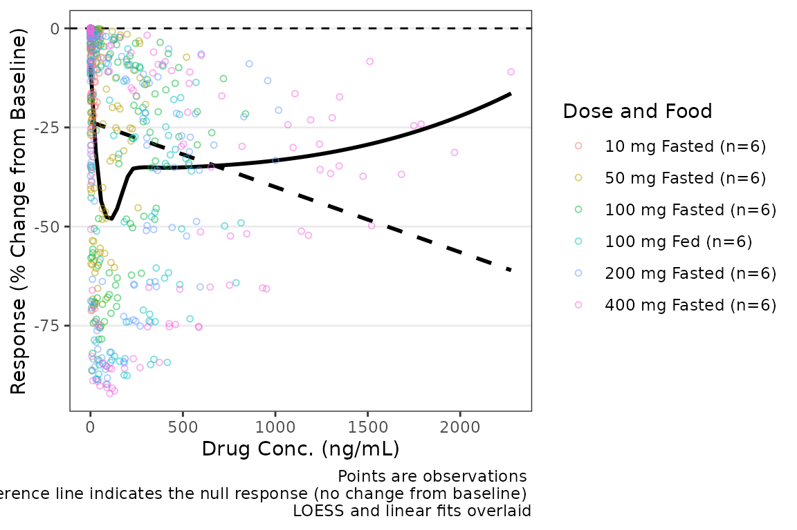
The confidence intervals of the trend lines are suppressed by default in
order to facilitate visualization of the central tendency and spread of
observed data points simultaneously. Confidence intervals can be added
to the plot using the logical arguments `se_loess` and `se_linear`.

``` r
plot_dvconc(data = filter(plot_data_pd, CMT == 3), dv_var = "CFB", idv_var = "CONC", 
            xlab = "Drug Conc. (ng/mL)", ylab = "Response (% Change from Baseline)",
            cfb = TRUE, col_var = "Dose and Food", col_trend = FALSE, 
            loess = TRUE, linear = TRUE, se_loess = TRUE, se_linear = TRUE) 
```

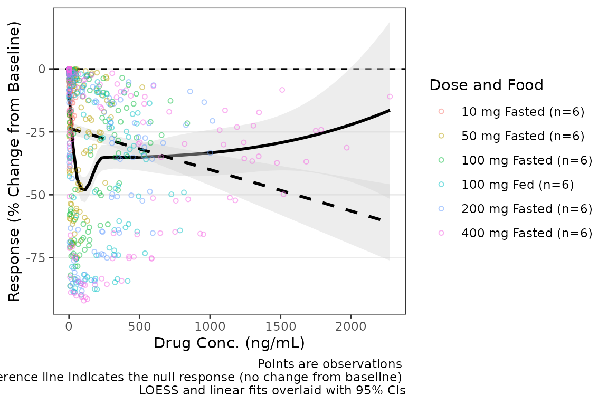
Additional arguments can be passed to `geom_smooth(method = "loess")`,
such as increasing the span of the smoothing fit.

``` r
plot_dvconc(data = filter(plot_data_pd, CMT == 3), dv_var = "CFB", idv_var = "CONC",
            xlab = "Drug Conc. (ng/mL)", ylab = "Response (% Change from Baseline)",
            cfb = TRUE, col_var = "Dose and Food", col_trend = FALSE, 
            loess = TRUE, linear = FALSE, se_loess = TRUE, se_linear = FALSE, 
            span = 1) 
```

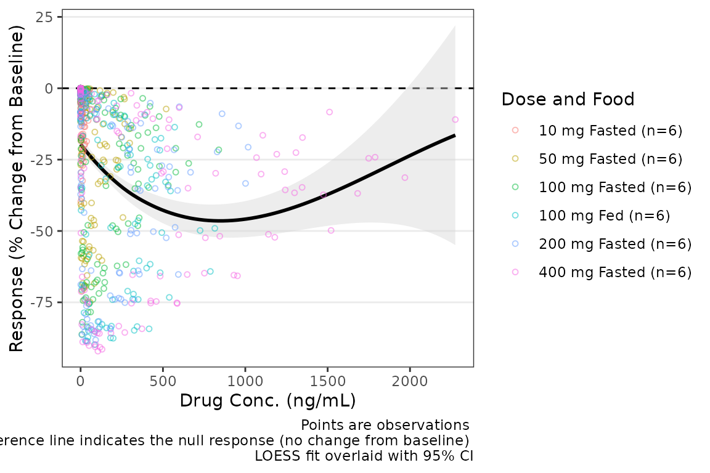 If the
color aesthetic is mapped to the trendlines with `col_trend = TRUE`, it
will also map to the ribbons defining the CIs of the trend lines.

``` r
plot_dvconc(data = filter(plot_data_pd, CMT == 3), dv_var = "CFB", idv_var = "CONC", 
            xlab = "Drug Conc. (ng/mL)", ylab = "Response (% Change of Baseline)",
            cfb = TRUE, col_var = "Dose and Food", col_trend = TRUE,
            se_loess = TRUE) 
```

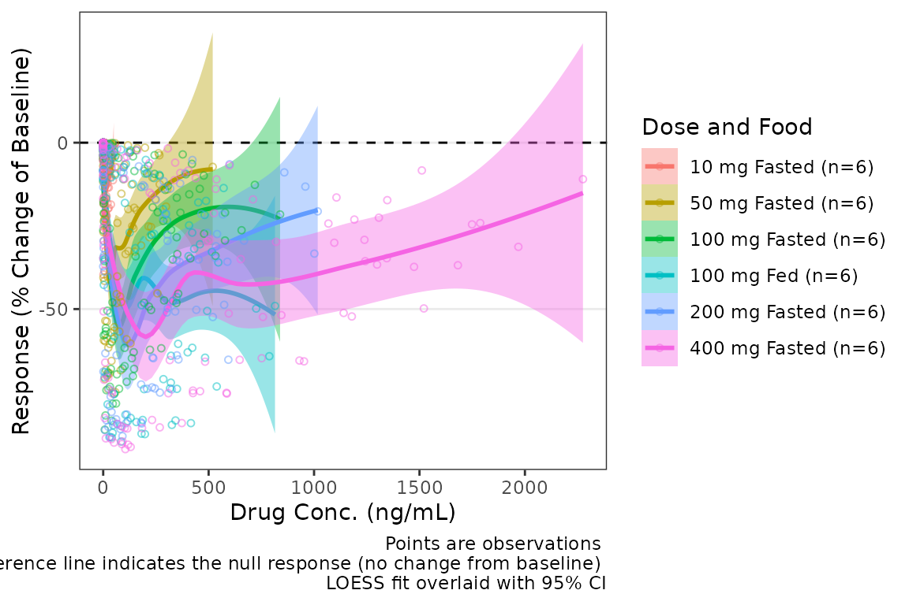

## Dose-proportionality Assessment: Power Law Regression

Another assessment that is commonly performed for pharmacokinetic data
is dose proportionality (e.g., does exposure increase proportionally
with dose). This is an important assessment prior to population PK
modeling, as it informs whether non-linearity is an important
consideration in model development.

The industry standard approach to assessing dose proportionality is
power law regression. Power law regression is based on the following
relationship:

$$Exposure = \alpha*(DOSE)^{\gamma}$$

This power relationship can be transformed to a linear relationship to
support quantitative estimation of the power ($\gamma$) via simple
linear regression by taking the logarithm of both sides:

$$log(Exposure) = intercept + \gamma*log(DOSE)$$

`NOTE`: Use of natural logarithm and log10 transformations will not
impact the assessment of the power and will only shift the intercept.

This approach facilitates hypothesis testing via assessment of the 95%
CI around the power ($\gamma$) estimated from the log-log regression.
The null hypothesis is that exposure increases proportionally to dose
(e.g., $\gamma = 1$) and the alternative hypothesis is that exposure
does *NOT* increase proportionally to dose (e.g., $\gamma \neq 1$).

Interpretation of the relationship is based on the 95% CI of the
$\gamma$ estimate as follows:

- 90% CI includes one (1): exposure increases proportionally to dose
- 90% CI excludes one (1) & is less than 1: exposure increases
  less-than-proportionally to dose
- 90% CI excludes one (1) & is greater than 1: exposure increases
  greater-than-proportionally to dose

This assessment is generally performed based on both maximum
concentration (Cmax) and area under the concentration-time curve (AUC).
While not a hard and fast rule, some inference can be drawn about which
phase of the pharmacokinetic profile is most likely contributing the
majority of the non-linearity of exposure with dose.

- AUC = *NOT* dose-proportional \| Cmax = dose-proportional =
  elimination phase
- AUC = dose-proportional \| Cmax = *NOT* dose-proportional = absorption
  phase (rate)
- AUC = *NOT* dose-proportional \| Cmax = *NOT* dose-proportional =
  absorption phase (extent)

These exploratory assessments provide quantitative support for
structural PK model decision-making. Practically speaking,
non-linearities in absorption rate are rarely impactful, and the modeler
is really deciding between dose-dependent bioavailability and
concentration-dependent elimination (e.g., Michaelis-Menten kinetics,
target-mediated drug disposition \[TMDD\])

### Step 1: Derive NCA Parameters

The first step in performing this assessment is deriving the necessary
NCA PK parameters. NCA software (e.g., Phoenix WinNonlin) is quite
expensive; however, thankfully there is an R package for performing NCA
analyses: `PKNCA`.

Refer to the documentation for the `PKNCA` packge for details. This
vignette will not provide a detailed overview of `PKNCA` functions and
workflows.

First, let’s set the options for our NCA analysis and define the
intervals over which we want to obtain the NCA parameters. `data_sad` is
a single ascending dose (SAD) design with a parallel food effect (FE)
cohort; therefore, our interval is \[0, $\infty$\]

``` r
##Set NCA options
PKNCA.options(conc.blq = list("first" = "keep", 
                              "middle" = unique(data_sad$LLOQ[!is.na(data_sad$LLOQ)]), 
                              "last" = "drop"),
              allow.tmax.in.half.life = FALSE,
              min.hl.r.squared = 0.9)

##Calculation Intervals and Requested Parameters
intervals <-
  data.frame(start = 0,
             end = Inf,
             auclast = TRUE,
             aucinf.obs = TRUE,
             aucpext.obs = TRUE,
             half.life = TRUE,
             cmax = TRUE,
             vz.obs = TRUE, 
             cl.obs = TRUE 
             )  
```

Next, we will set up our dose and concentration objects and perform the
NCA using `PKNCA`

``` r
#Impute BLQ concentrations to 0 (PKNCA formatting)
data_sad_nca_input <- data_sad %>% 
  mutate(CONC = ifelse(is.na(ODV), 0, ODV), 
         AMT = AMT/1000) #Convert from mg to ug (concentration is ng/mL = ug/L)

#Build PKNCA objects for concentration and dose including relevant strata
conc_obj <- PKNCAconc(filter(data_sad_nca_input, EVID==0), CONC~TIME|ID+DOSE+PART)
dose_obj <- PKNCAdose(filter(data_sad_nca_input, EVID==1), AMT~TIME|ID+PART)
nca_data_obj <- PKNCAdata(conc_obj, dose_obj, intervals = intervals)
nca_results_obj <- as.data.frame(pk.nca(nca_data_obj))
glimpse(nca_results_obj)
#> Rows: 648
#> Columns: 8
#> $ ID       <dbl> 1, 1, 1, 1, 1, 1, 1, 1, 1, 1, 1, 1, 1, 1, 1, 1, 1, 1, 2, 2, 2…
#> $ DOSE     <dbl> 10, 10, 10, 10, 10, 10, 10, 10, 10, 10, 10, 10, 10, 10, 10, 1…
#> $ PART     <chr> "Part 1-SAD", "Part 1-SAD", "Part 1-SAD", "Part 1-SAD", "Part…
#> $ start    <dbl> 0, 0, 0, 0, 0, 0, 0, 0, 0, 0, 0, 0, 0, 0, 0, 0, 0, 0, 0, 0, 0…
#> $ end      <dbl> Inf, Inf, Inf, Inf, Inf, Inf, Inf, Inf, Inf, Inf, Inf, Inf, I…
#> $ PPTESTCD <chr> "auclast", "cmax", "tmax", "tlast", "clast.obs", "lambda.z", …
#> $ PPORRES  <dbl> 277.7701457207, 13.4300000000, 7.8100000000, 35.9500000000, 3…
#> $ exclude  <chr> NA, NA, NA, NA, NA, NA, NA, NA, NA, NA, NA, NA, NA, NA, NA, N…
```

The NCA results object output from `PKNCA` is formatted using the
variable names in `SDTM` standards for the `PP` domain (Pharmacokinetic
Parameters). This NCA output dataset is also available internally within
`pmxhelpr` as `data_sad_nca` with a few additional columns specifying
units.

``` r
glimpse(data_sad_nca)
#> Rows: 612
#> Columns: 11
#> $ ID         <dbl> 1, 1, 1, 1, 1, 1, 1, 1, 1, 1, 1, 1, 1, 1, 1, 1, 1, 2, 2, 2,…
#> $ DOSE       <dbl> 10, 10, 10, 10, 10, 10, 10, 10, 10, 10, 10, 10, 10, 10, 10,…
#> $ PART       <chr> "Part 1-SAD", "Part 1-SAD", "Part 1-SAD", "Part 1-SAD", "Pa…
#> $ start      <dbl> 0, 0, 0, 0, 0, 0, 0, 0, 0, 0, 0, 0, 0, 0, 0, 0, 0, 0, 0, 0,…
#> $ end        <dbl> Inf, Inf, Inf, Inf, Inf, Inf, Inf, Inf, Inf, Inf, Inf, Inf,…
#> $ PPTESTCD   <chr> "auclast", "cmax", "tmax", "tlast", "clast.obs", "lambda.z"…
#> $ PPORRES    <dbl> 277.7701457207, 13.4300000000, 7.8100000000, 35.9500000000,…
#> $ exclude    <chr> NA, NA, NA, NA, NA, NA, NA, NA, NA, NA, NA, NA, NA, NA, NA,…
#> $ units_dose <chr> "mg", "mg", "mg", "mg", "mg", "mg", "mg", "mg", "mg", "mg",…
#> $ units_conc <chr> "ng/mL", "ng/mL", "ng/mL", "ng/mL", "ng/mL", "ng/mL", "ng/m…
#> $ units_time <chr> "hours", "hours", "hours", "hours", "hours", "hours", "hour…
```

We will need to select the relevant PK parameters from this dataset for
input into our power law regression analysis of dose-proportionality.
Thankfully, `pmxhelpr` handles the filtering and power law regression in
one step with functions for outputting either tables or plots of
results!

### Step 2: Perform Power Law Regression

The `df_doseprop` function is a wrapper function which bundles two other
`pmxhelpr` functions:

- `mod_loglog` a function to perform log-log regression which returns a
  `lm` object
- `df_loglog` a function to tabulate the power estimate and CI which
  returns a `data.frame`

There are two required arguments to `df_doseprop`.

- `data` a `data.frame` containing NCA parameter estimates
- `metrics` a character vector of NCA parameters to evaluate in log-log
  regression

``` r
power_table <- df_doseprop(data_sad_nca, metrics = c("aucinf.obs", "cmax"))
power_table
#>   Intercept StandardError  CI Power   LCL  UCL Proportional
#> 1      4.04        0.0663 90% 0.997 0.888 1.11         TRUE
#> 2      1.09        0.0616 90% 1.070 0.967 1.17         TRUE
#>                            PowerCI    Interpretation   PPTESTCD
#> 1 Power: 0.997 (90% CI 0.888-1.11) Dose-proportional aucinf.obs
#> 2  Power: 1.07 (90% CI 0.967-1.17) Dose-proportional       cmax
```

The table includes the relevant estimates from the power law regression
(intercept, standard error, power, lower confidence limit, upper
confidence limit), as well as, a logical flag for dose-proportionality
and text interpretation.

Based on this assessment, these data appear dose-proportional for both
Cmax and AUC! However, we should not include the food effect part of the
study in this assessment, as food could also influence these parameters,
and confounds the assessment of dose proportionality. The most important
thing is to understand the input data!

Let’s run it again, but this time only include `Part 1-SAD`.

``` r
power_table <- df_doseprop(filter(data_sad_nca, PART == "Part 1-SAD"), metrics = c("aucinf.obs", "cmax"))
power_table
#>   Intercept StandardError  CI Power   LCL  UCL Proportional
#> 1      3.97        0.0438 90% 0.979 0.907 1.05         TRUE
#> 2      1.06        0.0616 90% 1.060 0.959 1.16         TRUE
#>                            PowerCI    Interpretation   PPTESTCD
#> 1 Power: 0.979 (90% CI 0.907-1.05) Dose-proportional aucinf.obs
#> 2  Power: 1.06 (90% CI 0.959-1.16) Dose-proportional       cmax
```

In this case, the interpretation is unchanged with and without inclusion
of the food effect cohort. `df_doseprop` provides two arguments for
defining the confidence interval.

- `method`: method to derive the upper and lower confidence limits. The
  default is `"normal"`, specifying use of the normal distribution, with
  `"tdist"` as an alternative, specifying use of the t-distribution. The
  t-distribution is preferred for analyses with smaller sample sizes
- `ci`: width of the confidence interval. The default is `0.90` (90%
  CI), which is used in the bioequivalence criteria, with `0.95`
  (95% CI) as an alternative

### Step 3: Visualize the Power Law Regression

We can also visualize these data using the `plot_doseprop` function.
This function leverages the linear regression option within
[`ggplot2::geom_smooth()`](https://ggplot2.tidyverse.org/reference/geom_smooth.html)
to perform the log-log regression for visualization and pulls in the
functionality of `df_doseprop` to extract the power estimate and CI into
the facet label.

The required arguments to `plot_doseprop` are the same as `df_doseprop`!

``` r
plot_doseprop(filter(data_sad_nca, PART == "Part 1-SAD"), metrics = c("aucinf.obs", "cmax"))
```

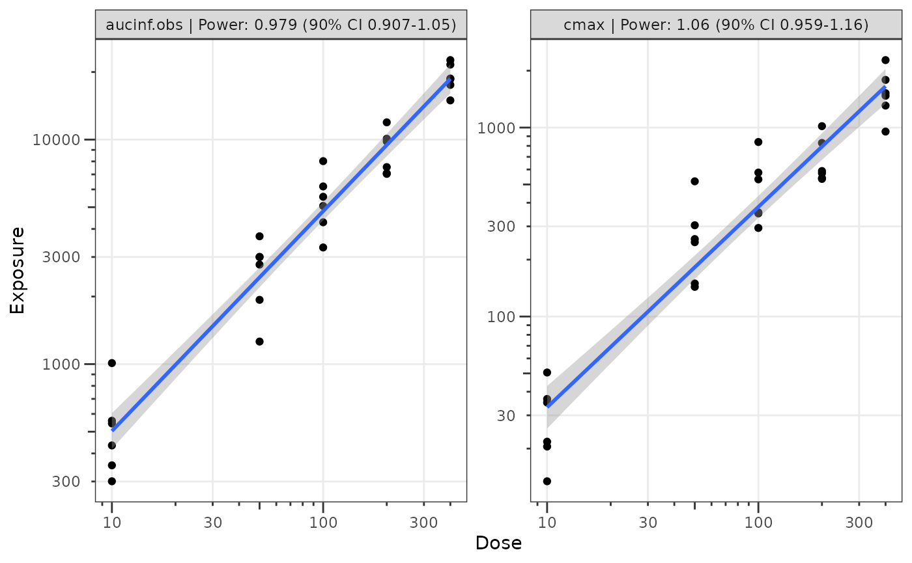
