# Getting Started with pmxhelpr

This vignette is a lean tour of every core `pmxhelpr` workflow in a
single sitting. Each section ends with a link to the corresponding
deep-dive article on the [pmxhelpr
website](https://ryancrass.github.io/pmxhelpr/) for users who want more
depth.

Exported functions follow a `ReturnType_Purpose` naming convention:

- `plot_*` — returns a `ggplot` object
- `df_*` — returns a `data.frame` (often class-tagged)
- `var_*` — returns a vector (vectorized helpers for use inside
  [`mutate()`](https://dplyr.tidyverse.org/reference/mutate.html))
- `pmx_*` — returns a theme element constructor

The bundled datasets `data_sad` and `data_sad_pkfit` use `ODV` (original
DV). Examples below pass `dv_var = "ODV"` or `dv_var = ODV` to highlight
the non-standard evaluation (NSE) of dataset column name variables which
may be specified as strings or bare names to override defaults in
`pmxhelpr` functions.

``` r

options(scipen = 999, rmarkdown.html_vignette.check_title = FALSE)
library(pmxhelpr)
library(dplyr, warn.conflicts = FALSE)
library(forcats, warn.conflicts = FALSE)
library(ggplot2, warn.conflicts = FALSE)
library(patchwork, warn.conflicts = FALSE)
library(mrgsolve, warn.conflicts = FALSE)
```

## Data

### `data_sad`

`data_sad` is a NLME modeling analysis-ready dataset for single
ascending dose (SAD) study with a parallel food-effect (FE) cohort. It
contains one oral dose input (`EVID=1`, `CMT=1`) and two observation
types (`EVID=0`):

- Drug concentration in `CMT=2` (original units: ng/mL)
- Response in `CMT=3` (original units: percentage of baseline)

``` r

glimpse(data_sad)
#> Rows: 1,404
#> Columns: 25
#> $ ID      <dbl> 1, 1, 1, 1, 1, 1, 1, 1, 1, 1, 1, 1, 1, 1, 1, 1, 1, 1, 1, 1, 1,…
#> $ TIME    <dbl> 0.00, 0.00, 0.00, 0.48, 0.48, 0.81, 0.81, 1.49, 1.49, 2.11, 2.…
#> $ NTIME   <dbl> 0.0, 0.0, 0.0, 0.5, 0.5, 1.0, 1.0, 1.5, 1.5, 2.0, 2.0, 3.0, 3.…
#> $ NDAY    <dbl> 1, 1, 1, 1, 1, 1, 1, 1, 1, 1, 1, 1, 1, 1, 1, 1, 1, 1, 1, 1, 1,…
#> $ DOSE    <dbl> 10, 10, 10, 10, 10, 10, 10, 10, 10, 10, 10, 10, 10, 10, 10, 10…
#> $ AMT     <dbl> 10, NA, NA, NA, NA, NA, NA, NA, NA, NA, NA, NA, NA, NA, NA, NA…
#> $ EVID    <dbl> 1, 0, 0, 0, 0, 0, 0, 0, 0, 0, 0, 0, 0, 0, 0, 0, 0, 0, 0, 0, 0,…
#> $ ODV     <dbl> NA, NA, 100.00000, NA, 99.87700, 2.02000, 99.44932, 4.02000, 9…
#> $ LDV     <dbl> NA, NA, 100.00000, NA, 99.87700, 0.70310, 99.44932, 1.39130, 9…
#> $ CFB     <dbl> NA, NA, 0.0000000, NA, -0.1229974, NA, -0.5506789, NA, -2.3928…
#> $ CONC    <dbl> NA, NA, 0.00, NA, 0.00, NA, 2.02, NA, 4.02, NA, 3.50, NA, 7.18…
#> $ LINE    <dbl> 2, 1, 1, 3, 3, 4, 4, 5, 5, 6, 6, 7, 7, 8, 8, 9, 9, 10, 10, 11,…
#> $ CMT     <dbl> 1, 2, 3, 2, 3, 2, 3, 2, 3, 2, 3, 2, 3, 2, 3, 2, 3, 2, 3, 2, 3,…
#> $ MDV     <dbl> NA, 1, 1, 1, 1, 0, 0, 0, 0, 0, 0, 0, 0, 0, 0, 0, 0, 0, 0, 0, 0…
#> $ BLQ     <dbl> NA, -1, -1, 1, 1, 0, 0, 0, 0, 0, 0, 0, 0, 0, 0, 0, 0, 0, 0, 0,…
#> $ LLOQ    <dbl> NA, 1, 1, 1, 1, 1, 1, 1, 1, 1, 1, 1, 1, 1, 1, 1, 1, 1, 1, 1, 1…
#> $ FOOD    <dbl> 0, 0, 0, 0, 0, 0, 0, 0, 0, 0, 0, 0, 0, 0, 0, 0, 0, 0, 0, 0, 0,…
#> $ SEXF    <dbl> 1, 1, 1, 1, 1, 1, 1, 1, 1, 1, 1, 1, 1, 1, 1, 1, 1, 1, 1, 1, 1,…
#> $ RACE    <dbl> 2, 2, 2, 2, 2, 2, 2, 2, 2, 2, 2, 2, 2, 2, 2, 2, 2, 2, 2, 2, 2,…
#> $ AGEBL   <int> 25, 25, 25, 25, 25, 25, 25, 25, 25, 25, 25, 25, 25, 25, 25, 25…
#> $ WTBL    <dbl> 82.1, 82.1, 82.1, 82.1, 82.1, 82.1, 82.1, 82.1, 82.1, 82.1, 82…
#> $ SCRBL   <dbl> 0.87, 0.87, 0.87, 0.87, 0.87, 0.87, 0.87, 0.87, 0.87, 0.87, 0.…
#> $ CRCLBL  <dbl> 128, 128, 128, 128, 128, 128, 128, 128, 128, 128, 128, 128, 12…
#> $ USUBJID <chr> "STUDYNUM-SITENUM-1", "STUDYNUM-SITENUM-1", "STUDYNUM-SITENUM-…
#> $ PART    <chr> "Part 1-SAD", "Part 1-SAD", "Part 1-SAD", "Part 1-SAD", "Part …
```

The preprocessing step below labels each participant with a dosing
regimen and per-group subject count using
[`var_addn()`](https://ryancrass.github.io/pmxhelpr/reference/var_addn.md).
We will also define separate PK and PD sets for use in downstream
plotting functions.

``` r

data <- data_sad %>%
  mutate(Food = ifelse(FOOD == 1, "Fed", "Fasted"),
         DoseFood = paste(DOSE, "mg x1", Food),
         Regimen = var_addn(DoseFood, ID))
unique(data$Regimen)
#> [1] 10 mg x1 Fasted (n=6)  50 mg x1 Fasted (n=6)  100 mg x1 Fasted (n=6)
#> [4] 100 mg x1 Fed (n=6)    200 mg x1 Fasted (n=6) 400 mg x1 Fasted (n=6)
#> 6 Levels: 10 mg x1 Fasted (n=6) ... 400 mg x1 Fasted (n=6)
```

The resulting factor variable is inspected, and then re-leveled with
[`forcats::fct_relevel()`](https://forcats.tidyverse.org/reference/fct_relevel.html)
to preserve dose order for plotting.

``` r

data <- data %>% 
  mutate(Regimen = fct_relevel(Regimen, "50 mg x1 Fasted (n=6)", after = 1))
unique(data$Regimen)
#> [1] 10 mg x1 Fasted (n=6)  50 mg x1 Fasted (n=6)  100 mg x1 Fasted (n=6)
#> [4] 100 mg x1 Fed (n=6)    200 mg x1 Fasted (n=6) 400 mg x1 Fasted (n=6)
#> 6 Levels: 10 mg x1 Fasted (n=6) ... 400 mg x1 Fasted (n=6)

data_pk <- data %>%
  filter(CMT %in% c(1,2))

data_pd <- data %>% 
  filter(CMT %in% c(1,3))
```

### `data_sad_nca`

`data_sad_nca` contains pharmacokinetic parameters and exposure metrics
from a non-compartmental analysis (NCA) of `data_sad` using the `PKNCA`
package.

We will filter to Part 1 fasted conditions only for use in
dose-proportionality assessment.

``` r

glimpse(data_sad_nca)
#> Rows: 648
#> Columns: 11
#> $ ID         <dbl> 1, 1, 1, 1, 1, 1, 1, 1, 1, 1, 1, 1, 1, 1, 1, 1, 1, 1, 2, 2,…
#> $ DOSE       <dbl> 10, 10, 10, 10, 10, 10, 10, 10, 10, 10, 10, 10, 10, 10, 10,…
#> $ PART       <chr> "Part 1-SAD", "Part 1-SAD", "Part 1-SAD", "Part 1-SAD", "Pa…
#> $ start      <dbl> 0, 0, 0, 0, 0, 0, 0, 0, 0, 0, 0, 0, 0, 0, 0, 0, 0, 0, 0, 0,…
#> $ end        <dbl> Inf, Inf, Inf, Inf, Inf, Inf, Inf, Inf, Inf, Inf, Inf, Inf,…
#> $ PPTESTCD   <chr> "auclast", "cmax", "tmax", "tlast", "clast.obs", "lambda.z"…
#> $ PPORRES    <dbl> 277.7701457207, 13.4300000000, 7.8100000000, 35.9500000000,…
#> $ exclude    <chr> NA, NA, NA, NA, NA, NA, NA, NA, NA, NA, NA, NA, NA, NA, NA,…
#> $ units_dose <chr> "mg", "mg", "mg", "mg", "mg", "mg", "mg", "mg", "mg", "mg",…
#> $ units_conc <chr> "ng/mL", "ng/mL", "ng/mL", "ng/mL", "ng/mL", "ng/mL", "ng/m…
#> $ units_time <chr> "hours", "hours", "hours", "hours", "hours", "hours", "hour…
data_nca_part1 <- filter(data_sad_nca, PART == "Part 1-SAD")
```

### `data_sad_pkfit`

`data_sad_pkfit` is a model output dataset version of `data_sad` (`CMT`
1 and 2) with two additional variables (`PRED` and `IPRED`) appended to
the `data_sad`.

These variables are derived from the internal PK model `pkmodel`.

``` r

pkmodel <- model_mread_load("pkmodel")
see(pkmodel)
#> 
#> Model file:  pkmodel.cpp 
#> $PARAM
#> TVCL = 20
#> TVVC = 35.7
#> TVKA = 0.3
#> TVQ = 25
#> TVVP = 150
#> DOSE_F1 = 0.33
#> 
#> WT_CL = 0.75
#> WT_VC = 1.00
#> WT_Q = 0.75
#> WT_VP = 1.00
#> FOOD_KA = -0.5
#> FOOD_F1 = 1.33
#> 
#> WT = 70
#> DOSE = 100
#> FOOD = 0
#> 
#> $CMT GUT CENT PERIPH TRANS1 TRANS2
#> 
#> $MAIN
#> double CL = TVCL*pow(WT/70,WT_CL)*exp(ETA_CL);
#> double VC  = TVVC*pow(WT/70, WT_VC)*exp(ETA_VC);
#> double Q = TVCL*pow(WT/70,WT_Q)*exp(ETA_Q);
#> double VP  = TVVP*pow(WT/70, WT_VP)*exp(ETA_VP);
#> double KA = TVKA*(1+FOOD_KA*FOOD)*exp(ETA_KA);
#> double F1 = 1*(1+FOOD_F1*FOOD)*pow(DOSE/100,DOSE_F1);
#> 
#> F_GUT = F1;
#> 
#> $ODE
#> dxdt_GUT = -KA*GUT;
#> dxdt_CENT = KA*TRANS1 - (CL/VC)*CENT + (Q/VP)*PERIPH - (Q/VC)*CENT;
#> dxdt_PERIPH = (Q/VC)*CENT - (Q/VP)*PERIPH;
#> dxdt_TRANS1 = KA*GUT - KA*TRANS1;
#> dxdt_TRANS2 = KA*TRANS1 - KA*TRANS2;
#> 
#> $OMEGA @labels ETA_CL ETA_VC ETA_KA ETA_Q ETA_VP
#> 0.075 0.1 0.2 0 0
#> 
#> $SIGMA @labels PROP
#> 0.09
#> 
#> $TABLE
#> capture IPRED = CENT/(VC/1000);
#> capture DV = IPRED*(1+PROP);
#> capture Y = DV;
```

We will process this dataset in a manner analogous to `data_sad` for
plotting, but adding subject counts to a derived dosing regimen
variable.

``` r

data_gof <- data_sad_pkfit %>%
  mutate(Food = ifelse(FOOD == 1, "Fed", "Fasted"),
         DoseFood = paste(DOSE, "mg x1", Food),
         Regimen = var_addn(DoseFood, ID)) %>%
  mutate(Regimen = fct_relevel(Regimen, "50 mg x1 Fasted (n=6)", after = 1))
```

## Longitudinal concentration and response with `plot_dvtime()`

[`plot_dvtime()`](https://ryancrass.github.io/pmxhelpr/reference/plot_dvtime.md)
produces a longitudinal observed-versus-time plot with central-tendency
overlays, which can be used for any longitudinal repeated measures
continuous variable, including both concentration `CMT = 2`) and
response (`CMT = 3`).

``` r

pk_plot <- plot_dvtime(
  data = data_pk,
  dv_var = ODV,
  cent = "mean_sdl",
  col_var = Regimen,
  log_y = TRUE,
  theme = plot_dvtime_theme(obs_point = pmx_point(alpha = 0))
) +
  labs(y = "Concentration (ng/mL)", x = "Time (hours)")
pk_plot
```

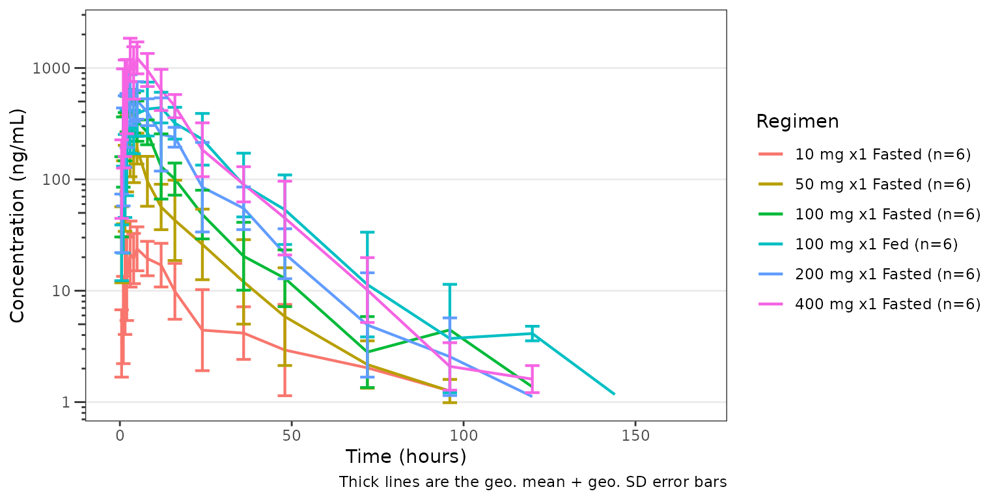

``` r

pd_plot <- plot_dvtime(
  data = data_pd,
  dv_var = "CFB",
  cent = "mean_sdl",
  col_var = Regimen,
  theme = plot_dvtime_theme(obs_point = pmx_point(alpha = 0))
) +
  labs(y = "Response (% Change from Baseline)", x = "Time (hours)")
pd_plot
```

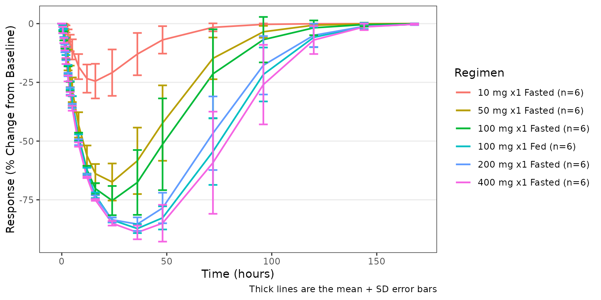

The two plots can be composed into a single paneled figure using the
`patchwork` package, aligned vertically with the shared time axis.

``` r

(pk_plot / pd_plot) + plot_layout(guides = "collect")
```

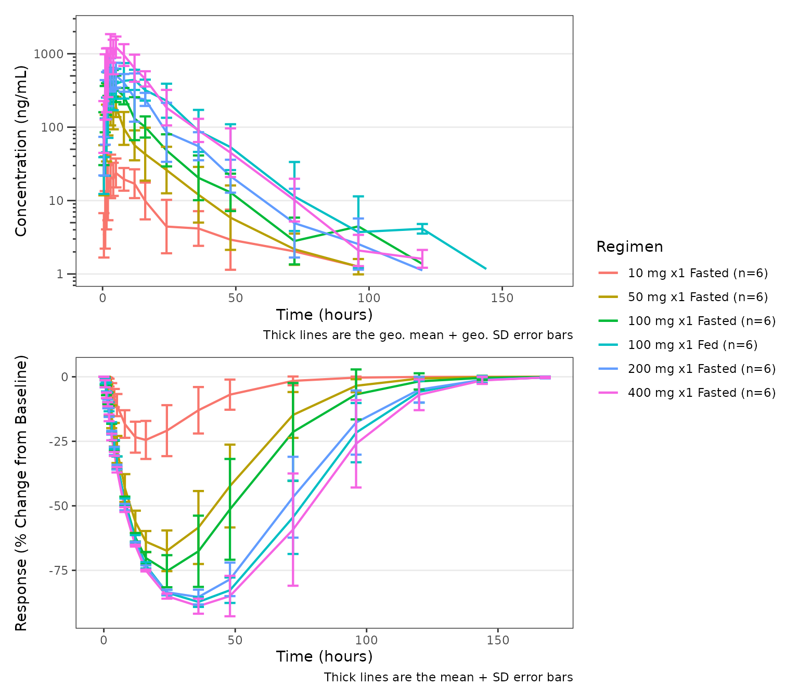

See the [Exploratory Analyses of PK and PK/PD
Data](https://ryancrass.github.io/pmxhelpr/articles/eda-pk-pkpd-workflow.md)
article for central tendency controls, BLQ imputation options,
dose-normalization, and other visual controls.

## Response versus concentration with `plot_dvconc()`

[`plot_dvconc()`](https://ryancrass.github.io/pmxhelpr/reference/plot_dvconc.md)
plots a dependent variable against a continuous independent variable.
The most common use case is visualizing a biomarker value or change
metric of response against drug concentration. Trend line options
include both linear (`linear`/`se_linear`) and non-linear
(`loess`/`se_loess`) logical toggles to control the central tendency
layer displayed.

A dashed black reference line is drawn at `y = ref` when `ref` is
specified.

``` r

plot_dvconc(
  data = filter(data, CMT == 3),
  dv_var = CFB,
  idv_var = CONC,
  ref = 0,
  col_var = Regimen,
  loess = TRUE,
  linear = TRUE
) +
  labs(y = "Response (% Change from Baseline)", x = "Concentration (ng/mL)")
```

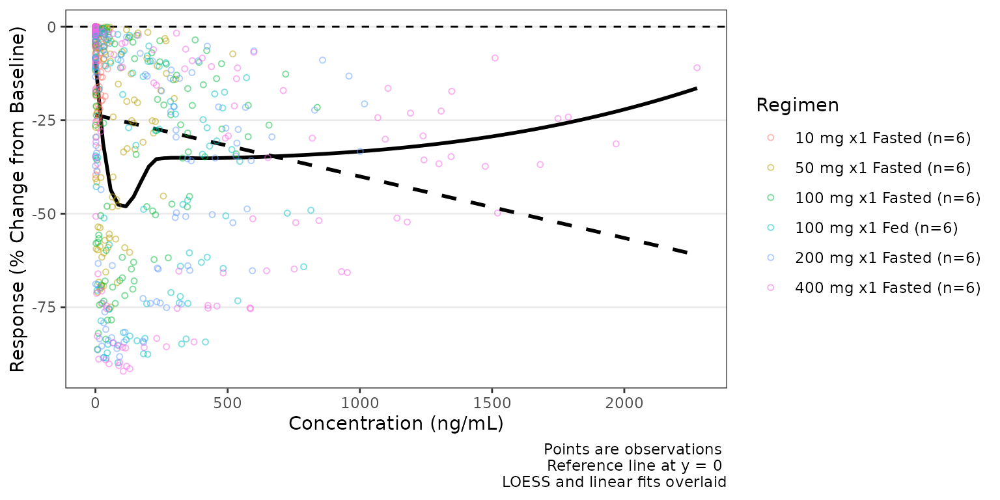

By default the trend lines are not grouped by the variable passed to
`col_var`; however, this can be toggled on by `col_trend=TRUE`.

``` r

plot_dvconc(
  data = filter(data, CMT == 3),
  dv_var = CFB,
  idv_var = CONC,
  ref = 0,
  col_var = Regimen,
  loess = TRUE,
  se_loess = TRUE,
  linear = FALSE,
  col_trend = TRUE
) +
  labs(y = "Response (% Change from Baseline)", x = "Concentration (ng/mL)")
```

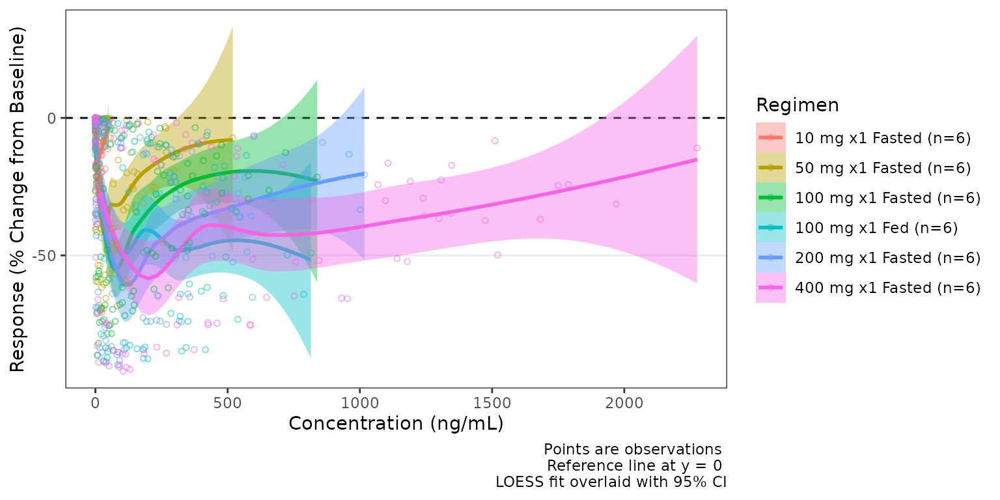

See the [Exploratory Analyses of PK and PK/PD
Data](https://ryancrass.github.io/pmxhelpr/articles/eda-pk-pkpd-workflow.md)
article for theme customization and other trend customization options.

## Dose-proportionality with `df_doseprop()` and `plot_doseprop()`

[`df_doseprop()`](https://ryancrass.github.io/pmxhelpr/reference/df_doseprop.md)
fits a log-log regression of exposure metrics (e.g., Cmax and AUC)
versus dose and returns a class-tagged `doseprop_stats` data frame.

``` r

tab <- df_doseprop(data_nca_part1, metrics = c("aucinf.obs", "cmax"))
tab
#> <doseprop_stats>
#>   stats: 2 rows x 10 columns
#>   obs:   60 rows
#>   config: metric_name_var = PPTESTCD, metric_value_var = PPORRES, dose_var = DOSE, ci = 0.9, method = normal
#> 
#>   stats body:
#>   Intercept StandardError  CI Power   LCL  UCL Proportional
#> 1      3.97        0.0438 90% 0.979 0.907 1.05         TRUE
#> 2      1.06        0.0616 90% 1.060 0.959 1.16         TRUE
#>                            PowerCI    Interpretation   PPTESTCD
#> 1 Power: 0.979 (90% CI 0.907-1.05) Dose-proportional aucinf.obs
#> 2  Power: 1.06 (90% CI 0.959-1.16) Dose-proportional       cmax
#> 
#>   Use `x$obs` for the observation overlay.
```

[`plot_doseprop()`](https://ryancrass.github.io/pmxhelpr/reference/plot_doseprop.md)
can directly process an NCA input dataset (1-stage) or accept a
previously processed `doseprop_stats` object (2-stage)

1.  One-stage: raw NCA `data.frame` input
    ([`df_doseprop()`](https://ryancrass.github.io/pmxhelpr/reference/df_doseprop.md)
    called internally)

``` r

plot_doseprop(data_nca_part1, metrics = c("aucinf.obs", "cmax"))
```

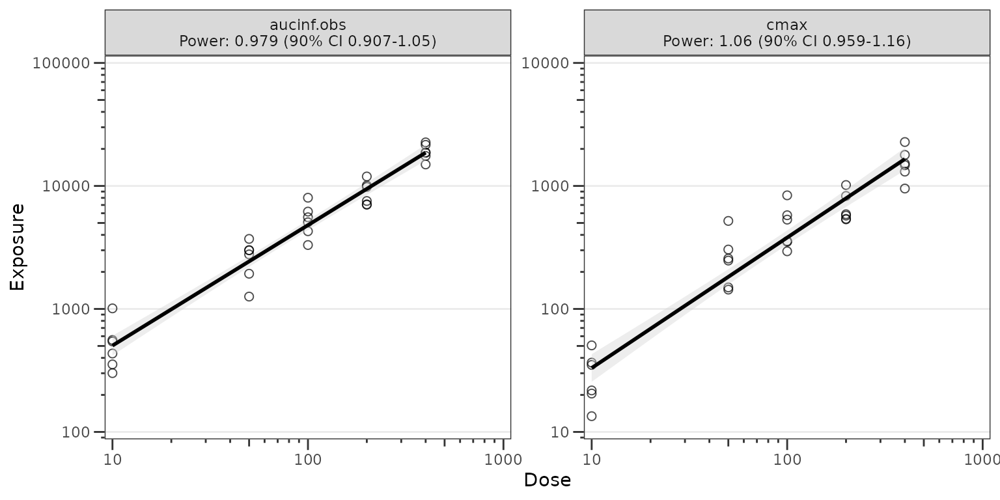

2.  Two-stage: a `doseprop_stats` object (computed separately with
    [`df_doseprop()`](https://ryancrass.github.io/pmxhelpr/reference/df_doseprop.md)

``` r

plot_doseprop(tab)
```


See the [Dose-Proportionality
Workflow](https://ryancrass.github.io/pmxhelpr/articles/doseprop-workflow.md)
article for confidence-interval interpretation, multi-metric layouts,
and theme customization.

## Model diagnostics with `plot_gof()`

[`plot_gof()`](https://ryancrass.github.io/pmxhelpr/reference/plot_gof.md)
produces a population overlay goodness-of-fit (GOF) plot depicting
binned central tendency layers of observed values (`dv`), individual
predictions (`ipred`), and population predictions (`pred`) over time
along with underlying observed data scatter layer (`obs`).

In most cases, these plots will be drawn using model output tables
directly from estimation engines (e.g., NONMEM), which will only include
predictions at timepoints non-missing and included in parameter
estimation (e.g., MDV=0). Our input dataset `data_gof` (derived from
`data_sad_pkfit`) includes model predictions from `mrgsim` at all
timepoints; therefore, we will filter on input to mimic this common
scenario.

``` r

plot_gof(data = filter(data_gof, MDV == 0), dv_var = ODV, log_y = TRUE) +
  facet_wrap(~Regimen) +
  scale_x_continuous(limits = c(0, 168), breaks = c(0, 24, 72, 120, 168))+
  labs(y = "Concentration (ng/mL)", x = "Time (hours)")
```

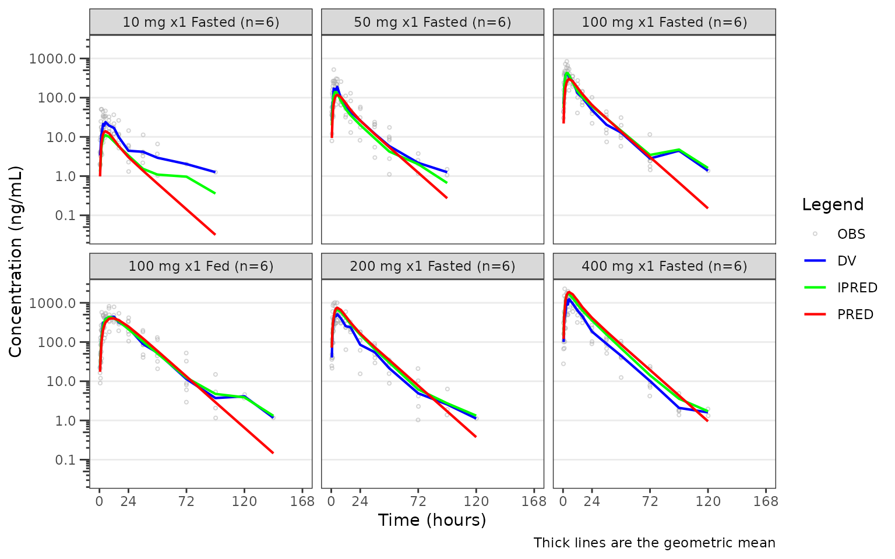

See the [Goodness-of-Fit
Diagnostics](https://ryancrass.github.io/pmxhelpr/articles/gof-diagnostics.md)
article for specifying central tendency, BLQ handling, and theme
customization.

## VPC model evaluation with `plot_vpc_cont()` and `plot_vpc_cens()`

The VPC process has been fully built as a workflow within `pmxhelpr`,
starting from the a fitted model that has been translated to an
`mrgsolve` model format (`mrgmod`).

From a validated model file, the VPC pipeline includes: + replication of
the input dataset via simulation with
[`df_mrgsim_replicate()`](https://ryancrass.github.io/pmxhelpr/reference/df_mrgsim_replicate.md) +
derivation of within and across trial replicate summary statistics with
`df_vpcstats` + plot building with
[`plot_build_vpc()`](https://ryancrass.github.io/pmxhelpr/reference/plot_build_vpc.md)
(both continuous and censored `type` available)

### Run the simulation with `df_mrgsim_replicate()`

[`df_mrgsim_replicate()`](https://ryancrass.github.io/pmxhelpr/reference/df_mrgsim_replicate.md)
is a wrapper function for
[`mrgsim_df()`](https://mrgsolve.org/docs/reference/mrgsim.html), which
uses [`lapply()`](https://rdrr.io/r/base/lapply.html) (or
[`future.apply::future_lapply()`](https://future.apply.futureverse.org/reference/future_lapply.html)
when `parallel = TRUE` and a corresponding
[`future::plan()`](https://future.futureverse.org/reference/plan.html)
in place) to iterate the simulation over integers from 1 to the value
passed to the argument `replicates`.

There are 3 required arguments to
[`df_mrgsim_replicate()`](https://ryancrass.github.io/pmxhelpr/reference/df_mrgsim_replicate.md)

- `data`, a `data.frame` modeling analysis dataset
- `model`, a `mrgmod` model object
- `replicates`, numeric number of replicates to perform.

The are optional arguments specifying key dataset variables to be input
into the simulation or captured in output. These include: - `dv_var` =
DV, dependent variable - `time_var` = TIME, actual time variable -
`ntime_var` = NTIME, nominal time variable - `pred_var` = PRED,
population prediction variable (fixed effects only) - `ipred_var` =
IPRED, individual prediction variable (fixed + level 1 random effects) -
`sim_dv_var` = DV, dependent variable captured in the simulated output
(fixed + level 1 and 2 random effects)

``` r

simout <- df_mrgsim_replicate(
  data = data_pk,
  model = pkmodel,
  replicates = 100,
  dv_var = "ODV",
  sim_dv_var = DV,
  carry_out = c("DOSE", "FOOD", "BLQ", "LLOQ"),
  recover  = c("PART", "Regimen")
) 
glimpse(simout)
#> Rows: 72,000
#> Columns: 23
#> $ ID      <dbl> 1, 1, 1, 1, 1, 1, 1, 1, 1, 1, 1, 1, 1, 1, 1, 1, 1, 1, 1, 1, 2,…
#> $ TIME    <dbl> 0.00, 0.00, 0.48, 0.81, 1.49, 2.11, 3.05, 4.14, 5.14, 7.81, 12…
#> $ NTIME   <dbl> 0.0, 0.0, 0.5, 1.0, 1.5, 2.0, 3.0, 4.0, 5.0, 8.0, 12.0, 16.0, …
#> $ PRED    <dbl> 0.0000000000, 0.0000000000, 1.0373644222, 2.4699025938, 5.8692…
#> $ IPRED   <dbl> 0.00000000000, 0.00000000000, 0.23991271053, 0.58097762508, 1.…
#> $ SIMDV   <dbl> 0.00000000000, 0.00000000000, 0.27955022508, 0.74917139938, 1.…
#> $ OBSDV   <dbl> NA, NA, NA, 2.02, 4.02, 3.50, 7.18, 9.31, 12.46, 13.43, 12.11,…
#> $ EVID    <dbl> 1, 0, 0, 0, 0, 0, 0, 0, 0, 0, 0, 0, 0, 0, 0, 0, 0, 0, 0, 0, 1,…
#> $ CMT     <dbl> 1, 2, 2, 2, 2, 2, 2, 2, 2, 2, 2, 2, 2, 2, 2, 2, 2, 2, 2, 2, 1,…
#> $ MDV     <dbl> NA, 1, 1, 0, 0, 0, 0, 0, 0, 0, 0, 0, 0, 0, 1, 1, 1, 1, 1, 1, N…
#> $ DOSE    <dbl> 10, 10, 10, 10, 10, 10, 10, 10, 10, 10, 10, 10, 10, 10, 10, 10…
#> $ FOOD    <dbl> 0, 0, 0, 0, 0, 0, 0, 0, 0, 0, 0, 0, 0, 0, 0, 0, 0, 0, 0, 0, 0,…
#> $ BLQ     <dbl> NA, -1, 1, 0, 0, 0, 0, 0, 0, 0, 0, 0, 0, 0, 1, 1, 1, 1, 1, 1, …
#> $ LLOQ    <dbl> NA, 1, 1, 1, 1, 1, 1, 1, 1, 1, 1, 1, 1, 1, 1, 1, 1, 1, 1, 1, N…
#> $ GUT     <dbl> 4.67735141287198175, 4.67735141287198175, 4.34652773939926984,…
#> $ CENT    <dbl> 0.000000000000, 0.000000000000, 0.009786371098, 0.023698880423…
#> $ PERIPH  <dbl> 0.00000000000, 0.00000000000, 0.00080390625, 0.00337854545, 0.…
#> $ TRANS1  <dbl> 0.0000000000000000, 0.0000000000000000, 0.3188382667608536, 0.…
#> $ TRANS2  <dbl> 0.00000000000000, 0.00000000000000, 0.01169414527583, 0.031663…
#> $ Y       <dbl> 0.00000000000, 0.00000000000, 0.27955022508, 0.74917139938, 1.…
#> $ PART    <chr> "Part 1-SAD", "Part 1-SAD", "Part 1-SAD", "Part 1-SAD", "Part …
#> $ Regimen <fct> 10 mg x1 Fasted (n=6), 10 mg x1 Fasted (n=6), 10 mg x1 Fasted …
#> $ SIM     <int> 1, 1, 1, 1, 1, 1, 1, 1, 1, 1, 1, 1, 1, 1, 1, 1, 1, 1, 1, 1, 1,…
```

### Calculate summary statistics with `df_vpcstats()`

`df_vpcstats` performs the input data validation and summary statistic
calculations for the VPC, returning a `pmx_stats`, `vpc_stats` S3
container including `$stats` (`data.frame` of summary statistics),
`$obs` observed data for scatter plot overlay, `$config` configuration
information (e.g., replicates, loq, stratifying variable).

`vpc_stats` objects contain both standard, prediction-correction, and
proportion BLQ statistics and may be passed directly to
[`plot_vpc_cont()`](https://ryancrass.github.io/pmxhelpr/reference/plot_vpc_cont.md)
or
[`plot_vpc_cens()`](https://ryancrass.github.io/pmxhelpr/reference/plot_vpc_cens.md)
following a 2-stage workflow. Both plotting functions can also take in
the raw simulated output and call
[`df_vpcstats()`](https://ryancrass.github.io/pmxhelpr/reference/df_vpcstats.md)
internally for a one-stage workflow; however, the summary calculation
computation cost is paid in every plot.

``` r

vpcstats_obj_part <- df_vpcstats(simout, strat_var = PART)
#> Inheriting per-row `loq` from `LLOQ` column in `data`.
vpcstats_obj_regimen <- df_vpcstats(simout, strat_var = Regimen)
#> Inheriting per-row `loq` from `LLOQ` column in `data`.

vpcstats_obj_part
#> <vpc_stats>
#>   stats: 38 rows x 35 columns
#>   obs:   515 rows
#>   config: n_replicates = 100, loq = 1, strat_var = PART
#>   column groups (stats):
#>     identifiers  : BIN_MID, PART
#>     counts       : obs_n, obs_n_blq, obs_prop_blq
#>     sim BLQ      : sim_prop_blq_low, sim_prop_blq_med, sim_prop_blq_hi  [std-only]
#>     std observed : obs_low, obs_med, obs_hi
#>     std simulated: sim_low_low, sim_low_med, sim_low_hi, sim_med_low, sim_med_med, sim_med_hi, sim_hi_low, sim_hi_med, sim_hi_hi
#>     pc observed  : pc_obs_low, pc_obs_med, pc_obs_hi
#>     pc simulated : pc_sim_low_low, pc_sim_low_med, pc_sim_low_hi, pc_sim_med_low, pc_sim_med_med, pc_sim_med_hi, pc_sim_hi_low, pc_sim_hi_med, pc_sim_hi_hi
#>     metadata     : ci, pi_low, pi_hi
#> 
#>   head(stats, 3):
#> # A tibble: 3 × 35
#>   BIN_MID PART    obs_n obs_n_blq obs_prop_blq sim_prop_blq_low sim_prop_blq_med
#>     <dbl> <chr>   <int>     <int>        <dbl>            <dbl>            <dbl>
#> 1     0   Part 1…    30        30       1                1                 1    
#> 2     0   Part 2…     6         6       1                1                 1    
#> 3     0.5 Part 1…    30         2       0.0667           0.0667            0.133
#> # ℹ 28 more variables: sim_prop_blq_hi <dbl>, obs_low <dbl>, obs_med <dbl>,
#> #   obs_hi <dbl>, sim_low_low <dbl>, sim_low_med <dbl>, sim_low_hi <dbl>,
#> #   sim_med_low <dbl>, sim_med_med <dbl>, sim_med_hi <dbl>, sim_hi_low <dbl>,
#> #   sim_hi_med <dbl>, sim_hi_hi <dbl>, pc_obs_low <dbl>, pc_obs_med <dbl>,
#> #   pc_obs_hi <dbl>, pc_sim_low_low <dbl>, pc_sim_low_med <dbl>,
#> #   pc_sim_low_hi <dbl>, pc_sim_med_low <dbl>, pc_sim_med_med <dbl>,
#> #   pc_sim_med_hi <dbl>, pc_sim_hi_low <dbl>, pc_sim_hi_med <dbl>, …
#> 
#>   Use `x$stats` and `x$obs` for the underlying data.frames.
```

### Plotting the continuous data range with `plot_vpc_cont`

[`plot_vpc_cont()`](https://ryancrass.github.io/pmxhelpr/reference/plot_vpc_cont.md)
builds standard or prediction-corrected VPCs of the continuous,
quantifiable range above the LLOQ.

The example below is a standard (non-prediction-corrected) VPC
stratified by `Regimen`.

``` r

vpc_regimen <- plot_vpc_cont(
  data = simout,
  strat_var = Regimen
) +
  scale_x_continuous(breaks = seq(0, 168, 24)) +
  scale_y_log10(guide = "axis_logticks") +
  labs(x = "Time (hours)", y = "Concentration (ng/mL)")
vpc_regimen
```

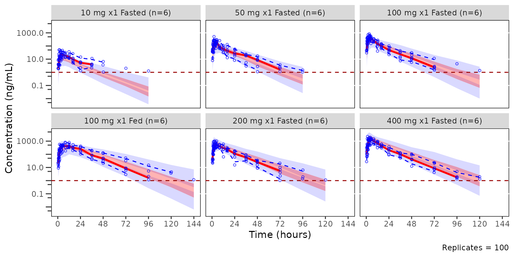

The example below is a pcVPC stratified by PART.

``` r

pcvpc_part <- plot_vpc_cont(
  data = simout,
  strat_var = PART,
  pcvpc = TRUE
) +
  scale_x_continuous(breaks = seq(0, 168, 24)) +
  scale_y_log10(guide = "axis_logticks") +
  labs(x = "Time (hours)", y = "Pred-corrected Conc. (ng/mL)")
pcvpc_part
```

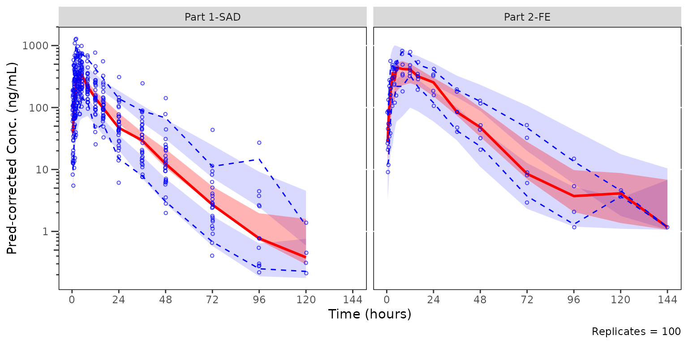 \##
Plotting the censored data range with `plot_vpc_cens`

[`plot_vpc_cens()`](https://ryancrass.github.io/pmxhelpr/reference/plot_vpc_cens.md)
is the companion diagnostic for the censored portion of the range — the
per-bin BLQ proportion. It mirrors
[`plot_vpc_cont()`](https://ryancrass.github.io/pmxhelpr/reference/plot_vpc_cont.md)
but plots `obs_prop_blq` and the empirical confidence band of
`sim_prop_blq` across replicates, and requires a LOQ source.

The most relevant censored VPC is that stratified by dose and food
status, which are combined in the `Regimen` variable.

``` r

cens_vpc_regimen <- plot_vpc_cens(
  data = simout,
  strat_var = Regimen,
  loq = 1
) +
  scale_x_continuous(breaks = seq(0, 168, 24)) +
  labs(x = "Time (hours)", y = "Proportion BLQ")
cens_vpc_regimen
```

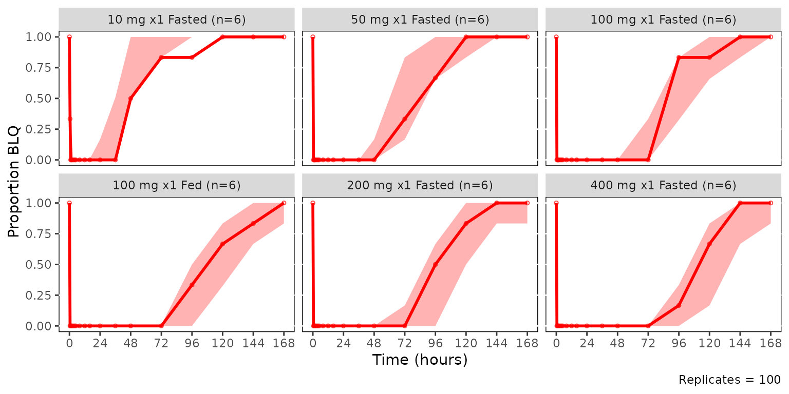

### Adding a panels and legends with `patchwork` and `plot_vpc_legend()`

[`plot_vpc_legend()`](https://ryancrass.github.io/pmxhelpr/reference/plot_vpc_legend.md)
returns a legend that can be patchworked beneath the VPC panel(s). The
four row layout below stacks the continuous and censored VPCs with
legends. The two-stage plot building from `vpc_stats` objects is also
demonstrated, highlighting the potential efficiency of reusing a
precomputed object in such a workflow.

``` r

vpc_plot_cont <- plot_vpc_cont(vpcstats_obj_regimen) + 
  scale_x_continuous(breaks = seq(0, 168, 24)) +
  scale_y_log10(guide = "axis_logticks") +
  labs(x = "Time (hours)", y = "Concentration (ng/mL)")
vpc_plot_cens <- plot_vpc_cens(vpcstats_obj_regimen) +
  scale_x_continuous(breaks = seq(0, 168, 24)) +
  labs(x = "Time (hours)", y = "Proportion BLQ")
cont_legend <- plot_vpc_legend()
cens_legend <- plot_vpc_legend(type = "cens", shown = plot_vpc_shown(obs_point = FALSE))
vpc_plot_cont / cont_legend / vpc_plot_cens / cens_legend + 
  plot_layout(heights = c(2, 0.5, 1, 0.5))
```

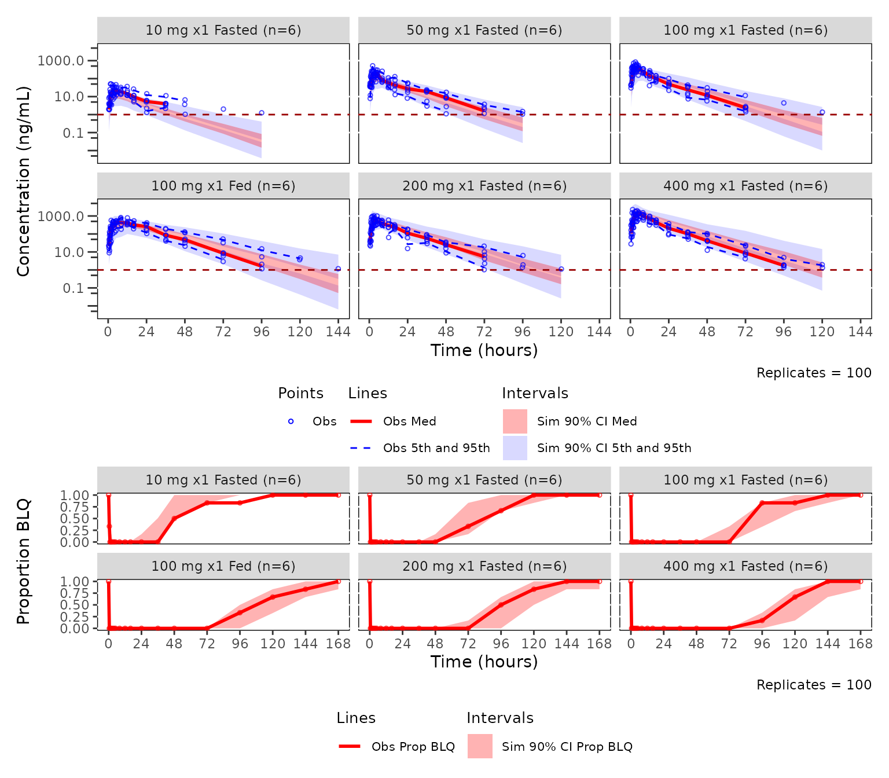

See the [Visual Predictive Check
Workflow](https://ryancrass.github.io/pmxhelpr/articles/vpc-workflow.md)
article for stratification controls, BLQ handling options, multi-LLOQ
pooling, `shown`/`theme` customization, and pairing pcVPC with cens VPC.

## Theme system overview

Every `plot_*()` function has a paired `plot_*_theme()` factory that
returns a named list of default element keys that follow a
`datalayer_geom` pattern. Elements are built with typed constructors
([`pmx_point()`](https://ryancrass.github.io/pmxhelpr/reference/pmx_point.md),
[`pmx_line()`](https://ryancrass.github.io/pmxhelpr/reference/pmx_line.md),
[`pmx_ribbon()`](https://ryancrass.github.io/pmxhelpr/reference/pmx_ribbon.md),
[`pmx_trend()`](https://ryancrass.github.io/pmxhelpr/reference/pmx_trend.md),
[`pmx_errorbar()`](https://ryancrass.github.io/pmxhelpr/reference/pmx_errorbar.md),
[`pmx_style()`](https://ryancrass.github.io/pmxhelpr/reference/pmx_style.md),
[`pmx_color()`](https://ryancrass.github.io/pmxhelpr/reference/pmx_color.md))
and passed to keys within the factory function. The factory functions
merges user-supplied overrides and override only the values passed
leaves the rest at their default values.

``` r

plot_dvtime_theme()
#> <plot_dvtime_theme>
#>   obs_point     <pmx_point>: shape = 1, size = 0.75, alpha = 0.5
#>   obs_line      <pmx_line>: linewidth = 0.5, linetype = 1, alpha = 0.5
#>   cent_point    <pmx_point>: shape = 16, size = 1.25, alpha = 0
#>   cent_line     <pmx_line>: linewidth = 0.75, linetype = 1, alpha = 1
#>   cent_errorbar <pmx_errorbar>: linewidth = 0.75, linetype = 1, alpha = 1, width = NULL
#>   ref_line      <pmx_line>: linewidth = 0.5, linetype = 2, alpha = 1
#>   loq_line      <pmx_line>: linewidth = 0.5, linetype = 2, alpha = 1

new_dvtime_theme <- plot_dvtime_theme(
    obs_point = pmx_point(alpha = 0),
    cent_line = pmx_line(linewidth = 1.5),
    cent_errorbar = pmx_errorbar(linewidth = 1.5)
  )
```

``` r

plot_dvtime(
  data = data_pk,
  dv_var = ODV,
  cent = "mean_sdl",
  col_var = "Regimen",
  log_y = TRUE,
  theme = new_dvtime_theme
) +
  labs(y = "Concentration (ng/mL)", x = "Time (hours)")
```

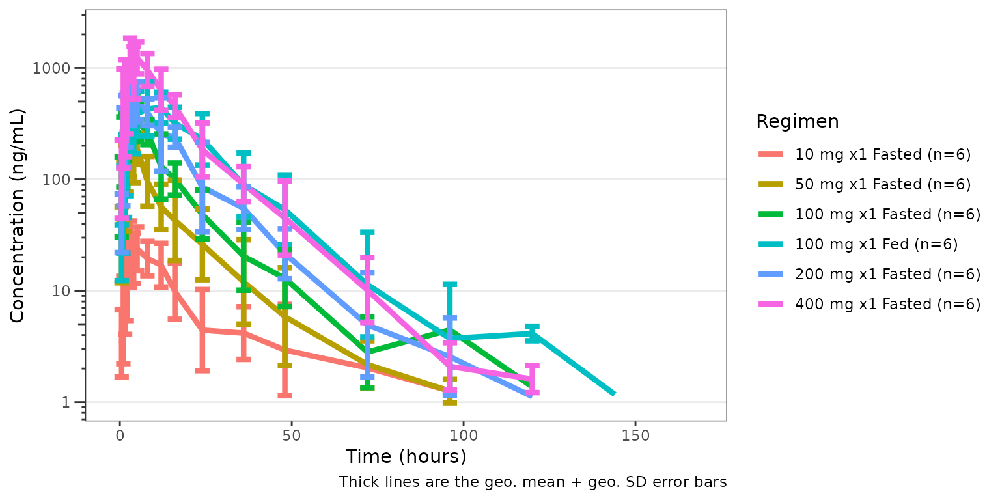

See the [Plot Themes and
Aesthetics](https://ryancrass.github.io/pmxhelpr/articles/plot-themes.md)
article for the full theme catalog, element-constructor reference, and
the class system that backs them.

## Where to go next

- [Exploratory Analyses of PK and PK/PD
  Data](https://ryancrass.github.io/pmxhelpr/articles/eda-pk-pkpd-workflow.md)
- [Dose-Proportionality
  Workflow](https://ryancrass.github.io/pmxhelpr/articles/doseprop-workflow.md)
- [Goodness-of-Fit
  Diagnostics](https://ryancrass.github.io/pmxhelpr/articles/gof-diagnostics.md)
- [Visual Predictive Check
  Workflow](https://ryancrass.github.io/pmxhelpr/articles/vpc-workflow.md)
- [Plot Themes and
  Aesthetics](https://ryancrass.github.io/pmxhelpr/articles/plot-themes.md)
