# Standard Overlay Goodness-of-Fit Diagnostics

This vignette will demonstrate `pmxhelpr` functions for generating
standard overlay goodness-of-fit model diagnostics for evaluation of
longitudinal non-linear mixed effects model fit.

This vignette will assume familiarity with the `data_sad` internal
dataset and the
[`plot_dvtime()`](https://ryancrass.github.io/pmxhelpr/reference/plot_dvtime.md)
function, as described in the [Exploratory Analyses of PK and PK/PD
Data](https://ryancrass.github.io/pmxhelpr/articles/eda-pk-pkpd-workflow.md)
vignette. These elements will not be reviewed in detail in this
vignette.

``` r

options(scipen = 999, rmarkdown.html_vignette.check_title = FALSE)
library(pmxhelpr)
library(dplyr, warn.conflicts =  FALSE)
library(ggplot2, warn.conflicts =  FALSE)
library(Hmisc, warn.conflicts = FALSE)
library(patchwork, warn.conflicts = FALSE)
```

## Data

The example dataset used in this vignette (`data_sad`) is based on a
single ascending dose (SAD) study of an orally administered drug product
with a parallel group food effect (FE) cohort.

### data_sad_pkfit

`data_sad_pkfit` is a model output dataset version of `data_sad`
containing model predictions from `pkmodel` appended to the observed
data. We can take a quick look at the dataset using
[`glimpse()`](https://pillar.r-lib.org/reference/glimpse.html) from the
dplyr package. Dataset definitions can also be viewed by calling
[`?data_sad_pkfit`](https://ryancrass.github.io/pmxhelpr/reference/data_sad_pkfit.md),
as one would to view the documentation for a package function.

``` r

glimpse(data_sad_pkfit)
#> Rows: 720
#> Columns: 25
#> $ LINE    <dbl> 1, 2, 3, 4, 5, 6, 7, 8, 9, 10, 11, 12, 13, 14, 15, 16, 17, 18,…
#> $ ID      <dbl> 1, 1, 1, 1, 1, 1, 1, 1, 1, 1, 1, 1, 1, 1, 1, 1, 1, 1, 1, 1, 2,…
#> $ TIME    <dbl> 0.00, 0.00, 0.48, 0.81, 1.49, 2.11, 3.05, 4.14, 5.14, 7.81, 12…
#> $ NTIME   <dbl> 0.0, 0.0, 0.5, 1.0, 1.5, 2.0, 3.0, 4.0, 5.0, 8.0, 12.0, 16.0, …
#> $ NDAY    <dbl> 1, 1, 1, 1, 1, 1, 1, 1, 1, 1, 1, 1, 2, 2, 3, 4, 5, 6, 7, 8, 1,…
#> $ DOSE    <dbl> 10, 10, 10, 10, 10, 10, 10, 10, 10, 10, 10, 10, 10, 10, 10, 10…
#> $ AMT     <dbl> NA, 10, NA, NA, NA, NA, NA, NA, NA, NA, NA, NA, NA, NA, NA, NA…
#> $ EVID    <dbl> 0, 1, 0, 0, 0, 0, 0, 0, 0, 0, 0, 0, 0, 0, 0, 0, 0, 0, 0, 0, 0,…
#> $ ODV     <dbl> NA, NA, NA, 2.02, 4.02, 3.50, 7.18, 9.31, 12.46, 13.43, 12.11,…
#> $ LDV     <dbl> NA, NA, NA, 0.7031, 1.3913, 1.2528, 1.9713, 2.2311, 2.5225, 2.…
#> $ CMT     <dbl> 2, 1, 2, 2, 2, 2, 2, 2, 2, 2, 2, 2, 2, 2, 2, 2, 2, 2, 2, 2, 2,…
#> $ MDV     <dbl> 1, NA, 1, 0, 0, 0, 0, 0, 0, 0, 0, 0, 0, 0, 1, 1, 1, 1, 1, 1, 1…
#> $ BLQ     <dbl> -1, NA, 1, 0, 0, 0, 0, 0, 0, 0, 0, 0, 0, 0, 1, 1, 1, 1, 1, 1, …
#> $ LLOQ    <dbl> 1, NA, 1, 1, 1, 1, 1, 1, 1, 1, 1, 1, 1, 1, 1, 1, 1, 1, 1, 1, 1…
#> $ FOOD    <dbl> 0, 0, 0, 0, 0, 0, 0, 0, 0, 0, 0, 0, 0, 0, 0, 0, 0, 0, 0, 0, 0,…
#> $ SEXF    <dbl> 1, 1, 1, 1, 1, 1, 1, 1, 1, 1, 1, 1, 1, 1, 1, 1, 1, 1, 1, 1, 1,…
#> $ RACE    <dbl> 2, 2, 2, 2, 2, 2, 2, 2, 2, 2, 2, 2, 2, 2, 2, 2, 2, 2, 2, 2, 1,…
#> $ AGEBL   <int> 25, 25, 25, 25, 25, 25, 25, 25, 25, 25, 25, 25, 25, 25, 25, 25…
#> $ WTBL    <dbl> 82.1, 82.1, 82.1, 82.1, 82.1, 82.1, 82.1, 82.1, 82.1, 82.1, 82…
#> $ SCRBL   <dbl> 0.87, 0.87, 0.87, 0.87, 0.87, 0.87, 0.87, 0.87, 0.87, 0.87, 0.…
#> $ CRCLBL  <dbl> 128, 128, 128, 128, 128, 128, 128, 128, 128, 128, 128, 128, 12…
#> $ USUBJID <chr> "STUDYNUM-SITENUM-1", "STUDYNUM-SITENUM-1", "STUDYNUM-SITENUM-…
#> $ PART    <chr> "Part 1-SAD", "Part 1-SAD", "Part 1-SAD", "Part 1-SAD", "Part …
#> $ IPRED   <dbl> 0.0000000000, 0.0000000000, 0.2399127105, 0.5809776251, 1.4434…
#> $ PRED    <dbl> 0.0000000000, 0.0000000000, 1.0373644222, 2.4699025938, 5.8692…
```

This dataset contains two additional variables representing model
predictions:

- `PRED`: population model predicted values accounting only for fixed
  effects (THETAs)
- `IPRED`: individual model predicted values accounting for fixed
  effects (THETAs) and level 1 (inter-individual) random effects (ETAs)

Let’s derive some additional variables and leverage the functionality of
[`var_addn()`](https://ryancrass.github.io/pmxhelpr/reference/var_addn.md)
to create a new factor variable including a count of unique individuals
in each unique dosing condition for plotting

``` r

plot_data <- data_sad_pkfit %>% 
  filter(EVID == 0) %>% 
  mutate(`Food Status` = ifelse(FOOD == 0, "Fasted", "Fed"), 
         DoseFood = paste(DOSE, "mg", `Food Status`)) %>% 
  mutate(`Food Status` = var_addn(`Food Status`, ID),
         `Dose and Food` = var_addn(DoseFood, ID))
```

## PK Model

An example PK model (`pkmodel`) in `mrgmod` format is provided in the
internal package library. This can be loaded using the helper function
[`model_mread_load()`](https://ryancrass.github.io/pmxhelpr/reference/model_mread_load.md),
which wraps
[`mrgsolve::mread()`](https://mrgsolve.org/docs/reference/mread.html).

``` r

model <- model_mread_load("pkmodel")
#> Building pkmodel_cpp ... done.
```

We can take a look at the model code using
[`mrgsolve::see()`](https://mrgsolve.org/docs/reference/see.html)

``` r

mrgsolve::see(model)
#> 
#> Model file:  pkmodel.cpp 
#> $PARAM
#> TVCL = 20
#> TVVC = 35.7
#> TVKA = 0.3
#> TVQ = 25
#> TVVP = 150
#> DOSE_F1 = 0.33
#> 
#> WT_CL = 0.75
#> WT_VC = 1.00
#> WT_Q = 0.75
#> WT_VP = 1.00
#> FOOD_KA = -0.5
#> FOOD_F1 = 1.33
#> 
#> WT = 70
#> DOSE = 100
#> FOOD = 0
#> 
#> $CMT GUT CENT PERIPH TRANS1 TRANS2
#> 
#> $MAIN
#> double CL = TVCL*pow(WT/70,WT_CL)*exp(ETA_CL);
#> double VC  = TVVC*pow(WT/70, WT_VC)*exp(ETA_VC);
#> double Q = TVCL*pow(WT/70,WT_Q)*exp(ETA_Q);
#> double VP  = TVVP*pow(WT/70, WT_VP)*exp(ETA_VP);
#> double KA = TVKA*(1+FOOD_KA*FOOD)*exp(ETA_KA);
#> double F1 = 1*(1+FOOD_F1*FOOD)*pow(DOSE/100,DOSE_F1);
#> 
#> F_GUT = F1;
#> 
#> $ODE
#> dxdt_GUT = -KA*GUT;
#> dxdt_CENT = KA*TRANS1 - (CL/VC)*CENT + (Q/VP)*PERIPH - (Q/VC)*CENT;
#> dxdt_PERIPH = (Q/VC)*CENT - (Q/VP)*PERIPH;
#> dxdt_TRANS1 = KA*GUT - KA*TRANS1;
#> dxdt_TRANS2 = KA*TRANS1 - KA*TRANS2;
#> 
#> $OMEGA @labels ETA_CL ETA_VC ETA_KA ETA_Q ETA_VP
#> 0.075 0.1 0.2 0 0
#> 
#> $SIGMA @labels PROP
#> 0.09
#> 
#> $TABLE
#> capture IPRED = CENT/(VC/1000);
#> capture DV = IPRED*(1+PROP);
#> capture Y = DV;
```

## Population Overlay Goodness of Fit Plots with `plot_gof()`

### Overview

`pmxhelpr` includes a function for generating overlay goodness-of-fit
(GOF) plots for model evaluation:
[`plot_gof()`](https://ryancrass.github.io/pmxhelpr/reference/plot_gof.md).

### Specifying Dependent and Independent Variables

[`plot_gof()`](https://ryancrass.github.io/pmxhelpr/reference/plot_gof.md)
has 3 arguments that specify the dependent variables to be mapped to the
y-axis (`dv_var`, `ipred_var`, `pred_var`) and 2 arguments for the
independent time variables to be mapped to the x-axis (`time_var`,
`ntime_var`). `ntime_var` is an exact binned version of the x-axis
variable for calculation of central tendency statistics.

The defaults are as follows: - `dv_var` = DV, observed dependent
variable. - `ipred_var` = IPRED, individual predictions. - `pred_var` =
PRED, population predictions. - `time_var` = TIME, actual time
variable - `ntime_var` = NTIME, nominal time variable

These arguments accept non-standard evaluation and may be supplied as
bare names or strings.

The example dataset `data_sad_pkfit` only differs from these defaults in
the variable name for the dependent variable, `"ODV"`. Thus, the most
basic population GOF plot can be obtained with:

``` r

plot_gof(data = plot_data, dv_var = "ODV") + 
  scale_x_continuous(breaks = seq(0, 168, 24)) +
  labs(y = "Concentration (ng/mL)", x = "Time Since First Dose (hours)")
```

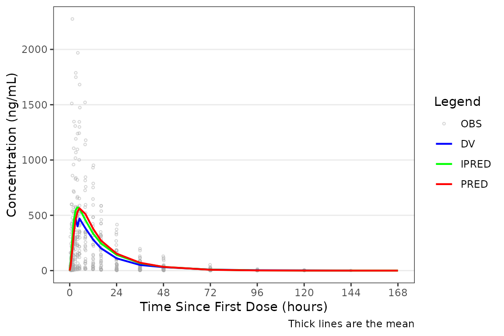

### Applying Dose-normalization

The pooled analysis population includes multiple dose levels in a single
plot, which is probably not optimal as a population PK model diagnostic.
A better minimal plot representation of these data can be obtained by
dose-normalizing and stratifying by study part to separate out the fast
and food effect portions:

``` r

plot_gof(data = plot_data, dv_var = "ODV", dosenorm = TRUE, dose_var = DOSE) +
  scale_x_continuous(breaks = seq(0, 168, 24)) +
  labs(y = "Dose-normalized Conc. (ng/mL/mg)", x = "Time Since First Dose (hours)") +
  facet_wrap(~`Food Status`)
```

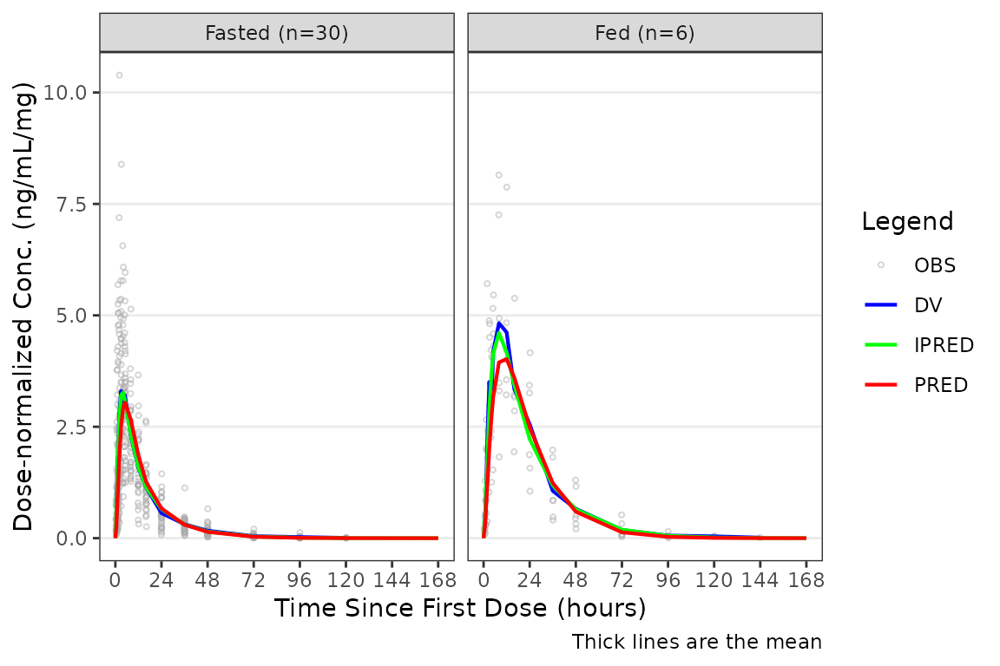

### Facetting by Study Design (Extrinsic) Factors

Although, generally population goodness-of-fit plots are stratified by
study design (extrinsic) factors (e.g., Dose and Food Status) in order
to assess the adequacy of model fit in each unique study condition.

``` r

plot_gof(data = plot_data, dv_var = "ODV") +
  scale_x_continuous(breaks = c(0, 24, 72, 120, 168)) +
  labs(y = "Concentration (ng/mL)", x = "Time Since First Dose (hours)") +
  facet_wrap(~`Dose and Food`, scales = "free")
```

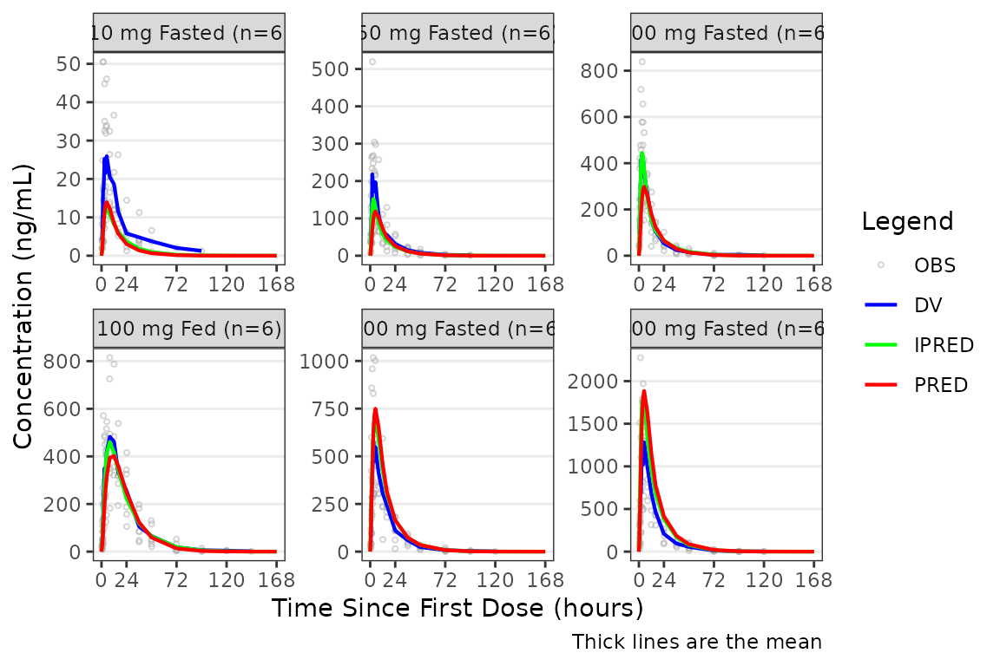

### Controlling Visible Output Variables

The `shown` argument controls which output variables are displayed. The
defaults can be viewed by running
[`plot_gof_shown()`](https://ryancrass.github.io/pmxhelpr/reference/plot_gof_shown.md)
with no arguments:

``` r

plot_gof_shown()
#> $obs
#> [1] TRUE
#> 
#> $dv
#> [1] TRUE
#> 
#> $pred
#> [1] TRUE
#> 
#> $ipred
#> [1] TRUE
```

The components of the list correspond to the following plot elements:

- Observed points/lines: `obs`
- DV central tendency: `dv`
- PRED central tendency: `pred`
- IPRED central tendency: `ipred`

One or more elements to be updated from the defaults above can be passed
via
[`plot_gof_shown()`](https://ryancrass.github.io/pmxhelpr/reference/plot_gof_shown.md)
to the `shown` argument. Any elements not specified will inherit the
defaults.

Some analysts prefer to only overlay the “typical value” in these plots
and exclude IPRED:

``` r

plot_gof(data = plot_data, dv_var = "ODV",
         shown = plot_gof_shown(ipred = FALSE)) +
  scale_x_continuous(breaks = c(0, 24, 72, 120, 168)) +
  labs(y = "Concentration (ng/mL)", x = "Time Since First Dose (hours)") +
  facet_wrap(~`Dose and Food`, scales = "free")
```

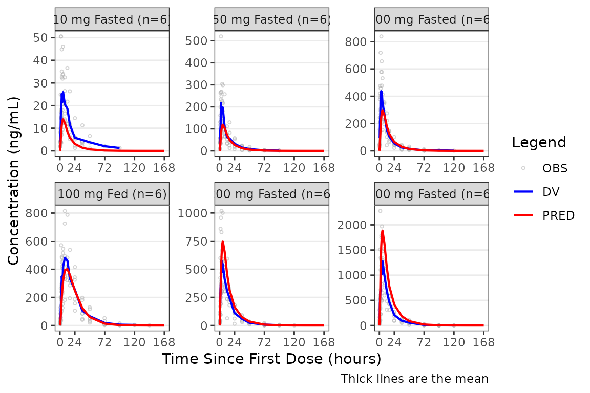

The observed data points can also be removed with `obs = FALSE`. Notice
how different this plot appears when only visualizing central tendency!

``` r

plot_gof(data = plot_data, dv_var = "ODV",
         shown = plot_gof_shown(obs = FALSE)) +
  scale_x_continuous(breaks = c(0, 24, 72, 120, 168)) +
  labs(y = "Concentration (ng/mL)", x = "Time Since First Dose (hours)") +
  facet_wrap(~`Dose and Food`, scales = "free") 
```

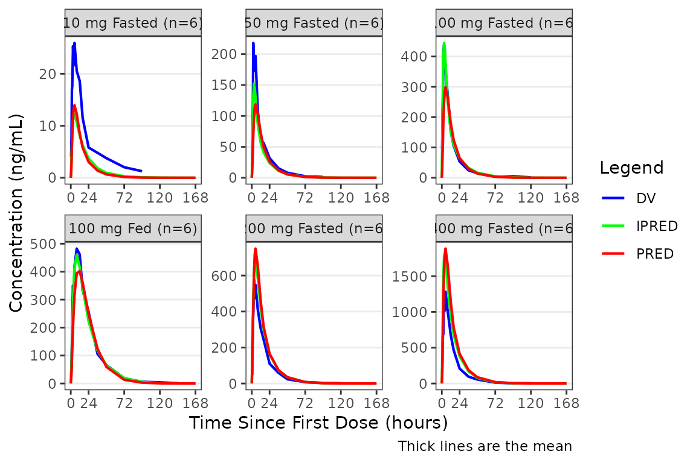
The `shown` object can be stored and reused across multiple
[`plot_gof()`](https://ryancrass.github.io/pmxhelpr/reference/plot_gof.md)
calls to maintain consistent visibility settings throughout a workflow:

``` r

my_shown <- plot_gof_shown(ipred = FALSE)

plot_gof(filter(plot_data, FOOD == 0), dv_var = ODV, shown = my_shown) +
  scale_x_continuous(breaks = c(0, 24, 72, 120, 168)) +
  labs(y = "Concentration (ng/mL)", x = "Time Since First Dose (hours)") + 
  facet_wrap(~`Dose and Food`, scales = "free")  

plot_gof(filter(plot_data, FOOD == 1), dv_var = ODV, shown = my_shown) +
  scale_x_continuous(breaks = c(0, 24, 72, 120, 168)) +
  labs(y = "Concentration (ng/mL)", x = "Time Since First Dose (hours)") + 
  facet_wrap(~`Dose and Food`, scales = "free")
```

### Specifying the Central Tendency

[`plot_gof()`](https://ryancrass.github.io/pmxhelpr/reference/plot_gof.md)
inherits its central tendency handling functionality from
[`plot_dvtime()`](https://ryancrass.github.io/pmxhelpr/reference/plot_dvtime.md).
Both functions use the
[`stat_summary()`](https://ggplot2.tidyverse.org/reference/stat_summary.html)
function from `ggplot2` to calculate and plot the central tendency
measures and error bars. The summary statistics calculated are specified
by the `cent` argument.

In
[`plot_gof()`](https://ryancrass.github.io/pmxhelpr/reference/plot_gof.md),
variability (SD, IQR) is plotted for the observed data (DV) and only the
central tendency measures are calculated and returned for model
predictions (PRED, IPRED).

An often overlooked feature of
[`stat_summary()`](https://ggplot2.tidyverse.org/reference/stat_summary.html),
is that it calculates the summary statistics *after* any transformations
to the data performed by changing the scales. This means that when
[`scale_y_log10()`](https://ggplot2.tidyverse.org/reference/scale_continuous.html)
is applied to the plot, the data are log-transformed for plotting and
the central tendency measure returned with `"mean"` is the *geometric
mean*.

If the `log_y` argument is used to generate semi-log plots along with
`show_captions = TRUE`, then the caption will delineate where arithmetic
and geometric means are being returned.

``` r

plot_gof(data = plot_data, dv_var = "ODV", cent = "mean_sdl",
         log_y = TRUE) +
  scale_x_continuous(breaks = c(0, 24, 72, 120, 168)) +
  labs(y = "Concentration (ng/mL)", x = "Time Since First Dose (hours)") + 
  facet_wrap(~`Dose and Food`, scales = "free")
```

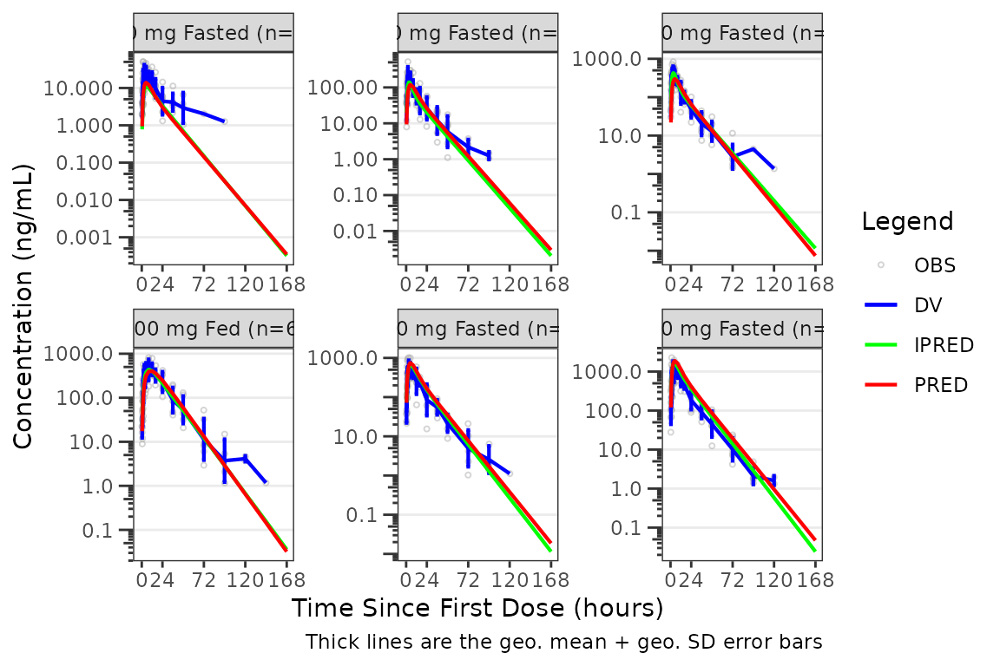

The caption will *NOT* update if a new axis is added to the plot object
outside of
[`plot_gof()`](https://ryancrass.github.io/pmxhelpr/reference/plot_gof.md)
with
[`scale_y_log10()`](https://ggplot2.tidyverse.org/reference/scale_continuous.html).

``` r

plot_gof(data = plot_data, dv_var = "ODV", cent = "mean_sdl") +
  scale_x_continuous(breaks = c(0, 24, 72, 120, 168)) +
  labs(y = "Concentration (ng/mL)", x = "Time Since First Dose (hours)") + 
  facet_wrap(~`Dose and Food`, scales = "free") +
  scale_y_log10()
```

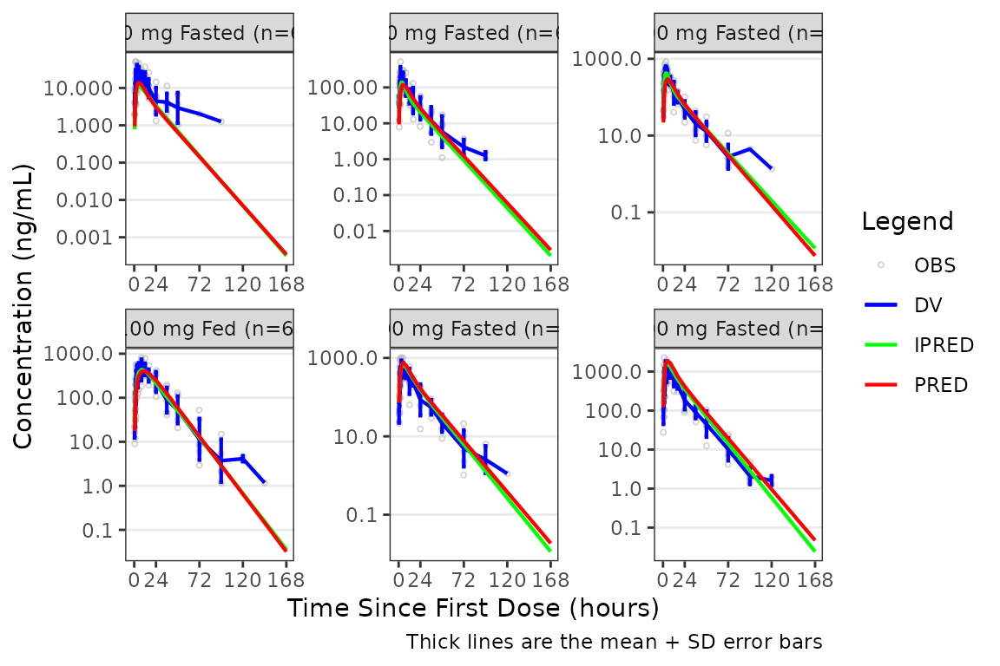

Transformation of the plot to a semi-log scale (log-scale y-axis only)
is recommended to be performed using the `log_y` argument for the
following benefits:

- Includes log tick marks on the y-axis
- Updates the caption with the correct central tendency measure if
  `show_captions = TRUE`.

### Handling Below-the-Limit-of-Quantification (BLQ) Data

By default
[`plot_gof()`](https://ryancrass.github.io/pmxhelpr/reference/plot_gof.md)
excludes BLQ records (`MDV == 1`) from the central tendency calculation,
which can artificially flatten or distort the observed central tendency
in the late terminal phase when visualizing data on a semi-log scale.

The `loq` and `loq_method` arguments in
[`plot_gof()`](https://ryancrass.github.io/pmxhelpr/reference/plot_gof.md)
inherit the BLQ handling pipeline from
[`plot_dvtime()`](https://ryancrass.github.io/pmxhelpr/reference/plot_dvtime.md).
`plot_gof` includes one additional argument in the pipeline, `blq_mode`,
which controls whether the imputation extends to the prediction layers
(`PRED`, `IPRED`) or stays scoped to the observed layer (`DV`) only.

The example dataset `data_sad_pkfit` carries an `LLOQ = 1` ng/mL and
~169 BLQ rows. Without BLQ handling, the observed line drops or
terminates at late times because those records are filtered out of the
central tendency.

``` r

plot_gof(plot_data, dv_var = "ODV", log_y = TRUE) +
  labs(x = "Time (h)", y = "Concentration (ng/mL)")
```

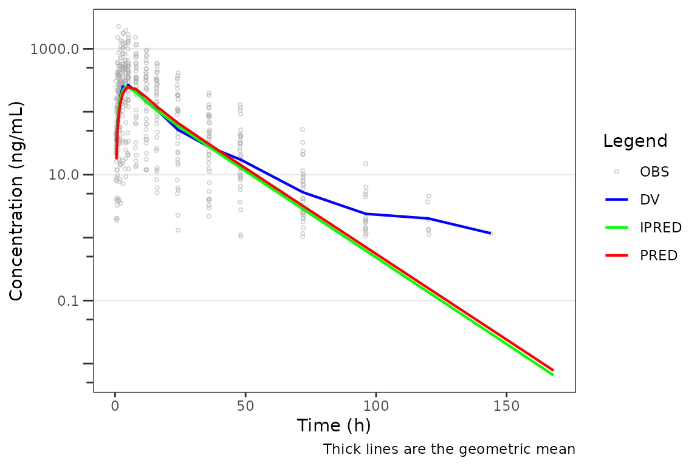

To anchor the late-time visual to the assay LLOQ, pass `loq` and a
non-zero `loq_method`. With `loq_method = 2` all BLQ observations are
imputed to `0.5 * LOQ`, the dashed LLOQ reference line and a `LLOQ = 1`
legend entry are added automatically, and the observed (`DV`) central
tendency continues at `y = 0.5` for late times. Predictions are *not*
imputed by default — they follow the model’s natural decay through and
below the LLOQ.

``` r

plot_gof(plot_data, dv_var = "ODV",
         loq = 1, loq_method = 2,
         log_y = TRUE) +
  labs(x = "Time (h)", y = "Concentration (ng/mL)")
```


When `loq` is omitted and the input dataset carries an `LLOQ` column (as
`data_sad_pkfit` does), the per-row `LLOQ` value is used as each
observation’s imputation threshold. The chunk below renders the same
plot as the previous one without specifying `loq` explicitly:

``` r

plot_gof(plot_data, dv_var = "ODV",
         loq_method = 2,
         log_y = TRUE) +
  labs(x = "Time (h)", y = "Concentration (ng/mL)")
```

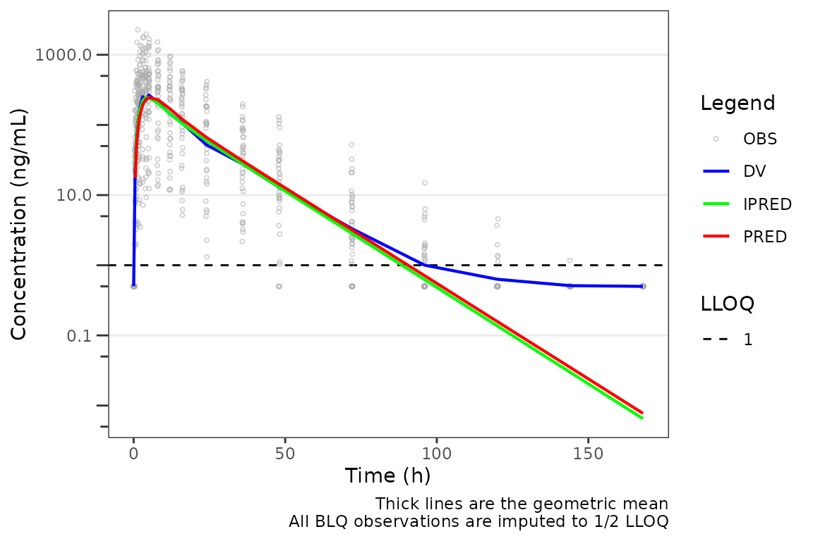

This is the recommended setting for evaluating model fit, since the
prediction lines are unaltered model output and any divergence between
the observed plateau and the prediction trajectory below the LLOQ is
itself diagnostic information.

Setting `blq_mode = "all"` extends the imputation to `PRED` and `IPRED`
as well — any prediction below the LLOQ snaps to `0.5 * LOQ`. Use this
when the GOF visual should mirror an estimation engine that censored
predictions during the fit (e.g., M3-style likelihood with explicit BLQ
censoring), so the rendered prediction lines reflect the same data the
likelihood saw.

``` r

plot_gof(plot_data, dv_var = "ODV",
         loq = 1, loq_method = 2,
         blq_mode = "all",
         log_y = TRUE) +
  labs(x = "Time (h)", y = "Concentration (ng/mL)")
```

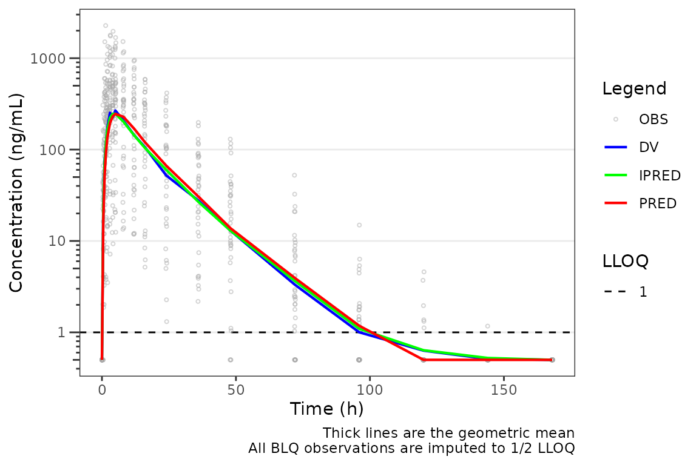

In short: pick `blq_mode = "obs"` (default) when you want to see how
well the model’s natural prediction (uncensored) matches censored
observations — predictions extending below the LLOQ signal where the
model expects sub-quantifiable concentrations. Pick `blq_mode = "all"`
when you want a like-for-like visual against an estimation pipeline that
censored the predictions.

`loq_method = 1` is also available: it imputes only the post-dose BLQ
records to `0.5 * LOQ` and pre-dose BLQ to `0` — useful for plotting on
linear scales. See
[`plot_dvtime()`](https://ryancrass.github.io/pmxhelpr/articles/eda-pk-pkpd-workflow.md)
for the full method semantics.

### Adjusting the Plot Theme with `plot_gof_theme()`

[`plot_gof()`](https://ryancrass.github.io/pmxhelpr/reference/plot_gof.md)
aesthetic control arguments are not reviewed in detail in this vignette.
See the [Plot Themes and
Aesthetics](https://ryancrass.github.io/pmxhelpr/articles/plot-themes.md)
vignette for details on customizing plot appearance.

The theme constructor factory function for
[`plot_gof()`](https://ryancrass.github.io/pmxhelpr/reference/plot_gof.md)
is
[`plot_gof_theme()`](https://ryancrass.github.io/pmxhelpr/reference/plot_gof_theme.md).

``` r

plot_gof_theme()
#> <plot_gof_theme>
#>   obs_point     <pmx_point>: shape = 1, size = 0.75, alpha = 0.5, color = darkgrey
#>   obs_line      <pmx_line>: linewidth = 0.5, linetype = 1, alpha = 0.75, color = darkgrey
#>   cent_point    <pmx_point>: shape = 16, size = 1.25, alpha = 0
#>   cent_line     <pmx_line>: linewidth = 0.75, linetype = 1, alpha = 1
#>   cent_errorbar <pmx_errorbar>: linewidth = 0.75, linetype = 1, alpha = 1, width = NULL
#>   ref_line      <pmx_line>: linewidth = 0.5, linetype = 2, alpha = 1
#>   loq_line      <pmx_line>: linewidth = 0.5, linetype = 2, alpha = 1
#>   cent_color    <pmx_color>: dv = blue, pred = red, ipred = green
```

Say we want to add points at the binned values for the central tendency
lines. The points are suppressed by default `alpha=0`. We can accomplish
this theme change by defining a new theme and passing that to the
`theme` argument of
[`plot_gof()`](https://ryancrass.github.io/pmxhelpr/reference/plot_gof.md).

``` r

gof_new_theme <- plot_gof_theme(
  cent_point = pmx_point(shape = 16, alpha = 1, size = 1.5)
)
```

``` r

plot_gof(data = plot_data, dv_var = "ODV", cent = "mean",
            log_y = TRUE, theme = gof_new_theme) +
  scale_x_continuous(breaks = c(0, 24, 72, 120, 168)) + 
  labs(y = "Concentration (ng/mL)", x = "Time Since First Dose (hours)") +
  facet_wrap(~`Dose and Food`, scales = "free") 
```

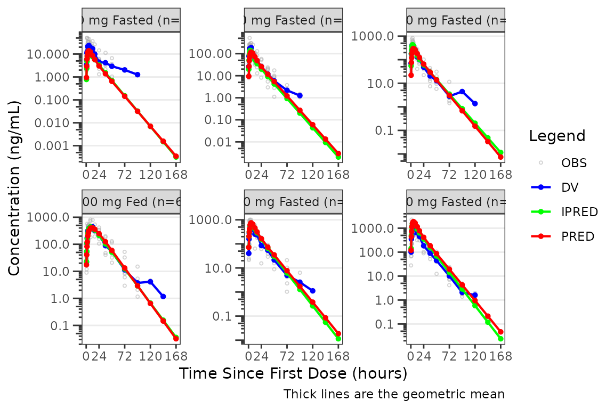

## Individual Concentration-time plots

The previous section provides an overview of how to generate population
overlay GOF plots using
[`plot_gof()`](https://ryancrass.github.io/pmxhelpr/reference/plot_gof.md);
however, we can also use
[`plot_gof()`](https://ryancrass.github.io/pmxhelpr/reference/plot_gof.md)
to generate subject-level visualizations with a little pre-processing of
the input dataset. The `shown` argument via
[`plot_gof_shown()`](https://ryancrass.github.io/pmxhelpr/reference/plot_gof_shown.md)
can be used to suppress the population prediction (PRED) in these plots
evaluating fit at the individual level.

We can plot an individual subject by filtering the input dataset. This
could be extended to generate plots for all individuals using `for`
loops, [`lapply()`](https://rdrr.io/r/base/lapply.html),
[`purrr::map()`](https://purrr.tidyverse.org/reference/map.html)
functions, or other methods.

``` r


ids <- sort(unique(plot_data$ID)) #vector of unique subject ids
n_ids <- length(ids) #count of unique subject ids
plots_per_pg <- 4
n_pgs <- ceiling(n_ids/plots_per_pg) #Total number of pages needed

plist<- list()
for(i in 1:n_ids){
  plist[[i]] <- plot_gof(filter(plot_data, ID == ids[i]),
                            dv_var = "ODV",
                            log_y = TRUE,
                            id_var = ID,
                            shown = plot_gof_shown(pred = FALSE, dv = FALSE),
                            show_caption = FALSE) +
  facet_wrap(~DoseFood) +
  scale_x_continuous(breaks = seq(0, 168, 24)) + 
  labs(title = paste0("ID = ", ids[i]), y = "Concentration (ng/mL)", x = "Time (hours)") +
  theme(legend.position="none")
}

lapply(1:n_pgs, function(n_pg) {
      i <-  (n_pg-1)*plots_per_pg+1
      j <- n_pg*plots_per_pg
      wrap_plots(plist[i:j])
})
#> [[1]]
```

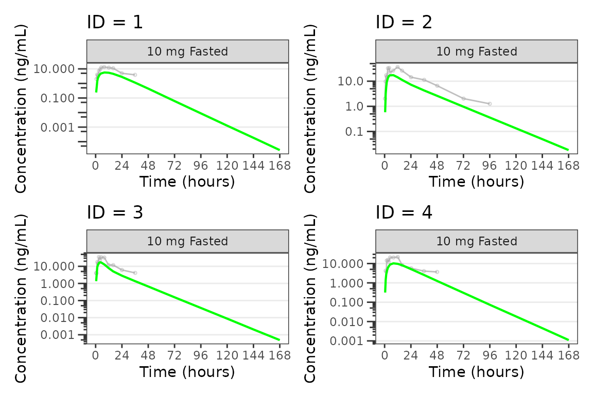

    #> 
    #> [[2]]

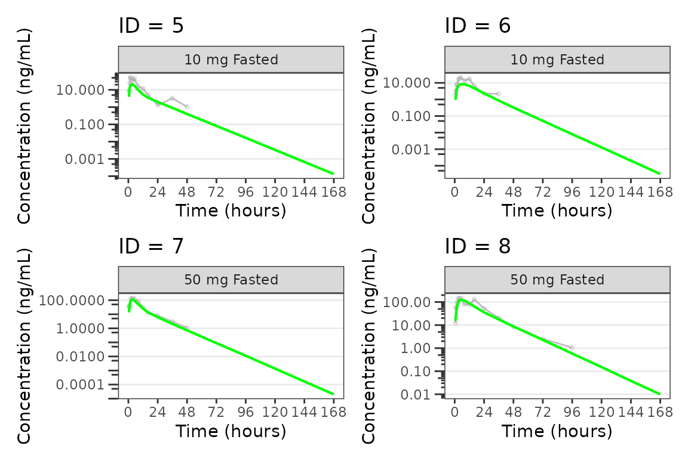

    #> 
    #> [[3]]

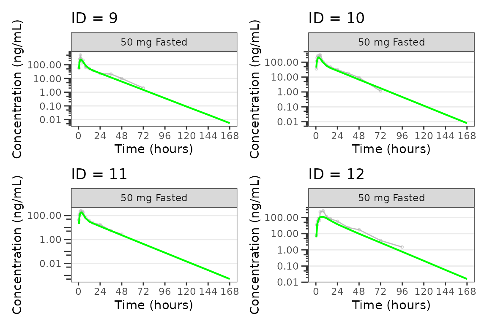

    #> 
    #> [[4]]

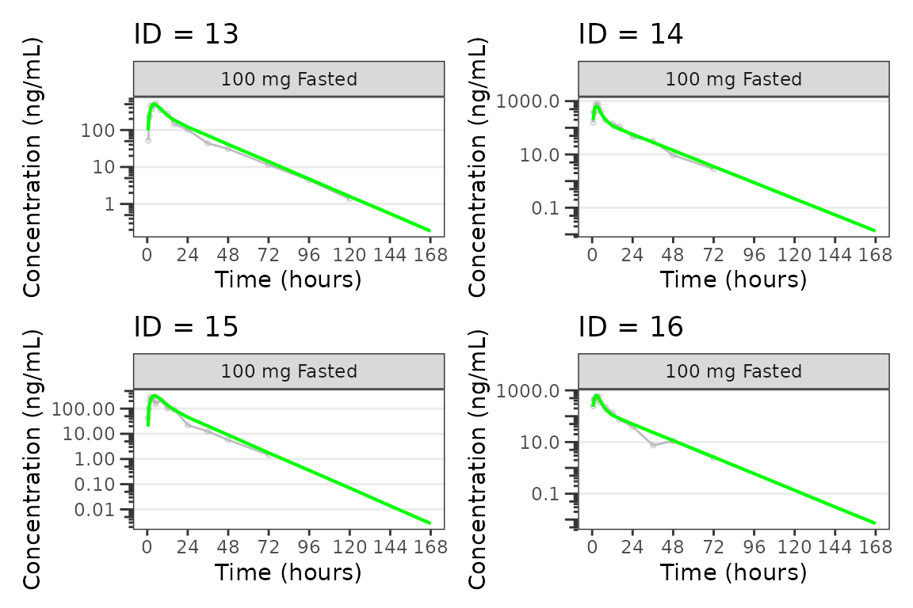

    #> 
    #> [[5]]

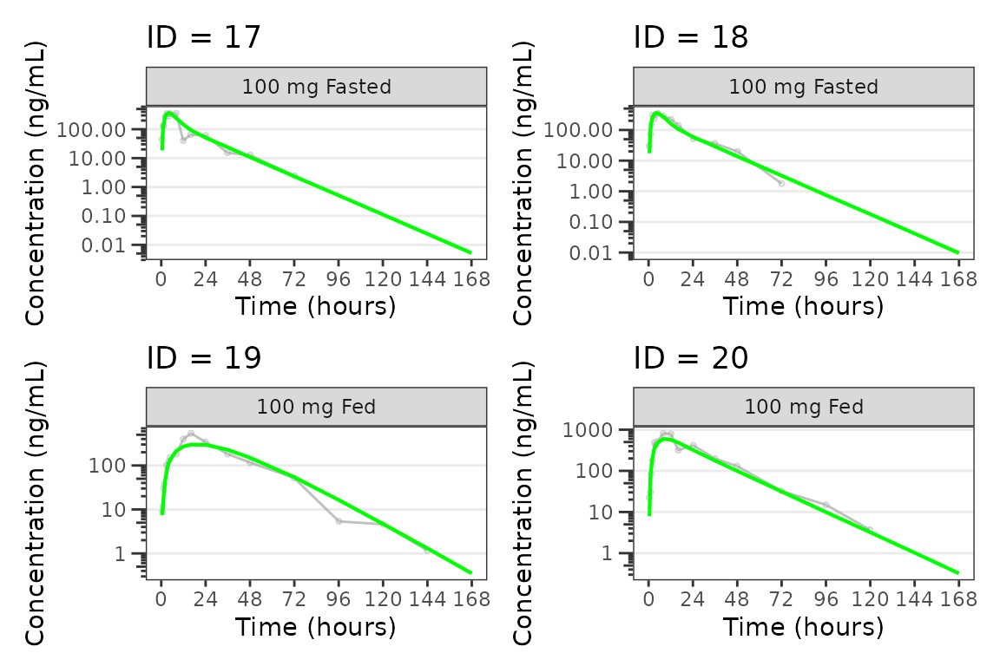

    #> 
    #> [[6]]

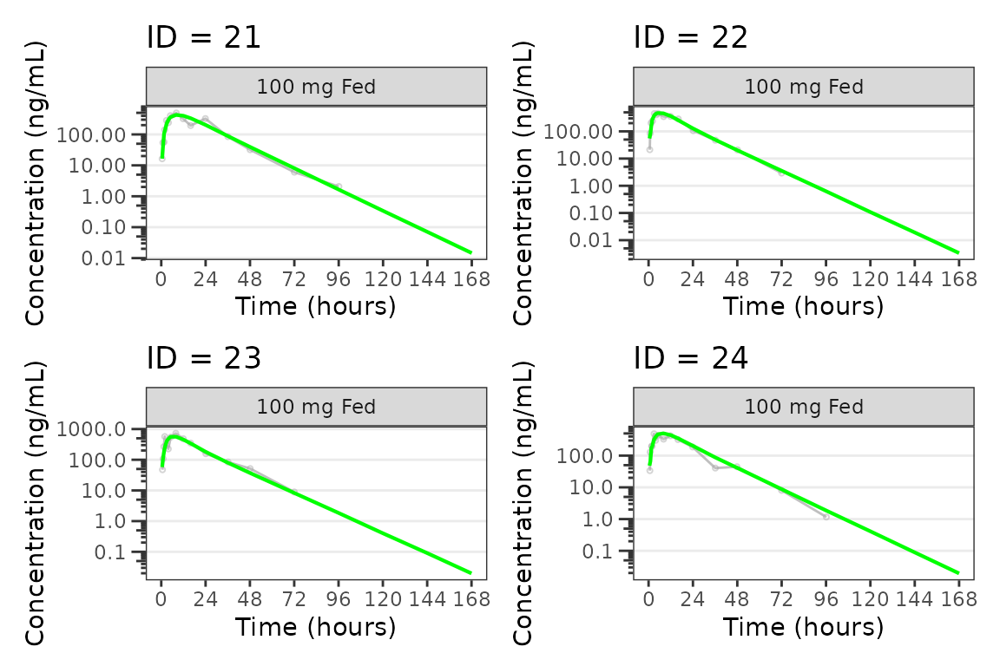

    #> 
    #> [[7]]

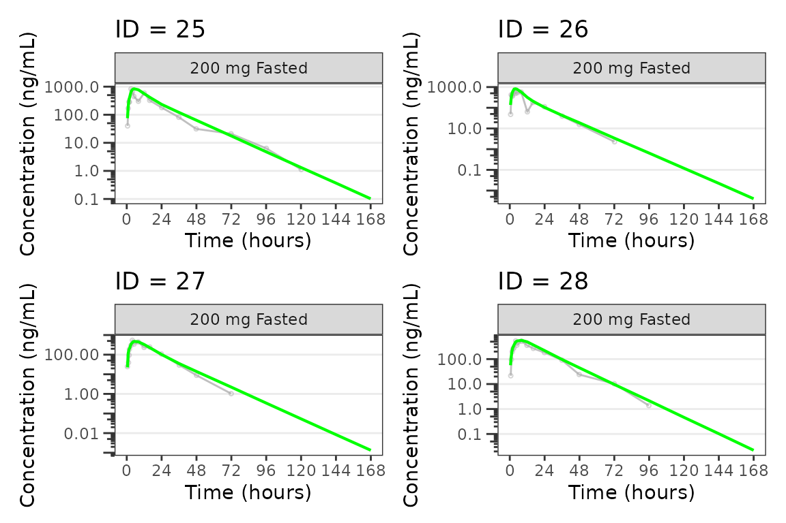

    #> 
    #> [[8]]

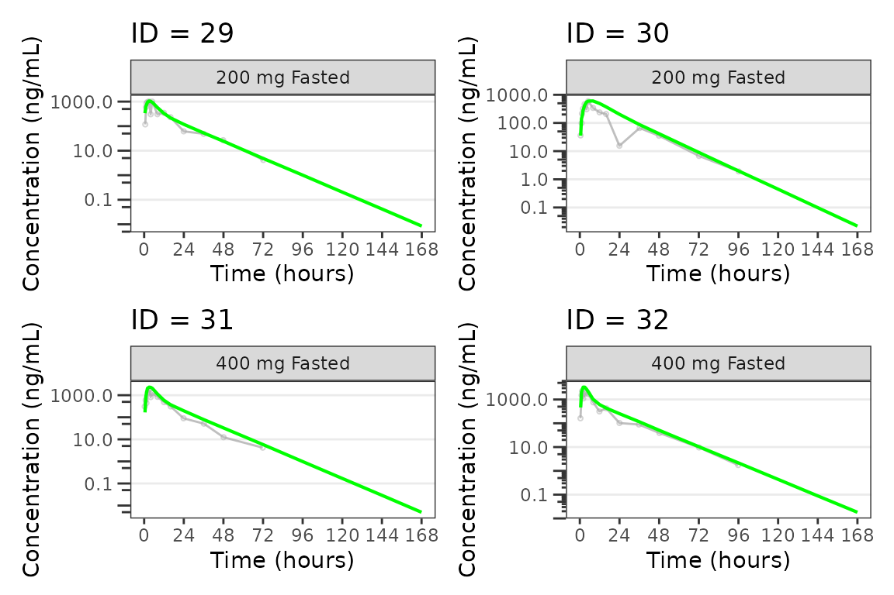

    #> 
    #> [[9]]

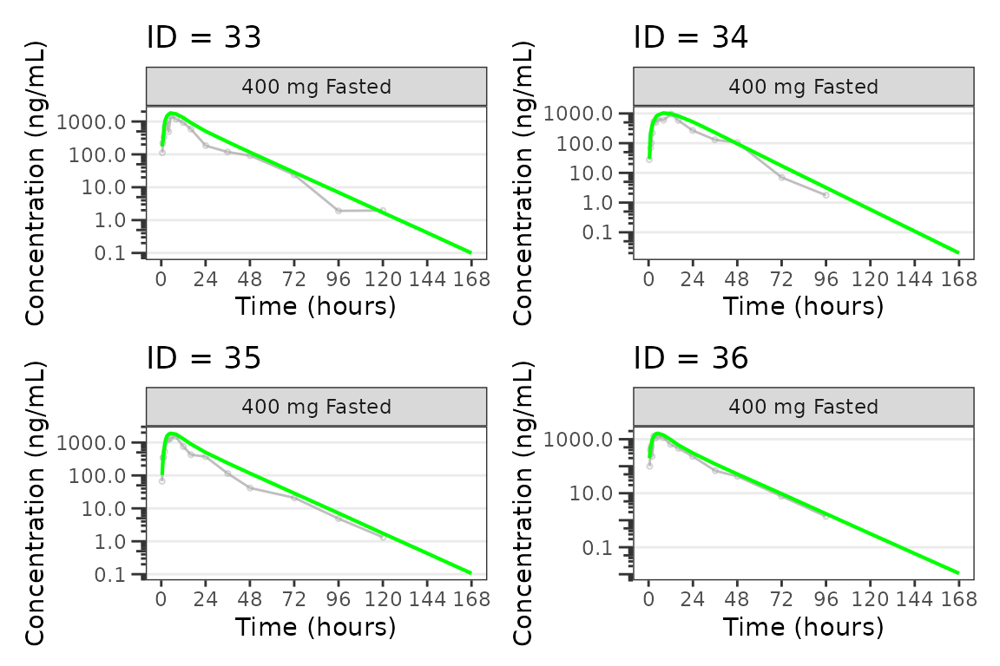

## See also

- [PK and PK/PD EDA
  workflow](https://ryancrass.github.io/pmxhelpr/articles/eda-pk-pkpd-workflow.md)
  — exploratory analysis of continuous longitudinal concentration-time
  data, response-time, and response-concentration data.
- [Plot Themes and
  Aesthetics](https://ryancrass.github.io/pmxhelpr/articles/plot-themes.md)
  — element constructors, theme factories, and class system for
  customizing plot output.
