# Plot Styling and Aesthetics

This vignette demonstrates how to control the visual aesthetics of the
`pmxhelpr` plotting functions. `pmxhelpr` styles its plots with
`ggstylekit`, which provides a uniform approach to styling plots.

``` r

options(scipen = 999, rmarkdown.html_vignette.check_title = FALSE)
library(pmxhelpr)
library(dplyr, warn.conflicts =  FALSE)
library(ggplot2, warn.conflicts =  FALSE)
library(Hmisc, warn.conflicts = FALSE)
library(patchwork, warn.conflicts = FALSE)
```

## Data and Model Objects

The example datasets used in this vignette are based around the
`data_sad` dataset internal to `pmxhelpr`. This dataset is based on a
single ascending dose (SAD) study of an orally administered drug product
with a parallel group food effect (FE) cohort and is formatted in a
analysis-ready format for non-linear mixed effects (NLME) modeling.
`data_sad_pkfit` is a modified version of `data_sad`, with PK model
predictions appended.

This vignette will assume familiarity with the structure of these
datasets from other vignettes.

### data_sad

Dataset definitions can be viewed by calling
[`?data_sad`](https://ryancrass.github.io/pmxhelpr/reference/data_sad.md).

Let’s define some variables that may be useful in plotting and filter
down to PK or PD relevant records.

``` r

data <- data_sad %>%
  mutate(`Food Status` = ifelse(FOOD == 0, "Fasted", "Fed"),
         DoseFood = paste(DOSE, "mg", `Food Status`)) %>%
  mutate(`Dose and Food` = var_addn(DoseFood, ID))

gof_data <- data_sad_pkfit %>%
  mutate(`Food Status` = ifelse(FOOD == 0, "Fasted", "Fed"),
         DoseFood = paste(DOSE, "mg", `Food Status`)) %>%
  mutate(`Dose and Food` = var_addn(DoseFood, ID))

data_pk <- filter(data, CMT %in% c(1,2))
data_pd <- filter(data, CMT %in% c(1,3))
data_pkfit <- filter(gof_data, CMT %in% c(1,2))
data_nca <- filter(data_sad_nca, PART == "Part 1-SAD")
doseprop_data_nca <- df_doseprop(data_nca, metrics = c("aucinf.obs", "cmax"), metric_name_var = "PPTESTCD")
```

An example PK model (`pkmodel`) in `mrgmod` format is provided in the
internal package library. This is loaded using the helper function
[`model_mread_load()`](https://ryancrass.github.io/pmxhelpr/reference/model_mread_load.md),
which wraps
[`mrgsolve::mread()`](https://mrgsolve.org/docs/reference/mread.html).

``` r

model <- model_mread_load("pkmodel")
#> Building pkmodel_cpp ... done.
```

## Plot Styling with `ggstylekit` in `pmxhelpr`

`pmxhelpr` re-exports four functions from `ggstylekit`:

- [`reveal()`](https://rdrr.io/pkg/ggstylekit/man/reveal.html): map a
  new data variable to an aesthetic or facet, then re-style
- [`restyle_plot()`](https://rdrr.io/pkg/ggstylekit/man/restyle_plot.html):
  adjust a plot style after it has been styled.
- [`combine_styled_plots()`](https://rdrr.io/pkg/ggstylekit/man/combine_styled_plots.html):
  combine styled plots and collect legends
- [`legend_spec()`](https://rdrr.io/pkg/ggstylekit/man/legend_spec.html):
  describe one legend, for the `legends` style field

Additionally, `pmxhelpr` includes **style preset** functions which
return a
[`ggstylekit::style_spec()`](https://rdrr.io/pkg/ggstylekit/man/style_spec.html)
object for each `plot_*()` function containing the defaults for the
plotting family. These functions

- [`style_dvtime()`](https://ryancrass.github.io/pmxhelpr/reference/style_dvtime.md)/[`plot_dvtime()`](https://ryancrass.github.io/pmxhelpr/reference/plot_dvtime.md),
- [`style_gof()`](https://ryancrass.github.io/pmxhelpr/reference/style_gof.md)/[`plot_gof()`](https://ryancrass.github.io/pmxhelpr/reference/plot_gof.md)
  ,
- [`style_dvconc()`](https://ryancrass.github.io/pmxhelpr/reference/style_dvconc.md)/[`plot_dvconc()`](https://ryancrass.github.io/pmxhelpr/reference/plot_dvconc.md),
- [`style_doseprop()`](https://ryancrass.github.io/pmxhelpr/reference/style_doseprop.md)/[`plot_doseprop()`](https://ryancrass.github.io/pmxhelpr/reference/plot_doseprop.md),
- [`style_vpc()`](https://ryancrass.github.io/pmxhelpr/reference/style_vpc.md)
  /
  [`plot_vpc_cont()`](https://ryancrass.github.io/pmxhelpr/reference/plot_vpc_cont.md)
  /
  [`plot_vpc_cens()`](https://ryancrass.github.io/pmxhelpr/reference/plot_vpc_cens.md)

These style presets are passed to the `style` argument of plotting
functions and use the following
syntax:`style_<fn>(<map> = c(<role> = <value>))`.

Unique **roles** in `pmxhelpr` plot families can be passed to
**per-series maps** in the style presets. These elements are overridden
based on the **roles** specified, with remaining **roles** inheriting
the defaults.

``` r

plot_dvtime(data_pk, dv_var = ODV, style = style_dvtime())
```

## Basics of Plot Styling with Style Specs

### Defaults

Call a style preset function with no arguments to print its defaults.

``` r

style_dvtime()
#> <ggstylekit_style_spec>
#>   colors                 NULL
#>   fill                   NULL
#>   linetypes              solid , solid , dashed, dashed
#>   alphas                 0.5, 0.5, 0.0, 1.0, 1.0, 1.0, 1.0
#>   shapes                  1, 16
#>   sizes                  0.75, 1.25
#>   linewidths             0.50, 0.75, 0.75, 0.50, 0.50
#>   point_color            NULL
#>   point_alpha            NULL
#>   point_size             NULL
#>   point_shape            NULL
#>   line_color             NULL
#>   line_alpha             NULL
#>   line_linetype          NULL
#>   line_linewidth         NULL
#>   line_fill              NULL
#>   errorbar_color         NULL
#>   errorbar_alpha         NULL
#>   errorbar_linetype      NULL
#>   errorbar_linewidth     NULL
#>   errorbar_width         NULL
#>   errorbar_fill          NULL
#>   bar_fill               NULL
#>   bar_color              NULL
#>   bar_alpha              NULL
#>   bar_linewidth          NULL
#>   area_fill              NULL
#>   area_color             NULL
#>   area_alpha             NULL
#>   area_linewidth         NULL
#>   box_fill               NULL
#>   box_color              NULL
#>   box_alpha              NULL
#>   box_linewidth          NULL
#>   title                  NULL
#>   xlabel                 NULL
#>   ylabel                 NULL
#>   xlims                  NULL
#>   ylims                  NULL
#>   logx                   NULL
#>   logy                   NULL
#>   xbreaks                NULL
#>   ybreaks                NULL
#>   xminor_breaks          NULL
#>   yminor_breaks          NULL
#>   xtick_labels           NULL
#>   ytick_labels           NULL
#>   xorder                 NULL
#>   yorder                 NULL
#>   equal_axis             NULL
#>   legends                NULL
#>   legend.position        NULL
#>   legend.title.position  top
#>   legend_nrow            NULL
#>   legend_ncol            NULL
#>   legend.title.hjust     NULL
#>   caption_hjust          NULL
#>   fill_alpha             NULL
#>   facet                  NULL
#>   facet_scales           NULL
#>   facet_nrow             NULL
#>   facet_ncol             NULL
#>   theme                  <ggplot2 theme>
```

### Maps within the `style_spec`

The `style_spec()` object bundles several types of *maps*:

- **Per-series maps**: apply to multiple plot layers specific to
  `pmxhelpr` plot families: `colors`, `fill`, `linetypes`, `alphas`,
  `shapes`, `sizes`,`linewidths`

- **Across-geom maps**: apply to an entire geom family: `point_color`,
  `point_shape`, `point_size`, `point_shape`, `line_color`,
  `line_alpha`, `line_linetype`,`line_linewidth`, `line_fill`,
  `bar_fill`, `bar_color`, `bar_alpha`, `bar_linewidth`, `area_fill`,
  `area_color`, `area_alpha`, `area_linewidth`, `box_fill`, `box_color`,
  `box_alpha`, `box_linewidth`, `fill_alpha`

- **Labels and axes**: apply to labels and axes: `title`,
  `xlabel`/`ylabel`, `xlims`/`ylims`, `logx`/`logy`,
  `xbreaks`/`ybreaks`, `xminor_breaks`/`yminor_breaks`,
  `xtick_labels`/`ytick_labels`, `xorder/yorder`, `equal_axis`.

- **Legends**: apply to legends and can be set by a
  [`legend_spec()`](https://rdrr.io/pkg/ggstylekit/man/legend_spec.html)
  object: `legends`,`legend.position`, `legend.title.position`,
  `legend_nrow`/`legend_ncol`, `legend.title.hjust`, `caption_hjust`

- **Facets**: apply to facets: `facet`, `facet_scales`,
  `facet_nrow`/`facet_ncol`

- **Theme**: apply a ggplot2 `theme` object.

`pmxhelpr` sets a shared house theme based on
[`ggplot2::theme_bw()`](https://ggplot2.tidyverse.org/reference/ggtheme.html),
with the all minor gridlines and major vertical gridlines removed.

### **Per-series map** Roles by plot family

Unique **roles** in each plot family style spec are as follows that can
be passed to **per-series maps** are summarized below.

- [`style_dvtime()`](https://ryancrass.github.io/pmxhelpr/reference/style_dvtime.md):
  Roles include `obs_point`, `obs_line`, `cent_point`, `cent_line`,
  `cent_errorbar`, `ref_line`, `loq_line`
- [`style_gof()`](https://ryancrass.github.io/pmxhelpr/reference/style_gof.md):
  Roles include the elements in `style_dvtime`, plus the overlay
  `colors` keyed by label (`OBS`, `DV`, `PRED`, `IPRED`)
- [`style_dvconc()`](https://ryancrass.github.io/pmxhelpr/reference/style_dvconc.md):
  Roles include `obs_point`, `ref_line`, `loess`, `linear`
- [`style_doseprop()`](https://ryancrass.github.io/pmxhelpr/reference/style_doseprop.md):
  Roles include `obs_point`, `linear`
- [`style_vpc()`](https://ryancrass.github.io/pmxhelpr/reference/style_vpc.md):
  Roles include `obs_point`, `obs_median_line`, `obs_pi_line`,
  `sim_pi_line`, `sim_median_line`, `loq_line`, `sim_pi_ci`,
  `sim_pi_area`, `sim_median_ci`

Available **roles** in **per-series maps** can be viewed from the style
present object using the `$` operator.

``` r

style_dvtime()$alphas
#>     obs_point      obs_line    cent_point     cent_line cent_errorbar 
#>           0.5           0.5           0.0           1.0           1.0 
#>      ref_line      loq_line 
#>           1.0           1.0
```

### Builder arguments versus style fields

A few aesthetic decisions belong to the plot builder rather than to the
style, because the builder needs them to decide *what to draw*, not just
how to draw it. Where the two overlap, the builder argument wins:

- **`log_y`**:
  [`plot_dvtime()`](https://ryancrass.github.io/pmxhelpr/reference/plot_dvtime.md),
  [`plot_dvconc()`](https://ryancrass.github.io/pmxhelpr/reference/plot_dvconc.md),
  and
  [`plot_gof()`](https://ryancrass.github.io/pmxhelpr/reference/plot_gof.md)
  set the style `logy` from the plotting function `log_y` argument. This
  is because `log_y` argument in the plotting function also controls the
  central tendency summary measure (e.g., arithmetic versus geometric
  mean).
- **[`plot_doseprop()`](https://ryancrass.github.io/pmxhelpr/reference/plot_doseprop.md)
  axes and facets**: this plotting family applies its own log-log
  `scale_*_log10()` and per-metric
  [`facet_wrap()`](https://ggplot2.tidyverse.org/reference/facet_wrap.html),
  so the style spec’s `logx`/`logy`/`xbreaks`/`facet` fields are
  ignored. The facet *layout* fields (`facet_scales`, default `"free"`;
  `facet_nrow`; `facet_ncol`) are honored.
- **Visibility**:
  [`plot_gof_shown()`](https://ryancrass.github.io/pmxhelpr/reference/plot_gof_shown.md)
  /
  [`plot_vpc_shown()`](https://ryancrass.github.io/pmxhelpr/reference/plot_vpc_shown.md)
  control which layers are *built* and the style spec controls how the
  built layers *look*. Setting `style_vpc(alphas = c(obs_point = 0))`
  draws an invisible layer and includes it in the legend whereas
  `plot_vpc_shown(obs_point = FALSE)` omits it entirely. `shown` is the
  preferred method when a layer is not wanted.

### Examples

#### Inline override

A style present can be passed and modified inline within the plotting
function call.

``` r

plot_dvtime(
  data = data_pk, dv_var = ODV, col_var = `Dose and Food`,
  cent = "mean_sdl", log_y = TRUE, loq_method = 2,
  style = style_dvtime(alphas = c(obs_point = 0))
) +
  scale_x_continuous(breaks = seq(0, 168, 24))+
  labs(y = "Concentration (ng/mL)", x = "Time (hours)")
```

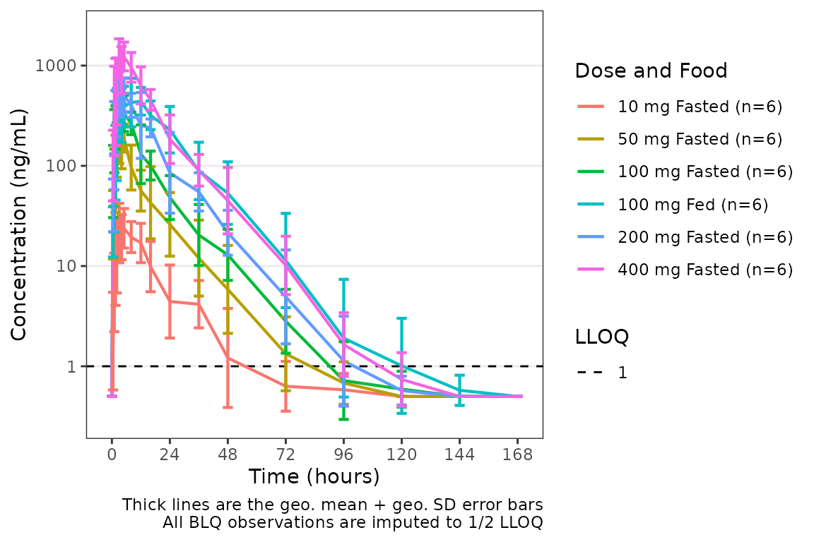

#### Reusable style object

Often, one may be generating a series of plots with common styling. In
this case, it is advantageous to build a style object once and reuse it
across plots. In addition to elements mapped to `ggplot2` aesthetic
layers, the style spec object can be used to specify axis elements,
labels, legends, and themes.

``` r

new_dvtime_style <- style_dvtime(
  alphas     = c(obs_point = 0),
  xbreaks = seq(0, 168, 24),
  ybreaks = c(0.1, 1, 10, 100, 1000),
  ylims   = c(0.1, 2000),
  xlabel = "Time (hours)",
  ylabel = "Concentration (ng/mL)",
  title = "Single Ascending Dose"
)

plot_dvtime(data_pk, dv_var = ODV, col_var = `Dose and Food`,
            cent = "mean_sdl", log_y = TRUE, loq_method = 2,
            style = new_dvtime_style) 
```

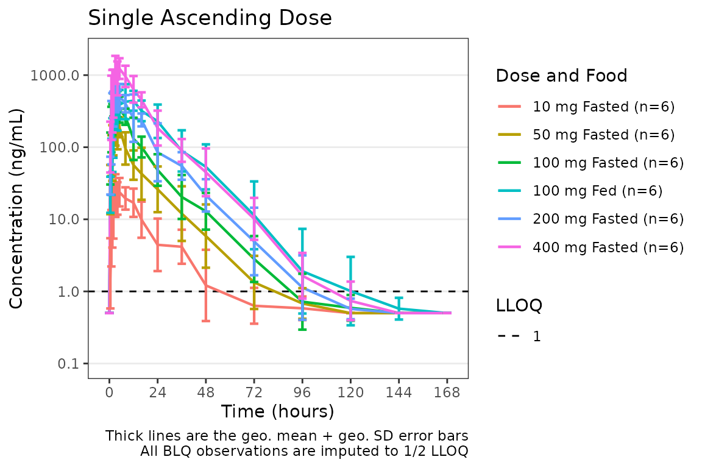

#### Error bar cap width

Error bar cap width is the `errorbar_width` style field, in x-axis
units. The presets leave it unset, and
[`plot_dvtime()`](https://ryancrass.github.io/pmxhelpr/reference/plot_dvtime.md)
/
[`plot_gof()`](https://ryancrass.github.io/pmxhelpr/reference/plot_gof.md)
then default it to 2.5% of the maximum nominal time so the caps scale
with the time axis. Set it in the style to override:

``` r

plot_dvtime(data_pk, dv_var = ODV, col_var = `Dose and Food`,
            cent = "mean_sdl", log_y = TRUE, loq_method = 2,
            style = style_dvtime(alphas = c(obs_point = 0), errorbar_width = 10))
```

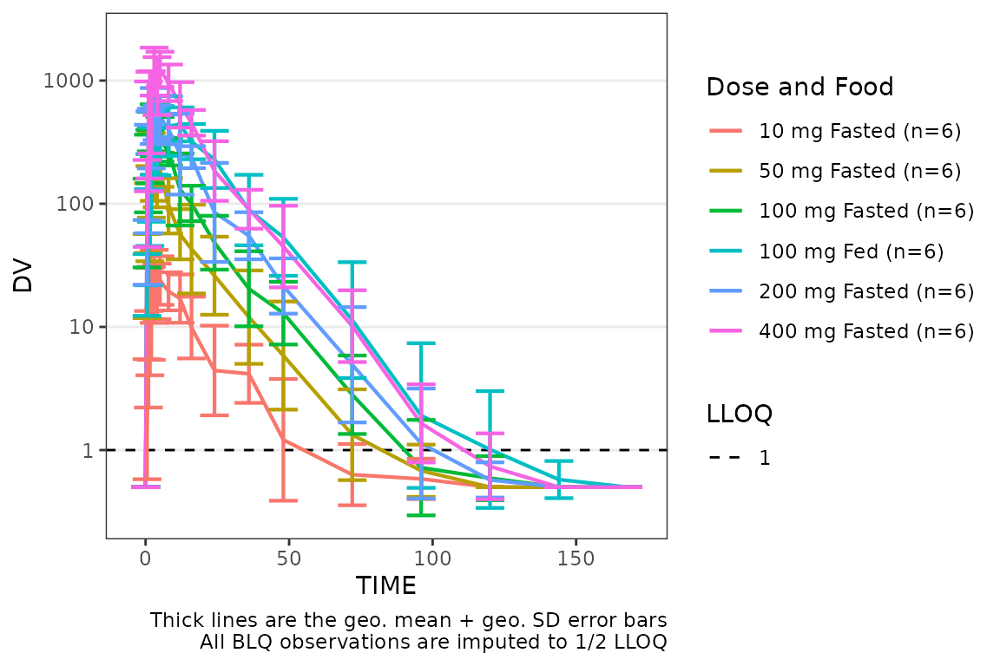

### Labeling with symbols using `bquote()`

The label keys `title`, `xlabel`, and `ylabel` accept
[`bquote()`](https://rdrr.io/r/base/bquote.html), which is the practical
way to put symbols and subscripts into a label:

``` r

plot_dvconc(
  data = data_pd, dv_var = CFB, idv_var = CONC, ref = 0, loess = TRUE,
  style = style_dvconc(
    xlabel = bquote("Concentration" ~ (ng %.% mL^-1)),
    ylabel = bquote(Delta ~ "Response (%)")
  )
)
```

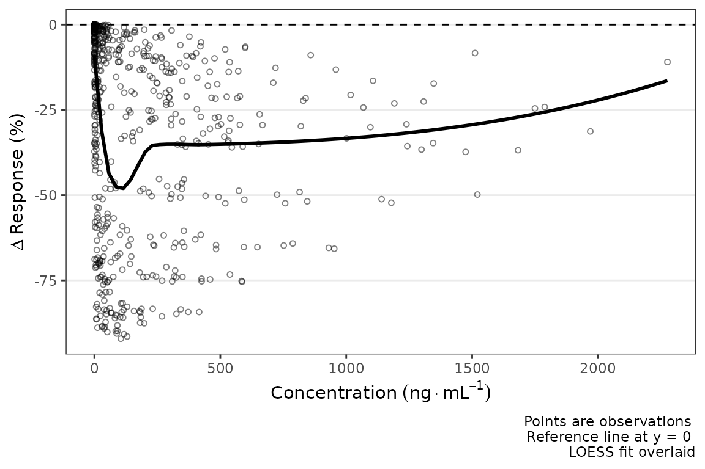

## Styling legends with `legend_spec()`

### Overview

The `legends` **map** accepts a
[`legend_spec()`](https://rdrr.io/pkg/ggstylekit/man/legend_spec.html)
object or list of legend spec objects. A legend spec describes one
legend, keyed either by the data column displayed (`col`) or by the plot
**map** channel (`channel`).

``` r

plot_dvtime(
  data_pk, dv_var = ODV, col_var = `Food Status`, 
  dose_var = "DOSE", dosenorm = T,
  cent = "median", log_y = TRUE,
  style = style_dvtime(
    ylabel  = "Dose-normalized Concentration (ng/mL)",
    xlabel  = "Time (hours)",
    xbreaks = seq(0, 168, 24),
    legends = legend_spec(
      col = `Food Status`,
      title  = "Meal Status",
      labels = c(Fasted = "Fasted (overnight)", Fed = "Fed (high-fat)")
    ),
    legend.position = "bottom",
    legend_nrow     = 1
  )
)
```

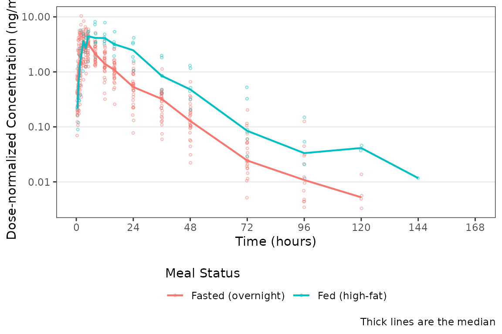 Other
[`legend_spec()`](https://rdrr.io/pkg/ggstylekit/man/legend_spec.html)
arguments include:

- `hide = TRUE` suppresses a legend while leaving its mapping in place
- `order` sets which legend is drawn first when a plot has multiple
- `nrow`/`ncol` override the `legend_nrow`/`legend_ncol` for the legend
  specified
- `combine_with` folds a variable into an existing legend, when each key
  of that legend identifies exactly one value of the folded column.

### Label overrides in legends and facets

A legend spec’s `labels` also relabel matching facet strips, if the
facetting is specified in the style spec, rather than added as a new
layer with
[`facet_wrap()`](https://ggplot2.tidyverse.org/reference/facet_wrap.html).

``` r

plot_dvtime(
  data_pk, dv_var = ODV, col_var = `Food Status`, 
  dose_var = "DOSE", dosenorm = T,
  cent = "median", log_y = TRUE,
  style = style_dvtime(
    ylabel  = "Dose-normalized Concentration (ng/mL/mg)",
    xlabel  = "Time (hours)",
    xbreaks = seq(0, 168, 24),
    legends = legend_spec(
      col = `Food Status`,
      title  = "Meal Status",
      labels = c(Fasted = "Fasted (overnight)", Fed = "Fed (high-fat)")
    ),
    legend.position = "bottom",
    legend_nrow     = 1,
    facet = "Food Status",
    facet_nrow = 1,
    facet_ncol = 2,
    facet_scales = "fixed"
  )
) 
```

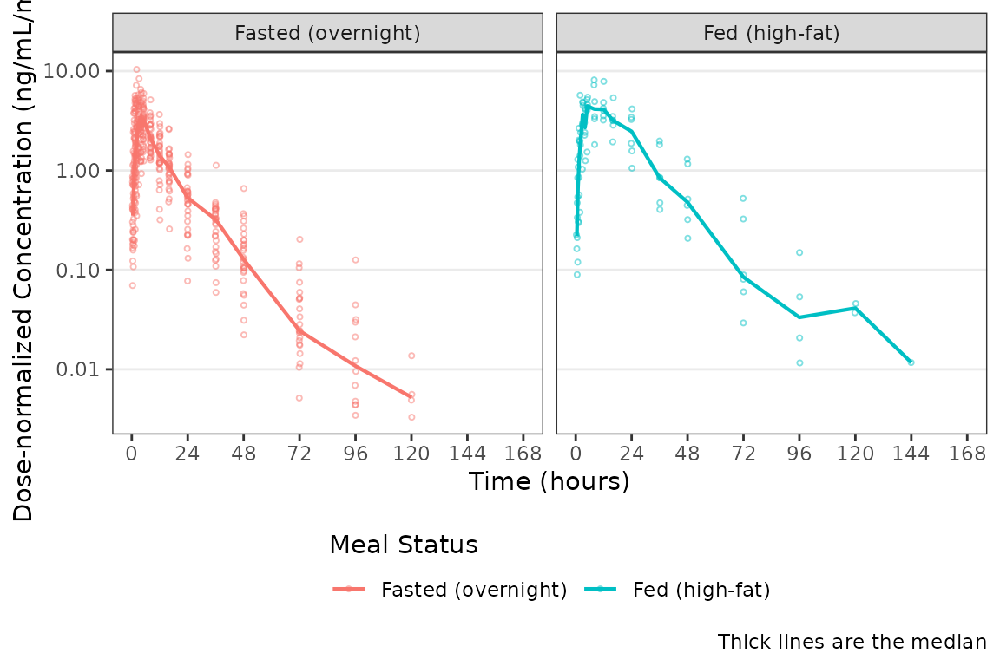

The original `labels` for the variable are retained in facet strips with
[`facet_wrap()`](https://ggplot2.tidyverse.org/reference/facet_wrap.html).

``` r

plot_dvtime(
  data_pk, dv_var = ODV, col_var = `Food Status`, 
  dose_var = "DOSE", dosenorm = T,
  cent = "median", log_y = TRUE,
  style = style_dvtime(
    ylabel  = "Dose-normalized Concentration (ng/mL/mg)",
    xlabel  = "Time (hours)",
    xbreaks = seq(0, 168, 24),
    legends = legend_spec(
      col = `Food Status`,
      title  = "Meal Status",
      labels = c(Fasted = "Fasted (overnight)", Fed = "Fed (high-fat)")
    ),
    legend.position = "bottom",
    legend_nrow     = 1
  )
)  + 
  facet_wrap(~`Food Status`)
```

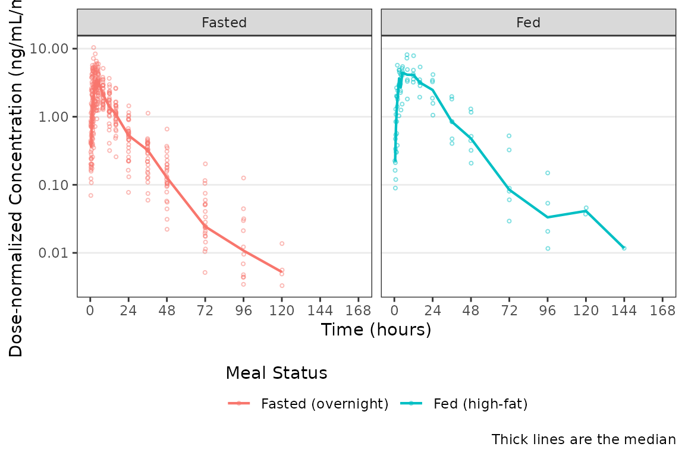

### Remove a legend

To drop a legend entirely, one can key the legend spec to the `channel`.

``` r

plot_dvtime(
  data_pk, dv_var = ODV, col_var = `Dose and Food`, cent = "none", id_var = ID,
  log_y = TRUE, 
  style = style_dvtime(
    ylabel  = "Concentration (ng/mL)",
    xlabel  = "Time (hours)",
    xbreaks = seq(0, 168, 24),
    legends = legend_spec(channel = "color", hide = TRUE)
  ) 
) + 
  facet_wrap(~`Dose and Food`)
```

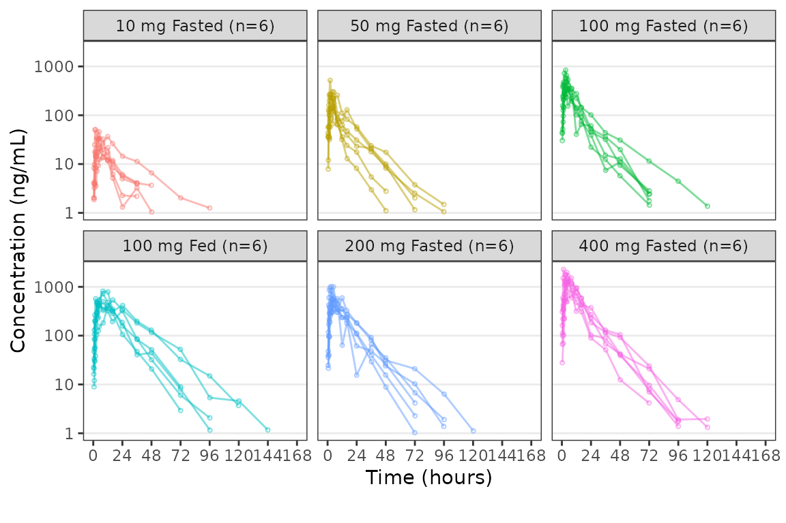

## **Per-series maps** in `pmxhelpr` style presets

### Palette functions

A per-series map can be a palette `function(n)` rather than a named
vector. `ggstylekit` calls the palette function with the unique number
of groups in each plot, so one house style colors every plot without
naming its groups.

``` r

viridis_pal <- function(n) grDevices::hcl.colors(n, "Viridis")

plot_dvtime(
  data_pk, dv_var = ODV, col_var = `Dose and Food`, cent = "mean", log_y = TRUE,
  style = style_dvtime(colors = viridis_pal,
                       ylabel = "Concentration (ng/mL)", xlabel = "Time (hours)",
                       xbreaks = seq(0, 168, 24))
) + 
  facet_wrap(~PART)
```

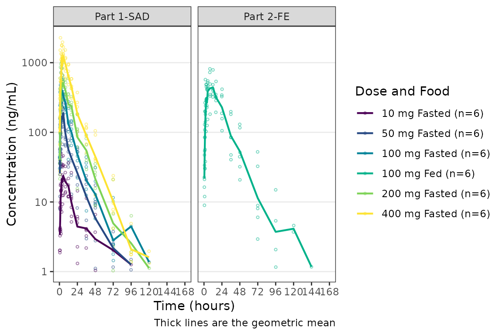

Any `function(n)` returning `n` values works. A palette has no names to
merge entry-wise, so it replaces the preset default map rather than
merging onto it.

### Trend line customization (`plot_dvconc()`)

Trend line colors are controlled using the **per-series map** colors
with the `loess`/`linear` **roles**. The 95% CI ribbon is controlled by
the `ggstylekit` default `line_fill`.

``` r

plot_dvconc(
  data = data_pd, dv_var = CFB, idv_var = CONC, ref = 0,
  loess = TRUE, se_loess = TRUE,
  style = style_dvconc(colors = c(loess = "darkred"), line_fill = "darkred")
) +
  labs(x = "Concentration (ng/mL)", y = "Response (% CFB)")
```

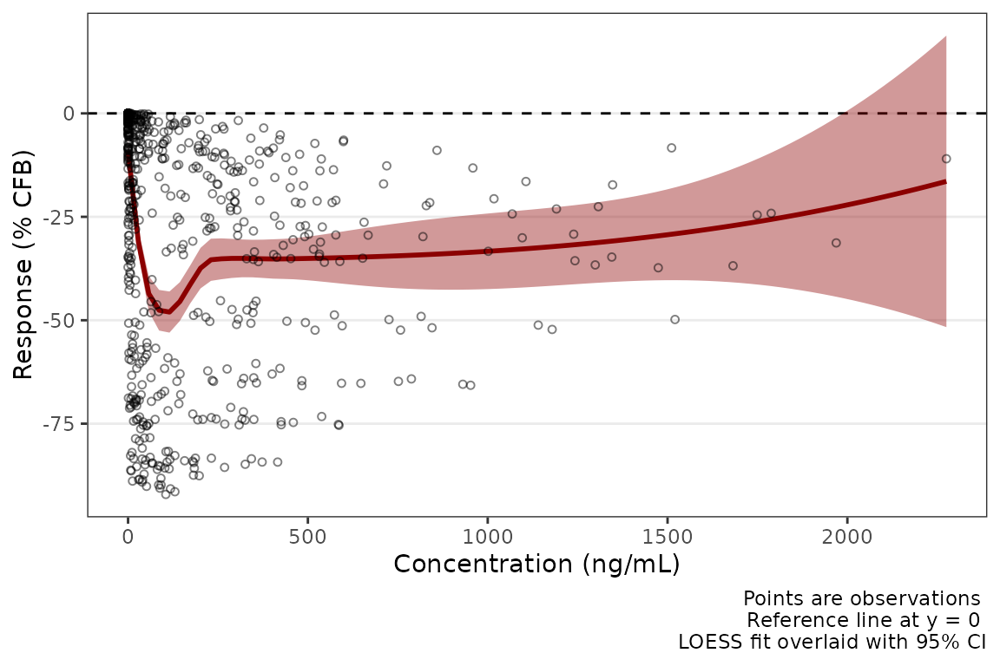

### Dose-proportionality facet layout (`plot_doseprop()`)

[`plot_doseprop()`](https://ryancrass.github.io/pmxhelpr/reference/plot_doseprop.md)
facets by exposure metric, so the style’s `facet_ncol`, `facet_nrow`,
and `facet_scales` fields control that layout. Here the two metrics are
stacked in a single column.

``` r

plot_doseprop(dplyr::filter(data_sad_nca, PART == "Part 1-SAD"),
              metrics = c("aucinf.obs", "cmax"),
              style = style_doseprop(colors = c(linear = "navy"),
                                     facet_ncol = 1))
```

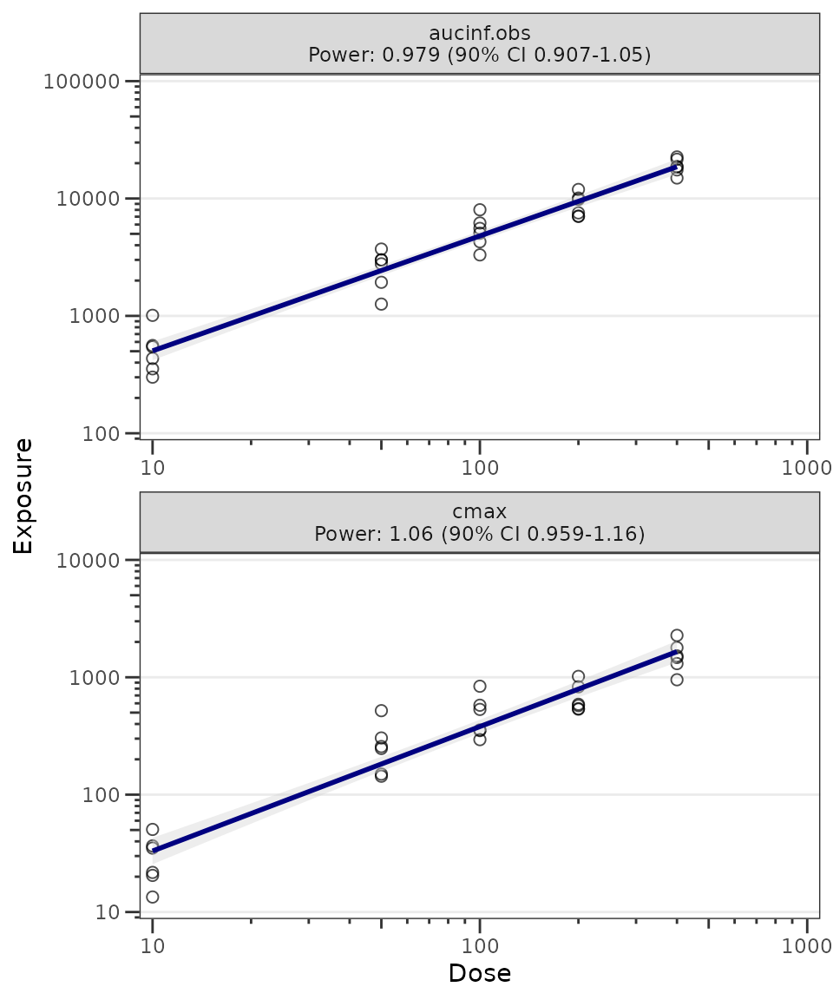

### GOF overlay colors (`plot_gof()`)

The DV (OBS), PRED, and PRED central tendency lines are the **role**
keys for the **per-series map** `colors`.

``` r

plot_gof(
  data = data_pkfit, dv_var = ODV, cent = "mean", log_y = TRUE,
  style = style_gof(colors = c(OBS = "grey60", DV = "black",
                               PRED = "#3388cc", IPRED = "firebrick"), 
                    xlabel = "Time (hours)", ylabel = "Concentration (ng/mL)", 
                    xbreaks = seq(0, 168, 24)))
```

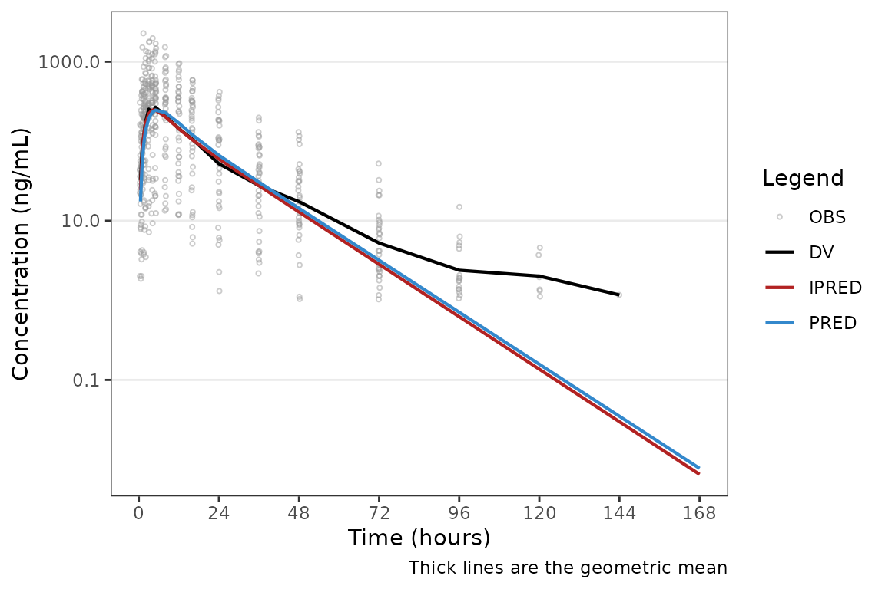

### VPC plot color scheme (`plot_vpc_cont()`)

The **per-series maps** `colors` controls colors for points and lines
while confidence/prediction interval ribbon fills are controlled by
`fill`.

``` r

sim <- df_mrgsim_replicate(data = data_pk, model = model, replicates = 100,
                           dv_var = ODV, carry_out = c("LLOQ", "FOOD"))

pcvpc_style <- style_vpc(
  colors = c(obs_point = "#000000", obs_median_line = "#000000",
             obs_pi_line = "#000000"),
  fill   = c(sim_median_ci = "#3388cc", sim_pi_ci = "#3388cc"),
  ylabel = "PRED-corrected Conc. (ng/mL)",
  xlabel = "Time (hours)",
  xbreaks = seq(0, 168, 24),
  xlims = c(0, 168)
)

plot_vpc_cont(sim, loq = 1, pcvpc = TRUE,
              style = pcvpc_style) + 
  scale_y_log10(guide = "axis_logticks")
```

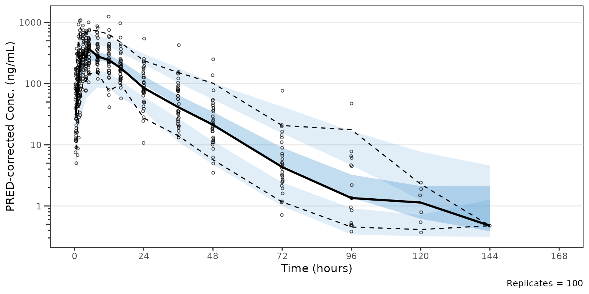

### Faceted VPC plot with free scales (`plot_vpc_cont()`)

As discussed in [Visual Predictive Check
Workflow](https://ryancrass.github.io/pmxhelpr/articles/vpc-workflow.md),
VPC plots should *ONLY* be facetted via the `strat_var` argument and
*SHOULD NOT* be facetted post-hoc with `facet_wrap`. This is to ensure
that the summary statistics from the simulation are also calculated
stratified by the faceting variable.

However, because the `facet_wrap` call is internal to the VPC plotting
functions, the user is not able to change the `scales` argument from the
`"fixed"` preset to `"free_y"`. This can be accomplished in the style.

``` r

sim <- df_mrgsim_replicate(data = data_pk, model = model, replicates = 100,
                           dv_var = ODV, carry_out = c("LLOQ", "FOOD", "DOSE"))

vpc_style_facet <- style_vpc(
  ylabel = "Concentration (ng/mL)",
  xlabel = "Time (hours)",
  xbreaks = seq(0, 168, 24),
  xlims = c(0, 168), 
  facet_scales = "free_y"
)

plot_vpc_cont(sim, loq = 1, strat_var = DOSE,
              style = vpc_style_facet)
```

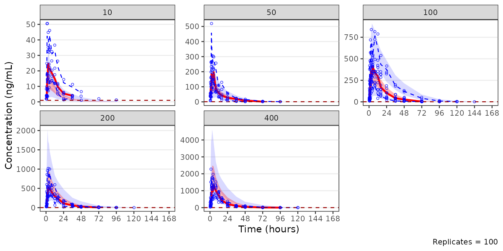

### VPC legend (`plot_vpc_legend()`)

The VPC plotting functions do not generate a legend.
[`plot_vpc_legend()`](https://ryancrass.github.io/pmxhelpr/reference/plot_vpc_legend.md)
builds a standalone legend plot intended to be combined with the VPC
plot into a single figure.

Pass the **same** style object along with the same `shown`, `ci`, and
`pi` as the plotting function to generate the corresponding legend.

``` r

plot_vpc_legend(style = pcvpc_style, lloq = 1)
```

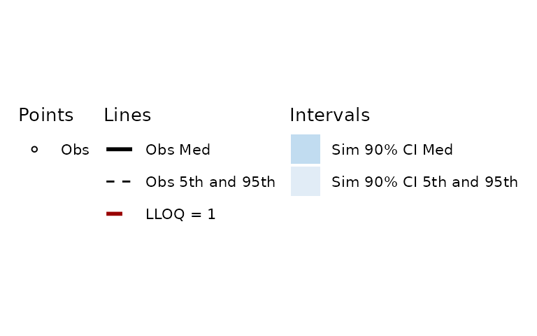

## Updating the plot theme

The `theme` field takes any ggplot2 theme object and replaces the
`pmxhelpr` house theme wholesale. Build on the house theme by adding to
it rather than starting over:

``` r

plot_dvtime(
  data_pk, dv_var = ODV, col_var = `Dose and Food`,
            cent = "mean_sdl_upper",
  style = style_dvtime(
    ylabel = "Concentration (ng/mL)", xlabel = "Time (hours)",
    xbreaks = seq(0, 168, 24),
    theme  = theme_minimal(base_size = 8) + 
      theme(panel.grid.minor = element_blank(),
                   panel.grid.major = element_blank(),
                   legend.position  = "bottom")
  )
)
```

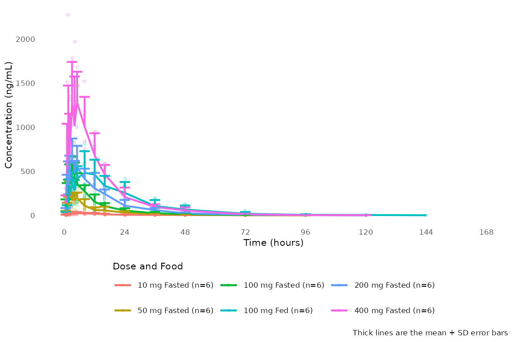

## Post-hoc styling: making aesthetic changes with `restyle_plot()`

`ggstylekit` not only handles plot styling *a priori*, it also handles
plot styling *a posteriori* after a finished plot object has been
generated.

[`restyle_plot()`](https://rdrr.io/pkg/ggstylekit/man/restyle_plot.html)
merges style fields onto a finished plot. Restyling works analogously to
the up front styling with style specs.

For example, if one wanted to remove points and the legend from an
existing plot, this can be accomplished as follows with `restyle_plot`.

``` r

p <- plot_dvtime(data_pk, dv_var = ODV, cent = "median", log_y = TRUE, 
                 loq_method = 2,
                 style = style_dvtime(
                   xlabel = "Time (hours)", 
                   ylabel = "Dose-normalized Conc. (ng/mL/mg)",
                   xbreaks = seq(0, 168, 24)
                 ))
p
```

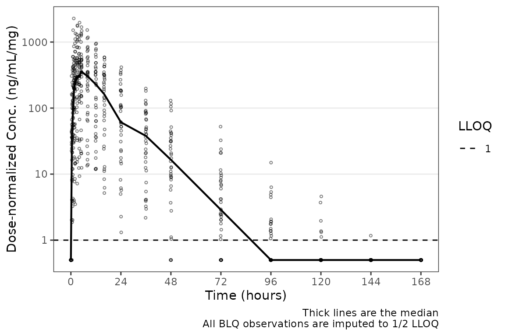

``` r


restyle_plot(p, 
             alphas = c(obs_point = 0), 
             legends = legend_spec(channel = "linetype", hide = TRUE))
```

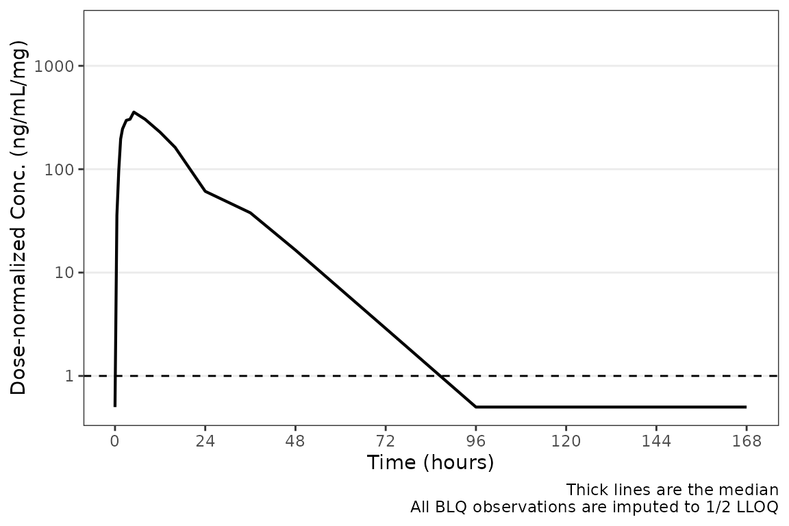

## Post-hoc styling: surfacing new variables with `reveal()`

One of the most powerful features of `ggstylekit` is the
[`reveal()`](https://rdrr.io/pkg/ggstylekit/man/reveal.html) function.

[`reveal()`](https://rdrr.io/pkg/ggstylekit/man/reveal.html) maps a
variable present in the underlying plot dataset that is not currently
mapped to a graphical channel (or a facet).

### Mapping to all layers with `as =`

Use `as =` to inherit that channel’s default values.

``` r

reveal(p, `Food Status`, as = "colors")
```

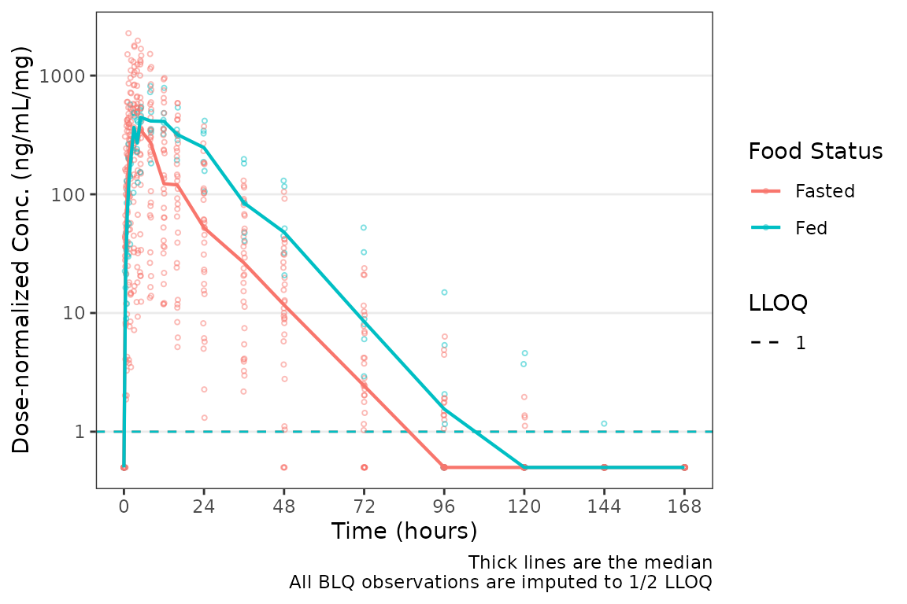

Alternatively, the values can be supplied manually.

``` r

reveal(p, `Food Status`,
       colors = c(Fasted = "#3388cc", Fed = "firebrick"),
       labels = c(Fasted = "Fasted (overnight)", Fed = "Fed (high-fat)"))
```

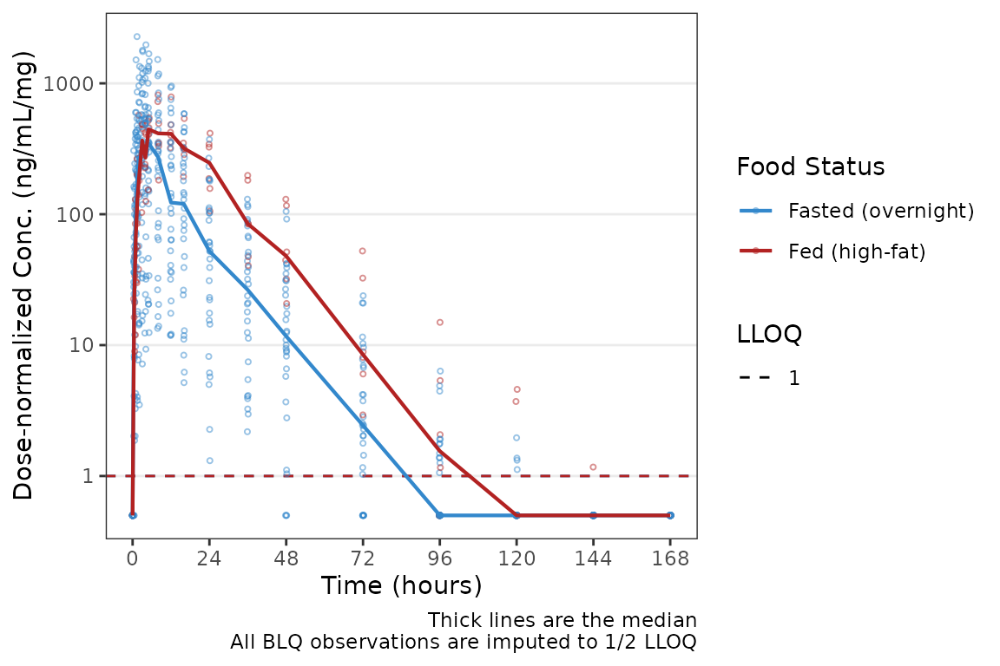

Facets are also a channel that can be mapped like any other with
`reveal`.

``` r

p2 <- reveal(p, `Food Status`, as = "facet", 
       colors = c(Fasted = "#3388cc", Fed = "firebrick"),
       labels = c(Fasted = "Fasted (overnight)", Fed = "Fed (high-fat)"))

p2
```

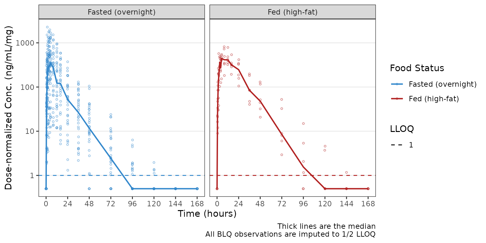

### Targeting specific layers with `on`

By default, [`reveal()`](https://rdrr.io/pkg/ggstylekit/man/reveal.html)
maps the variable onto every layer that can display the channel. The
`on` argument narrows this to an **entity** — `"point"`, `"line"`,
`"bar"`, `"area"`, or `"box"` — or to a named **series**.

Here the central tendency line and its error bars are left unmapped,
reflecting the totality of the data, while the points are mapped to food
status with `on`

``` r

p_sdl <- plot_dvtime(data_pk, dv_var = ODV, cent = "mean_sdl", log_y = TRUE,
                     style = style_dvtime(xlabel = "Time (hours)",
                                          ylabel = "Concentration (ng/mL)",
                                          xbreaks = seq(0, 168, 24)))

reveal(p_sdl, `Food Status`, as = "colors", on = "point")
```

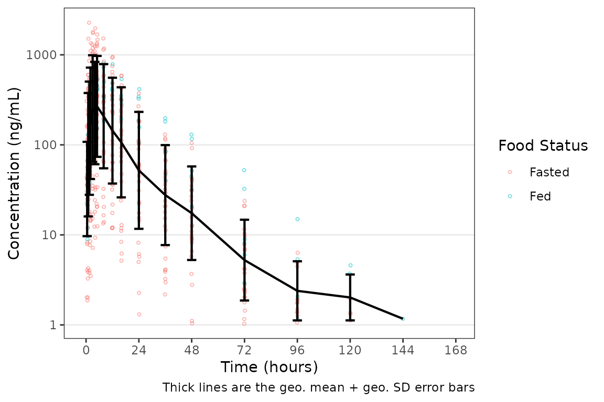

Values are supplied with `on` exactly as they are without it.

``` r

reveal(p_sdl, `Food Status`, on = "point",
       colors = c(Fasted = "#3388cc", Fed = "firebrick"),
       labels = c(Fasted = "Fasted (overnight)", Fed = "Fed (high-fat)"))
```

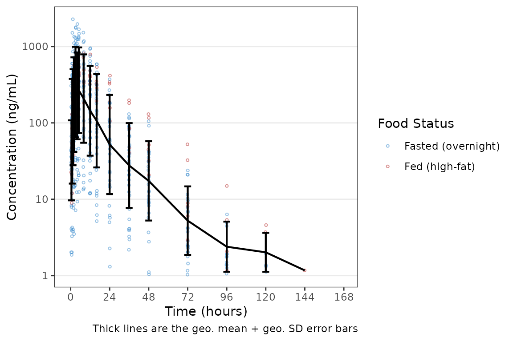

`on` is also how a channel that is already in use is revealed onto. A
plot built with `col_var` already maps color, and revealing a second
variable onto color without `on` returns the plot unchanged, with a
message naming the entities and series available to target. Two
variables sharing one channel are drawn in a single legend, so revealing
onto a free channel — `as = "shapes"`, `as = "linetypes"`,
`as = "facet"` — is usually the clearer choice.

## Combining plots with `combine_styled_plots`

[`combine_styled_plots()`](https://rdrr.io/pkg/ggstylekit/man/combine_styled_plots.html)
arranges several styled plots into one figure with a **single collected
legend**.

Build the panels with a shared style so the collected legend is
meaningful.

``` r

panel_style_gm <- style_dvtime(
  alphas = c(obs_point = 0.3),
  xlabel = "Time (hours)",
  ylabel = "Concentration (ng/mL)",
  title = "Geometric Mean"
)

panel_style_med <- style_dvtime(
  alphas = c(obs_point = 0.3),
  xlabel = "Time (hours)",
  ylabel = "Concentration (ng/mL)",
  title = "Median"
)

p_mean <- plot_dvtime(data_pk, dv_var = ODV, col_var = `Food Status`,
                      cent = "mean", log_y = TRUE,
                      style = panel_style_gm)

p_median <- plot_dvtime(data_pk, dv_var = ODV, col_var = `Food Status`,
                        cent = "median", log_y = TRUE,
                        style = panel_style_med)
```

Then combine them. Unnamed arguments are the plots. Named arguments pass
through to
[`patchwork::wrap_plots()`](https://patchwork.data-imaginist.com/reference/wrap_plots.html),
so `axes = "collect"` also de-duplicates the shared axis labels.

``` r

p_combo <- combine_styled_plots(p_mean, p_median, ncol = 2, axes = "collect")
p_combo
```

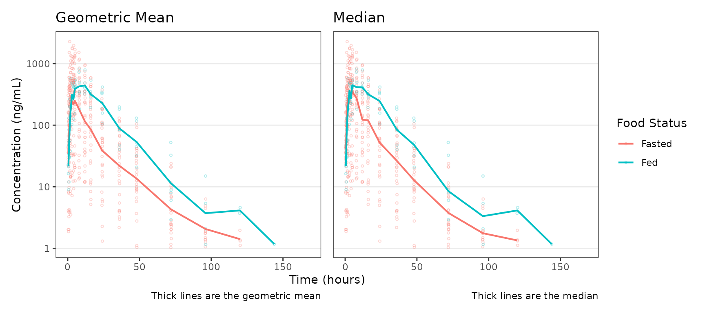

The combined figure is still a styled object, so
[`restyle_plot()`](https://rdrr.io/pkg/ggstylekit/man/restyle_plot.html)
and [`reveal()`](https://rdrr.io/pkg/ggstylekit/man/reveal.html)
continue to work. Here the collected legend is re-titled and moved to
the bottom of the figure:

``` r

restyle_plot(p_combo, 
             legends = legend_spec(`Food Status`, title = "Meal Status",
                                   labels = c(Fasted = "Fasted (overnight)", 
                                              Fed = "Fed (high-fat)")),
             colors = c(Fasted = "#3388cc", Fed = "firebrick"),
             legend.position = "bottom")
```

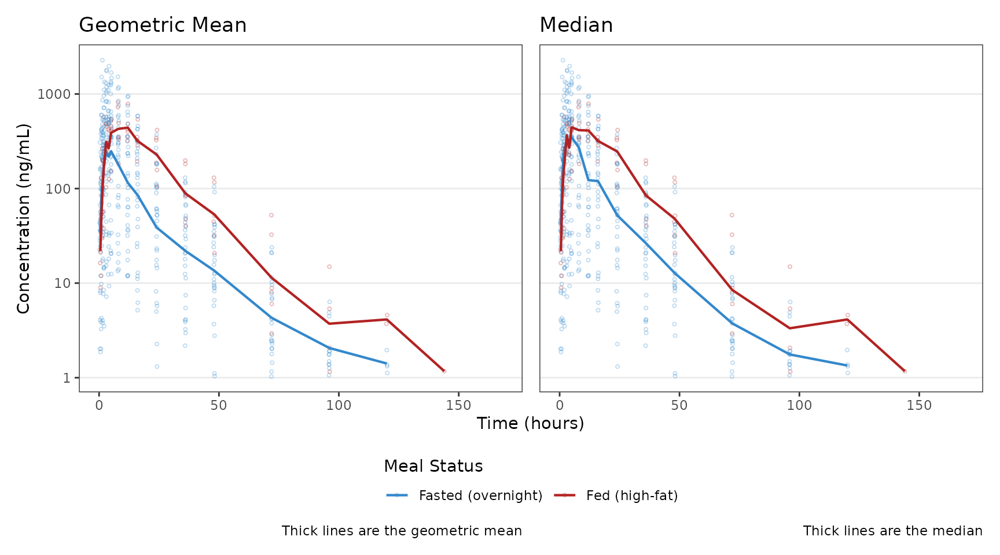

`legend.position` moves the collected legend on the combined figure, as
[`restyle_plot()`](https://rdrr.io/pkg/ggstylekit/man/restyle_plot.html)
reaches the assembled figure and not only the individual panels. Note
that `labels` is not a style field: legend entries are relabeled through
the `labels` argument of
[`legend_spec()`](https://rdrr.io/pkg/ggstylekit/man/legend_spec.html),
as above.

Panels do not have to come from the same plot family; however, legends
need to be **identical** and drawn from the same layer sets. Here
concentration vs time and response vs concentration panels colored by an
indicator variable for female sex (SEXF).

The legend is suppressed in one plot in order to have only a single
legend collected into the paneled combined plot, as even though the
legends are visually identical, they are built from different layers.

``` r

p_pk <- plot_dvtime(data_pk, dv_var = ODV, col_var = SEXF,
                    dose_var = DOSE, dosenorm = TRUE,
                    cent = "mean", log_y = TRUE,
                    style = style_dvtime(xlabel = "Time (hours)",
                                         ylabel = "Dose-normalized Conc. (ng/mL/mg)", 
                                         xbreaks = seq(0, 168, 24),
                                         legends = legend_spec(channel = "color", 
                                                               hide = TRUE)))

p_pd <- plot_dvconc(data_pd, dv_var = CFB, idv_var = CONC, col_var = SEXF,
                    col_trend = TRUE, ref = 0, loess = TRUE,
                    style = style_dvconc(xlabel = "Concentration (ng/mL)",
                                         ylabel = "Response (% CFB)"))

combine_styled_plots(p_pk, p_pd, ncol = 2)
```

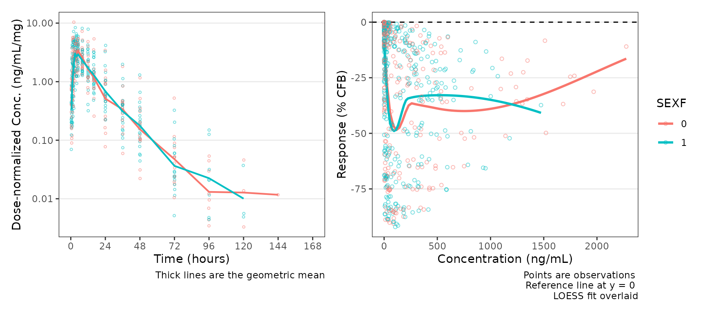

Two things to keep in mind when generated combined plots with
`combine_styled_plots`:

- [`combine_styled_plots()`](https://rdrr.io/pkg/ggstylekit/man/combine_styled_plots.html)
  **flattens** the input plot panels and discards any patchwork
  annotations or layouts. Add titles and tags to the combined plot
  returned with
  [`patchwork::plot_annotation()`](https://patchwork.data-imaginist.com/reference/plot_annotation.html).
- `guides = "collect"` is the default. Pass `guides` explicitly to
  override it.

``` r

combine_styled_plots(p_pk, p_pd, ncol = 2) +
  plot_annotation(title = "Single ascending dose PK/PD", tag_levels = "A")
```

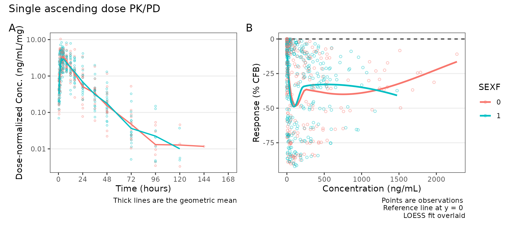
