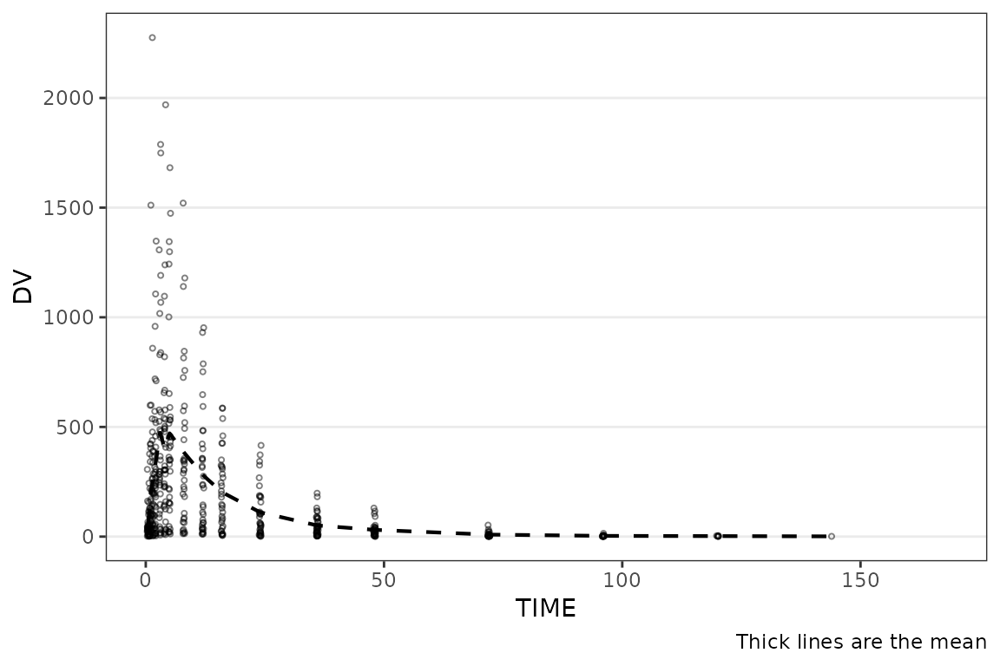
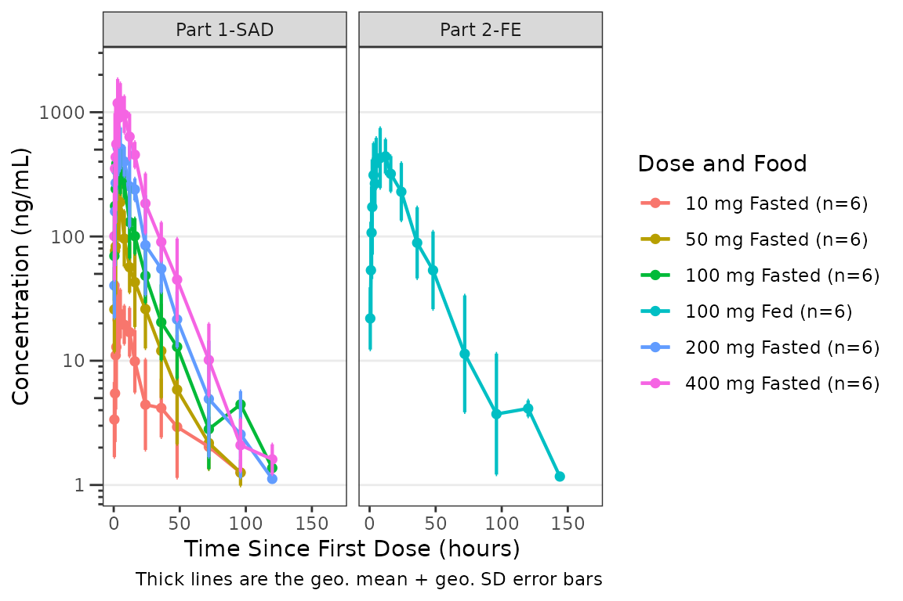
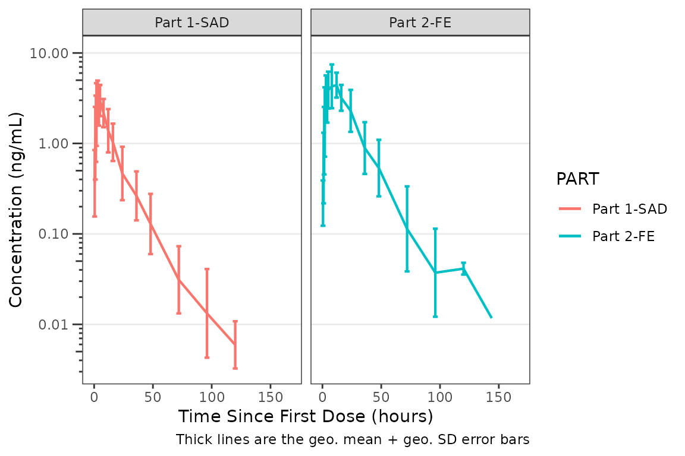
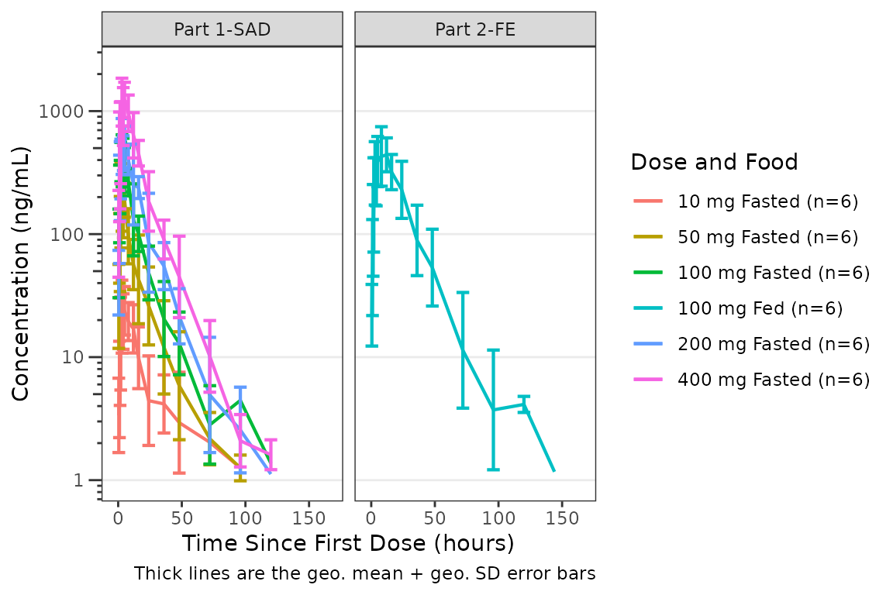
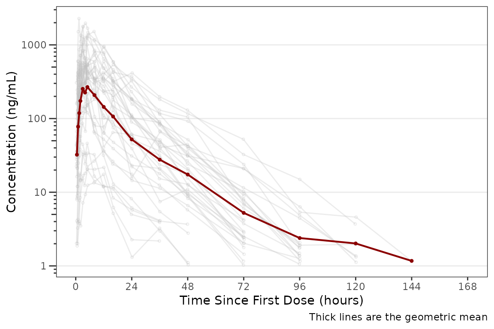
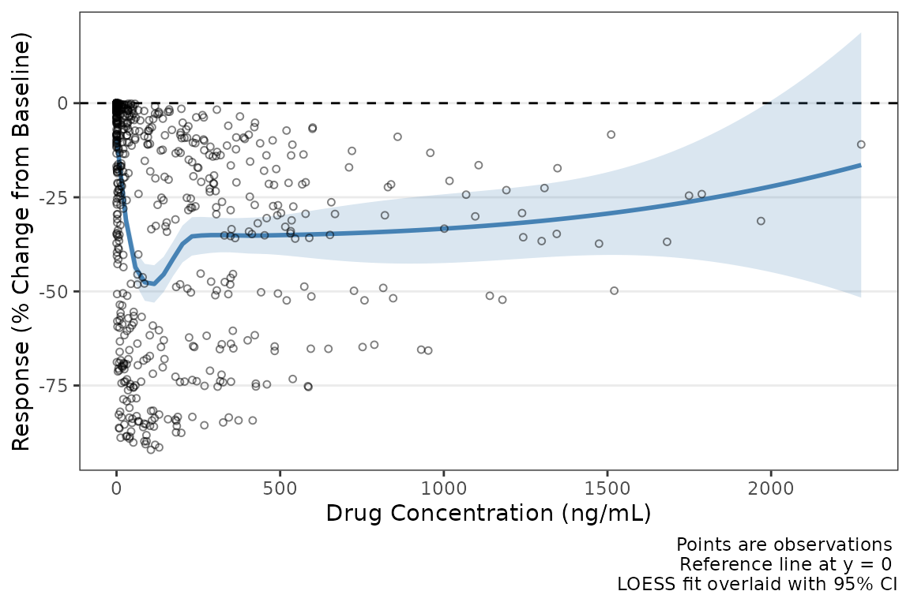
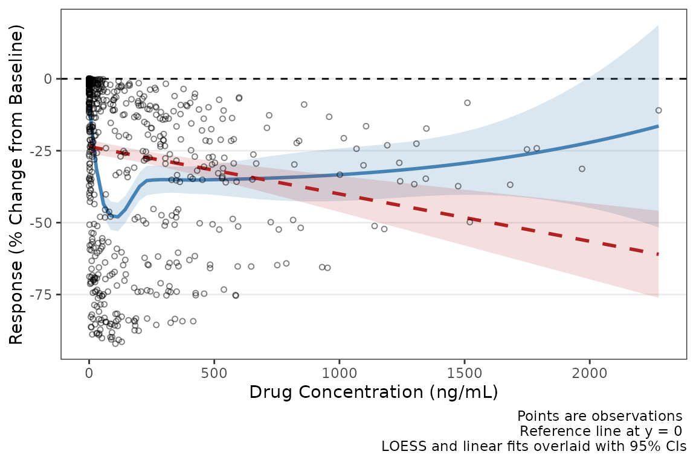
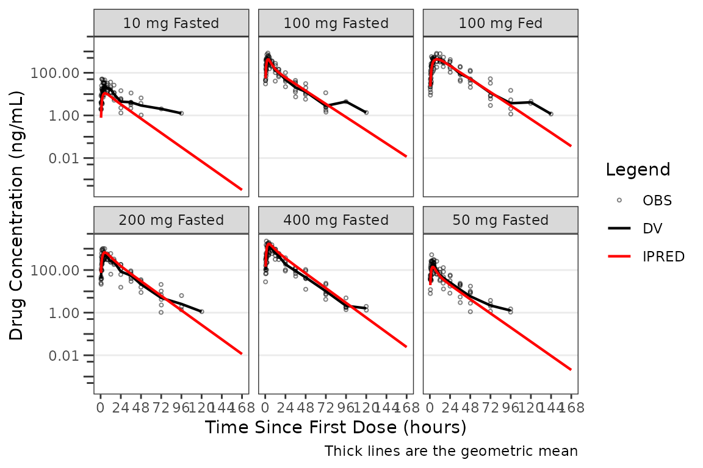
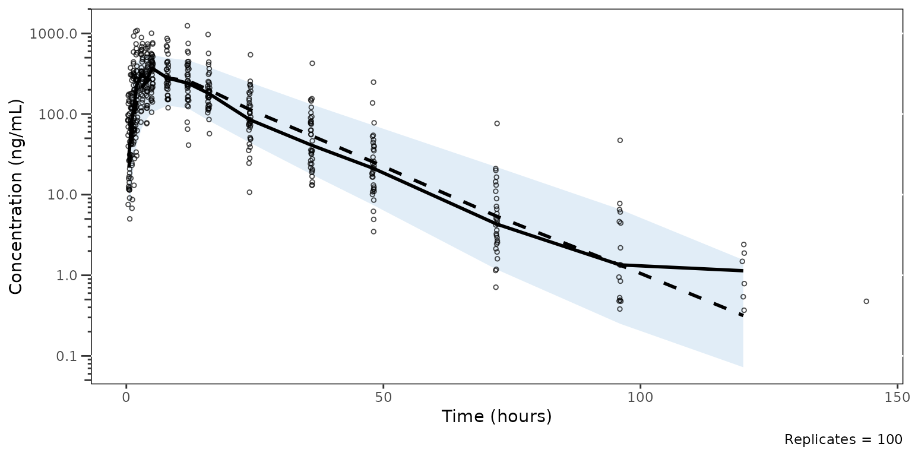

# Plot Themes and Aesthetics

This vignette will demonstrate `pmxhelpr` functions for viewing and
modifying plot themes and theme elements for all package plotting
functions, which includes
[`plot_dvtime()`](https://ryancrass.github.io/pmxhelpr/reference/plot_dvtime.md),
[`plot_dvconc()`](https://ryancrass.github.io/pmxhelpr/reference/plot_dvconc.md),
[`plot_doseprop()`](https://ryancrass.github.io/pmxhelpr/reference/plot_doseprop.md),
[`plot_gof()`](https://ryancrass.github.io/pmxhelpr/reference/plot_gof.md),
and
[`plot_vpc_cont()`](https://ryancrass.github.io/pmxhelpr/reference/plot_vpc_cont.md).
This vignette will introduce the theory and naming conventions behind
the theme factory functions for each plot, as well as individual plot
element constructors.

``` r

options(scipen = 999, rmarkdown.html_vignette.check_title = FALSE)
library(pmxhelpr)
library(dplyr, warn.conflicts =  FALSE)
library(ggplot2, warn.conflicts =  FALSE)
library(Hmisc, warn.conflicts = FALSE)
library(patchwork, warn.conflicts = FALSE)
```

## Data and Model Objects

The example datasets used in this vignette are based around the
`data_sad` dataset internal to `pmxhelpr`. This dataset is based on a
single ascending dose (SAD) study of an orally administered drug product
with a parallel group food effect (FE) cohort and is formatted in a
analysis-ready format for non-linear mixed effects (NLME) Population PK
or PK/PD modeling. `data_sad_pkfit` is a modified version of `data_sad`,
which includes additional PK model predictions appended.

This vignette will assume familiarity with these internal datasets from
other vignettes. These elements will not be reviewed in detail in this
vignette, which is focused only on theme aesthetic controls across
plotting functions.

### data_sad

Dataset definitions can be viewed by calling
[`?data_sad`](https://ryancrass.github.io/pmxhelpr/reference/data_sad.md).

Let’s define some variables that may be useful in plotting and filter
down to PK or PD relevant records.

``` r

data <- data_sad %>%
  mutate(`Food Status` = ifelse(FOOD == 0, "Fasted", "Fed"),
         DoseFood = paste(DOSE, "mg", `Food Status`)) %>%
  mutate(`Dose and Food` = var_addn(DoseFood, ID))

gof_data <- data_sad_pkfit %>%
  mutate(`Food Status` = ifelse(FOOD == 0, "Fasted", "Fed"),
         DoseFood = paste(DOSE, "mg", `Food Status`)) %>%
  mutate(`Dose and Food` = var_addn(DoseFood, ID))

data_pk <- filter(data, CMT %in% c(1,2))
data_pd <- filter(data, CMT %in% c(1,3))
data_pkfit <- filter(gof_data, CMT %in% c(1,2))
data_nca <- filter(data_sad_nca, PART == "Part 1-SAD")
doseprop_data_nca <- df_doseprop(data_nca, metrics = c("aucinf.obs", "cmax"), metric_name_var = "PPTESTCD")
```

An example PK model (`pkmodel`) in `mrgmod` format is provided in the
internal package library. This is loaded using the helper function
[`model_mread_load()`](https://ryancrass.github.io/pmxhelpr/reference/model_mread_load.md),
which wraps
[`mrgsolve::mread`](https://mrgsolve.org/docs/reference/mread.html).

``` r

model <- model_mread_load("pkmodel")
#> Building pkmodel_cpp ... done.
```

## Overview

Every `pmxhelpr` plot function
([`plot_dvtime()`](https://ryancrass.github.io/pmxhelpr/reference/plot_dvtime.md),
[`plot_dvconc()`](https://ryancrass.github.io/pmxhelpr/reference/plot_dvconc.md),
[`plot_doseprop()`](https://ryancrass.github.io/pmxhelpr/reference/plot_doseprop.md),
[`plot_gof()`](https://ryancrass.github.io/pmxhelpr/reference/plot_gof.md),
[`plot_vpc_cont()`](https://ryancrass.github.io/pmxhelpr/reference/plot_vpc_cont.md))
accepts a `theme` argument that controls the appearance of points,
lines, ribbons, error bars, and reference lines. The theme system has
two layers:

1.  **Element constructors**
    ([`pmx_point()`](https://ryancrass.github.io/pmxhelpr/reference/pmx_point.md),
    [`pmx_line()`](https://ryancrass.github.io/pmxhelpr/reference/pmx_line.md),
    etc.) define *what* to style. Each constructor maps directly to a
    `ggplot2` geom and only accepts aesthetics relevant to that geom.

2.  **Theme factories**
    ([`plot_dvtime_theme()`](https://ryancrass.github.io/pmxhelpr/reference/plot_dvtime_theme.md),
    [`plot_gof_theme()`](https://ryancrass.github.io/pmxhelpr/reference/plot_gof_theme.md),
    etc.) define *where* those elements go. Each factory returns a named
    list of default element objects, one per visual layer in the plot.
    User overrides are merged field-by-field into these defaults.

This design means every plot function uses the same workflow. The
defaults can be viewed by calling the theme factory function
corresponding to the plot with no arguments, which produces default plot
aesthetics.

``` r

# View defaults
plot_dvtime_theme()
#> <plot_dvtime_theme>
#>   obs_point     <pmx_point>: shape = 1, size = 0.75, alpha = 0.5
#>   obs_line      <pmx_line>: linewidth = 0.5, linetype = 1, alpha = 0.5
#>   cent_point    <pmx_point>: shape = 16, size = 1.25, alpha = 0
#>   cent_line     <pmx_line>: linewidth = 0.75, linetype = 1, alpha = 1
#>   cent_errorbar <pmx_errorbar>: linewidth = 0.75, linetype = 1, alpha = 1, width = NULL
#>   ref_line      <pmx_line>: linewidth = 0.5, linetype = 2, alpha = 1
#>   loq_line      <pmx_line>: linewidth = 0.5, linetype = 2, alpha = 1
```

``` r

plot_dvtime(data_pk, dv_var = ODV, theme = plot_dvtime_theme())
```


The workflow to update themes is consistent across plotting functions.

``` r

# Override specific fields — unspecified fields keep their defaults
new_dvtime_theme <- plot_dvtime_theme(cent_line = pmx_line(linetype = "dashed"))
plot_dvtime(data_pk, dv_var = ODV, theme = new_dvtime_theme)
```



## Element Constructors

Each constructor creates a named list with an S3 class tag.

``` r

# Full element with all fields
pmx_point(shape = 16, size = 1.25, alpha = 1, color = "blue")
#> <pmx_point>
#>   shape = 16, size = 1.25, alpha = 1, color = blue
```

Only non-NULL fields are stored, so partial overrides are easy to define
by only passing the elements to override. When a user-supplied element
is merged into a default, each specified field replaces the
corresponding default. Unspecified fields are preserved. This occurs
without user input in the plot theme constructor factory functions.

``` r

# Partial override — only the fields you want to change
pmx_point(size = 2)
#> <pmx_point>
#>   size = 2
```

The available element constructors are as follows:

- [`pmx_point()`](https://ryancrass.github.io/pmxhelpr/reference/pmx_point.md)
  - `ggplot` layers:`geom_point`, `stat_summary`
  - function fields: `shape`, `size`, `alpha`, `color`
- [`pmx_line()`](https://ryancrass.github.io/pmxhelpr/reference/pmx_line.md)
  - `ggplot` layers:`geom_line`, `geom_hline`
  - function fields: `shape`, `size`, `alpha`, `color`
- [`pmx_ribbon()`](https://ryancrass.github.io/pmxhelpr/reference/pmx_ribbon.md)
  - `ggplot` layers:`geom_ribbon`
  - function fields: `fill`, `alpha`, `color`, `linetype`, `linewidth`
- [`pmx_errorbar()`](https://ryancrass.github.io/pmxhelpr/reference/pmx_errorbar.md)
  - `ggplot` layers:`geom_errorbar`,
  - function fields: `linewidth`, `linetype`, `alpha`, `width`
- [`pmx_trend()`](https://ryancrass.github.io/pmxhelpr/reference/pmx_trend.md)
  - `ggplot` layers:`geom_smooth`,
  - function fields: `linewidth`, `linetype`, `color`, `se_color`,
    `se_alpha`
- [`pmx_style()`](https://ryancrass.github.io/pmxhelpr/reference/pmx_style.md)
  - Convenience shortcut function
  - function fields: `alpha`, `color`

## Theme Factories

### Naming Convention

Theme keys follow a `role_element` pattern where the **role** identifies
the data layer and the **element** identifies the geom type:

- `obs_point` — observed data, point geom
- `cent_line` — central tendency, line geom
- `ref_line` — reference line, line geom

When a role uses only one geom type, the key uses the role plus the
element suffix (e.g., `ref_line`, `loq_line`).

### Shared Elements Across Factories

Several element roles appear across multiple theme factories:

- Element Key: `ref_line`
  - Element Constructor: `pmx_line`
  - Used in: `plot_dvtime_theme`, `plot_gof_theme`, `plot_dvconc_theme`
- Element Key: `loq_line`
  - Element Constructor: `pmx_line`
  - Used in: `plot_dvtime_theme`, `plot_gof_theme`, `plot_vpc_theme`
- Element Key: `cent_errorbar`
  - Element Constructor: `pmx_errorbar`
  - Used in: `plot_dvtime_theme`, `plot_gof_theme`
- Element Key: `obs_point`
  - Element Constructor: `pmx_point`
  - Used in: `plot_dvtime_theme`, `plot_gof_theme`, `plot_dvconc_theme`

The same constructors and merge logic apply everywhere, so learning the
system once covers all plot types.

### Role-Level Shortcuts with `pmx_style()`

When a role has both `_point` and `_line` elements (e.g., `obs_point`
and `obs_line`), you can set shared aesthetics on both at once using
[`pmx_style()`](https://ryancrass.github.io/pmxhelpr/reference/pmx_style.md).
This is passed to a shared key for observations (`obs`).

``` r

# These two calls produce the same result:
plot_dvtime_theme(obs_point = pmx_point(alpha = 0.3),
                  obs_line = pmx_line(alpha = 0.3))
#> <plot_dvtime_theme>
#>   obs_point     <pmx_point>: shape = 1, size = 0.75, alpha = 0.3
#>   obs_line      <pmx_line>: linewidth = 0.5, linetype = 1, alpha = 0.3
#>   cent_point    <pmx_point>: shape = 16, size = 1.25, alpha = 0
#>   cent_line     <pmx_line>: linewidth = 0.75, linetype = 1, alpha = 1
#>   cent_errorbar <pmx_errorbar>: linewidth = 0.75, linetype = 1, alpha = 1, width = NULL
#>   ref_line      <pmx_line>: linewidth = 0.5, linetype = 2, alpha = 1
#>   loq_line      <pmx_line>: linewidth = 0.5, linetype = 2, alpha = 1

plot_dvtime_theme(obs = pmx_style(alpha = 0.3))
#> <plot_dvtime_theme>
#>   obs_point     <pmx_point>: shape = 1, size = 0.75, alpha = 0.3
#>   obs_line      <pmx_line>: linewidth = 0.5, linetype = 1, alpha = 0.3
#>   cent_point    <pmx_point>: shape = 16, size = 1.25, alpha = 0
#>   cent_line     <pmx_line>: linewidth = 0.75, linetype = 1, alpha = 1
#>   cent_errorbar <pmx_errorbar>: linewidth = 0.75, linetype = 1, alpha = 1, width = NULL
#>   ref_line      <pmx_line>: linewidth = 0.5, linetype = 2, alpha = 1
#>   loq_line      <pmx_line>: linewidth = 0.5, linetype = 2, alpha = 1
```

[`pmx_style()`](https://ryancrass.github.io/pmxhelpr/reference/pmx_style.md)
accepts `color` and `alpha` — the two fields shared by both
[`pmx_point()`](https://ryancrass.github.io/pmxhelpr/reference/pmx_point.md)
and
[`pmx_line()`](https://ryancrass.github.io/pmxhelpr/reference/pmx_line.md).

When both a style shortcut and an explicit element override are
provided, the style is applied first, then the element override wins for
any conflicting fields:

``` r

# Style sets alpha on both point and line,
# then the explicit override changes just the point size
theme <- plot_dvtime_theme(
  obs = pmx_style(alpha = 0.3),
  obs_point = pmx_point(size = 3)
)
theme$obs_point  # alpha = 0.3, size = 3
#> <pmx_point>
#>   shape = 1, size = 3, alpha = 0.3
theme$obs_line   # alpha = 0.3, linewidth = 0.5 (default)
#> <pmx_line>
#>   linewidth = 0.5, linetype = 1, alpha = 0.3
```

### Defaults in Theme Factories

#### Defaults for `plot_dvtime()` in `plot_dvtime_theme()`

``` r

plot_dvtime_theme()
#> <plot_dvtime_theme>
#>   obs_point     <pmx_point>: shape = 1, size = 0.75, alpha = 0.5
#>   obs_line      <pmx_line>: linewidth = 0.5, linetype = 1, alpha = 0.5
#>   cent_point    <pmx_point>: shape = 16, size = 1.25, alpha = 0
#>   cent_line     <pmx_line>: linewidth = 0.75, linetype = 1, alpha = 1
#>   cent_errorbar <pmx_errorbar>: linewidth = 0.75, linetype = 1, alpha = 1, width = NULL
#>   ref_line      <pmx_line>: linewidth = 0.5, linetype = 2, alpha = 1
#>   loq_line      <pmx_line>: linewidth = 0.5, linetype = 2, alpha = 1
```

The relationship between element key, element constructor, and purpose
is defined below:

- `obs_point` \| `pmx_point` \| Observed data points
- `obs_line` \| `pmx_line` \| Individual spaghetti lines connecting
  observations
- `cent_point` \| `pmx_point` \| Central tendency points
- `cent_line` \| `pmx_line` \| Central tendency lines
- `cent_errorbar` \| `pmx_errorbar` \| Central tendency error bars
- `ref_line` \| `pmx_line` \| Reference line (e.g.,
  change-from-baseline, target value)
- `loq_line` \| `pmx_line` \| LOQ reference line

Shortcuts: `obs` = `obs_point`/`obs_line`, `cent` =
`cent_point`/`cent_line` accept
[`pmx_style()`](https://ryancrass.github.io/pmxhelpr/reference/pmx_style.md).

#### Defaults for `plot_gof()` in `plot_gof_theme()`

``` r

plot_gof_theme()
#> <plot_gof_theme>
#>   obs_point     <pmx_point>: shape = 1, size = 0.75, alpha = 0.5, color = darkgrey
#>   obs_line      <pmx_line>: linewidth = 0.5, linetype = 1, alpha = 0.75, color = darkgrey
#>   cent_point    <pmx_point>: shape = 16, size = 1.25, alpha = 0
#>   cent_line     <pmx_line>: linewidth = 0.75, linetype = 1, alpha = 1
#>   cent_errorbar <pmx_errorbar>: linewidth = 0.75, linetype = 1, alpha = 1, width = NULL
#>   ref_line      <pmx_line>: linewidth = 0.5, linetype = 2, alpha = 1
#>   loq_line      <pmx_line>: linewidth = 0.5, linetype = 2, alpha = 1
#>   cent_color    <pmx_color>: dv = blue, pred = red, ipred = green
```

The relationship between element key, element constructor, and purpose
is defined below:

- `obs_point` \| `pmx_point` \| Observed data points (default: darkgrey)
- `obs_line` \| `pmx_line` \| Individual spaghetti lines connecting
  observations (default: darkgrey)
- `cent_point` \| `pmx_point` \| Shared central tendency points for DV,
  PRED, IPRED
- `cent_line` \| `pmx_line` \| Shared central tendency lines for DV,
  PRED, IPRED
- `cent_errorbar` \| `pmx_errorbar` \| Shared central tendency error
  bars
- `ref_line` \| `pmx_line` \| Reference line
- `loq_line` \| `pmx_line` \| LOQ reference line
- `cent_color` \| `pmx_color` \| Overlay color mapping `dv`, `pred`,
  `ipred` (defaults: blue, red, green)

Shortcuts: `obs` = `obs_point`/`obs_line`, `cent` =
`cent_point`/`cent_line` accept
[`pmx_style()`](https://ryancrass.github.io/pmxhelpr/reference/pmx_style.md).
Overlay colors are controlled via `cent_color = pmx_color()`.

#### Defaults for `plot_dvconc` in `plot_dvconc_theme()`

``` r

plot_dvconc_theme()
#> <plot_dvconc_theme>
#>   obs_point <pmx_point>: shape = 1, size = 1.25, alpha = 0.5
#>   ref_line  <pmx_line>: linewidth = 0.5, linetype = 2, alpha = 1
#>   loess     <pmx_trend>: linewidth = 1, linetype = 1, color = black, se_color = lightgrey, se_alpha = 0.4
#>   linear    <pmx_trend>: linewidth = 1, linetype = 2, color = black, se_color = lightgrey, se_alpha = 0.4
```

The relationship between element key, element constructor, and purpose
is defined below:

- `obs_point` \| `pmx_point` \| Observed data points
- `ref_line` \| `pmx_line` \| Reference line (e.g.,
  change-from-baseline)
- `loess` \| `pmx_trend` \| LOESS trend line and confidence interval
- `linear` \| `pmx_trend` \| Linear trend line and confidence interval

Shortcuts using
[`pmx_style()`](https://ryancrass.github.io/pmxhelpr/reference/pmx_style.md)
are not relevant for this function.

#### Defaults for `plot_vpc_cont` in `plot_vpc_theme()`

``` r

plot_vpc_theme()
#> <plot_vpc_theme>
#>   obs_point       <pmx_point>: shape = 1, size = 1, alpha = 0.7, color = #0000FF
#>   obs_median_line <pmx_line>: linewidth = 1, linetype = solid, color = #FF0000
#>   obs_pi_line     <pmx_line>: linewidth = 0.5, linetype = dashed, color = #0000FF
#>   sim_pi_line     <pmx_line>: linewidth = 1, linetype = dotted, color = #000000
#>   sim_pi_ci       <pmx_ribbon>: fill = #0000FF, alpha = 0.15
#>   sim_pi_area     <pmx_ribbon>: fill = #0000FF, alpha = 0.15
#>   sim_median_line <pmx_line>: linewidth = 1, linetype = dashed, color = #000000
#>   sim_median_ci   <pmx_ribbon>: fill = #FF0000, alpha = 0.3
#>   loq_line        <pmx_line>: linewidth = 0.5, linetype = dashed, color = #990000
```

The relationship between element key, element constructor, and purpose
is defined below: + `obs_point` \| `pmx_point` \| Observed data points +
`obs_median_line` \| `pmx_line` \| Observed median line + `obs_pi_line`
\| `pmx_line` \| Observed quantile lines + `sim_pi_line` \| `pmx_line`
\| Simulated prediction interval lines + `sim_pi_ci` \| `pmx_ribbon` \|
Simulated PI confidence interval ribbons + `sim_pi_area` \| `pmx_ribbon`
\| Simulated PI area ribbon + `sim_median_line` \| `pmx_line` \|
Simulated median line + `sim_median_ci` \| `pmx_ribbon` \| Simulated
median CI ribbon + `loq_line` \| `pmx_line` \| LOQ reference line \|

Shortcuts using
[`pmx_style()`](https://ryancrass.github.io/pmxhelpr/reference/pmx_style.md)
are not relevant for this function.

#### Composing themes with the `+` operator

When you have a base theme handle and want to apply an override without
rebuilding from defaults, use the `+` operator. The right-hand side is a
partial `pmx_theme` (built with
[`pmx_theme()`](https://ryancrass.github.io/pmxhelpr/reference/pmx_theme.md)),
and only its keys win — every other key on the left side is preserved.

``` r

base_theme <- plot_vpc_theme()
red_obs    <- pmx_theme(list(obs_point = pmx_point(color = "red")))
new_theme  <- base_theme + red_obs

# Class is preserved — still a plot_vpc_theme
inherits(new_theme, "plot_vpc_theme")
#> [1] TRUE
new_theme$obs_point$color   # "red"
#> [1] "red"
new_theme$sim_pi_ci$fill    # untouched, still the default
#> [1] "#0000FF"
```

[`pmx_theme()`](https://ryancrass.github.io/pmxhelpr/reference/pmx_theme.md)
is the public partial-theme constructor: it takes a named list of
`pmx_element` objects and tags it with the `pmx_theme` class. With no
`subclass` argument the partial is plot-type-agnostic; pass
`subclass = "plot_<type>_theme"` if you need the partial to satisfy a
specific class check.

`+` is also defined on `pmx_element` for layering field-level overrides:

``` r

pmx_point(size = 2, color = "blue") + pmx_point(color = "red")
#> <pmx_point>
#>   size = 2, color = red
```

`theme + NULL` returns the theme unchanged — convenient for
`theme + maybe_extra_theme` patterns where the right side may
conditionally be `NULL`.

## Examples

The following examples demonstrate common customization patterns. Each
pattern applies to any plot function — only the theme factory and
element keys change. These examples will endeavor to cover common use
cases for default theme overrides.

### Make Theme Overrides Inline

Pass element overrides directly in the `theme` argument. Only the fields
specified are changed. This example removes points for observations,
increases the size of the mean data points, and removes error bar caps
directly within a
[`plot_dvtime()`](https://ryancrass.github.io/pmxhelpr/reference/plot_dvtime.md)
plot call.

``` r

plot_dvtime(data = data_pk, dv_var = ODV, col_var = `Dose and Food`,
            cent = "mean_sdl", log_y = TRUE,
            theme = plot_dvtime_theme(obs_point = pmx_point(alpha = 0),
                                     cent_point = pmx_point(size =2, alpha = 1), 
                                     cent_errorbar = pmx_errorbar(width = 1))) +
  labs(y = "Concentration (ng/mL)", x = "Time Since First Dose (hours)") +
  facet_wrap(~PART)
```



### Make Theme Overrides with a Reusable Theme Object

A more common approach to modifying theme elements is to create a
reusable theme object that can be passed to a series of plots. The
example below produces the same plot output as the inline example above,
but can be recycled to additional plots.

``` r

my_theme <- plot_dvtime_theme(obs_point = pmx_point(alpha = 0),
                                     cent_point = pmx_point(size =2, alpha = 1), 
                                     cent_errorbar = pmx_errorbar(width = 1))

plot_dvtime(data = data_pk, dv_var = ODV, col_var = `Dose and Food`,
            cent = "mean_sdl", log_y = TRUE,
            theme = my_theme) +
  scale_x_continuous(breaks = seq(0, 168, 24))+
  labs(y = "Concentration (ng/mL)", x = "Time Since First Dose (hours)") +
  facet_wrap(~PART)
```


### Remove Individual Data Points

A common use case for the `theme` argument is to set to `alpha = 0` for
data points to remove them from the plot. Those that are also part of a
layer including both points and lines, may also be removed by setting
`size=0` with the corresponding line present. This example removes
points for observations and central tendency means to emphasize the
error bars.

``` r

plot_dvtime(data = data_pk, dv_var = ODV, col_var = PART,
            cent = "mean_sdl", dosenorm = TRUE, log_y = TRUE,
            theme = plot_dvtime_theme(obs_point = pmx_point(alpha = 0),
                                     cent_point = pmx_point(size = 0))) +
  labs(y = "Concentration (ng/mL)", x = "Time Since First Dose (hours)") +
  facet_wrap(~PART)
```

 \# Modifying
Error Bar Width

The default error bar width is 2.5% of the maximum nominal time.
Override with the `width` field:

``` r

plot_dvtime(data = data_pk, dv_var = ODV, col_var = `Dose and Food`,
            cent = "mean_sdl", log_y = TRUE,
            theme = plot_dvtime_theme(obs_point = pmx_point(alpha = 0),
                                     cent_errorbar = pmx_errorbar(width = 10))) +
  labs(y = "Concentration (ng/mL)", x = "Time Since First Dose (hours)") +
  facet_wrap(~PART)
```



### Modifying color and alpha for points or lines simultaneously with `pmx_style()`

Use
[`pmx_style()`](https://ryancrass.github.io/pmxhelpr/reference/pmx_style.md)
to change the color of both point and line elements for a role in one
call. This example uses it to change the color and alpha of the
individual spaghetti line colors and the color and alpha of the central
tendency line.

This is useful when you want to fade or recolor an entire layer without
repeating yourself.

``` r

plot_dvtime(data = data_pk, dv_var = ODV, id_var = ID,
            theme = plot_dvtime_theme(obs = pmx_style(color = "grey", alpha = 0.3), 
                                      cent = pmx_style(color = "darkred", alpha = 1)), 
            log_y = TRUE) +
  scale_x_continuous(breaks = seq(0, 168, 24)) +
  labs(y = "Concentration (ng/mL)", x = "Time Since First Dose (hours)") 
```



### Trend Line Customization for `plot_dvconc_theme()` with `pmx_trend()`

[`pmx_trend()`](https://ryancrass.github.io/pmxhelpr/reference/pmx_trend.md)
controls both the trend line and its standard error ribbon. The `color`,
`linewidth`, and `linetype` fields style the line itself, while
`se_color` and `se_alpha` style the confidence ribbon shown when
`se_loess = TRUE` or `se_linear = TRUE`.

An example override of the line color and SE ribbon appearances is
provided below.

``` r

dvconc_theme <- plot_dvconc_theme(loess = pmx_trend(color = "steelblue", linetype = 1,
                                                    se_color = "steelblue", se_alpha = 0.2))

plot_dvconc(data = data_pd, dv_var = CFB, idv_var = CONC,
            loess = TRUE, se_loess = TRUE, ref = 0,
            theme = dvconc_theme) +
  labs(x = "Drug Concentration (ng/mL)", y = "Response (% Change from Baseline)")
```



Both trend elements can be customized independently. Here the LOESS line
is styled as a solid blue line and the linear fit as a dashed red line.

``` r

new_linear_red <- pmx_theme(list(linear = pmx_trend(color = "firebrick", linetype = 2,
                                 se_color = "firebrick", se_alpha = 0.15)))
new_dvconc_theme <- dvconc_theme + new_linear_red

plot_dvconc(data = data_pd, dv_var = CFB, idv_var = CONC,
            ref = 0,
            loess = TRUE, linear = TRUE,
            se_loess = TRUE, se_linear = TRUE,
            theme = new_dvconc_theme) +
  labs(x = "Drug Concentration (ng/mL)", y = "Response (% Change from Baseline)")
```



### Trend line customization for `plot_doseprop_theme()` with `pmx_trend()`

We can also apply customization using `pmx_trend` for
dose-proportionality plots with
[`plot_doseprop_theme()`](https://ryancrass.github.io/pmxhelpr/reference/plot_doseprop_theme.md).
We can recycle the previous `new_linear_red` object since
`plot_doseprop_theme` shares a linear regression fit key.

``` r

new_doseprop_theme <- plot_doseprop_theme() + new_linear_red

plot_doseprop(data = doseprop_data_nca, 
                          theme = new_doseprop_theme)
```


### Customize Colors for Central Tendency using `plot_gof_theme()`

The `cent_color` key in
[`plot_gof_theme()`](https://ryancrass.github.io/pmxhelpr/reference/plot_gof_theme.md)
can be used to change the colors of central tendency lines for PRED,
IPRED, and DV. The example below sets the observed data and observed
data mean line to black and the IPRED mean line to red with the PRED
line suppressed.

``` r

plot_gof(data = data_pkfit, dv_var = ODV, log_y = TRUE,
         theme = plot_gof_theme(obs_point = pmx_point(color = "black"), 
                                cent_color = pmx_color(dv = "black", ipred = "red")), 
         shown = plot_gof_shown(pred = FALSE)) +
  scale_x_continuous(breaks = seq(0, 168, 24))+
  labs(x = "Time Since First Dose (hours)", y = "Drug Concentration (ng/mL)") + 
  facet_wrap(~DoseFood)
```



### Customize VPC Color Scheme with `plot_vpc_theme()`

For VPC workflows, it is almost always preferred to set alternative
theme objects that can be recycled into different VPC plot strata.

The example below sets a new VPC theme using a blue / black color
schema.

``` r

new_vpc_theme <- plot_vpc_theme(obs_point = pmx_point(color = "#000000"),
                                obs_median_line = pmx_line(color = "#000000"),
                                obs_pi_line = pmx_line(color = "#000000"),
                                sim_median_ci = pmx_ribbon(fill = "#3388cc"),
                                sim_pi_ci = pmx_ribbon(fill = "#3388cc"), 
                                sim_pi_area = pmx_ribbon(fill = "#3388cc"))
```

``` r

plot_vpc_cont(
  data = simout,
  pcvpc = TRUE,
  theme = new_vpc_theme,
  min_bin_count = 4,
  shown = plot_vpc_shown(sim_pi_area = TRUE, sim_pi_ci = FALSE, 
                         obs_median_line = TRUE, obs_pi_line = FALSE, 
                         sim_median_line = TRUE, sim_median_ci = FALSE)
) +
  labs(x = "Time (hours)", y = "Concentration (ng/mL)") +
  scale_y_log10(guide = "axis_logticks")
```

 This object can be
passed into
[`plot_vpc_legend()`](https://ryancrass.github.io/pmxhelpr/reference/plot_vpc_legend.md)
to generate a legend matching the custo aesthetics of the plot, which
can be paneled with the `patchwork` package.

``` r

plot_vpc_legend(
  theme = new_vpc_theme,
  shown = plot_vpc_shown(sim_pi_area = TRUE, sim_pi_ci = FALSE, 
                         obs_median_line = TRUE, obs_pi_line = FALSE, 
                         sim_median_line = TRUE, sim_median_ci = FALSE)
) 
```


## Inspecting and Validating Themes

The `pmx_*()` element constructors and `plot_*_theme()` factories return
objects with shared S3 class tags — `pmx_element` and `pmx_theme` — that
provide predicates for programmatic validation and a consistent `print`
method for interactive inspection. These are useful when you build
themes inside helper functions, share them across teams, or test that
overrides have produced the expected structure.

### Print Methods

Every element constructor returns an object whose
[`print()`](https://rdrr.io/r/base/print.html) method shows the element
type as a banner and the set fields inline. Unset fields (those left at
their `NULL` default) are omitted.

``` r

print(pmx_point(shape = 1, size = 2, alpha = 0.5))
#> <pmx_point>
#>   shape = 1, size = 2, alpha = 0.5
```

Theme factories return objects whose
[`print()`](https://rdrr.io/r/base/print.html) method shows the theme
type as a banner and one line per theme key, listing the inner element
type and its set fields. This is the same format you have already seen
when calling
[`plot_dvtime_theme()`](https://ryancrass.github.io/pmxhelpr/reference/plot_dvtime_theme.md),
[`plot_vpc_theme()`](https://ryancrass.github.io/pmxhelpr/reference/plot_vpc_theme.md),
and the other factories above — the print method dispatches
automatically at the REPL.

``` r

print(plot_dvtime_theme())
#> <plot_dvtime_theme>
#>   obs_point     <pmx_point>: shape = 1, size = 0.75, alpha = 0.5
#>   obs_line      <pmx_line>: linewidth = 0.5, linetype = 1, alpha = 0.5
#>   cent_point    <pmx_point>: shape = 16, size = 1.25, alpha = 0
#>   cent_line     <pmx_line>: linewidth = 0.75, linetype = 1, alpha = 1
#>   cent_errorbar <pmx_errorbar>: linewidth = 0.75, linetype = 1, alpha = 1, width = NULL
#>   ref_line      <pmx_line>: linewidth = 0.5, linetype = 2, alpha = 1
#>   loq_line      <pmx_line>: linewidth = 0.5, linetype = 2, alpha = 1
```

### Predicates

The shared predicates
[`is_pmx_element()`](https://ryancrass.github.io/pmxhelpr/reference/is_pmx_element.md)
and
[`is_pmx_theme()`](https://ryancrass.github.io/pmxhelpr/reference/is_pmx_theme.md)
test whether an object came from any constructor or factory in their
respective families. For a specific-type check, use
`inherits(x, "pmx_point")` (or whichever class) directly — that’s the
standard R idiom and works on every `pmx_*` element and `plot_*_theme`
factory.

``` r

is_pmx_element(pmx_point())                          # TRUE
#> [1] TRUE
is_pmx_element(list(shape = 1))                      # FALSE -- a plain list, not a pmx element
#> [1] FALSE

is_pmx_theme(plot_dvtime_theme())                    # TRUE
#> [1] TRUE
inherits(plot_dvtime_theme(), "plot_dvtime_theme")   # TRUE  -- specific-type check
#> [1] TRUE
inherits(plot_vpc_theme(), "plot_dvtime_theme")   # FALSE
#> [1] FALSE
```

These are inside helper functions that should accept either a
default-built theme or a user override, where you want to fail fast on a
typo (e.g., a plain list mistakenly passed where a theme was expected).

### Class Propagation Through Merge

User overrides are merged into the default theme via the internal
[`merge_theme()`](https://ryancrass.github.io/pmxhelpr/reference/merge_theme.md)
helper at plot time. The merge preserves the theme’s class tags, so a
customized theme still satisfies both the shared predicate and any
specific-type [`inherits()`](https://rdrr.io/r/base/class.html) check.

``` r

custom <- plot_dvtime_theme(obs_point = pmx_point(size = 2),
                            cent_line = pmx_line(linetype = "dashed"))

is_pmx_theme(custom)                          # TRUE
#> [1] TRUE
inherits(custom, "plot_dvtime_theme")         # TRUE
#> [1] TRUE
class(custom)
#> [1] "plot_dvtime_theme" "pmx_theme"
```

This means programmatic theme-building and theme-validation pipelines
work uniformly on raw factory output and on any sequence of overrides
applied to it.

### Composing themes and elements with the `+` operator

Themes and elements support a ggplot-style `+` operator that performs a
left-to-right merge: each set field on the right-hand side overrides the
matching field on the left, and unset fields on the right leave the
left-hand side untouched. The merged object keeps the class vector of
the left-hand side, so partial overrides applied to a typed factory
output stay typed.

``` r

base  <- plot_vpc_theme()
patch <- pmx_theme(list(obs_point = pmx_point(color = "red")))
combined <- base + patch

inherits(combined, "plot_vpc_theme")   # TRUE -- subclass preserved through the merge
#> [1] TRUE
combined$obs_point$color               # "red" -- patch field wins
#> [1] "red"
combined$obs_point$shape               # 1    -- base field persists (patch did not set it)
#> [1] 1
```

The same operator works on individual elements, which is useful when you
want to layer a small role-specific tweak onto a shared default element
rather than rebuilding the element from scratch.

``` r

shape_default <- pmx_point(shape = 1, size = 1)
color_patch   <- pmx_point(color = "#3388cc")
shape_default + color_patch
#> <pmx_point>
#>   shape = 1, size = 1, color = #3388cc
```

Two further predicates round out the class system.
[`is_pmx_stats()`](https://ryancrass.github.io/pmxhelpr/reference/is_pmx_stats.md)
is the shared parent predicate — it matches every stats subclass
(`vpc_stats`, `doseprop_stats`) and is the right test in code that
should accept any of them.
[`is_pmx_vpc_plot()`](https://ryancrass.github.io/pmxhelpr/reference/is_pmx_vpc_plot.md)
identifies plot objects whose `+` method emits the facet-warning
behavior described in the VPC workflow article.

``` r

is_pmx_stats(doseprop_data_nca)        # TRUE -- doseprop_stats inherits from pmx_stats
#> [1] TRUE

vpc_p <- plot_vpc_cont(simout, pcvpc = TRUE)
is_pmx_vpc_plot(vpc_p)                 # TRUE
#> [1] TRUE
```
