# VPC Plots with Exact Bins

This vignette will review the limitations of the
[`vpc()`](https://rdrr.io/pkg/vpc/man/vpc.html) function in the `vpc`
package for datasets containing an exact binning variable. This was the
motivating reason for development of
[`plot_vpc_exactbins()`](https://ryancrass.github.io/pmxhelpr/reference/plot_vpc_exactbins.md).

The `vpc`package offers a lot of great functionality to generate VPC
plots including, but certainly not limited to:

1.  data processing and visualization steps combined in one function
2.  built-in options for automatic binning for datasets without a binned
    time variable
3.  built-in option for prediction-correction
4.  built-in option for censoring at the lower limit of quantification
    (LLOQ)

However, although [`vpc()`](https://rdrr.io/pkg/vpc/man/vpc.html)
contains many great options to automatically identify bins in the data,
it is not optimized to leverage input datasets with variable a variable
representing exact bin times (e.g., nominal, or protocol-specified,
times).

First, we will load the required packages.

``` r
options(scipen = 999, rmarkdown.html_vignette.check_title = FALSE)
library(pmxhelpr)
library(dplyr, warn.conflicts =  FALSE)
library(ggplot2, warn.conflicts =  FALSE)
library(vpc, warn.conflicts =  FALSE)
library(mrgsolve, warn.conflicts =  FALSE)
library(withr, warn.conflicts =  FALSE)
```

## Analysis Dataset

Next let’s explore the input dataset, `data_sad`. This dataset was
generated via simulation from `model`, an `mrgsolve` model internal to
the pmxhelpr package.

We can take a quick look at the dataset using
[`glimpse()`](https://pillar.r-lib.org/reference/glimpse.html) from the
dplyr package. Documentation for the dataset can also be viewed using
the R help functionality, just as one would for a function, with
`?data_sad()`

``` r
glimpse(data_sad)
#> Rows: 720
#> Columns: 23
#> $ LINE    <dbl> 1, 2, 3, 4, 5, 6, 7, 8, 9, 10, 11, 12, 13, 14, 15, 16, 17, 18,…
#> $ ID      <dbl> 1, 1, 1, 1, 1, 1, 1, 1, 1, 1, 1, 1, 1, 1, 1, 1, 1, 1, 1, 1, 2,…
#> $ TIME    <dbl> 0.00, 0.00, 0.48, 0.81, 1.49, 2.11, 3.05, 4.14, 5.14, 7.81, 12…
#> $ NTIME   <dbl> 0.0, 0.0, 0.5, 1.0, 1.5, 2.0, 3.0, 4.0, 5.0, 8.0, 12.0, 16.0, …
#> $ NDAY    <dbl> 1, 1, 1, 1, 1, 1, 1, 1, 1, 1, 1, 1, 2, 2, 3, 4, 5, 6, 7, 8, 1,…
#> $ DOSE    <dbl> 10, 10, 10, 10, 10, 10, 10, 10, 10, 10, 10, 10, 10, 10, 10, 10…
#> $ AMT     <dbl> NA, 10, NA, NA, NA, NA, NA, NA, NA, NA, NA, NA, NA, NA, NA, NA…
#> $ EVID    <dbl> 0, 1, 0, 0, 0, 0, 0, 0, 0, 0, 0, 0, 0, 0, 0, 0, 0, 0, 0, 0, 0,…
#> $ ODV     <dbl> NA, NA, NA, 2.02, 4.02, 3.50, 7.18, 9.31, 12.46, 13.43, 12.11,…
#> $ LDV     <dbl> NA, NA, NA, 0.7031, 1.3913, 1.2528, 1.9713, 2.2311, 2.5225, 2.…
#> $ CMT     <dbl> 2, 1, 2, 2, 2, 2, 2, 2, 2, 2, 2, 2, 2, 2, 2, 2, 2, 2, 2, 2, 2,…
#> $ MDV     <dbl> 1, NA, 1, 0, 0, 0, 0, 0, 0, 0, 0, 0, 0, 0, 1, 1, 1, 1, 1, 1, 1…
#> $ BLQ     <dbl> -1, NA, 1, 0, 0, 0, 0, 0, 0, 0, 0, 0, 0, 0, 1, 1, 1, 1, 1, 1, …
#> $ LLOQ    <dbl> 1, NA, 1, 1, 1, 1, 1, 1, 1, 1, 1, 1, 1, 1, 1, 1, 1, 1, 1, 1, 1…
#> $ FOOD    <dbl> 0, 0, 0, 0, 0, 0, 0, 0, 0, 0, 0, 0, 0, 0, 0, 0, 0, 0, 0, 0, 0,…
#> $ SEXF    <dbl> 1, 1, 1, 1, 1, 1, 1, 1, 1, 1, 1, 1, 1, 1, 1, 1, 1, 1, 1, 1, 1,…
#> $ RACE    <dbl> 2, 2, 2, 2, 2, 2, 2, 2, 2, 2, 2, 2, 2, 2, 2, 2, 2, 2, 2, 2, 1,…
#> $ AGEBL   <int> 25, 25, 25, 25, 25, 25, 25, 25, 25, 25, 25, 25, 25, 25, 25, 25…
#> $ WTBL    <dbl> 82.1, 82.1, 82.1, 82.1, 82.1, 82.1, 82.1, 82.1, 82.1, 82.1, 82…
#> $ SCRBL   <dbl> 0.87, 0.87, 0.87, 0.87, 0.87, 0.87, 0.87, 0.87, 0.87, 0.87, 0.…
#> $ CRCLBL  <dbl> 128, 128, 128, 128, 128, 128, 128, 128, 128, 128, 128, 128, 12…
#> $ USUBJID <chr> "STUDYNUM-SITENUM-1", "STUDYNUM-SITENUM-1", "STUDYNUM-SITENUM-…
#> $ PART    <chr> "Part 1-SAD", "Part 1-SAD", "Part 1-SAD", "Part 1-SAD", "Part …
```

This dataset is formatted for modeling. It contains NONMEM reserved
variables (e.g., ID, TIME, AMT, EVID, MDV), as well as, dependent
variables of drug concentration in original units (ODV) and natural
logarithm transformed units (LDV). In addition to the numeric variables,
there are two character variables: USUBJID and PART.

PART specifies the two study cohorts:

- Single Ascending Dose (SAD)
- Food Effect (FE).

``` r
unique(data_sad$PART)
#> [1] "Part 1-SAD" "Part 2-FE"
```

This dataset also contains an exact binning variable:

- Nominal Time (NTIME).

This variable represents the nominal time of sample collection relative
to first dose per study protocol whereas Actual Time (TIME) represents
the actual time the sample was collected.

``` r
##Unique values of NTIME
unique(data_sad$NTIME)
#>  [1]   0.0   0.5   1.0   1.5   2.0   3.0   4.0   5.0   8.0  12.0  16.0  24.0
#> [13]  36.0  48.0  72.0  96.0 120.0 144.0 168.0

##Comparison of number of unique values of NTIME and TIME
length(unique(data_sad$NTIME))
#> [1] 19
length(unique(data_sad$TIME))
#> [1] 449
```

## PK Model

Luckily for us, someone has already fit a PK model to these data! Let’s
load `model` by calling
[`model_mread_load()`](https://ryancrass.github.io/pmxhelpr/reference/model_mread_load.md)
and take a look at it with the
[`see()`](https://mrgsolve.org/docs/reference/see.html) function from
the `mrgsolve` package.

``` r
model <- model_mread_load("model")
#> Building model_cpp ... done.
see(model)
#> 
#> Model file:  model.cpp 
#> $PARAM
#> TVCL = 20
#> TVVC = 35.7
#> TVKA = 0.3
#> TVQ = 25
#> TVVP = 150
#> DOSE_F1 = 0.33
#> 
#> WT_CL = 0.75
#> WT_VC = 1.00
#> WT_Q = 0.75
#> WT_VP = 1.00
#> FOOD_KA = -0.5
#> FOOD_F1 = 1.33
#> 
#> WT = 70
#> DOSE = 100
#> FOOD = 0
#> 
#> $CMT GUT CENT PERIPH TRANS1 TRANS2
#> 
#> $MAIN
#> double CL = TVCL*pow(WT/70,WT_CL)*exp(ETA_CL);
#> double VC  = TVVC*pow(WT/70, WT_VC)*exp(ETA_VC);
#> double Q = TVCL*pow(WT/70,WT_Q)*exp(ETA_Q);
#> double VP  = TVVP*pow(WT/70, WT_VP)*exp(ETA_VP);
#> double KA = TVKA*(1+FOOD_KA*FOOD)*exp(ETA_KA);
#> double F1 = 1*(1+FOOD_F1*FOOD)*pow(DOSE/100,DOSE_F1);
#> 
#> F_GUT = F1;
#> 
#> $ODE
#> dxdt_GUT = -KA*GUT;
#> dxdt_CENT = KA*TRANS1 - (CL/VC)*CENT + (Q/VP)*PERIPH - (Q/VC)*CENT;
#> dxdt_PERIPH = (Q/VC)*CENT - (Q/VP)*PERIPH;
#> dxdt_TRANS1 = KA*GUT - KA*TRANS1;
#> dxdt_TRANS2 = KA*TRANS1 - KA*TRANS2;
#> 
#> $OMEGA @labels ETA_CL ETA_VC ETA_KA ETA_Q ETA_VP
#> 0.075 0.1 0.2 0 0
#> 
#> $SIGMA @labels PROP
#> 0.09
#> 
#> $TABLE
#> capture IPRED = CENT/(VC/1000);
#> capture DV = IPRED*(1+PROP);
#> capture Y = DV;
```

Unluckily for us, no one has validated this PK model! Therefore, we need
to generate some Visual Predictive Checks (VPCs).

## VPC Plot Workflow

### Running the simulation

We will use
[`df_mrgsim_replicate()`](https://ryancrass.github.io/pmxhelpr/reference/df_mrgsim_replicate.md)
to run the simulation for the VPC.
[`df_mrgsim_replicate()`](https://ryancrass.github.io/pmxhelpr/reference/df_mrgsim_replicate.md)
is a wrapper function for
[`mrgsim_df()`](https://mrgsolve.org/docs/reference/mrgsim.html), which
uses [`lapply()`](https://rdrr.io/r/base/lapply.html) to iterate the
simulation over integers from 1 to the value passed to the argument
`replicates`.

We can pass `data_sad` and `model` from the previous steps to the `data`
and `model` arguments, respectively, and run the simulation for 100
`replicates`. The names of actual and nominal time variables in
`data_sad` match the default arguments; however, our dependent variable
is named `"ODV"`, which must be specified in the `dv_var` argument,
since it differs from the default (`"DV"`).

We would like to recover the numerical variables `"DOSE"` and `"FOOD"`
and the character variable `"PART"` from the input dataset, as we may
need these study conditions to stratify our VPC plots. We will request
`"BLQ"` and `"LLOQ"` for potential assessment of impact of censoring in
the VPCs, as well as, the NONMEM reserved variables `"CMT"`, `"EVID"`,
and `"MDV"`. Finally, we will add the argument `obsonly = TRUE`, which
is passed to
[`mrgsim()`](https://mrgsolve.org/docs/reference/mrgsim.html), to remove
dose records from the simulation output and reduce file size.

``` r
simout <- df_mrgsim_replicate(data = data_sad, 
                     model = model, 
                     replicates = 100, 
                     dv_var = "ODV",
                     time_vars = c(TIME = "TIME", NTIME = "NTIME"),
                     output_vars = c(PRED = "PRED", IPRED = "IPRED", DV = "DV"),
                     num_vars = c("CMT", "BLQ", "LLOQ", "EVID", "MDV", "DOSE", "FOOD"),
                     char_vars = c("PART"),
                     obsonly = TRUE)

glimpse(simout)
#> Rows: 68,400
#> Columns: 22
#> $ ID     <dbl> 1, 1, 1, 1, 1, 1, 1, 1, 1, 1, 1, 1, 1, 1, 1, 1, 1, 1, 1, 2, 2, …
#> $ TIME   <dbl> 0.00, 0.48, 0.81, 1.49, 2.11, 3.05, 4.14, 5.14, 7.81, 12.08, 16…
#> $ NTIME  <dbl> 0.0, 0.5, 1.0, 1.5, 2.0, 3.0, 4.0, 5.0, 8.0, 12.0, 16.0, 24.0, …
#> $ PRED   <dbl> 0.0000000000, 1.0373644222, 2.4699025938, 5.8692716205, 8.67222…
#> $ IPRED  <dbl> 0.00000000000, 0.23991271053, 0.58097762508, 1.44344928000, 2.2…
#> $ SIMDV  <dbl> 0.0000000000, 0.2070745747, 0.6769646573, 1.8613297145, 1.74160…
#> $ OBSDV  <dbl> NA, NA, 2.02, 4.02, 3.50, 7.18, 9.31, 12.46, 13.43, 12.11, 11.0…
#> $ EVID   <dbl> 0, 0, 0, 0, 0, 0, 0, 0, 0, 0, 0, 0, 0, 0, 0, 0, 0, 0, 0, 0, 0, …
#> $ CMT    <dbl> 2, 2, 2, 2, 2, 2, 2, 2, 2, 2, 2, 2, 2, 2, 2, 2, 2, 2, 2, 2, 2, …
#> $ BLQ    <dbl> -1, 1, 0, 0, 0, 0, 0, 0, 0, 0, 0, 0, 0, 1, 1, 1, 1, 1, 1, -1, 0…
#> $ LLOQ   <dbl> 1, 1, 1, 1, 1, 1, 1, 1, 1, 1, 1, 1, 1, 1, 1, 1, 1, 1, 1, 1, 1, …
#> $ MDV    <dbl> 1, 1, 0, 0, 0, 0, 0, 0, 0, 0, 0, 0, 0, 1, 1, 1, 1, 1, 1, 1, 0, …
#> $ DOSE   <dbl> 10, 10, 10, 10, 10, 10, 10, 10, 10, 10, 10, 10, 10, 10, 10, 10,…
#> $ FOOD   <dbl> 0, 0, 0, 0, 0, 0, 0, 0, 0, 0, 0, 0, 0, 0, 0, 0, 0, 0, 0, 0, 0, …
#> $ GUT    <dbl> 0.00000000000000000, 4.34652773939926984, 4.13276198317304821, …
#> $ CENT   <dbl> 0.000000000000, 0.009786371098, 0.023698880423, 0.058880291437,…
#> $ PERIPH <dbl> 0.00000000000, 0.00080390625, 0.00337854545, 0.01621962833, 0.0…
#> $ TRANS1 <dbl> 0.0000000000000000, 0.3188382667608536, 0.5115783540267899, 0.8…
#> $ TRANS2 <dbl> 0.00000000000000, 0.01169414527583, 0.03166313774719, 0.0965661…
#> $ Y      <dbl> 0.0000000000, 0.2070745747, 0.6769646573, 1.8613297145, 1.74160…
#> $ PART   <chr> "Part 1-SAD", "Part 1-SAD", "Part 1-SAD", "Part 1-SAD", "Part 1…
#> $ SIM    <int> 1, 1, 1, 1, 1, 1, 1, 1, 1, 1, 1, 1, 1, 1, 1, 1, 1, 1, 1, 1, 1, …

max(simout$SIM)
#> [1] 100
```

The maximum value of our replicate count variable (default = `"SIM"`)
indicates that the dataset has been replicated 100 times.

Glimpsing the output reveals the following model outputs:

- `PRED` (population prediction)
- `IPRED` (individual prediction)
- `SIMDV` (simulated dependent variable)
- `OBSDV` (observed dependent variable).

### VPC plots with the `vpc` package

Now that we have run the simulation, we can generate VPC plots using
[`vpc()`](https://rdrr.io/pkg/vpc/man/vpc.html).The documentation for
[`vpc()`](https://rdrr.io/pkg/vpc/man/vpc.html)
(<https://vpc.ronkeizer.com/binning.html>) describes the following
binning methods:

- `time`: Divide bins equally over time (or whatever independent
  variable is used). Recommended only when there is no observable
  clustering in the independent variable.
- `data`: Divide bins equally over the amount of data ordered by
  independent variable. Recommended only when data are for nominal
  timepoints and all datapoints are available.
- `density`: Divide bins based on data-density, i.e. place the
  bin-separators at nadirs in the density function. An approximate
  number of bins can be specified, but it is not certain that the
  algorithm will strictly use the specified number. More info in
  `?auto_bin()`.
- `jenks`: Default and recommended method. Jenk’s natural breaks
  optimization, similar to K-means clustering.
- `kmeans`: K-means clustering.
- `pretty`, `quantile`, `hclust`, `sd`, `bclust`, `fisher`. Methods
  provided by the `classInt` package, see the package help for more
  information.

We can visualize the bins assigned by the various binning approaches in
[`vpc()`](https://rdrr.io/pkg/vpc/man/vpc.html) using by assigning the
plot as an object , let’s call it `plot_object`, and calling
`plot_object$data`.

Because we have multiple dose levels in the SAD portion of the study, as
well as, a food effect cohort, prediction-correction will be used to
plot all the data on a single plot using the argument
`pred_corr = TRUE`.

``` r
vpc_jenks <- vpc(
  sim = simout, 
  obs = filter(simout, SIM == 1), 
  bins = "jenks", #default
  n_bins = "auto", 
  sim_cols = list(dv = "SIMDV", idv = "NTIME", pred = "PRED"),
  obs_cols = list(dv = "OBSDV", idv = "NTIME", pred = "PRED"),
  pred_corr = TRUE,
  pi = c(0.05, 0.95),
  ci = c(0.05, 0.95),
  show = list(obs_dv = TRUE),
  log_y = TRUE,
  xlab = "Time (hours)",
  ylab = "PRED-corrected Concentration (ng/mL)"
) +
  scale_x_continuous(breaks = seq(0,168,24))

vpc_jenks
```

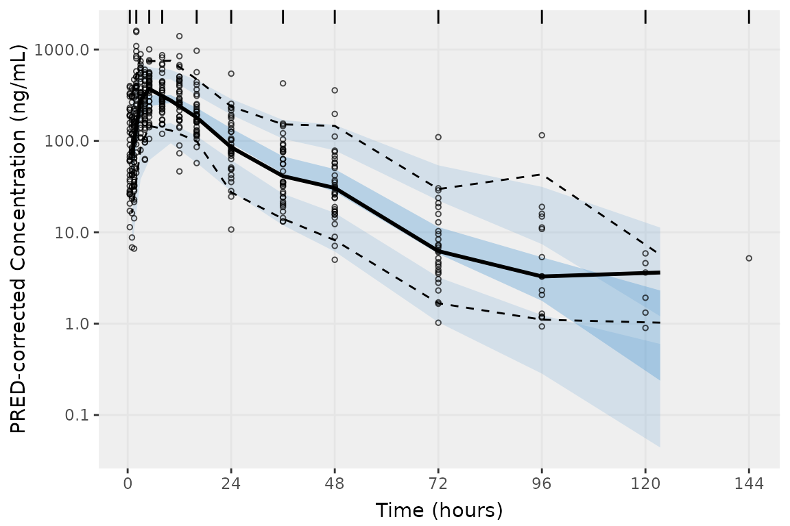

This plot looks pretty good! The default binning in
[`vpc::vpc()`](https://rdrr.io/pkg/vpc/man/vpc.html) produce a very nice
looking plot. However, all of the binning methods internal to
[`vpc()`](https://rdrr.io/pkg/vpc/man/vpc.html) are designed to
determine binning intervals from the data. Currently, there is no method
to use *exact bins contained in the data* in place of *bin intervals
determined from the data*. The presence of exact bins in the data is a
common scenario in pharmacometrics, as Clinical Study Protocols usually
specific Study Days and times for collection.

We can use the
[`df_nobsbin()`](https://ryancrass.github.io/pmxhelpr/reference/df_nobsbin.md)
function to calculate and return a summary data.frame containing the
unique exact bin times, count of non-missing observations (EVID=0 &
MDV=0), and count of missing (EVID=0 & MDV=1) observations.

``` r
##Exact bins in the input data
df_nobsbin(data_sad, bin_var = "NTIME")
#> # A tibble: 19 × 4
#>    NTIME   CMT n_obs n_miss
#>    <dbl> <dbl> <int>  <int>
#>  1   0       2     0     36
#>  2   0.5     2    34      2
#>  3   1       2    36      0
#>  4   1.5     2    36      0
#>  5   2       2    36      0
#>  6   3       2    36      0
#>  7   4       2    36      0
#>  8   5       2    36      0
#>  9   8       2    36      0
#> 10  12       2    36      0
#> 11  16       2    36      0
#> 12  24       2    36      0
#> 13  36       2    36      0
#> 14  48       2    33      3
#> 15  72       2    29      7
#> 16  96       2    16     20
#> 17 120       2     6     30
#> 18 144       2     1     35
#> 19 168       2     0     36

##Bin midpoints and boundaries determined by vpc() using bins = "jenks"
distinct(select(vpc_jenks$data, bin_mid, bin_min, bin_max))
#> Adding missing grouping variables: `strat`
#> # A tibble: 11 × 4
#> # Groups:   strat [1]
#>    strat bin_mid bin_min bin_max
#>    <fct>   <dbl>   <dbl>   <dbl>
#>  1 1        1.01     0.5       2
#>  2 1        3        2         5
#>  3 1        5        5         8
#>  4 1       10        8        16
#>  5 1       16       16        24
#>  6 1       24       24        36
#>  7 1       36       36        48
#>  8 1       48       48        72
#>  9 1       72       72        96
#> 10 1       96       96       120
#> 11 1      123.     120       144
```

The `bin_mid` variable is
where[`vpc()`](https://rdrr.io/pkg/vpc/man/vpc.html) will plot the
summary statistics calculated for the observed and simulated data.

We can clearly see that the default `bins = "jenks"` method does not
reproduce the exact bins in the observed dataset, *even when passing
nominal, rather than actual, time as the independent variable (`idv`)*.
How about the other binning methods native to
[`vpc()`](https://rdrr.io/pkg/vpc/man/vpc.html)?

Let’s take a look at `bins = "pretty"` next.

``` r
vpc_pretty <- vpc(
  sim = simout, 
  obs = filter(simout, SIM == 1), 
  bins = "pretty", 
  n_bins = "auto", 
  sim_cols = list(dv = "SIMDV", idv = "NTIME", pred = "PRED"),
  obs_cols = list(dv = "OBSDV", idv = "NTIME", pred = "PRED"),
  pred_corr = TRUE,
  pi = c(0.05, 0.95),
  ci = c(0.05, 0.95),
  show = list(obs_dv = TRUE),
  log_y = TRUE,
  xlab = "Time (hours)",
  ylab = "PRED-corrected Concentration (ng/mL)"
) +
  scale_x_continuous(breaks = seq(0,168,24))

vpc_pretty
```

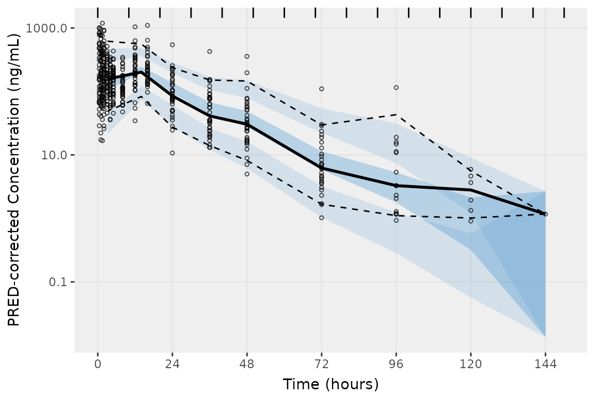

The vpc plot produced with `bins = "pretty` *is* fairly pretty; however,
again we can see that the binning is not true to the exact bins in our
dataset, especially at the earlier absorption phase time-points, which
are being largely binned together.

``` r
##Exact bins in the input data
df_nobsbin(data_sad, bin_var = "NTIME")
#> # A tibble: 19 × 4
#>    NTIME   CMT n_obs n_miss
#>    <dbl> <dbl> <int>  <int>
#>  1   0       2     0     36
#>  2   0.5     2    34      2
#>  3   1       2    36      0
#>  4   1.5     2    36      0
#>  5   2       2    36      0
#>  6   3       2    36      0
#>  7   4       2    36      0
#>  8   5       2    36      0
#>  9   8       2    36      0
#> 10  12       2    36      0
#> 11  16       2    36      0
#> 12  24       2    36      0
#> 13  36       2    36      0
#> 14  48       2    33      3
#> 15  72       2    29      7
#> 16  96       2    16     20
#> 17 120       2     6     30
#> 18 144       2     1     35
#> 19 168       2     0     36

##Bin midpoints and boundaries determined by vpc() using bins = "pretty"
distinct(select(vpc_pretty$data, bin_mid, bin_min, bin_max))
#> Adding missing grouping variables: `strat`
#> # A tibble: 9 × 4
#> # Groups:   strat [1]
#>   strat bin_mid bin_min bin_max
#>   <fct>   <dbl>   <dbl>   <dbl>
#> 1 1        3.14       0      10
#> 2 1       14         10      20
#> 3 1       24         20      30
#> 4 1       36         30      40
#> 5 1       48         40      50
#> 6 1       72         70      80
#> 7 1       96         90     100
#> 8 1      120        120     130
#> 9 1      144        140     150
```

The `bins = "kmeans"` option produces yet another reasonable plot;
however, like `bins = "pretty"`, it groups many of the absorption phase
timepoints together and does not include the last three sampling times
with quantifiable observations in simulated intervals.

``` r
vpc_kmeans <- vpc(
  sim = simout, 
  obs = filter(simout, SIM == 1), 
  bins = "kmeans", 
  n_bins = "auto", 
  sim_cols = list(dv = "SIMDV", idv = "NTIME", pred = "PRED"),
  obs_cols = list(dv = "OBSDV", idv = "NTIME", pred = "PRED"),
  pred_corr = TRUE,
  pi = c(0.05, 0.95),
  ci = c(0.05, 0.95),
  show = list(obs_dv = TRUE),
  log_y = TRUE,
  xlab = "Time (hours)",
  ylab = "PRED-corrected Concentration (ng/mL)"
) +
  scale_x_continuous(breaks = seq(0,168,24))

vpc_kmeans
```

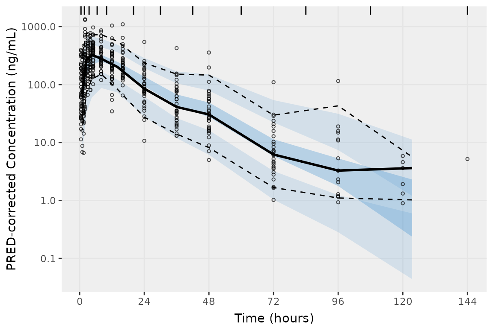

``` r
##Exact bins in the input data
df_nobsbin(data_sad, bin_var = "NTIME")
#> # A tibble: 19 × 4
#>    NTIME   CMT n_obs n_miss
#>    <dbl> <dbl> <int>  <int>
#>  1   0       2     0     36
#>  2   0.5     2    34      2
#>  3   1       2    36      0
#>  4   1.5     2    36      0
#>  5   2       2    36      0
#>  6   3       2    36      0
#>  7   4       2    36      0
#>  8   5       2    36      0
#>  9   8       2    36      0
#> 10  12       2    36      0
#> 11  16       2    36      0
#> 12  24       2    36      0
#> 13  36       2    36      0
#> 14  48       2    33      3
#> 15  72       2    29      7
#> 16  96       2    16     20
#> 17 120       2     6     30
#> 18 144       2     1     35
#> 19 168       2     0     36

##Bin midpoints and boundaries determined by vpc() using bins = "kmeans"
distinct(select(vpc_kmeans$data, bin_mid, bin_min, bin_max))
#> Adding missing grouping variables: `strat`
#> # A tibble: 11 × 4
#> # Groups:   strat [1]
#>    strat bin_mid bin_min bin_max
#>    <fct>   <dbl>   <dbl>   <dbl>
#>  1 1        1.01    0.5     1.75
#>  2 1        2.5     1.75    3.5 
#>  3 1        4.5     3.5     6.5 
#>  4 1        8       6.5    10   
#>  5 1       14      10      20   
#>  6 1       24      20      30   
#>  7 1       36      30      42   
#>  8 1       48      42      60   
#>  9 1       72      60      84   
#> 10 1       96      84     108   
#> 11 1      123.    108     144
```

The native binning method `density` attempts to bin the data by finding
the nadir in the density function. In this case, we can try and inform
the binning algorithm on how many bins we *expect* in the data. Let’s
pass the length of the vector of unique `NTIME` values in our dataset to
the `n_bins` argument and see if the `density` approach can find the
correct bins.

``` r
vpc_density <- vpc(
  sim = simout, 
  obs = filter(simout, SIM == 1), 
  bins = "density", 
  n_bins = length(unique(simout$NTIME)), 
  sim_cols = list(dv = "SIMDV", idv = "NTIME", pred = "PRED"),
  obs_cols = list(dv = "OBSDV", idv = "NTIME", pred = "PRED"),
  pred_corr = TRUE,
  pi = c(0.05, 0.95),
  ci = c(0.05, 0.95),
  show = list(obs_dv = TRUE),
  log_y = TRUE,
  xlab = "Time (hours)",
  ylab = "PRED-corrected Concentration (ng/mL)"
) +
  scale_x_continuous(breaks = seq(0,168,24))

vpc_density
```

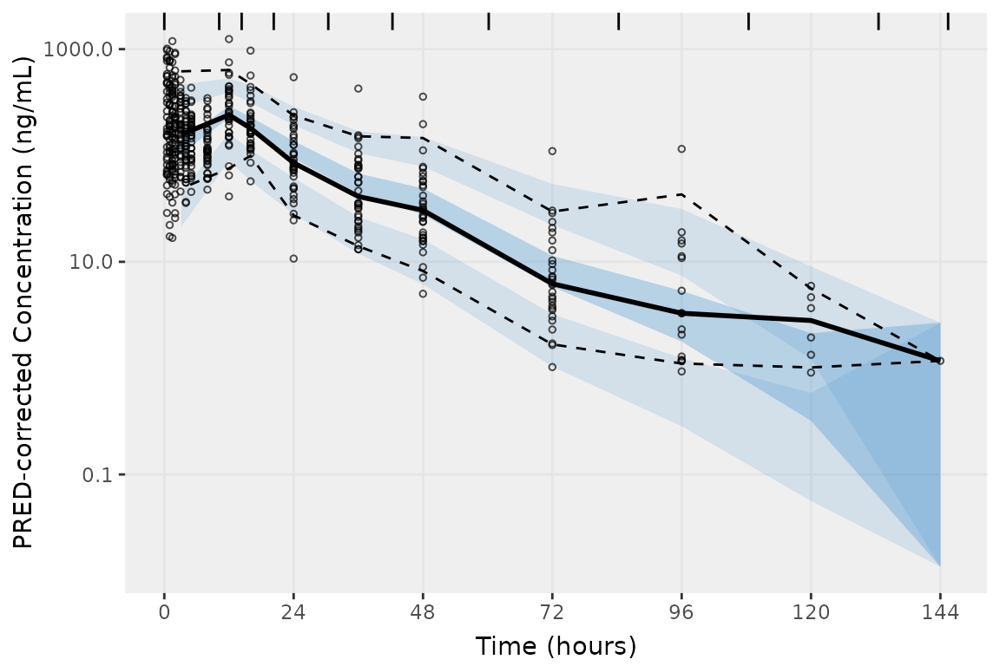

Whomp Whomp. `bins = "density"`, like the previous methods evaluated,
grouped most of the absorption phase into a single bin.

``` r
##Exact bins in the input data
df_nobsbin(data_sad, bin_var = "NTIME")
#> # A tibble: 19 × 4
#>    NTIME   CMT n_obs n_miss
#>    <dbl> <dbl> <int>  <int>
#>  1   0       2     0     36
#>  2   0.5     2    34      2
#>  3   1       2    36      0
#>  4   1.5     2    36      0
#>  5   2       2    36      0
#>  6   3       2    36      0
#>  7   4       2    36      0
#>  8   5       2    36      0
#>  9   8       2    36      0
#> 10  12       2    36      0
#> 11  16       2    36      0
#> 12  24       2    36      0
#> 13  36       2    36      0
#> 14  48       2    33      3
#> 15  72       2    29      7
#> 16  96       2    16     20
#> 17 120       2     6     30
#> 18 144       2     1     35
#> 19 168       2     0     36

##Bin midpoints and boundaries determined by vpc() using bins = "density"
distinct(select(vpc_density$data, bin_mid, bin_min, bin_max))
#> Adding missing grouping variables: `strat`
#> # A tibble: 10 × 4
#> # Groups:   strat [1]
#>    strat bin_mid bin_min bin_max
#>    <fct>   <dbl>   <dbl>   <dbl>
#>  1 1        3.14     0      10.2
#>  2 1       12       10.2    14.4
#>  3 1       16       14.4    20.3
#>  4 1       24       20.3    30.4
#>  5 1       36       30.4    42.3
#>  6 1       48       42.3    60.2
#>  7 1       72       60.2    84.3
#>  8 1       96       84.3   108. 
#>  9 1      120      108.    133. 
#> 10 1      144      133.    145.
```

This leaves us with two methods that divide the data equally into bins
over the range of values in the data: `bins = "data"` (equal data
density in each bin) and `bins = "time"` (equal bin width in time).

``` r
vpc_data <- vpc(
  sim = simout, 
  obs = filter(simout, SIM == 1), 
  bins = "data", 
  sim_cols = list(dv = "SIMDV", idv = "NTIME", pred = "PRED"),
  obs_cols = list(dv = "OBSDV", idv = "NTIME", pred = "PRED"),
  pred_corr = TRUE,
  pi = c(0.05, 0.95),
  ci = c(0.05, 0.95),
  show = list(obs_dv = TRUE),
  log_y = TRUE,
  xlab = "Time (hours)",
  ylab = "PRED-corrected Concentration (ng/mL)"
) +
  scale_x_continuous(breaks = seq(0,168,24))

vpc_time <- vpc(
  sim = simout, 
  obs = filter(simout, SIM == 1), 
  bins = "time", 
  sim_cols = list(dv = "SIMDV", idv = "NTIME", pred = "PRED"),
  obs_cols = list(dv = "OBSDV", idv = "NTIME", pred = "PRED"),
  pred_corr = TRUE,
  pi = c(0.05, 0.95),
  ci = c(0.05, 0.95),
  show = list(obs_dv = TRUE),
  log_y = TRUE,
  xlab = "Time (hours)",
  ylab = "PRED-corrected Concentration (ng/mL)"
) +
  scale_x_continuous(breaks = seq(0,168,24))

vpc_data
```

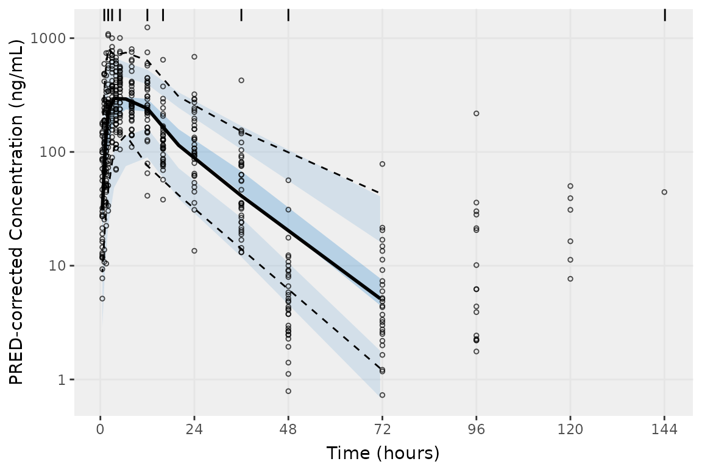

``` r
vpc_time
```

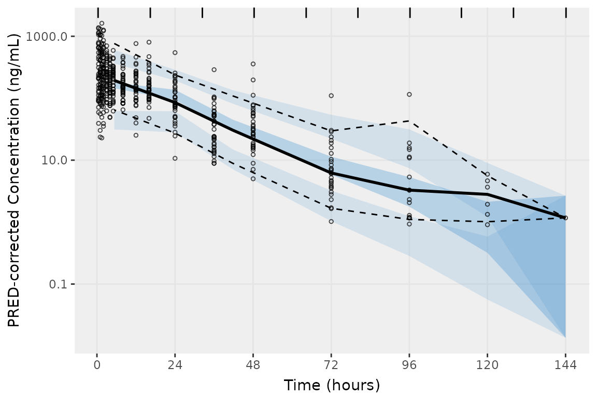

These methods are designed to equalize data density in each bin, which
does not produce binning consistent with the exact bins in our dataset.

``` r
##Exact bins in the input data
df_nobsbin(data_sad, bin_var = "NTIME")
#> # A tibble: 19 × 4
#>    NTIME   CMT n_obs n_miss
#>    <dbl> <dbl> <int>  <int>
#>  1   0       2     0     36
#>  2   0.5     2    34      2
#>  3   1       2    36      0
#>  4   1.5     2    36      0
#>  5   2       2    36      0
#>  6   3       2    36      0
#>  7   4       2    36      0
#>  8   5       2    36      0
#>  9   8       2    36      0
#> 10  12       2    36      0
#> 11  16       2    36      0
#> 12  24       2    36      0
#> 13  36       2    36      0
#> 14  48       2    33      3
#> 15  72       2    29      7
#> 16  96       2    16     20
#> 17 120       2     6     30
#> 18 144       2     1     35
#> 19 168       2     0     36

##Bin midpoints and boundaries determined by vpc() using bins = "data"
distinct(select(vpc_data$data, bin_mid, bin_min, bin_max))
#> Adding missing grouping variables: `strat`
#> # A tibble: 9 × 4
#> # Groups:   strat [1]
#>   strat bin_mid bin_min bin_max
#>   <fct>   <dbl>   <dbl>   <dbl>
#> 1 1        1.25       1      2 
#> 2 1        2          2      3 
#> 3 1        3.5        3      5 
#> 4 1        6.5        5     12 
#> 5 1       12         12     16 
#> 6 1       20         16     36 
#> 7 1       36         36     48 
#> 8 1       71.4       48    144.
#> 9 1        0.5       NA     NA

##Bin midpoints and boundaries determined by vpc() using bins = "time"
distinct(select(vpc_time$data, bin_mid, bin_min, bin_max))
#> Adding missing grouping variables: `strat`
#> # A tibble: 7 × 4
#> # Groups:   strat [1]
#>   strat bin_mid bin_min bin_max
#>   <fct>   <dbl>   <dbl>   <dbl>
#> 1 1        5.33   0.357    16.4
#> 2 1       24     16.4      32.4
#> 3 1       41.7   32.4      48.3
#> 4 1       72     64.3      80.2
#> 5 1       96     80.2      96.2
#> 6 1      120    112       128  
#> 7 1      144    128       144.
```

### VPC Plots with `pmxhelpr`

The pmxhelpr function
[`plot_vpc_exactbins()`](https://ryancrass.github.io/pmxhelpr/reference/plot_vpc_exactbins.md)
is a wrapper function for
[`vpc()`](https://rdrr.io/pkg/vpc/man/vpc.html), which is optimized for
input datasets containing exact bins. This wrapper passes the the unique
exact bins (e.g., nominal times) in the input dataset as bin boundaries
with the addition of `Inf` to the end of the vector to ensure that the
final exact bin is included, rather than set only as a boundary.

This functionality can be reproduced using
[`vpc()`](https://rdrr.io/pkg/vpc/man/vpc.html) by passing a vector of
unique exact bins to `bins` with the addition of `Inf` as follows:

`bins = c(sort(unique(simout$NTIME)), Inf)`

``` r
exact_bins <- c(sort(unique(simout$NTIME)), Inf)

vpc_exact_ntime <- vpc(
  sim = simout, 
  obs = filter(simout, SIM == 1), 
  bins = exact_bins,
  sim_cols = list(dv = "SIMDV", idv = "NTIME", pred = "PRED"),
  obs_cols = list(dv = "OBSDV", idv = "NTIME", pred = "PRED"),
  pred_corr = TRUE,
  pi = c(0.05, 0.95),
  ci = c(0.05, 0.95),
  show = list(obs_dv = TRUE),
  log_y = TRUE,
  xlab = "Time (hours)",
  ylab = "PRED-corrected Concentration (ng/mL)"
)+
  scale_x_continuous(breaks = seq(0,168,24))

vpc_exact_ntime
```

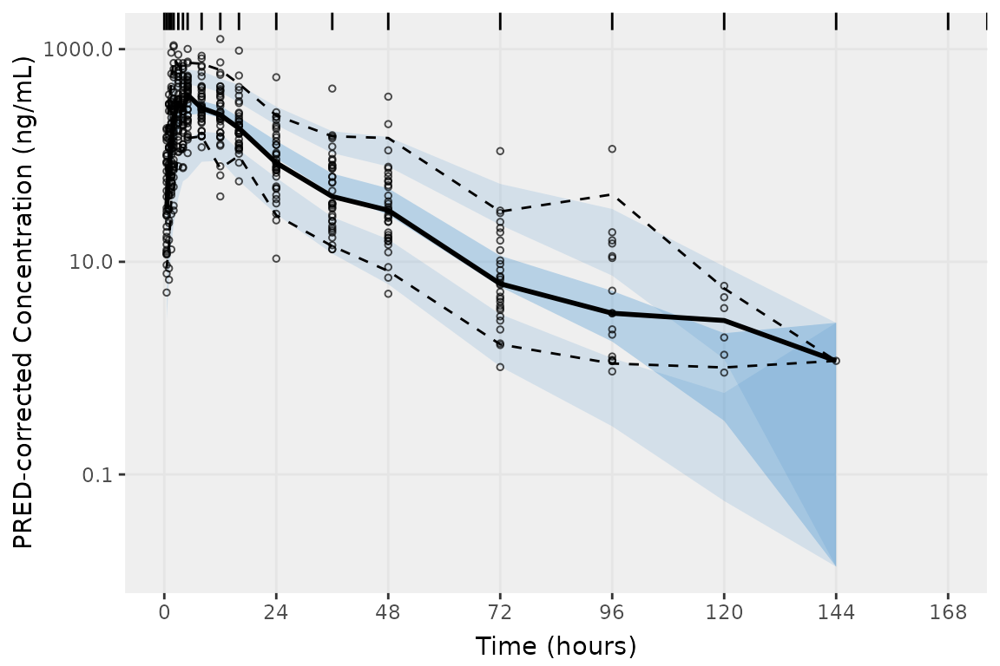

However, this workaround only works if `idv` is set to the nominal time
variable (`idv = "NTIME`) in both `sim_cols` and `obs_cols`, which
removes the option to plot the observations by actual time (`"TIME"`).

[`plot_vpc_exactbins()`](https://ryancrass.github.io/pmxhelpr/reference/plot_vpc_exactbins.md)
gets around this limitation by plotting the observed data in a separate
layer on top of the plot object returned by
[`vpc()`](https://rdrr.io/pkg/vpc/man/vpc.html), including
prediction-correction of those observed points if `pcvpc = TRUE` (also
passed along to the `pred_corr` argument of
[`vpc()`](https://rdrr.io/pkg/vpc/man/vpc.html)).

``` r
vpc_exact <- plot_vpc_exactbins(
  sim = simout, 
  pcvpc = TRUE,
  time_vars = c(TIME = "TIME", NTIME = "NTIME"),
  output_vars = c(PRED = "PRED", IPRED = "IPRED", SIMDV = "SIMDV", OBSDV = "OBSDV"),
  pi = c(0.05, 0.95),
  ci = c(0.05, 0.95),
  xlab = "Time (hours)",
  ylab = "PRED-corrected Concentration (ng/mL)"
) + 
  scale_y_log10(guide = "axis_logticks")

vpc_exact 
```

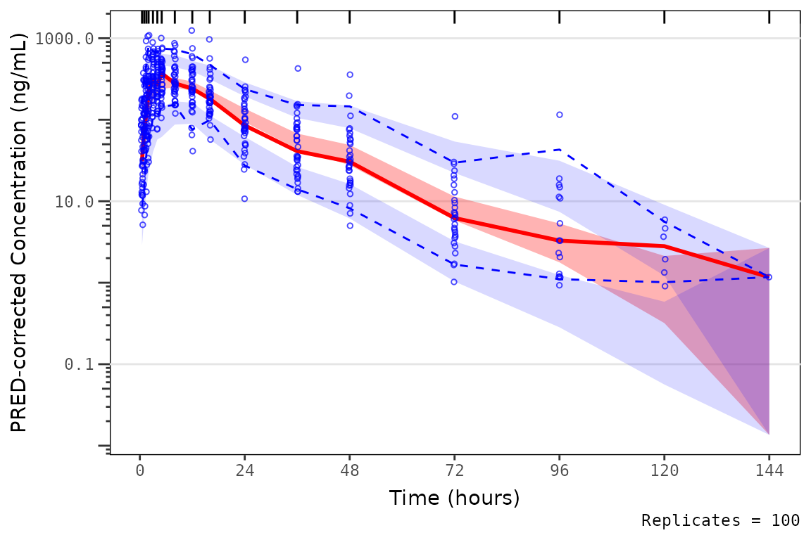

The difference in plotting the observed prediction-corrected data points
by `"TIME"` versus `"NTIME"` is negligible for this example dataset, due
to the high concordance between `"TIME"` and `"NTIME"` in this example
Phase 1 study. However, this difference is often much larger for pooled
analyses including later phase clinical studies where plotting the
observed points versus actual time will result in a plot that is much
more representative of the distribution of times in the model training
dataset.

When exploring the bins in the input and output datasets using
[`plot_vpc_exactbins()`](https://ryancrass.github.io/pmxhelpr/reference/plot_vpc_exactbins.md),
we now see that they are consistent! Huzzah!

``` r
##Exact bins in the input data
df_nobsbin(data_sad, bin_var = "NTIME")
#> # A tibble: 19 × 4
#>    NTIME   CMT n_obs n_miss
#>    <dbl> <dbl> <int>  <int>
#>  1   0       2     0     36
#>  2   0.5     2    34      2
#>  3   1       2    36      0
#>  4   1.5     2    36      0
#>  5   2       2    36      0
#>  6   3       2    36      0
#>  7   4       2    36      0
#>  8   5       2    36      0
#>  9   8       2    36      0
#> 10  12       2    36      0
#> 11  16       2    36      0
#> 12  24       2    36      0
#> 13  36       2    36      0
#> 14  48       2    33      3
#> 15  72       2    29      7
#> 16  96       2    16     20
#> 17 120       2     6     30
#> 18 144       2     1     35
#> 19 168       2     0     36

##Bin midpoints and boundaries determined by plot_vpc_exactbins()
distinct(select(vpc_exact$data, bin_mid, bin_min, bin_max))
#> Adding missing grouping variables: `strat`
#> # A tibble: 17 × 4
#> # Groups:   strat [1]
#>    strat bin_mid bin_min bin_max
#>    <fct>   <dbl>   <dbl>   <dbl>
#>  1 1         0.5     1       1.5
#>  2 1         1       1.5     2  
#>  3 1         1.5     2       3  
#>  4 1         2       3       4  
#>  5 1         3       4       5  
#>  6 1         4       5       8  
#>  7 1         5       8      12  
#>  8 1         8      12      16  
#>  9 1        12      16      24  
#> 10 1        16      24      36  
#> 11 1        24      36       0.5
#> 12 1        36       0.5    48  
#> 13 1        48      48      72  
#> 14 1        72      72      96  
#> 15 1        96      96     120  
#> 16 1       120     120     144  
#> 17 1       144     144     Inf
```

[`plot_vpc_exactbins()`](https://ryancrass.github.io/pmxhelpr/reference/plot_vpc_exactbins.md)
also contains an argument built around
[`df_nobsbin()`](https://ryancrass.github.io/pmxhelpr/reference/df_nobsbin.md).
The argument `min_bin_count` (default = 1) filters out exact bins with
fewer quantifiable observations than the minimum set by this argument.
Importantly, the observed data points in these small bins are *still
plotted*; however, they do not influence the calculation of summary
statistics or summary plot elements (shaded intervals, lines). This
provides the greatest fidelity to the data visualized without
introducing visual artifacts due to small sample timepoints.

Additionally, because our plot input dataset `simout` was generated
using `df_mrgsim_replicate`, the `time_vars` and `output_vars` match the
default values, so we do not need to specify these arguments and they
can be removed. Furthermore, the `pi` and `ci` arguments we are
specifying match the default 90% PI and CI in
[`vpc()`](https://rdrr.io/pkg/vpc/man/vpc.html) and can be removed.

When setting`min_bin_count = 10`, summary statistics are not plotted for
the final two timepoint containing only fewer than 10 quantifiable
observations; however, the observations themselves are still plotted.

``` r
vpc_exact_bin_gt10 <- plot_vpc_exactbins(
  sim = simout, 
  pcvpc = TRUE,
  min_bin_count = 10,
  xlab = "Time (hours)",
  ylab = "PRED-corrected Concentration (ng/mL)"
) +
  scale_y_log10(guide = "axis_logticks")

vpc_exact_bin_gt10
```

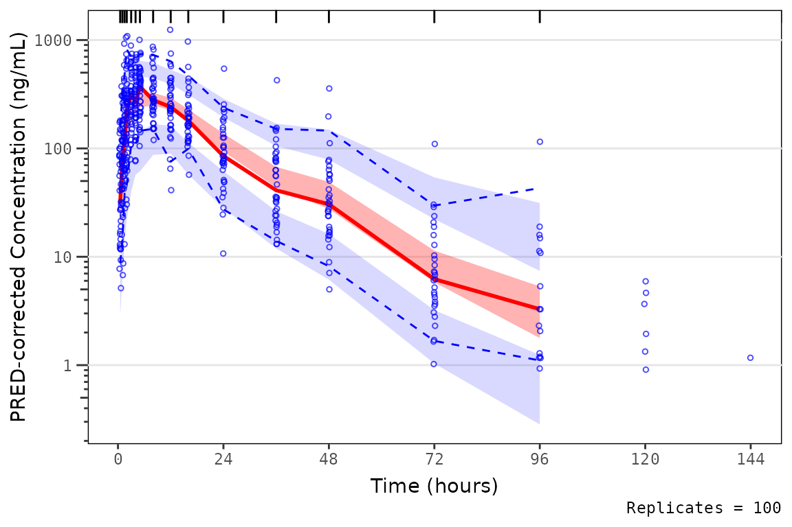

We can also pass stratifying variables to the argument `strat_var` in
order to facet our plots by relevant covariate conditions. The
stratification variables specified in `strat_var` are also passed to the
`stratify` argument of [`vpc()`](https://rdrr.io/pkg/vpc/man/vpc.html),
in order to facet the resulting plots. Currently, only one variable can
be passed to this argument.

``` r
vpc_exact_food <- plot_vpc_exactbins(
  sim = mutate(simout, FOOD_f = factor(FOOD, levels = c(0,1), labels = c("Fasted", "Fed"))), 
  strat_var = "FOOD_f",
  pcvpc = TRUE,
  xlab = "Time (hours)",
  ylab = "PRED-corrected Concentration (ng/mL)",
  min_bin_count = 4
) + 
  scale_y_log10(guide = "axis_logticks")

vpc_exact_food
```

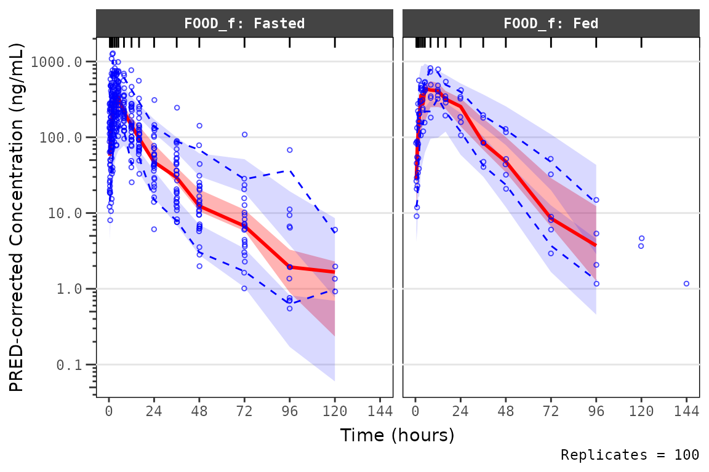

Note that all these plots add a layer to the `ggplot2` object returned
by `plot_vpc_exactbins` to transform the y-axis from linear to log10
scales. One could specify the `log_y` argument in `plot_vpc_exactbins`,
which is not native to `plot_vpc_exactbins`, but will be passed to
[`vpc::vpc`](https://rdrr.io/pkg/vpc/man/vpc.html).

It is important to understand how the data are handled within
[`vpc::vpc()`](https://rdrr.io/pkg/vpc/man/vpc.html) when specifying the
`log_y` argument. From the
[`vpc::vpc()`](https://rdrr.io/pkg/vpc/man/vpc.html) function
documentation:

- `log_y`: Boolean indicting whether y-axis should be shown as
  logarithmic. Default is FALSE.
- `log_y_min`: minimal value when using log_y argument. Default is 1e-3.

Therefore, [`vpc::vpc()`](https://rdrr.io/pkg/vpc/man/vpc.html) will
will transform the data prior to calculating summary statistics and
plotting by imputing any values \< `log_y_min` to the value specified in
this argument (default = 0.001). Therefore, if there are observed values
less than this threshold, they will be censored at this minimum.

This can lead to unexpected behavior if data fall in a very low
concentration range and the `log_y_min` argument is not specified.

``` r
vpc_exact_transform_logy <- plot_vpc_exactbins(
  sim = mutate(simout, 
               PRED = PRED/(10^6),
               OBSDV = OBSDV/(10^6),
               SIMDV = SIMDV/(10^6)),
  pcvpc = TRUE,
  xlab = "Time (hours)",
  ylab = "PRED-corrected Concentration (mg/mL)",
  min_bin_count = 4,
  log_y = TRUE
) 

vpc_exact_transform_logy
```

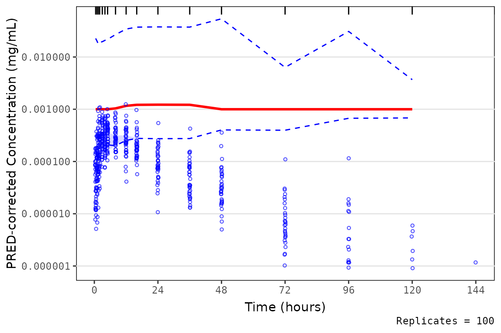

Thus, to avoid unexpected censoring of data on the VPC plot, one can
plot without specifying `log_y` and then add a new log10 scale for the
y-axis.

``` r
vpc_exact_transform_yscale <- plot_vpc_exactbins(
  sim = mutate(simout, 
               PRED = PRED/(10^6),
               OBSDV = OBSDV/(10^6),
               SIMDV = SIMDV/(10^6)),
  pcvpc = TRUE,
  xlab = "Time (hours)",
  ylab = "PRED-corrected Concentration (mg/mL)",
  min_bin_count = 4
)  + 
  scale_y_log10(guide = "axis_logticks")

vpc_exact_transform_yscale
```

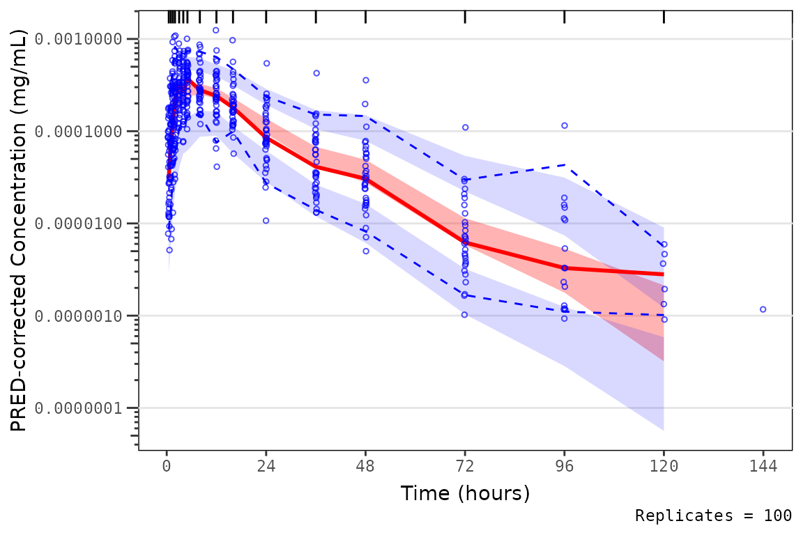
