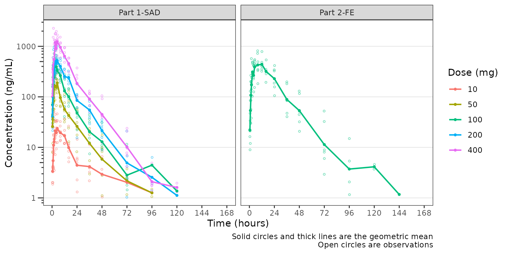
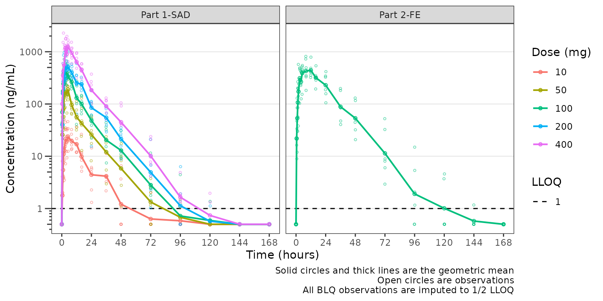
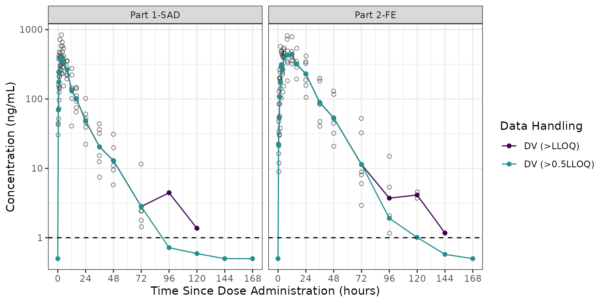
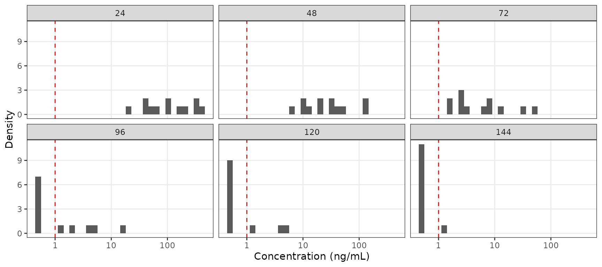
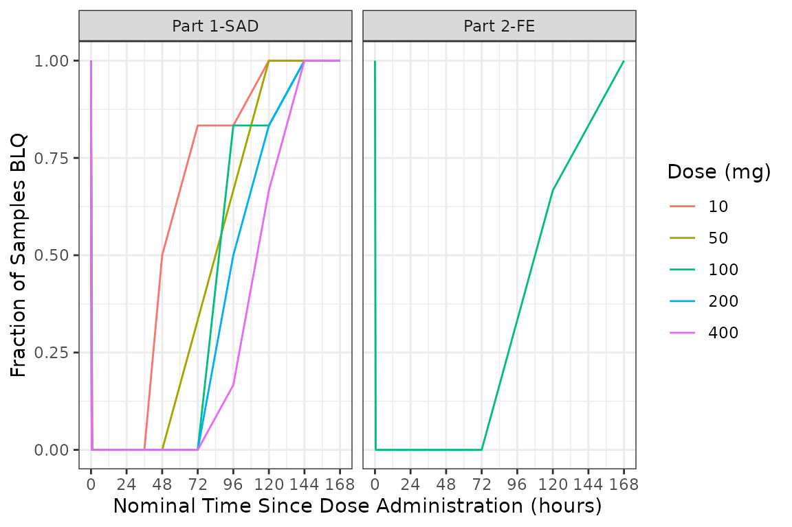
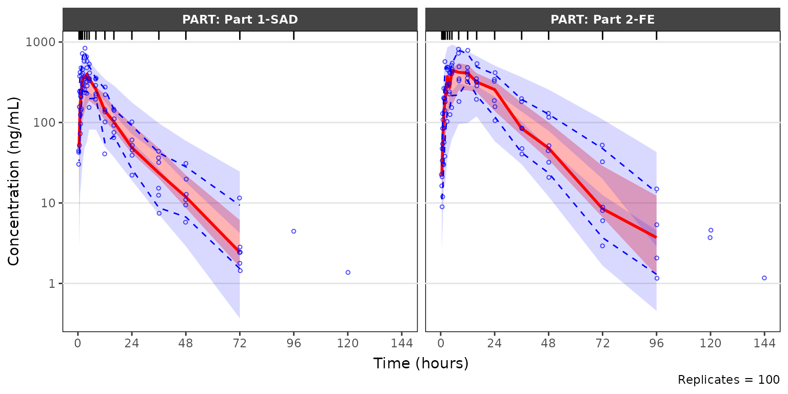
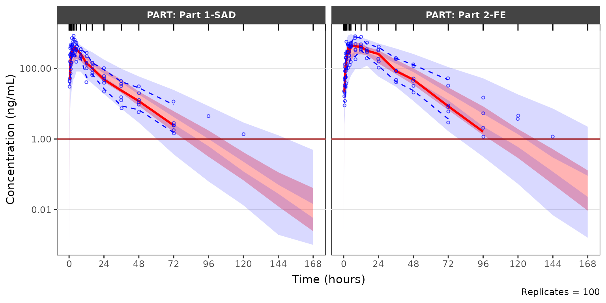

# VPC Plots with BLQ Censoring

This vignette will review the excellent functionality in the
[`vpc()`](https://rdrr.io/pkg/vpc/man/vpc.html) function from the `vpc`
package for appropriate handling of data censored below the lower limit
of quantification (LLOQ) using the `lloq` argument.

`vpc_plot_exactbins()` takes advantage of this functionality through the
argument `loq`, which is also passed to `lloq` in
[`vpc()`](https://rdrr.io/pkg/vpc/man/vpc.html).

Let’s get started. First, we will load the required packages.

``` r
options(scipen = 999, rmarkdown.html_vignette.check_title = FALSE)
library(pmxhelpr)
library(dplyr, warn.conflicts =  FALSE)
library(ggplot2, warn.conflicts =  FALSE)
library(Hmisc, warn.conflicts = FALSE)
library(vpc, warn.conflicts =  FALSE)
library(mrgsolve, warn.conflicts =  FALSE)
library(withr, warn.conflicts =  FALSE)
```

## Analysis Dataset

Next let’s explore our input dataset `data_sad`. This dataset was
generated via simulation from the mrgsolve `model` internal to the
pmxhelpr package. We can take a quick look at the dataset using
[`glimpse()`](https://pillar.r-lib.org/reference/glimpse.html) from the
`dplyr`.

``` r
glimpse(data_sad)
#> Rows: 720
#> Columns: 23
#> $ LINE    <dbl> 1, 2, 3, 4, 5, 6, 7, 8, 9, 10, 11, 12, 13, 14, 15, 16, 17, 18,…
#> $ ID      <dbl> 1, 1, 1, 1, 1, 1, 1, 1, 1, 1, 1, 1, 1, 1, 1, 1, 1, 1, 1, 1, 2,…
#> $ TIME    <dbl> 0.00, 0.00, 0.48, 0.81, 1.49, 2.11, 3.05, 4.14, 5.14, 7.81, 12…
#> $ NTIME   <dbl> 0.0, 0.0, 0.5, 1.0, 1.5, 2.0, 3.0, 4.0, 5.0, 8.0, 12.0, 16.0, …
#> $ NDAY    <dbl> 1, 1, 1, 1, 1, 1, 1, 1, 1, 1, 1, 1, 2, 2, 3, 4, 5, 6, 7, 8, 1,…
#> $ DOSE    <dbl> 10, 10, 10, 10, 10, 10, 10, 10, 10, 10, 10, 10, 10, 10, 10, 10…
#> $ AMT     <dbl> NA, 10, NA, NA, NA, NA, NA, NA, NA, NA, NA, NA, NA, NA, NA, NA…
#> $ EVID    <dbl> 0, 1, 0, 0, 0, 0, 0, 0, 0, 0, 0, 0, 0, 0, 0, 0, 0, 0, 0, 0, 0,…
#> $ ODV     <dbl> NA, NA, NA, 2.02, 4.02, 3.50, 7.18, 9.31, 12.46, 13.43, 12.11,…
#> $ LDV     <dbl> NA, NA, NA, 0.7031, 1.3913, 1.2528, 1.9713, 2.2311, 2.5225, 2.…
#> $ CMT     <dbl> 2, 1, 2, 2, 2, 2, 2, 2, 2, 2, 2, 2, 2, 2, 2, 2, 2, 2, 2, 2, 2,…
#> $ MDV     <dbl> 1, NA, 1, 0, 0, 0, 0, 0, 0, 0, 0, 0, 0, 0, 1, 1, 1, 1, 1, 1, 1…
#> $ BLQ     <dbl> -1, NA, 1, 0, 0, 0, 0, 0, 0, 0, 0, 0, 0, 0, 1, 1, 1, 1, 1, 1, …
#> $ LLOQ    <dbl> 1, NA, 1, 1, 1, 1, 1, 1, 1, 1, 1, 1, 1, 1, 1, 1, 1, 1, 1, 1, 1…
#> $ FOOD    <dbl> 0, 0, 0, 0, 0, 0, 0, 0, 0, 0, 0, 0, 0, 0, 0, 0, 0, 0, 0, 0, 0,…
#> $ SEXF    <dbl> 1, 1, 1, 1, 1, 1, 1, 1, 1, 1, 1, 1, 1, 1, 1, 1, 1, 1, 1, 1, 1,…
#> $ RACE    <dbl> 2, 2, 2, 2, 2, 2, 2, 2, 2, 2, 2, 2, 2, 2, 2, 2, 2, 2, 2, 2, 1,…
#> $ AGEBL   <int> 25, 25, 25, 25, 25, 25, 25, 25, 25, 25, 25, 25, 25, 25, 25, 25…
#> $ WTBL    <dbl> 82.1, 82.1, 82.1, 82.1, 82.1, 82.1, 82.1, 82.1, 82.1, 82.1, 82…
#> $ SCRBL   <dbl> 0.87, 0.87, 0.87, 0.87, 0.87, 0.87, 0.87, 0.87, 0.87, 0.87, 0.…
#> $ CRCLBL  <dbl> 128, 128, 128, 128, 128, 128, 128, 128, 128, 128, 128, 128, 12…
#> $ USUBJID <chr> "STUDYNUM-SITENUM-1", "STUDYNUM-SITENUM-1", "STUDYNUM-SITENUM-…
#> $ PART    <chr> "Part 1-SAD", "Part 1-SAD", "Part 1-SAD", "Part 1-SAD", "Part …
```

Let’s visualize the data. For this visualization, we will leverage the
functionality of `plot_dvtime`. First, we will derive a factor variable
from `"DOSE"` to pass to the color aesthetic.

``` r
plot_data <- data_sad %>% 
  filter(EVID == 0) %>% 
  mutate(`Dose (mg)` = factor(DOSE))
```

Now let’s plot the data using `ODV` colored by `Dose (mg)` and faceted
by `PART`.

``` r
plot_dvtime(plot_data, dv_var = "ODV", col_var = "Dose (mg)",  
            ylab = "Concentration (ng/mL)", log_y = TRUE) +
  facet_wrap(~PART)
```



The concentration-time profiles increase with dose with some potential
impact of censoring at the LLOQ in the late terminal phase. To further
assess the potential impact of BLQ censoring, we will set the
`loq_method = 2` in `plot_dvtime`, which imputes BLQ data to 1/2 x LLOQ.
Imputing concentrations below the lower limit of quantification as 1/2 x
LLOQ normalizes the late terminal phase of the concentration-time
profile. This suggests that the artifact in the late terminal phase is
due to censoring of observations below the LLOQ, which impacts lower
doses more than higher doses.

``` r
plot_dvtime(plot_data, dv_var =  "ODV", col_var = "Dose (mg)", loq_method = 2, 
            ylab = "Concentration (ng/mL)", log_y = TRUE) +
  facet_wrap(~PART)
```



Indeed, while pharmacokinetic data are generally treated as continuous
log-normally distributed data, in reality the distribution is truncated
by the lower limit of quantification of the assays used in bioanalysis.

Therefore, whenever evaluating concentration-time plots, we hould keep
in mind the assay limitations and their potential impact on visual
trends. To examine this further, let’s visualize the two different
concentrations variables in the `plot_data` object for a single dose:

- `ODV`: Original dependent variable based on the source data. Data
  below the LLOQ are censored and set to missing `NA`.
- `DV`: Derived dependent variable with data below the LLOQ set to
  `0.5 x LLOQ`.

We will focus in on the 100 mg dose, which is included in both Part1-SAD
and Part2-FE, and appears to display some of the most visual artifact
potentially due to censoring at the LLOQ.

``` r
plot_data100 <- plot_data %>% 
  filter(DOSE == 100) %>% 
  mutate(DV = ifelse(BLQ == 0, ODV, LLOQ/2))

ggplot(aes(x = TIME, y = ODV), data = plot_data100)+
  geom_point(shape = 1, alpha = 0.5)+
  stat_summary(fun = "mean", geom = "point", 
               aes(x = NTIME, y = ODV, col = "DV (>LLOQ)"), inherit.aes = FALSE) +
  stat_summary(fun = "mean", geom = "line", 
               aes(x = NTIME, y = ODV, col = "DV (>LLOQ)"), inherit.aes = FALSE) +
  stat_summary(fun = "mean", geom = "point", 
               aes(x = NTIME, y = DV, col = "DV (>0.5LLOQ)"), inherit.aes = FALSE) +
  stat_summary(fun = "mean", geom = "line", 
               aes(x = NTIME, y = DV, col = "DV (>0.5LLOQ)"), inherit.aes = FALSE) +
  geom_hline(yintercept = unique(plot_data$LLOQ), linetype = "dashed")+
  scale_x_continuous(breaks = seq(0,168,24))+
  scale_y_log10(guide = "axis_logticks")+
  scale_color_manual(name = "Data Handling", 
                     breaks = c("DV (>LLOQ)", "DV (>0.5LLOQ)"), 
                     values = c("DV (>LLOQ)" = "#440154FF", "DV (>0.5LLOQ)" = "#21908CFF"))+
  facet_wrap(~PART)+
  labs(y = "Concentration (ng/mL)", x = "Time Since Dose Administration (hours)")+
  theme_bw() +
  theme(panel.grid.minor.y = element_blank(),
        panel.grid.major.x = element_blank())
```



We can see in these plots that the central tendency of the late terminal
phase is influenced by censoring at the LLOQ. This leads to visual
artifact, which may sometimes appear like another log-linear slope. The
exact pattern of impact will depend on the dose intensity, the assay
sensitivity, and the study sampling schema.

The relative impact of the unobserved portion of the distribution of
concentration can be further visualized as histograms faceted by nominal
sampling time. These distributions are pooled across both Part 1-SAD and
Part 2-FE for the 100 mg in these histograms.

``` r
ggplot(aes(x = DV), data = filter(plot_data100, NTIME %in% seq(24,144,24), DOSE == 100))+
  geom_histogram()+
  geom_vline(xintercept = unique(plot_data$LLOQ), linetype = "dashed", color = "red")+
  scale_x_log10()+
  facet_wrap(~NTIME)+
  labs(y = "Density", x = "Concentration (ng/mL)")+
  theme_bw()+ 
  theme(panel.grid.minor = element_blank())
```



If the study protocol had only included sampling through 72 hours, then
the impact of censoring at the assay LLOQ would have been negligible for
a single 100 mg dose, regardless of food condition. However, a large
portion of the distribution of concentrations is BLQ at later timepoints
the one week duration of sampling.

It is expected that the frequency of censored data at the LLOQ will
increase with increasing time from dose administration. Additionally, it
is expect that the frequency of of censored data below the LLOQ will
decrease with increasing dose intensity.

We can visualize this by summarizing the fraction of samples that are
missing due to assay sensitivity (`MDV=1`) by timepoint, dose, and study
part.

``` r
plot_data_sumblq <- plot_data %>% 
  group_by(DOSE, `Dose (mg)`,NTIME, PART) %>% 
  dplyr::summarize(`Fraction BLQ`= mean(MDV)) %>% 
  ungroup()

ggplot(aes(x = NTIME, y = `Fraction BLQ`, col = `Dose (mg)`), data = plot_data_sumblq)+
  geom_line()+
  scale_x_continuous(breaks = seq(0,168,24))+
  facet_wrap(~PART)+
  labs(y = "Fraction of Samples BLQ", x = "Nominal Time Since Dose Administration (hours)")+
  theme_bw() + 
  theme(panel.grid.minor = element_blank())
```



In summary, the observed patters of BLQ data were in the example dataset
are anticipated for an early phase clinical study.

- increasing frequency of BLQ data with increasing time
- decreasing frequency of BLQ data with increasing dose

BLQ data are often ignored (i.e., set as missing; M1 method) in
population PK model development. This is unlikely to introduce
appreciable bias in model parameter estimation, provided the absolute
frequency of BLQ data is low (e.g., \<10-20%) and the pattern of BLQ
censoring is in line with the expectations by dose and time.

However, just as BLQ censoring introduced some artifact to the
exploratory plots of concentration over time, the handling of BLQ data
in VPCs may impact the interpretation of these graphical model
diagnostics.

## VPC Plots Accounting for BLQ Censoring

Lets run a simulation and generate some VPC plots to demonstrate the
impact of different approaches to BLQ handling to the visual assessment
of the adequacy of model fit and the true underlying PK profile.

``` r
model <- model_mread_load("model")
#> Building model_cpp ... done.

simout <- df_mrgsim_replicate(data = data_sad, model = model,replicates = 100, 
                     dv_var = "ODV",
                     time_vars = c(TIME = "TIME", NTIME = "NTIME"),
                     output_vars = c(PRED = "PRED", IPRED = "IPRED", DV = "DV"),
                     num_vars = c("CMT", "BLQ", "LLOQ", "EVID", "MDV", "DOSE", "FOOD"),
                     char_vars = c("PART"),
                     obsonly = TRUE)
```

Let’s start by focusing on evaluating the model fit of the 100 mg dose
level we have been exploring across Part1-SAD and Part2-FE.

``` r
sim100 <- simout %>% 
  filter(DOSE == 100)
```

There are two potential approaches proccessing and plotting the VPC:

1.  `Exclude BLQ`: remove missing observations (`MDV=1`) in both the
    observed and simulated data
2.  `Censor Observed Quantiles`: set quantiles of the observed data to
    `NA`, if the sample representing that quantile of the observed is
    BLQ (`MDV=1`) in the bin.

Let’s plot using the default arguments to
[`plot_vpc_exactbins()`](https://ryancrass.github.io/pmxhelpr/reference/plot_vpc_exactbins.md).
The default behavior is `Exclude BLQ`, which filters out `MDV=1`.

``` r
vpc_blq_drop <- plot_vpc_exactbins(
  sim = sim100, 
  time_vars = c(TIME = "TIME", NTIME = "NTIME"),
  output_vars = c(PRED = "PRED", IPRED = "IPRED", SIMDV = "SIMDV", OBSDV = "OBSDV"),
  pi = c(0.05, 0.95),
  ci = c(0.05, 0.95),
  xlab = "Time (hours)",
  ylab = "Concentration (ng/mL)",
  strat_var = "PART",
  min_bin_count = 4,
  log_y = TRUE
) 

vpc_blq_drop
```


The observed median appears consistent with the exploratory
concentration-time profiles generated earlier excluding data below the
lower limit of quantification (i.e., plotting `"ODV"`). Notice that the
increasing trend in the observed quantiles at later timelines coincides
with completely overlapping simulated confidence intervals for all
quantiles. This is due to the decreasing sample size with time due to
exclusion of timepoints where `MDV=1`.

Let’s instead try specifying a new argument `loq` to
[`plot_vpc_exactbins()`](https://ryancrass.github.io/pmxhelpr/reference/plot_vpc_exactbins.md).

`loq` is the numeric value of the lower limit of quantification in the
units of the dependent variable. It primarily serves as an alias for
`lloq` in [`vpc::vpc()`](https://rdrr.io/pkg/vpc/man/vpc.html),
leveraging BLQ handling functionality already built into that package.

``` r
vpc_blq_qobs_cens <- plot_vpc_exactbins(
  sim = sim100, 
  time_vars = c(TIME = "TIME", NTIME = "NTIME"),
  output_vars = c(PRED = "PRED", IPRED = "IPRED", SIMDV = "SIMDV", OBSDV = "OBSDV"),
  xlab = "Time (hours)",
  ylab = "Concentration (ng/mL)",
  strat_var = "PART",
  min_bin_count = 4,
  loq = 1,
  log_y = TRUE)

vpc_blq_qobs_cens
```


Now we see a red horizontal line depicting the LLOQ (1 ng/mL). Notice
also the increase in the y-axis range, the change in the shape of the
observed quantiles, and the greater resolution in separation between the
confidence intervals.

Specifying `loq` assumes that `MDV=1` represents *only* BLQ samples in
the input dataset for the plot (`sim`) when `EVID=0`. The function sets
the `MDV` variable in `sim` to zero (0) so that all timepoints are
included.

- In the calculation of the summary statistics of the observed data, the
  quantiles are calculated across all data per bin and taken as `NA`
  when that quantile of observations is below `loq`.
- In the calculation of summary statistics of the simulated data, the
  simulated confidence intervals are based on all data without any
  censoring, which is representative of the model-predicted “true”
  underlying PK profile in the absence of real-world assay limitations.

Specifying `loq` is the preferred method for plotting VPC diagnostics
with the `pmxhelpr` package. This is not the default method due to the
all-too-common case where the assay LLOQ is not known to the analyst.
Additionally, this method of accounting for the censoring of data below
the LLOQ by specifying the `loq` argument should only be applied to
Visual Predictive Checks (`pcvpc = FALSE`) and should *not* be applied
to Prediction-corrected Visual Predictive Checks (`pcvpc = TRUE`).

If`loq` is specified with`pcvpc = TRUE`, an error message will print
from [`vpc::vpc()`](https://rdrr.io/pkg/vpc/man/vpc.html).

**Prediction-correction cannot be used together with censored data
(ULOQ). VPC plot will be shown for non-censored data only!**
