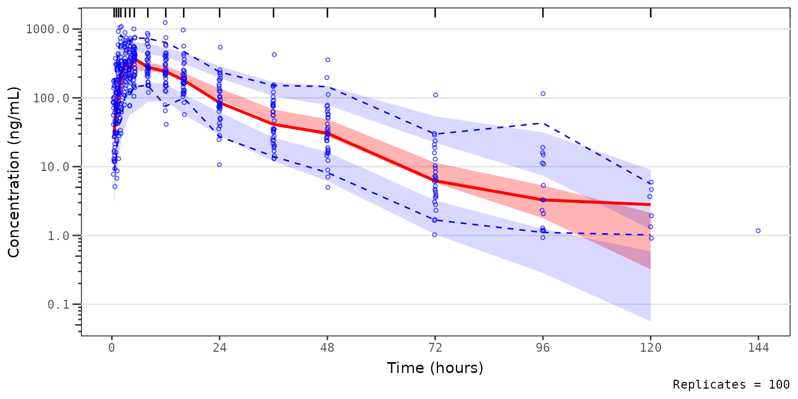
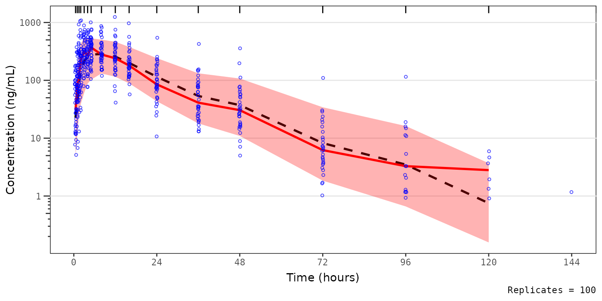
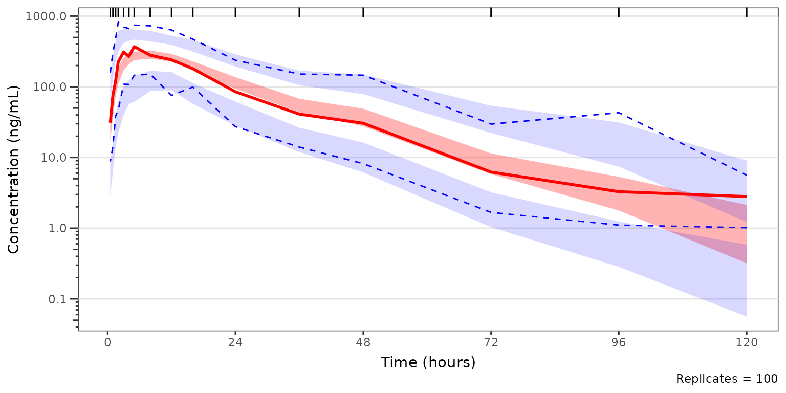
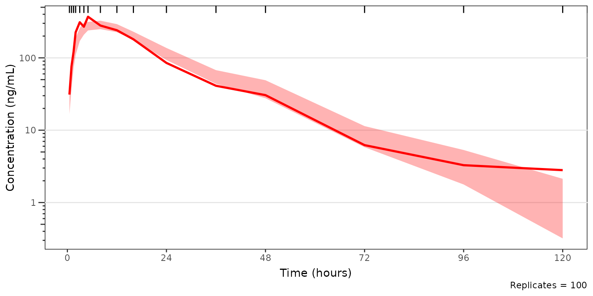
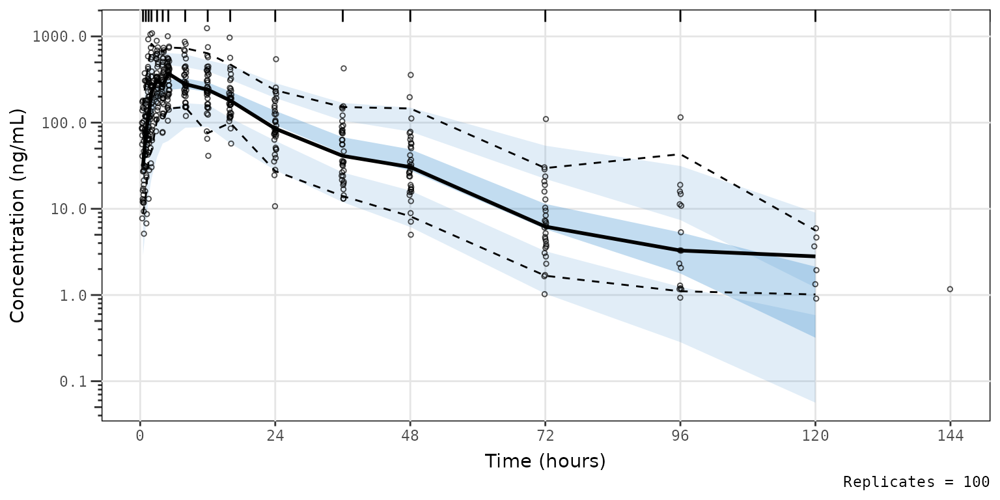
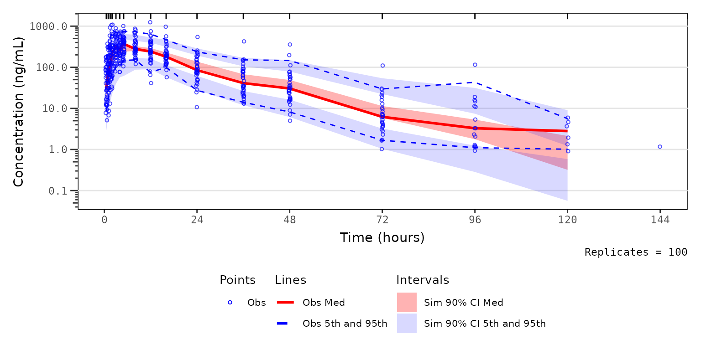
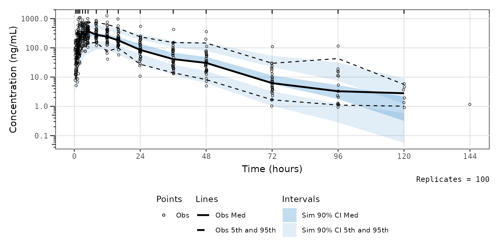

# VPC Plot Aesthetics

This vignette will review the functionality for updating aesthetic
elements of VPC plots generated using
[`vpc()`](https://rdrr.io/pkg/vpc/man/vpc.html) with the
[`new_vpc_theme()`](https://rdrr.io/pkg/vpc/man/new_vpc_theme.html)
function from the `vpc` package.

`plot_legend()` is a helper plotting function that creates a legend for
plots generated using [`vpc()`](https://rdrr.io/pkg/vpc/man/vpc.html).
These legends can then be merged with the VPC plot into a single plot
object using the `patchwork` package.

Let’s get started. First, we will load the required packages.

``` r
options(scipen = 999, rmarkdown.html_vignette.check_title = FALSE)
library(pmxhelpr)
library(dplyr, warn.conflicts =  FALSE)
library(ggplot2, warn.conflicts =  FALSE)
library(vpc, warn.conflicts =  FALSE)
library(mrgsolve, warn.conflicts =  FALSE)
library(withr, warn.conflicts =  FALSE)
library(patchwork, warn.conflicts = FALSE)
```

Next, let’s load use the internal data and model objects from `pmxhelpr`
and `df_mrgsim_replicate` to run the simulation.

``` r
data <- data_sad
model <- model_mread_load("model")
#> Building model_cpp ... done.

simout <- df_mrgsim_replicate(data = data, model = model,replicates = 100, 
                     dv_var = "ODV",
                     time_vars = c(TIME = "TIME", NTIME = "NTIME"),
                     output_vars = c(PRED = "PRED", IPRED = "IPRED", DV = "DV"),
                     num_vars = c("CMT", "BLQ", "LLOQ", "EVID", "MDV", "DOSE", "FOOD"),
                     char_vars = c("PART"),
                     obsonly = TRUE)
```

Now let’s plot all data together in a prediction-corrected VPC (pcVPC).
There is only single dose administration in this dataset, thus we are
able to pool across doses and food conditions with
prediction-correction. We will set `min_bin_count = 5` to avoid the
simulated intervals extending to the final timepoint with only a single
observation.

``` r
vpc_pc <- plot_vpc_exactbins(
  sim = simout,
  xlab = "Time (hours)",
  ylab = "Concentration (ng/mL)",
  pcvpc = TRUE,
  min_bin_count = 5
) +
  scale_y_log10(guide = "axis_logticks")
#> Joining with `by = join_by(NTIME, CMT)`
#> Joining with `by = join_by(NTIME, CMT)`

vpc_pc
```



## Plot Elements

### Default Elements

The default elements shown in the plot are inherited from
[`vpc()`](https://rdrr.io/pkg/vpc/man/vpc.html). The `shown` argument
can be provided to
[`plot_vpc_exactbins()`](https://ryancrass.github.io/pmxhelpr/reference/plot_vpc_exactbins.md)
and passed on to the `show` argument of
[`vpc()`](https://rdrr.io/pkg/vpc/man/vpc.html).

The default is as follows:

``` r
shown_list <- list(obs_dv = TRUE, obs_ci = TRUE,
                   pi = FALSE, pi_as_area = FALSE, pi_ci = TRUE,
                   obs_median = TRUE, sim_median =FALSE, sim_median_ci = TRUE)
```

The components of the list correspond to the following vpc plot
elements:

- Observed points: `obs_dv`
- Observed quantiles: `obs_ci`
- Simulated inter-quantile range: `pi`
- Simulated inter-quantile area: `pi_as_area`
- Simulated Quantile CI: `pi_ci`
- Observed Median: `obs_median`
- Simulated Median: `sim_median`
- Simulated Median CI: `sim_median_ci`

One or more elements to be updated from the defaults above can be passed
as a list to the argument `shown`. Any elements not specified in `shown`
will inherit the defaults.

### Adjusting Elements

For example, we may want to visualize the 90% prediction interval (i.e.,
5th to 95th percentiles) derived from the simulation, rather than the
confidence intervals of the 5th and 95th percentiles independently. In
this case, we want to also see how close the simulated median falls
relative to the observed median.

Let’s see how this can be down using `shown`!

``` r

vpc_pc_pi <- plot_vpc_exactbins(
  sim = simout, 
  time_vars = c(TIME = "TIME", NTIME = "NTIME"),
  output_vars = c(PRED = "PRED", IPRED = "IPRED", SIMDV = "SIMDV", OBSDV = "OBSDV"),
  xlab = "Time (hours)",
  ylab = "Concentration (ng/mL)",
  pcvpc = TRUE,
  min_bin_count = 5,
  shown = list(obs_ci = FALSE, pi_ci = FALSE, sim_median_ci = FALSE, sim_median = TRUE, pi_as_area = TRUE)
) +
  scale_y_log10(guide = "axis_logticks")
#> Joining with `by = join_by(NTIME, CMT)`
#> Joining with `by = join_by(NTIME, CMT)`

vpc_pc_pi
```



Now, let’s say we want to remove the observed data points from the plot
above to better visualize the observed quantile lines relative to their
corresponding simulated confidence intervals. We can do this as follows.

``` r

vpc_pc_noobs <- plot_vpc_exactbins(
  sim = simout, 
  time_vars = c(TIME = "TIME", NTIME = "NTIME"),
  output_vars = c(PRED = "PRED", IPRED = "IPRED", SIMDV = "SIMDV", OBSDV = "OBSDV"),
  xlab = "Time (hours)",
  ylab = "Concentration (ng/mL)",
  pcvpc = TRUE,
  min_bin_count = 5,
  shown = list(obs_dv = FALSE)
) +
  scale_y_log10(guide = "axis_logticks")
#> Joining with `by = join_by(NTIME, CMT)`
#> Joining with `by = join_by(NTIME, CMT)`

vpc_pc_noobs
```



We could also take this one step further and only look at the median and
the simulated confidence interval of the median, to closely interrogate
central tendency. This is common for VPC strata which have few
observations, leading to inadequate sample size to discriminate between
the confidence intervals of the median and the extremes. This is common
scenario when evaluating VPC plots stratified by individual study arms
in early phase trials.

``` r

vpc_pc_noobs_medonly <- plot_vpc_exactbins(
  sim = simout, 
  time_vars = c(TIME = "TIME", NTIME = "NTIME"),
  output_vars = c(PRED = "PRED", IPRED = "IPRED", SIMDV = "SIMDV", OBSDV = "OBSDV"),
  xlab = "Time (hours)",
  ylab = "Concentration (ng/mL)",
  pcvpc = TRUE,
  min_bin_count = 5,
  shown = list(obs_dv = FALSE, obs_ci = FALSE, pi_ci = FALSE)
) +
  scale_y_log10(guide = "axis_logticks")
#> Joining with `by = join_by(NTIME, CMT)`
#> Joining with `by = join_by(NTIME, CMT)`

vpc_pc_noobs_medonly
```



## Plot Aesthetics

### Default Aesthetics

Similarly, the default aesthetics for vpc plots in pmxhelpr use the
classical red-blue-green brewer color schema. The defaults for
`pmxhelpr` can be visualized by specifying the `pmxhlepr_vpc_theme()`
function with no arguments.

``` r
pmxhelpr_theme_list <- pmxhelpr_vpc_theme()
print(pmxhelpr_theme_list)
#> $obs_color
#> [1] "#0000FF"
#> 
#> $obs_size
#> [1] 1
#> 
#> $obs_median_color
#> [1] "#FF0000"
#> 
#> $obs_median_linetype
#> [1] "solid"
#> 
#> $obs_median_size
#> [1] 1
#> 
#> $obs_alpha
#> [1] 0.7
#> 
#> $obs_shape
#> [1] 1
#> 
#> $obs_ci_color
#> [1] "#0000FF"
#> 
#> $obs_ci_linetype
#> [1] "dashed"
#> 
#> $obs_ci_fill
#> [1] "#80808033"
#> 
#> $obs_ci_size
#> [1] 0.5
#> 
#> $sim_pi_fill
#> [1] "#0000FF"
#> 
#> $sim_pi_alpha
#> [1] 0.15
#> 
#> $sim_pi_color
#> [1] "#000000"
#> 
#> $sim_pi_linetype
#> [1] "dotted"
#> 
#> $sim_pi_size
#> [1] 1
#> 
#> $sim_median_fill
#> [1] "#FF0000"
#> 
#> $sim_median_alpha
#> [1] 0.3
#> 
#> $sim_median_color
#> [1] "#000000"
#> 
#> $sim_median_linetype
#> [1] "dashed"
#> 
#> $sim_median_size
#> [1] 1
#> 
#> $bin_separators_color
#> [1] "#000000"
#> 
#> $loq_color
#> [1] "#990000"
#> 
#> attr(,"class")
#> [1] "vpc_theme"
```

We can compare to the corresponding aesthetics from the `vpc` package,
which can be viewed by running
[`new_vpc_theme()`](https://rdrr.io/pkg/vpc/man/new_vpc_theme.html) with
no arguments.

``` r
vpc_theme_list <- new_vpc_theme()
print(vpc_theme_list)
#> $obs_color
#> [1] "#000000"
#> 
#> $obs_size
#> [1] 1
#> 
#> $obs_median_color
#> [1] "#000000"
#> 
#> $obs_median_linetype
#> [1] "solid"
#> 
#> $obs_median_size
#> [1] 1
#> 
#> $obs_alpha
#> [1] 0.7
#> 
#> $obs_shape
#> [1] 1
#> 
#> $obs_ci_color
#> [1] "#000000"
#> 
#> $obs_ci_linetype
#> [1] "dashed"
#> 
#> $obs_ci_fill
#> [1] "#80808033"
#> 
#> $obs_ci_size
#> [1] 0.5
#> 
#> $sim_pi_fill
#> [1] "#3388cc"
#> 
#> $sim_pi_alpha
#> [1] 0.15
#> 
#> $sim_pi_color
#> [1] "#000000"
#> 
#> $sim_pi_linetype
#> [1] "dotted"
#> 
#> $sim_pi_size
#> [1] 1
#> 
#> $sim_median_fill
#> [1] "#3388cc"
#> 
#> $sim_median_alpha
#> [1] 0.3
#> 
#> $sim_median_color
#> [1] "#000000"
#> 
#> $sim_median_linetype
#> [1] "dashed"
#> 
#> $sim_median_size
#> [1] 1
#> 
#> $bin_separators_color
#> [1] "#000000"
#> 
#> $loq_color
#> [1] "#990000"
#> 
#> attr(,"class")
#> [1] "vpc_theme"
```

### Adjusting Aesthetics

Now, suppose we want to change the default aesthetics of the VPC plot,
without changing what is being shown. This can be accomplished by
passing a named list of elements to update to the function
[`pmxhelpr_vpc_theme()`](https://ryancrass.github.io/pmxhelpr/reference/pmxhelpr_vpc_theme.md).
The named list object generated from this function can then be passed to
the `theme` argument in `vpc_plot_exactbins`, which is also an alias for
the `vpc_theme` argument in
[`vpc()`](https://rdrr.io/pkg/vpc/man/vpc.html).

Let’s say we prefer a the blue-grey color scheme native to the `vpc`
package! We can reproduce this by passing
[`vpc::new_vpc_theme()`](https://rdrr.io/pkg/vpc/man/new_vpc_theme.html):

1.  to the update argument of
    [`pmxhelpr_vpc_theme()`](https://ryancrass.github.io/pmxhelpr/reference/pmxhelpr_vpc_theme.md)

``` r
vpc_pc_vpctheme <- plot_vpc_exactbins(
  sim = simout, 
  time_vars = c(TIME = "TIME", NTIME = "NTIME"),
  output_vars = c(PRED = "PRED", IPRED = "IPRED", SIMDV = "SIMDV", OBSDV = "OBSDV"),
  xlab = "Time (hours)",
  ylab = "Concentration (ng/mL)",
  pcvpc = TRUE,
  theme = pmxhelpr_vpc_theme(update = vpc::new_vpc_theme()),
  min_bin_count = 5
) +
  scale_y_log10(guide = "axis_logticks")
#> Joining with `by = join_by(NTIME, CMT)`
#> Joining with `by = join_by(NTIME, CMT)`

vpc_pc_vpctheme
```

 2)
to the theme argument of `plot_vpc_exactbins`.

``` r
vpc_pc_vpctheme2 <- plot_vpc_exactbins(
  sim = simout, 
  time_vars = c(TIME = "TIME", NTIME = "NTIME"),
  output_vars = c(PRED = "PRED", IPRED = "IPRED", SIMDV = "SIMDV", OBSDV = "OBSDV"),
  xlab = "Time (hours)",
  ylab = "Concentration (ng/mL)",
  pcvpc = TRUE,
  theme = vpc::new_vpc_theme(),
  min_bin_count = 5
) +
  scale_y_log10(guide = "axis_logticks")
#> Joining with `by = join_by(NTIME, CMT)`
#> Joining with `by = join_by(NTIME, CMT)`

vpc_pc_vpctheme2
```


### Adding Layers

Let’s say we would like to visualize the major x-axis grid lines to help
locate data corresponding to each sampling timepoint with our plot using
the `vpc` package aesthetic defaults. Conveniently, `plot_vpc_exactbins`
returns a `ggplot2` plot object, which we can modify by adding layers
just like like any other `ggplot2` object.

``` r
vpc_pc_vpctheme_xgrid <- plot_vpc_exactbins(
  sim = simout, 
  time_vars = c(TIME = "TIME", NTIME = "NTIME"),
  xlab = "Time (hours)",
  ylab = "Concentration (ng/mL)",
  pcvpc = TRUE,
  min_bin_count = 5,
  theme = vpc::new_vpc_theme()
) + 
  scale_y_log10(guide = "axis_logticks") + 
  theme(panel.grid.major.x = element_line())
#> Joining with `by = join_by(NTIME, CMT)`
#> Joining with `by = join_by(NTIME, CMT)`

vpc_pc_vpctheme_xgrid
```



## VPC Plot Legends

### Defaults Legend

Okay, now we have gotten the plot aesthetics where we want them;
however, there is one other element we may like to include in the figure
to make it more easily interpreted in isolation - a legend.

`pmxhelpr` provides a useful helper function for this purpose,
`plot_legend()`. To obtain a legend for a plot using default aesthetics,
simply run
[`plot_vpclegend()`](https://ryancrass.github.io/pmxhelpr/reference/plot_vpclegend.md)
without any arguments specified.

``` r
vpc_pc_legend <- plot_vpclegend()
vpc_pc_legend
```

 Now we
have a `ggplot` object legend for our first plot!

To generate one for our second plot with updated aesthetics to match the
`vpc` package defaults, let’s pass the named list output from
[`vpc::new_vpc_theme()`](https://rdrr.io/pkg/vpc/man/new_vpc_theme.html)
to the `update` argument.

``` r
vpc_pc_new_legend <- plot_vpclegend(update = vpc::new_vpc_theme())
vpc_pc_new_legend
```


Okay, now that we have our legend plot objects, let’s combine them with
the VPC plot objects into a single plot object with the `patchwork`
package.

``` r
vpc_pc_wleg <- vpc_pc + vpc_pc_legend + plot_layout(heights = c(2.5,1))
vpc_pc_wleg
```



``` r
vpc_pc_new_wleg <- vpc_pc_vpctheme_xgrid + vpc_pc_new_legend + plot_layout(heights = c(2.5,1))
vpc_pc_new_wleg
```


