# Visual Predictive Check Workflow

This vignette will demonstrate `pmxhelpr` functions for simulation-based
visual predictive check (VPC) and prediction-corrected visual predictive
check (pcVPC) evaluation of models fit to concentration-time data.

``` r

options(scipen = 999, rmarkdown.html_vignette.check_title = FALSE)
library(pmxhelpr)
library(dplyr, warn.conflicts =  FALSE)
library(ggplot2, warn.conflicts =  FALSE)
library(mrgsolve, warn.conflicts =  FALSE)
library(withr, warn.conflicts =  FALSE)
library(patchwork, warn.conflicts = FALSE)
```

The continuous-range VPC plots in this vignette share a common axes /
labels layer (time on x with breaks every 24 hours, concentration on a
log10 y-axis). Defining a single list object lets each plot reuse it
with `+ vpc_scales_labs`; pcVPC views override the y label with
`+ labs(y = ...)` afterwards. The censored-range VPCs use a parallel
`vpc_cens_scales_labs` for the BLQ-proportion plots.

``` r

vpc_scales_labs <- list(
  labs(x = "Time (hours)", y = "Concentration (ng/mL)"),
  scale_x_continuous(breaks = seq(0, 168, 24)),
  scale_y_log10(guide = "axis_logticks")
)

vpc_cens_scales_labs <- list(
  labs(x = "Time (hours)", y = "Proportion BLQ"),
  scale_x_continuous(breaks = seq(0, 168, 24))
)
```

## Data

The example dataset used in this vignette (`data_sad`) is based on a
single ascending dose (SAD) study of an orally administered drug product
with a parallel group food effect (FE) cohort. This vignette will assume
familiarity with the `data_sad` internal dataset and the
[`plot_dvtime()`](https://ryancrass.github.io/pmxhelpr/reference/plot_dvtime.md)
function, as described in the [Exploratory Analyses of PK and PK/PD
Data](https://ryancrass.github.io/pmxhelpr/articles/eda-pk-pkpd-workflow.md)
vignette. These elements will not be reviewed in detail in this
vignette.

### data_sad

Dataset definitions can be viewed by calling
[`?data_sad`](https://ryancrass.github.io/pmxhelpr/reference/data_sad.md).
A quick summary of variables and types is printed below.

``` r

glimpse(data_sad)
#> Rows: 1,404
#> Columns: 25
#> $ ID      <dbl> 1, 1, 1, 1, 1, 1, 1, 1, 1, 1, 1, 1, 1, 1, 1, 1, 1, 1, 1, 1, 1,…
#> $ TIME    <dbl> 0.00, 0.00, 0.00, 0.48, 0.48, 0.81, 0.81, 1.49, 1.49, 2.11, 2.…
#> $ NTIME   <dbl> 0.0, 0.0, 0.0, 0.5, 0.5, 1.0, 1.0, 1.5, 1.5, 2.0, 2.0, 3.0, 3.…
#> $ NDAY    <dbl> 1, 1, 1, 1, 1, 1, 1, 1, 1, 1, 1, 1, 1, 1, 1, 1, 1, 1, 1, 1, 1,…
#> $ DOSE    <dbl> 10, 10, 10, 10, 10, 10, 10, 10, 10, 10, 10, 10, 10, 10, 10, 10…
#> $ AMT     <dbl> 10, NA, NA, NA, NA, NA, NA, NA, NA, NA, NA, NA, NA, NA, NA, NA…
#> $ EVID    <dbl> 1, 0, 0, 0, 0, 0, 0, 0, 0, 0, 0, 0, 0, 0, 0, 0, 0, 0, 0, 0, 0,…
#> $ ODV     <dbl> NA, NA, 100.00000, NA, 99.87700, 2.02000, 99.44932, 4.02000, 9…
#> $ LDV     <dbl> NA, NA, 100.00000, NA, 99.87700, 0.70310, 99.44932, 1.39130, 9…
#> $ CFB     <dbl> NA, NA, 0.0000000, NA, -0.1229974, NA, -0.5506789, NA, -2.3928…
#> $ CONC    <dbl> NA, NA, 0.00, NA, 0.00, NA, 2.02, NA, 4.02, NA, 3.50, NA, 7.18…
#> $ LINE    <dbl> 2, 1, 1, 3, 3, 4, 4, 5, 5, 6, 6, 7, 7, 8, 8, 9, 9, 10, 10, 11,…
#> $ CMT     <dbl> 1, 2, 3, 2, 3, 2, 3, 2, 3, 2, 3, 2, 3, 2, 3, 2, 3, 2, 3, 2, 3,…
#> $ MDV     <dbl> NA, 1, 1, 1, 1, 0, 0, 0, 0, 0, 0, 0, 0, 0, 0, 0, 0, 0, 0, 0, 0…
#> $ BLQ     <dbl> NA, -1, -1, 1, 1, 0, 0, 0, 0, 0, 0, 0, 0, 0, 0, 0, 0, 0, 0, 0,…
#> $ LLOQ    <dbl> NA, 1, 1, 1, 1, 1, 1, 1, 1, 1, 1, 1, 1, 1, 1, 1, 1, 1, 1, 1, 1…
#> $ FOOD    <dbl> 0, 0, 0, 0, 0, 0, 0, 0, 0, 0, 0, 0, 0, 0, 0, 0, 0, 0, 0, 0, 0,…
#> $ SEXF    <dbl> 1, 1, 1, 1, 1, 1, 1, 1, 1, 1, 1, 1, 1, 1, 1, 1, 1, 1, 1, 1, 1,…
#> $ RACE    <dbl> 2, 2, 2, 2, 2, 2, 2, 2, 2, 2, 2, 2, 2, 2, 2, 2, 2, 2, 2, 2, 2,…
#> $ AGEBL   <int> 25, 25, 25, 25, 25, 25, 25, 25, 25, 25, 25, 25, 25, 25, 25, 25…
#> $ WTBL    <dbl> 82.1, 82.1, 82.1, 82.1, 82.1, 82.1, 82.1, 82.1, 82.1, 82.1, 82…
#> $ SCRBL   <dbl> 0.87, 0.87, 0.87, 0.87, 0.87, 0.87, 0.87, 0.87, 0.87, 0.87, 0.…
#> $ CRCLBL  <dbl> 128, 128, 128, 128, 128, 128, 128, 128, 128, 128, 128, 128, 12…
#> $ USUBJID <chr> "STUDYNUM-SITENUM-1", "STUDYNUM-SITENUM-1", "STUDYNUM-SITENUM-…
#> $ PART    <chr> "Part 1-SAD", "Part 1-SAD", "Part 1-SAD", "Part 1-SAD", "Part …
```

PART specifies the two study cohorts:

- Single Ascending Dose (SAD)
- Food Effect (FE).

``` r

unique(data_sad$PART)
#> [1] "Part 1-SAD" "Part 2-FE"
```

This dataset also contains an exact binning variable:

- Nominal Time (NTIME).

This variable represents the nominal time of sample collection relative
to first dose per study protocol whereas Actual Time (TIME) represents
the actual time the sample was collected.

``` r

##Unique values of NTIME
unique(data_sad$NTIME)
#>  [1]   0.0   0.5   1.0   1.5   2.0   3.0   4.0   5.0   8.0  12.0  16.0  24.0
#> [13]  36.0  48.0  72.0  96.0 120.0 144.0 168.0

##Comparison of number of unique values of NTIME and TIME
length(unique(data_sad$NTIME))
#> [1] 19
length(unique(data_sad$TIME))
#> [1] 449
```

Let’s define some variables that may be useful in plotting and filter
down to PK relevant records.

``` r

data_sad_pk <- data_sad %>% 
  filter(CMT %in% c(1,2)) %>% 
  mutate(`Food Status` = ifelse(FOOD == 0, "Fasted", "Fed"), 
         DoseFood = paste(DOSE, "mg", `Food Status`)) %>% 
  mutate(`Food Status` = var_addn(`Food Status`, ID),
         `Dose and Food` = var_addn(DoseFood, ID))
```

## PK Model

An example PK model (`pkmodel`) in `mrgmod` format is provided in the
internal package library. This can be loaded using the helper function
[`model_mread_load()`](https://ryancrass.github.io/pmxhelpr/reference/model_mread_load.md),
which wraps
[`mrgsolve::mread`](https://mrgsolve.org/docs/reference/mread.html).

``` r

model <- model_mread_load("pkmodel")
#> Building pkmodel_cpp ... done.
```

We can take a look at the model code using
[`mrgsolve::see`](https://mrgsolve.org/docs/reference/see.html)

``` r

mrgsolve::see(model)
#> 
#> Model file:  pkmodel.cpp 
#> $PARAM
#> TVCL = 20
#> TVVC = 35.7
#> TVKA = 0.3
#> TVQ = 25
#> TVVP = 150
#> DOSE_F1 = 0.33
#> 
#> WT_CL = 0.75
#> WT_VC = 1.00
#> WT_Q = 0.75
#> WT_VP = 1.00
#> FOOD_KA = -0.5
#> FOOD_F1 = 1.33
#> 
#> WT = 70
#> DOSE = 100
#> FOOD = 0
#> 
#> $CMT GUT CENT PERIPH TRANS1 TRANS2
#> 
#> $MAIN
#> double CL = TVCL*pow(WT/70,WT_CL)*exp(ETA_CL);
#> double VC  = TVVC*pow(WT/70, WT_VC)*exp(ETA_VC);
#> double Q = TVCL*pow(WT/70,WT_Q)*exp(ETA_Q);
#> double VP  = TVVP*pow(WT/70, WT_VP)*exp(ETA_VP);
#> double KA = TVKA*(1+FOOD_KA*FOOD)*exp(ETA_KA);
#> double F1 = 1*(1+FOOD_F1*FOOD)*pow(DOSE/100,DOSE_F1);
#> 
#> F_GUT = F1;
#> 
#> $ODE
#> dxdt_GUT = -KA*GUT;
#> dxdt_CENT = KA*TRANS1 - (CL/VC)*CENT + (Q/VP)*PERIPH - (Q/VC)*CENT;
#> dxdt_PERIPH = (Q/VC)*CENT - (Q/VP)*PERIPH;
#> dxdt_TRANS1 = KA*GUT - KA*TRANS1;
#> dxdt_TRANS2 = KA*TRANS1 - KA*TRANS2;
#> 
#> $OMEGA @labels ETA_CL ETA_VC ETA_KA ETA_Q ETA_VP
#> 0.075 0.1 0.2 0 0
#> 
#> $SIGMA @labels PROP
#> 0.09
#> 
#> $TABLE
#> capture IPRED = CENT/(VC/1000);
#> capture DV = IPRED*(1+PROP);
#> capture Y = DV;
```

We can use this PK model to add population predictions (`"PRED"`) to our
dataset with the function
[`df_mrgsim_addpred()`](https://ryancrass.github.io/pmxhelpr/reference/df_mrgsim_addpred.md),
which wraps
[`mrgsolve::mrgsim_df()`](https://mrgsolve.org/docs/reference/mrgsim.html)
with
[`mrgsolve::zero_re()`](https://mrgsolve.org/docs/reference/zero_re.html)
to return an input dataset with population predictions appended. This
function is called automatically within
[`df_mrgsim_replicate()`](https://ryancrass.github.io/pmxhelpr/reference/df_mrgsim_replicate.md)
in the VPC Workflow; therefore, it does not need to be separately called
for the VPC purpose.

This function takes `data.frame` and `mrgmod` objects as input and an
optional argument to specify the model variable to capture as `"PRED"`
with random effects zeroed. The default is `"IPRED"`.

``` r

data_sad_pk_pred <- df_mrgsim_addpred(data_sad_pk, model, output_var = "IPRED")

colnames(data_sad_pk_pred)[!colnames(data_sad_pk_pred) %in% colnames(data_sad_pk)]
#> [1] "PRED"
```

## VPC Workflow

`pmxhelpr` includes two functions for calculating summary statistics
across simulated replicates of an input dataset and plotting the output
for model evaluation: `df_vpcstats` and
[`plot_vpc_cont()`](https://ryancrass.github.io/pmxhelpr/reference/plot_vpc_cont.md).

The `df_vpcstats` function can be called within
[`plot_vpc_cont()`](https://ryancrass.github.io/pmxhelpr/reference/plot_vpc_cont.md),
for a one function call calculation and visualization of VPC statistics.
`df_vpcstats` returns a `pmx_stats` container with `stats` (summary
statistics of simulated and observed data), `obs` (observed data points
for overlay), and `config` (run configuration) slots. The returned
output can be passed directly into
[`plot_vpc_cont()`](https://ryancrass.github.io/pmxhelpr/reference/plot_vpc_cont.md)
or the full pipeline can be run within the plotting function.

Many VPC tools use automatic binning algorithms (e.g., Jenks natural
breaks, k-means, density) to determine bin intervals from the data.
While these are useful for datasets without a pre-defined binning
variable, they are not optimized to leverage input datasets with a
variable representing exact bin times (e.g., nominal or
protocol-specified times). Additionally, when a dataset contains an
exact binning variable, these algorithms may not reproduce the exact
bins. For example, absorption phase timepoints that are close together
may be grouped into a single bin, obscuring important pharmacokinetic
details.

The presence of exact bins in the data is a common scenario in
pharmacometrics, as Clinical Study Protocols specify the times of PK
sampling.
[`plot_vpc_cont()`](https://ryancrass.github.io/pmxhelpr/reference/plot_vpc_cont.md)
uses the unique values of the nominal time variable directly as exact
bins, ensuring that summary statistics are calculated at visualized at
the protocol-specified sampling times.

## Running the simulation with `df_mrgsim_replicate()`

### Overview

`pmxhelpr` includes a function for running multiple replicates of a data
set via simulation:
[`df_mrgsim_replicate()`](https://ryancrass.github.io/pmxhelpr/reference/df_mrgsim_replicate.md)

[`df_mrgsim_replicate()`](https://ryancrass.github.io/pmxhelpr/reference/df_mrgsim_replicate.md)
is a wrapper function for
[`mrgsim_df()`](https://mrgsolve.org/docs/reference/mrgsim.html), which
uses [`lapply()`](https://rdrr.io/r/base/lapply.html) to iterate the
simulation over integers from 1 to the value passed to the argument
`replicates`.

There are 3 required arguments to
[`df_mrgsim_replicate()`](https://ryancrass.github.io/pmxhelpr/reference/df_mrgsim_replicate.md)

- `data`, a `data.frame` modeling analysis dataset
- `model`, a `mrgmod` model object
- `replicates`, numeric number of replicates to perform.

The are optional arguments specifying key dataset variables to be input
into the simulation or captured in output. These include:

- `dv_var` = DV, dependent variable
- `time_var` = TIME, actual time variable
- `ntime_var` = NTIME, nominal time variable
- `pred_var` = PRED, population prediction variable (fixed effects only)
- `ipred_var` = IPRED, individual prediction variable (fixed + level 1
  random effects)
- `sim_dv_var` = DV, dependent variable captured in the simulated output
  (fixed + level 1 and 2 random effects)

These arguments use non-standard evaluation and can be passed as a bare
column name or as a string.

We can pass `data_sad_pk` and `model` and run the simulation for 100
`replicates`. The names of actual and nominal time variables in
`data_sad` match the default arguments; however, our dependent variable
is named `ODV`, which must be specified in the `dv_var` argument, since
it differs from the default (`DV`).

``` r

simout <- df_mrgsim_replicate(
  data = data_sad_pk,
  model = model,
  replicates = 100,
  dv_var = ODV,
  carry_out = c("DOSE", "FOOD", "BLQ", "LLOQ"),
  recover  = c("PART", "DoseFood"))

glimpse(simout)
#> Rows: 72,000
#> Columns: 23
#> $ ID       <dbl> 1, 1, 1, 1, 1, 1, 1, 1, 1, 1, 1, 1, 1, 1, 1, 1, 1, 1, 1, 1, 2…
#> $ TIME     <dbl> 0.00, 0.00, 0.48, 0.81, 1.49, 2.11, 3.05, 4.14, 5.14, 7.81, 1…
#> $ NTIME    <dbl> 0.0, 0.0, 0.5, 1.0, 1.5, 2.0, 3.0, 4.0, 5.0, 8.0, 12.0, 16.0,…
#> $ PRED     <dbl> 0.0000000000, 0.0000000000, 1.0373644222, 2.4699025938, 5.869…
#> $ IPRED    <dbl> 0.00000000000, 0.00000000000, 0.23991271053, 0.58097762508, 1…
#> $ SIMDV    <dbl> 0.00000000000, 0.00000000000, 0.27955022508, 0.74917139938, 1…
#> $ OBSDV    <dbl> NA, NA, NA, 2.02, 4.02, 3.50, 7.18, 9.31, 12.46, 13.43, 12.11…
#> $ EVID     <dbl> 1, 0, 0, 0, 0, 0, 0, 0, 0, 0, 0, 0, 0, 0, 0, 0, 0, 0, 0, 0, 1…
#> $ CMT      <dbl> 1, 2, 2, 2, 2, 2, 2, 2, 2, 2, 2, 2, 2, 2, 2, 2, 2, 2, 2, 2, 1…
#> $ MDV      <dbl> NA, 1, 1, 0, 0, 0, 0, 0, 0, 0, 0, 0, 0, 0, 1, 1, 1, 1, 1, 1, …
#> $ DOSE     <dbl> 10, 10, 10, 10, 10, 10, 10, 10, 10, 10, 10, 10, 10, 10, 10, 1…
#> $ FOOD     <dbl> 0, 0, 0, 0, 0, 0, 0, 0, 0, 0, 0, 0, 0, 0, 0, 0, 0, 0, 0, 0, 0…
#> $ BLQ      <dbl> NA, -1, 1, 0, 0, 0, 0, 0, 0, 0, 0, 0, 0, 0, 1, 1, 1, 1, 1, 1,…
#> $ LLOQ     <dbl> NA, 1, 1, 1, 1, 1, 1, 1, 1, 1, 1, 1, 1, 1, 1, 1, 1, 1, 1, 1, …
#> $ GUT      <dbl> 4.67735141287198175, 4.67735141287198175, 4.34652773939926984…
#> $ CENT     <dbl> 0.000000000000, 0.000000000000, 0.009786371098, 0.02369888042…
#> $ PERIPH   <dbl> 0.00000000000, 0.00000000000, 0.00080390625, 0.00337854545, 0…
#> $ TRANS1   <dbl> 0.0000000000000000, 0.0000000000000000, 0.3188382667608536, 0…
#> $ TRANS2   <dbl> 0.00000000000000, 0.00000000000000, 0.01169414527583, 0.03166…
#> $ Y        <dbl> 0.00000000000, 0.00000000000, 0.27955022508, 0.74917139938, 1…
#> $ PART     <chr> "Part 1-SAD", "Part 1-SAD", "Part 1-SAD", "Part 1-SAD", "Part…
#> $ DoseFood <chr> "10 mg Fasted", "10 mg Fasted", "10 mg Fasted", "10 mg Fasted…
#> $ SIM      <int> 1, 1, 1, 1, 1, 1, 1, 1, 1, 1, 1, 1, 1, 1, 1, 1, 1, 1, 1, 1, 1…
max(simout$SIM)
#> [1] 100
```

The simulation has appended some key variables with standardized names
that will allow us to take advantage of default arguments in later
pipeline functions: - `PRED` (population prediction) - `IPRED`
(individual prediction) - `SIMDV` (simulated dependent variable) -
`OBSDV` (observed dependent variable).

These variable standard names are output regardless of the input name.
For example, we can see from the
[`glimpse()`](https://pillar.r-lib.org/reference/glimpse.html) output
that the simulation also outputs `"Y"`, which represents a simulated
version of DV. We will still receive the same standardized output
variable names if we change argument form `sim_dv_var`, as the variables
are renamed to VPC workflow standards on output

``` r

simout <- df_mrgsim_replicate(data = data_sad_pk,
                     model = model,
                     replicates = 100,
                     dv_var = ODV,
                     sim_dv_var = Y,
                     carry_out = c("DOSE", "FOOD", "BLQ", "LLOQ"),
                     recover  = c("PART", "DoseFood"))

glimpse(simout)
#> Rows: 72,000
#> Columns: 23
#> $ ID       <dbl> 1, 1, 1, 1, 1, 1, 1, 1, 1, 1, 1, 1, 1, 1, 1, 1, 1, 1, 1, 1, 2…
#> $ TIME     <dbl> 0.00, 0.00, 0.48, 0.81, 1.49, 2.11, 3.05, 4.14, 5.14, 7.81, 1…
#> $ NTIME    <dbl> 0.0, 0.0, 0.5, 1.0, 1.5, 2.0, 3.0, 4.0, 5.0, 8.0, 12.0, 16.0,…
#> $ PRED     <dbl> 0.0000000000, 0.0000000000, 1.0373644222, 2.4699025938, 5.869…
#> $ IPRED    <dbl> 0.00000000000, 0.00000000000, 0.23991271053, 0.58097762508, 1…
#> $ SIMDV    <dbl> 0.00000000000, 0.00000000000, 0.27955022508, 0.74917139938, 1…
#> $ OBSDV    <dbl> NA, NA, NA, 2.02, 4.02, 3.50, 7.18, 9.31, 12.46, 13.43, 12.11…
#> $ EVID     <dbl> 1, 0, 0, 0, 0, 0, 0, 0, 0, 0, 0, 0, 0, 0, 0, 0, 0, 0, 0, 0, 1…
#> $ CMT      <dbl> 1, 2, 2, 2, 2, 2, 2, 2, 2, 2, 2, 2, 2, 2, 2, 2, 2, 2, 2, 2, 1…
#> $ MDV      <dbl> NA, 1, 1, 0, 0, 0, 0, 0, 0, 0, 0, 0, 0, 0, 1, 1, 1, 1, 1, 1, …
#> $ DOSE     <dbl> 10, 10, 10, 10, 10, 10, 10, 10, 10, 10, 10, 10, 10, 10, 10, 1…
#> $ FOOD     <dbl> 0, 0, 0, 0, 0, 0, 0, 0, 0, 0, 0, 0, 0, 0, 0, 0, 0, 0, 0, 0, 0…
#> $ BLQ      <dbl> NA, -1, 1, 0, 0, 0, 0, 0, 0, 0, 0, 0, 0, 0, 1, 1, 1, 1, 1, 1,…
#> $ LLOQ     <dbl> NA, 1, 1, 1, 1, 1, 1, 1, 1, 1, 1, 1, 1, 1, 1, 1, 1, 1, 1, 1, …
#> $ GUT      <dbl> 4.67735141287198175, 4.67735141287198175, 4.34652773939926984…
#> $ CENT     <dbl> 0.000000000000, 0.000000000000, 0.009786371098, 0.02369888042…
#> $ PERIPH   <dbl> 0.00000000000, 0.00000000000, 0.00080390625, 0.00337854545, 0…
#> $ TRANS1   <dbl> 0.0000000000000000, 0.0000000000000000, 0.3188382667608536, 0…
#> $ TRANS2   <dbl> 0.00000000000000, 0.00000000000000, 0.01169414527583, 0.03166…
#> $ DV       <dbl> 0.00000000000, 0.00000000000, 0.27955022508, 0.74917139938, 1…
#> $ PART     <chr> "Part 1-SAD", "Part 1-SAD", "Part 1-SAD", "Part 1-SAD", "Part…
#> $ DoseFood <chr> "10 mg Fasted", "10 mg Fasted", "10 mg Fasted", "10 mg Fasted…
#> $ SIM      <int> 1, 1, 1, 1, 1, 1, 1, 1, 1, 1, 1, 1, 1, 1, 1, 1, 1, 1, 1, 1, 1…
```

### Changing the Replicate Counter

The maximum value of our replicate count variable (default = `"SIM"`)
indicates that the dataset has been replicated 100 times. The variable
name output for the count of replicates can be specified using the
`irep_name` argument.

This argument uses non-standard evaluation and can be supplied as a bare
name or string

``` r

simout <- df_mrgsim_replicate(data = data_sad_pk,
                     model = model,
                     replicates = 100,
                     dv_var = ODV,
                     irep_name = IREP,
                     carry_out = c("DOSE", "FOOD", "BLQ", "LLOQ"),
                     recover  = c("PART", "DoseFood"))

max(simout$IREP)
#> [1] 100
```

### Carrying Input Columns to the Output

[`df_mrgsim_replicate()`](https://ryancrass.github.io/pmxhelpr/reference/df_mrgsim_replicate.md)
does not auto-carry input columns. Use `carry_out` and `recover` (passed
through `...` to
[`mrgsim_df()`](https://mrgsolve.org/docs/reference/mrgsim.html)) to
list the columns you want propagated to the output:

- `carry_out`: character vector of numeric input column names to carry
  to the output. Best for numeric columns (`DOSE`, `FOOD`, `BLQ`,
  `LLOQ`, …).
- `recover`: character vector of input column names of any type to
  restore to the output. Best for character / factor columns (`PART`,
  `DoseFood`, …).

The always-carried set (`EVID`, `MDV`, `CMT`, `TIME`, `NTIME`, `OBSDV`,
`PRED`) is appended internally so the wrapper’s standardized output
structure is preserved regardless of what you pass.

``` r

simout <- df_mrgsim_replicate(data = data_sad_pk,
                     model = model,
                     replicates = 100,
                     dv_var = ODV,
                     carry_out = c("DOSE", "FOOD", "BLQ", "LLOQ"),
                     recover  = c("PART", "DoseFood"))

colnames(simout)
#>  [1] "ID"       "TIME"     "NTIME"    "PRED"     "IPRED"    "SIMDV"   
#>  [7] "OBSDV"    "EVID"     "CMT"      "MDV"      "DOSE"     "FOOD"    
#> [13] "BLQ"      "LLOQ"     "GUT"      "CENT"     "PERIPH"   "TRANS1"  
#> [19] "TRANS2"   "Y"        "PART"     "DoseFood" "SIM"
```

### Setting the seed

The unique seed can be set using the `seed` argument. The default is
`1234567889`.

``` r

simout <- df_mrgsim_replicate(data = data_sad_pk,
                     model = model,
                     replicates = 100,
                     dv_var = ODV,
                     seed = 42,
                     carry_out = c("DOSE", "FOOD", "BLQ", "LLOQ"),
                     recover  = c("PART", "DoseFood"))

glimpse(simout)
#> Rows: 72,000
#> Columns: 23
#> $ ID       <dbl> 1, 1, 1, 1, 1, 1, 1, 1, 1, 1, 1, 1, 1, 1, 1, 1, 1, 1, 1, 1, 2…
#> $ TIME     <dbl> 0.00, 0.00, 0.48, 0.81, 1.49, 2.11, 3.05, 4.14, 5.14, 7.81, 1…
#> $ NTIME    <dbl> 0.0, 0.0, 0.5, 1.0, 1.5, 2.0, 3.0, 4.0, 5.0, 8.0, 12.0, 16.0,…
#> $ PRED     <dbl> 0.0000000000, 0.0000000000, 1.0373644222, 2.4699025938, 5.869…
#> $ IPRED    <dbl> 0.00000000000, 0.00000000000, 0.47019035132, 1.13765701005, 2…
#> $ SIMDV    <dbl> 0.00000000000, 0.00000000000, 0.67706358033, 0.41670974113, 2…
#> $ OBSDV    <dbl> NA, NA, NA, 2.02, 4.02, 3.50, 7.18, 9.31, 12.46, 13.43, 12.11…
#> $ EVID     <dbl> 1, 0, 0, 0, 0, 0, 0, 0, 0, 0, 0, 0, 0, 0, 0, 0, 0, 0, 0, 0, 1…
#> $ CMT      <dbl> 1, 2, 2, 2, 2, 2, 2, 2, 2, 2, 2, 2, 2, 2, 2, 2, 2, 2, 2, 2, 1…
#> $ MDV      <dbl> NA, 1, 1, 0, 0, 0, 0, 0, 0, 0, 0, 0, 0, 0, 1, 1, 1, 1, 1, 1, …
#> $ DOSE     <dbl> 10, 10, 10, 10, 10, 10, 10, 10, 10, 10, 10, 10, 10, 10, 10, 1…
#> $ FOOD     <dbl> 0, 0, 0, 0, 0, 0, 0, 0, 0, 0, 0, 0, 0, 0, 0, 0, 0, 0, 0, 0, 0…
#> $ BLQ      <dbl> NA, -1, 1, 0, 0, 0, 0, 0, 0, 0, 0, 0, 0, 0, 1, 1, 1, 1, 1, 1,…
#> $ LLOQ     <dbl> NA, 1, 1, 1, 1, 1, 1, 1, 1, 1, 1, 1, 1, 1, 1, 1, 1, 1, 1, 1, …
#> $ GUT      <dbl> 4.677351412871981750641, 4.677351412871981750641, 4.210781713…
#> $ CENT     <dbl> 0.000000000000, 0.000000000000, 0.020158567446, 0.04877500251…
#> $ PERIPH   <dbl> 0.00000000000, 0.00000000000, 0.00157476512, 0.00661928452, 0…
#> $ TRANS1   <dbl> 0.0000000000000000000, 0.0000000000000000000, 0.4424845280226…
#> $ TRANS2   <dbl> 0.0000000000000000000, 0.0000000000000000000, 0.0232489583254…
#> $ Y        <dbl> 0.00000000000, 0.00000000000, 0.67706358033, 0.41670974113, 2…
#> $ PART     <chr> "Part 1-SAD", "Part 1-SAD", "Part 1-SAD", "Part 1-SAD", "Part…
#> $ DoseFood <chr> "10 mg Fasted", "10 mg Fasted", "10 mg Fasted", "10 mg Fasted…
#> $ SIM      <int> 1, 1, 1, 1, 1, 1, 1, 1, 1, 1, 1, 1, 1, 1, 1, 1, 1, 1, 1, 1, 1…
```

### Additional arguments passed to `mrgsim_df()`

Any other
[`mrgsim_df()`](https://mrgsolve.org/docs/reference/mrgsim.html)
argument can be passed via `...`. One useful argument is
`obsonly = TRUE`, which removes dose records from the simulation output
to reduce file size.

``` r

# Default behavior (dose records included) — simout from the prior chunk
nrow(simout)
#> [1] 72000

# With obsonly = TRUE, dose records are removed
simout <- df_mrgsim_replicate(data = data_sad_pk,
                              model = model,
                              replicates = 100,
                              dv_var = ODV,
                              carry_out = c("DOSE", "FOOD", "BLQ", "LLOQ"),
                              recover  = c("PART", "DoseFood"),
                              obsonly = TRUE)

nrow(simout)
#> [1] 68400
```

### Parallel processing

For large `replicates` values or expensive model evaluations,
[`df_mrgsim_replicate()`](https://ryancrass.github.io/pmxhelpr/reference/df_mrgsim_replicate.md)
accepts `parallel = TRUE` to dispatch per-replicate simulations across
worker processes via
[`future.apply::future_lapply()`](https://future.apply.futureverse.org/reference/future_lapply.html).
This requires the `future.apply` package and a parallel plan set by the
user.
[`df_mrgsim_replicate()`](https://ryancrass.github.io/pmxhelpr/reference/df_mrgsim_replicate.md)
does not modify the plan itself, so the user retains full control over
the worker topology and is responsible for restoring the prior plan
after the call.

The pattern is to wrap the parallel simulation between a
[`future::plan()`](https://future.futureverse.org/reference/plan.html)
setup and a teardown back to
[`future::sequential`](https://future.futureverse.org/reference/sequential.html):

``` r

future::plan(future::multisession, workers = 4)

simout <- df_mrgsim_replicate(data = data_sad_pk,
                     model = model,
                     replicates = 1000,
                     dv_var = ODV,
                     carry_out = c("DOSE", "FOOD", "BLQ", "LLOQ"),
                     recover  = c("PART", "DoseFood"),
                     parallel = TRUE)

future::plan(future::sequential)
```

Under `parallel = TRUE`, per-replicate RNG streams are generated from
`seed` using L’Ecuyer-CMRG (via the `future.seed = seed` argument to
`future_lapply()`), so output is reproducible given the same `seed` and
[`future::plan()`](https://future.futureverse.org/reference/plan.html).
The numerical output differs from `parallel = FALSE` because the RNG
mechanism differs, but the two are statistically equivalent — the same
per-replicate distribution is sampled, only the per-record realizations
change. As a consequence, downstream
[`df_vpcstats()`](https://ryancrass.github.io/pmxhelpr/reference/df_vpcstats.md)
summary statistics (quantiles, BLQ proportions, simulated CI bands) will
not match bit-for-bit between the sequential and parallel paths even
when the seed is held constant; both are valid Monte Carlo samples of
the same target distribution.

Speedup is best for high `replicates` (the per-worker dispatch overhead
amortizes over many replicates) and models with expensive numerical
integration. For modest workloads — e.g., the 100-replicate examples
used throughout this vignette — the sequential path is typically faster
end-to-end because worker-startup cost dominates the simulation cost.

## Calculating the summary statistics with `df_vpcstats()`

`pmxhelpr` contains a function to pre-process and derive summary
statistics from the observed and simulated data for plotting in
downstream VPC and pcVPC plots to evaluate the model fit for
longitudinal, continuous repeated measures data:
[`df_vpcstats()`](https://ryancrass.github.io/pmxhelpr/reference/df_vpcstats.md)

This function is designed around the concept of actual and nominal time
variables, with the latter used to bin data together to calculate
summary statistics across simulation replicates. Functionality is
included for handling of data missing due to assay sensitivity (BLQ)
separately depending on user request of standard or prediction-corrected
values.

### Overview of `df_vpcstats()`

The `df_vpcstats` function handles the first two steps in the VPC plot
pipeline after simulation:

1.  Pre-processing the data to validate arguments, filter to observation
    records, and handle missing data
2.  Grouping, prediction-correction (if requested), and calculation of
    summary statistics

VPC summary statistics are calculated for the input dataset `data` at
the study replicate-level (median and quantiles specified by `pi`), and
subsequently summarized across replicates (median and uantiles specified
by `ci`) to identify the non-parametric confidence interval.

Outputs are grouped by the variables passed to `ntime_var` and
`strat_var`.

The remaining arguments control processing for prediction-correction
(`pcvpc`) and BLQ handling (`loq`).

[`df_vpcstats()`](https://ryancrass.github.io/pmxhelpr/reference/df_vpcstats.md)
returns a \[`pmx_stats`\]\[is_pmx_stats\] container with three slots:

- `stats` — the quantile summary statistics of the observed and
  simulated data
- `obs` — first-replicate observation rows used as the scatter overlay
  in
  [`plot_vpc_cont()`](https://ryancrass.github.io/pmxhelpr/reference/plot_vpc_cont.md)
- `config` — the run configuration (`n_replicates`, `loq`, `strat_var`)
  used by downstream plot builders

Let’s calculate VPC summary statistics for our simulated dataset. The
minimum stratification based on extrinsic participant factors in the
study design for a standard vpc is stratifying by Dose and Food.

``` r

vpcstats_ntime_dose_food <- df_vpcstats(
  data = simout,
  strat_var = DoseFood
)
#> Inheriting per-row `loq` from `LLOQ` column in `data`.

glimpse(vpcstats_ntime_dose_food$stats)
#> Rows: 114
#> Columns: 35
#> $ BIN_MID          <dbl> 0.0, 0.0, 0.0, 0.0, 0.0, 0.0, 0.5, 0.5, 0.5, 0.5, 0.5…
#> $ DoseFood         <chr> "10 mg Fasted", "100 mg Fasted", "100 mg Fed", "200 m…
#> $ obs_n            <int> 6, 6, 6, 6, 6, 6, 6, 6, 6, 6, 6, 6, 6, 6, 6, 6, 6, 6,…
#> $ obs_n_blq        <int> 6, 6, 6, 6, 6, 6, 2, 0, 0, 0, 0, 0, 0, 0, 0, 0, 0, 0,…
#> $ obs_prop_blq     <dbl> 1.0000000, 1.0000000, 1.0000000, 1.0000000, 1.0000000…
#> $ sim_prop_blq_low <dbl> 1.0000000, 1.0000000, 1.0000000, 1.0000000, 1.0000000…
#> $ sim_prop_blq_med <dbl> 1.0000000, 1.0000000, 1.0000000, 1.0000000, 1.0000000…
#> $ sim_prop_blq_hi  <dbl> 1.0000000, 1.0000000, 1.0000000, 1.0000000, 1.0000000…
#> $ obs_low          <dbl> NA, NA, NA, NA, NA, NA, NA, 33.3625, 10.7975, 22.2725…
#> $ obs_med          <dbl> NA, NA, NA, NA, NA, NA, 1.945, 48.420, 21.815, 37.945…
#> $ obs_hi           <dbl> NA, NA, NA, NA, NA, NA, 7.2300, 221.8375, 43.8525, 10…
#> $ sim_low_low      <dbl> 0.0000000, 0.0000000, 0.0000000, 0.0000000, 0.0000000…
#> $ sim_low_med      <dbl> 0.0000000, 0.0000000, 0.0000000, 0.0000000, 0.0000000…
#> $ sim_low_hi       <dbl> 0.0000000, 0.0000000, 0.0000000, 0.0000000, 0.0000000…
#> $ sim_med_low      <dbl> 0.0000000, 0.0000000, 0.0000000, 0.0000000, 0.0000000…
#> $ sim_med_med      <dbl> 0.000000, 0.000000, 0.000000, 0.000000, 0.000000, 0.0…
#> $ sim_med_hi       <dbl> 0.000000, 0.000000, 0.000000, 0.000000, 0.000000, 0.0…
#> $ sim_hi_low       <dbl> 0.000000, 0.000000, 0.000000, 0.000000, 0.000000, 0.0…
#> $ sim_hi_med       <dbl> 0.000000, 0.000000, 0.000000, 0.000000, 0.000000, 0.0…
#> $ sim_hi_hi        <dbl> 0.000000, 0.000000, 0.000000, 0.000000, 0.000000, 0.0…
#> $ pc_obs_low       <dbl> NA, NA, NA, NA, NA, NA, 1.530694, 40.004397, 12.01887…
#> $ pc_obs_med       <dbl> NA, NA, NA, NA, NA, NA, 3.914847, 83.148012, 27.82290…
#> $ pc_obs_hi        <dbl> NA, NA, NA, NA, NA, NA, 7.183916, 142.733833, 74.3794…
#> $ pc_sim_low_low   <dbl> NA, NA, NA, NA, NA, NA, 0.8337134, 3.6432711, 4.29289…
#> $ pc_sim_low_med   <dbl> NA, NA, NA, NA, NA, NA, 1.320560, 8.318671, 8.079804,…
#> $ pc_sim_low_hi    <dbl> NA, NA, NA, NA, NA, NA, 2.906035, 18.911323, 18.79419…
#> $ pc_sim_med_low   <dbl> NA, NA, NA, NA, NA, NA, 1.189390, 12.076170, 11.18460…
#> $ pc_sim_med_med   <dbl> NA, NA, NA, NA, NA, NA, 1.957474, 25.815061, 23.20582…
#> $ pc_sim_med_hi    <dbl> NA, NA, NA, NA, NA, NA, 4.286188, 50.392108, 49.98782…
#> $ pc_sim_hi_low    <dbl> NA, NA, NA, NA, NA, NA, 1.351083, 34.810759, 30.34537…
#> $ pc_sim_hi_med    <dbl> NA, NA, NA, NA, NA, NA, 3.081431, 74.491704, 58.54469…
#> $ pc_sim_hi_hi     <dbl> NA, NA, NA, NA, NA, NA, 9.222506, 163.679258, 160.875…
#> $ ci               <dbl> 0.9, 0.9, 0.9, 0.9, 0.9, 0.9, 0.9, 0.9, 0.9, 0.9, 0.9…
#> $ pi_low           <dbl> 0.05, 0.05, 0.05, 0.05, 0.05, 0.05, 0.05, 0.05, 0.05,…
#> $ pi_hi            <dbl> 0.95, 0.95, 0.95, 0.95, 0.95, 0.95, 0.95, 0.95, 0.95,…
```

A helpful informational message prints to let us know that the `loq`
argument was automatically inherited from our input dataset passed to
`data` since it contained a variable named `LLOQ`.

[`df_vpcstats()`](https://ryancrass.github.io/pmxhelpr/reference/df_vpcstats.md)
always emits **both** standard-VPC and prediction-corrected (pcVPC)
summary statistics in a single call. The standard-flavor columns are
unprefixed; the prediction-corrected counterparts carry a `pc_` prefix.
Selecting which view to render is a plot-time decision via
`plot_vpc_cont(out, pcvpc = TRUE/FALSE)`.

The `stats` element contains the following summary statistics:

- `obs_n / obs_n_blq / obs_prop_blq`: count of observations (EVID = 0)
  in each bin, count of BLQ-encoded observations (MDV=1, OBSDV\<loq,
  is.na(OBSDV)), and the BLQ proportion. Single (not duplicated under
  `pc_*`) — these are row counts, unaffected by prediction-correction.
- `sim_low_low / sim_low_med / sim_low_hi`: standard-flavor quantiles of
  the lower `pi` quantile (`pi_low`) across replicates. Suffix
  `_low/_med/_hi` refers to the lower/upper `ci` bound and the median.
- `sim_med_low / sim_med_med / sim_med_hi`: standard-flavor quantiles of
  the simulated median across replicates.
- `sim_hi_low / sim_hi_med / sim_hi_hi`: standard-flavor quantiles of
  the upper `pi` quantile (`pi_hi`) across replicates.
- `obs_low / obs_med / obs_hi`: standard-flavor observed quantiles in
  each bin.
- `sim_prop_blq_low / sim_prop_blq_med / sim_prop_blq_hi`:
  standard-flavor quantiles of the proportion of simulated data \< `loq`
  across replicates. Std-only — LOQ has no meaning on the
  prediction-corrected scale, so the pc flavor does not emit a
  `pc_sim_prop_blq_*` set.
- `pc_obs_low/med/hi`, `pc_sim_low_low/med/hi`, `pc_sim_med_low/med/hi`,
  `pc_sim_hi_low/med/hi`: prediction-corrected counterparts of the
  standard observed and simulated quantile groups.
- `ci`: confidence interval width (run config; constant within result).
- `pi_low / pi_hi`: lower and upper prediction-interval probabilities
  (run config; constant within result).

### Pre-processing of Data for VPCs

*NOTE* The VPC Workflow functions work best when used in sequence as a
tool chain. `df_vpcstats` is designed to work with an input simulated
dataset generated by `df_mrgsim_replicate`. No pre-processing of the
simulated output is required before passing directly into `df_vpcstats`.
Indeed, data processing to handle BLQ imputation and
prediction-corrected is built into the `df_vpcstats` pre-processing
function pipeline; therefore, the user should pass in a simulated
dataset that includes all observations collected and analyzed regardless
of assay result (e.g., `MDV=0` or `MDV=1`).

The handling of BLQ imputation for derivation of quantiles within and
across replicates is controlled by the `mode` argument. Options include:

- `"auto"` (default) apply rank when `pcVPC = FALSE` and drop when
  `pcVPC = TRUE`
- `"rank"` include BLQ data in quantile calculations
- `"drop"` drop BLQ data in quantile calculations

The default method recommended by `pmxhelpr` is `"auto"`, which applies
the `"rank"` method for standard VPCs and the `"drop"` method for
pcVPCs. The other options are included for comparability and
reproducibility across other VPC plotting functions and to give the user
control on handling. Under the hood, this option controls whether
missing values are inputed to -Inf (rank) or NA (drop) prior to
calculation of quantile summary statistics, which drop missing values
with `na.rm = TRUE`.

For standard VPCs without prediction-correction, both the observed and
simulated data are handled with `"rank"`; however, no BLQ handling is
applied to the simulated data and rankings are based on raw simulated
values without BLQ censoring to illustrate the underlying “true” profile
based on the model.

We can see that specifying `mode = "drop"` results in differential
summary statistics from the default `mode = "auto"` in 15 of the 114
rows in the output `stats` data.frame.

``` r

vpcstats_ntime_dose_food_drop <- df_vpcstats(
  data = simout,
  strat_var = DoseFood,
  mode = "drop"
)
#> Inheriting per-row `loq` from `LLOQ` column in `data`.
nrow(vpcstats_ntime_dose_food_drop$stats)
#> [1] 114
anti_join(vpcstats_ntime_dose_food$stats, vpcstats_ntime_dose_food_drop$stats) %>% nrow()
#> Joining with `by = join_by(BIN_MID, DoseFood, obs_n, obs_n_blq, obs_prop_blq,
#> sim_prop_blq_low, sim_prop_blq_med, sim_prop_blq_hi, obs_low, obs_med, obs_hi,
#> sim_low_low, sim_low_med, sim_low_hi, sim_med_low, sim_med_med, sim_med_hi,
#> sim_hi_low, sim_hi_med, sim_hi_hi, pc_obs_low, pc_obs_med, pc_obs_hi,
#> pc_sim_low_low, pc_sim_low_med, pc_sim_low_hi, pc_sim_med_low, pc_sim_med_med,
#> pc_sim_med_hi, pc_sim_hi_low, pc_sim_hi_med, pc_sim_hi_hi, ci, pi_low, pi_hi)`
#> [1] 15
```

### Prediction-correction

Prediction-correction is applied internally as part of every
[`df_vpcstats()`](https://ryancrass.github.io/pmxhelpr/reference/df_vpcstats.md)
call; therefore, the prediction-corrected columns (`pc_*`) appear
alongside the standard columns in the output.

The prediction-correction pipeline censors both observed and simulated
values at the `loq` prior to prediction-correction (when `loq` is known)
and then calculates quantile summary statistics on the continuous,
quantifiable range. If `loq` is unknown, missing observations
(`MDV == 1`) are excluded from quantile summary statistics for both the
observed and simulated data.

``` r

vpcstats_ntime_part <- df_vpcstats(
  data = simout,
  strat_var = PART
)
#> Inheriting per-row `loq` from `LLOQ` column in `data`.
```

### Inspecting the `vpc_stats` object

The container returned by
[`df_vpcstats()`](https://ryancrass.github.io/pmxhelpr/reference/df_vpcstats.md)
is class-tagged `c("vpc_stats", "pmx_stats")`, which provides three S3
methods designed for interactive inspection without dumping every
column.

[`print()`](https://rdrr.io/r/base/print.html) shows a focused summary —
object dimensions, run-config values (`n_replicates`, `loq`,
`strat_var`), the column groups present in `stats` (counts,
simulated-BLQ proportions, standard and prediction-corrected
observed/simulated quantiles, run-config metadata), and a short head
preview.

``` r

print(vpcstats_ntime_dose_food)
#> <vpc_stats>
#>   stats: 114 rows x 35 columns
#>   obs:   515 rows
#>   config: n_replicates = 100, loq = 1, strat_var = DoseFood
#>   column groups (stats):
#>     identifiers  : BIN_MID, DoseFood
#>     counts       : obs_n, obs_n_blq, obs_prop_blq
#>     sim BLQ      : sim_prop_blq_low, sim_prop_blq_med, sim_prop_blq_hi  [std-only]
#>     std observed : obs_low, obs_med, obs_hi
#>     std simulated: sim_low_low, sim_low_med, sim_low_hi, sim_med_low, sim_med_med, sim_med_hi, sim_hi_low, sim_hi_med, sim_hi_hi
#>     pc observed  : pc_obs_low, pc_obs_med, pc_obs_hi
#>     pc simulated : pc_sim_low_low, pc_sim_low_med, pc_sim_low_hi, pc_sim_med_low, pc_sim_med_med, pc_sim_med_hi, pc_sim_hi_low, pc_sim_hi_med, pc_sim_hi_hi
#>     metadata     : ci, pi_low, pi_hi
#> 
#>   head(stats, 3):
#> # A tibble: 3 × 35
#>   BIN_MID DoseFood      obs_n obs_n_blq obs_prop_blq sim_prop_blq_low
#>     <dbl> <chr>         <int>     <int>        <dbl>            <dbl>
#> 1       0 10 mg Fasted      6         6            1                1
#> 2       0 100 mg Fasted     6         6            1                1
#> 3       0 100 mg Fed        6         6            1                1
#> # ℹ 29 more variables: sim_prop_blq_med <dbl>, sim_prop_blq_hi <dbl>,
#> #   obs_low <dbl>, obs_med <dbl>, obs_hi <dbl>, sim_low_low <dbl>,
#> #   sim_low_med <dbl>, sim_low_hi <dbl>, sim_med_low <dbl>, sim_med_med <dbl>,
#> #   sim_med_hi <dbl>, sim_hi_low <dbl>, sim_hi_med <dbl>, sim_hi_hi <dbl>,
#> #   pc_obs_low <dbl>, pc_obs_med <dbl>, pc_obs_hi <dbl>, pc_sim_low_low <dbl>,
#> #   pc_sim_low_med <dbl>, pc_sim_low_hi <dbl>, pc_sim_med_low <dbl>,
#> #   pc_sim_med_med <dbl>, pc_sim_med_hi <dbl>, pc_sim_hi_low <dbl>, …
#> 
#>   Use `x$stats` and `x$obs` for the underlying data.frames.
```

[`summary()`](https://rdrr.io/r/base/summary.html) returns the same
content as [`print()`](https://rdrr.io/r/base/print.html) but suppresses
the head preview, which is convenient for snapshotting the run
configuration without the row content.

``` r

summary(vpcstats_ntime_dose_food)
#> <vpc_stats>
#>   stats: 114 rows x 35 columns
#>   obs:   515 rows
#>   config: n_replicates = 100, loq = 1, strat_var = DoseFood
#>   column groups (stats):
#>     identifiers  : BIN_MID, DoseFood
#>     counts       : obs_n, obs_n_blq, obs_prop_blq
#>     sim BLQ      : sim_prop_blq_low, sim_prop_blq_med, sim_prop_blq_hi  [std-only]
#>     std observed : obs_low, obs_med, obs_hi
#>     std simulated: sim_low_low, sim_low_med, sim_low_hi, sim_med_low, sim_med_med, sim_med_hi, sim_hi_low, sim_hi_med, sim_hi_hi
#>     pc observed  : pc_obs_low, pc_obs_med, pc_obs_hi
#>     pc simulated : pc_sim_low_low, pc_sim_low_med, pc_sim_low_hi, pc_sim_med_low, pc_sim_med_med, pc_sim_med_hi, pc_sim_hi_low, pc_sim_hi_med, pc_sim_hi_hi
#>     metadata     : ci, pi_low, pi_hi
#> 
#>   Use `x$stats` and `x$obs` for the underlying data.frames.
```

[`as.data.frame()`](https://rdrr.io/r/base/as.data.frame.html) returns
the `stats` slot as a plain data.frame. Access `obs` and `config`
separately via `vpcstats_ntime_dose_food$obs` and
`vpcstats_ntime_dose_food$config`.

``` r

glimpse(as.data.frame(vpcstats_ntime_dose_food))
#> Rows: 114
#> Columns: 35
#> $ BIN_MID          <dbl> 0.0, 0.0, 0.0, 0.0, 0.0, 0.0, 0.5, 0.5, 0.5, 0.5, 0.5…
#> $ DoseFood         <chr> "10 mg Fasted", "100 mg Fasted", "100 mg Fed", "200 m…
#> $ obs_n            <int> 6, 6, 6, 6, 6, 6, 6, 6, 6, 6, 6, 6, 6, 6, 6, 6, 6, 6,…
#> $ obs_n_blq        <int> 6, 6, 6, 6, 6, 6, 2, 0, 0, 0, 0, 0, 0, 0, 0, 0, 0, 0,…
#> $ obs_prop_blq     <dbl> 1.0000000, 1.0000000, 1.0000000, 1.0000000, 1.0000000…
#> $ sim_prop_blq_low <dbl> 1.0000000, 1.0000000, 1.0000000, 1.0000000, 1.0000000…
#> $ sim_prop_blq_med <dbl> 1.0000000, 1.0000000, 1.0000000, 1.0000000, 1.0000000…
#> $ sim_prop_blq_hi  <dbl> 1.0000000, 1.0000000, 1.0000000, 1.0000000, 1.0000000…
#> $ obs_low          <dbl> NA, NA, NA, NA, NA, NA, NA, 33.3625, 10.7975, 22.2725…
#> $ obs_med          <dbl> NA, NA, NA, NA, NA, NA, 1.945, 48.420, 21.815, 37.945…
#> $ obs_hi           <dbl> NA, NA, NA, NA, NA, NA, 7.2300, 221.8375, 43.8525, 10…
#> $ sim_low_low      <dbl> 0.0000000, 0.0000000, 0.0000000, 0.0000000, 0.0000000…
#> $ sim_low_med      <dbl> 0.0000000, 0.0000000, 0.0000000, 0.0000000, 0.0000000…
#> $ sim_low_hi       <dbl> 0.0000000, 0.0000000, 0.0000000, 0.0000000, 0.0000000…
#> $ sim_med_low      <dbl> 0.0000000, 0.0000000, 0.0000000, 0.0000000, 0.0000000…
#> $ sim_med_med      <dbl> 0.000000, 0.000000, 0.000000, 0.000000, 0.000000, 0.0…
#> $ sim_med_hi       <dbl> 0.000000, 0.000000, 0.000000, 0.000000, 0.000000, 0.0…
#> $ sim_hi_low       <dbl> 0.000000, 0.000000, 0.000000, 0.000000, 0.000000, 0.0…
#> $ sim_hi_med       <dbl> 0.000000, 0.000000, 0.000000, 0.000000, 0.000000, 0.0…
#> $ sim_hi_hi        <dbl> 0.000000, 0.000000, 0.000000, 0.000000, 0.000000, 0.0…
#> $ pc_obs_low       <dbl> NA, NA, NA, NA, NA, NA, 1.530694, 40.004397, 12.01887…
#> $ pc_obs_med       <dbl> NA, NA, NA, NA, NA, NA, 3.914847, 83.148012, 27.82290…
#> $ pc_obs_hi        <dbl> NA, NA, NA, NA, NA, NA, 7.183916, 142.733833, 74.3794…
#> $ pc_sim_low_low   <dbl> NA, NA, NA, NA, NA, NA, 0.8337134, 3.6432711, 4.29289…
#> $ pc_sim_low_med   <dbl> NA, NA, NA, NA, NA, NA, 1.320560, 8.318671, 8.079804,…
#> $ pc_sim_low_hi    <dbl> NA, NA, NA, NA, NA, NA, 2.906035, 18.911323, 18.79419…
#> $ pc_sim_med_low   <dbl> NA, NA, NA, NA, NA, NA, 1.189390, 12.076170, 11.18460…
#> $ pc_sim_med_med   <dbl> NA, NA, NA, NA, NA, NA, 1.957474, 25.815061, 23.20582…
#> $ pc_sim_med_hi    <dbl> NA, NA, NA, NA, NA, NA, 4.286188, 50.392108, 49.98782…
#> $ pc_sim_hi_low    <dbl> NA, NA, NA, NA, NA, NA, 1.351083, 34.810759, 30.34537…
#> $ pc_sim_hi_med    <dbl> NA, NA, NA, NA, NA, NA, 3.081431, 74.491704, 58.54469…
#> $ pc_sim_hi_hi     <dbl> NA, NA, NA, NA, NA, NA, 9.222506, 163.679258, 160.875…
#> $ ci               <dbl> 0.9, 0.9, 0.9, 0.9, 0.9, 0.9, 0.9, 0.9, 0.9, 0.9, 0.9…
#> $ pi_low           <dbl> 0.05, 0.05, 0.05, 0.05, 0.05, 0.05, 0.05, 0.05, 0.05,…
#> $ pi_hi            <dbl> 0.95, 0.95, 0.95, 0.95, 0.95, 0.95, 0.95, 0.95, 0.95,…
```

Use
[`is_vpc_stats()`](https://ryancrass.github.io/pmxhelpr/reference/is_vpc_stats.md)
to test class membership programmatically — for example, in user code
that should accept either a precomputed `vpc_stats` object or a raw
simulated data.frame. Pass `strict = TRUE` to additionally validate
structural integrity.

``` r

is_vpc_stats(vpcstats_ntime_dose_food)
#> [1] TRUE
is_vpc_stats(vpcstats_ntime_dose_food$stats)  # FALSE -- that's the inner data.frame
#> [1] FALSE
```

## VPC Plots with `plot_vpc_cont()`

`pmxhelpr` contains a function to produce VPC and pcVPC plots for models
fit to longitudinal, continuous repeated measures data:
[`plot_vpc_cont()`](https://ryancrass.github.io/pmxhelpr/reference/plot_vpc_cont.md)

This function is designed around the concept of actual and nominal time
variables, with the latter used to bin data together to calculate and
display summary statistics across simulation replicates.

`plot_vpc_cont` has 1 required argument: `data`, the input simulated
dataset for the VPC procedure. Standard VPCs require stratification by
dose, and other extrinsic study conditions, for interpretability;
therefore, we will also specify `strat_var=DoseFood` to also stratify
our plots by this variable.

``` r

plot_vpc_cont(
  data = simout,
  strat_var = DoseFood
) +
  vpc_scales_labs
```


The default for standard VPCs in `pmxhelpr` is to censor observed
quantiles at the `loq` when it is known without censoring simulated
values. The `loq` is inherited from the input dataset automatically
since the variable `"LLOQ"` is present in `data`.

### Prediction-correction

Under `pcvpc = TRUE`, BLQ censoring is still applied (before
prediction-correction, to both observed and simulated data), but the LOQ
reference line is not drawn since `loq` has no meaning on the
prediction-corrected scale.

``` r

plot_vpc_cont(
  data = simout,
  pcvpc = TRUE,
  strat_var = PART
) +
  vpc_scales_labs +
  labs(y = "Pred-corrected Conc. (ng/mL)")
#> Inheriting per-row `loq` from `LLOQ` column in `data`.
```

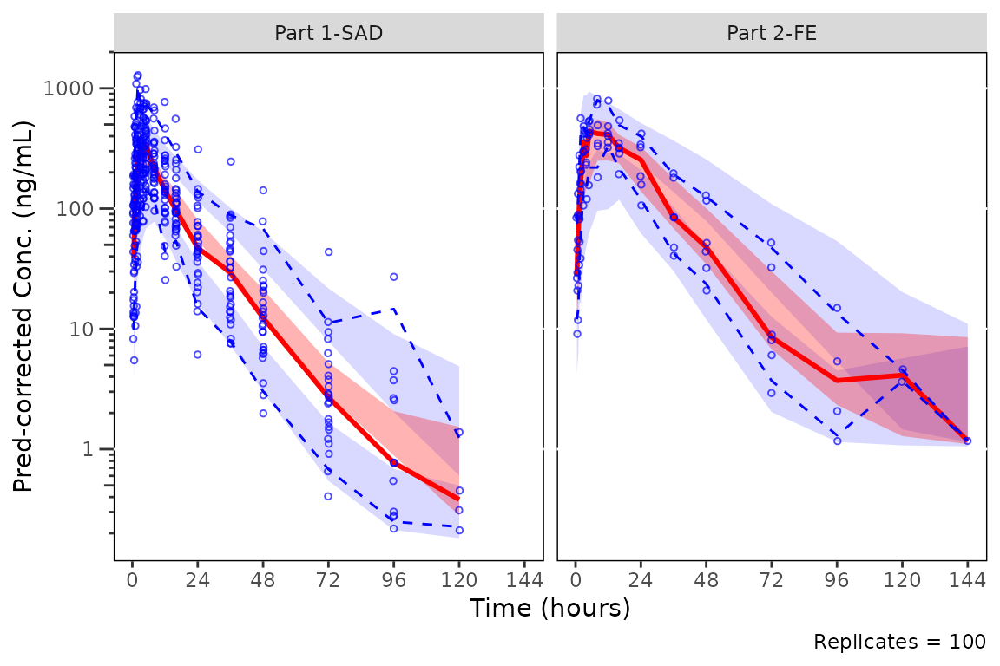

### Stratifying plots

The other option to prediction-correction is to stratify by confounding
factors. Dose is generally the minimum stratification for a VPC plot.
The variable for stratification *MUST* be passed to the argument
`strat_var` and not added later only as a `facet_wrap`/`facet_grid` call
to the returned object.
[`plot_vpc_cont()`](https://ryancrass.github.io/pmxhelpr/reference/plot_vpc_cont.md)
returns a `pmx_vpc_plot` object that emits a warning when a
[`facet_wrap()`](https://ggplot2.tidyverse.org/reference/facet_wrap.html)
or
[`facet_grid()`](https://ggplot2.tidyverse.org/reference/facet_grid.html)
layer is added with `+`, calling out that the pre-computed VPC
statistics will be inconsistent with the new panels.

Let’s take a look at our prediction-corrected VPC stratified by Food
Status.

``` r

plot_vpc_cont(
  data = mutate(simout, FoodStatus = ifelse(FOOD == 1, "Fed", "Fasted")),
  pcvpc = TRUE,
  strat_var = FoodStatus
) +
  vpc_scales_labs +
  labs(y = "Pred-corrected Conc. (ng/mL)")
```


*NOTE* Because `plot_vpc_cont` performs BOTH the summary statistic
calculation and the plotting, one cannot simply add a `facet_wrap` layer
with the stratification after calling `plot_vpc_cont`. This will result
in the binned observed quantiles and simulated intervals plotted
reflecting the unstratified data across all conditions with only the
observed points stratified.

Simulated and observed intervals in the plot below are *INCORRECT* and
reflect the full dataset, not the `DoseFood` stratification. Only the
observed points are correctly stratified, as they are added to the final
plot layer. The warning printed above the plot is emitted by the
`+.pmx_vpc_plot` method as the
[`facet_wrap()`](https://ggplot2.tidyverse.org/reference/facet_wrap.html)
layer is added.

``` r

plot_vpc_cont(
  data = simout
) +
  facet_wrap(~DoseFood) +
  vpc_scales_labs
#> Inheriting per-row `loq` from `LLOQ` column in `data`.
#> Warning: Adding `facet_*()` to a `plot_vpc_cont()` plot produces incorrect VPC statistics.
#> ℹ Summary statistics are pre-computed before plotting.
#> ℹ Pass `strat_var` to `plot_vpc_cont()` to stratify both statistics and panels correctly.
#> Warning: Removed 18 rows containing missing values or values outside the scale range
#> (`geom_line()`).
#> Warning: Removed 36 rows containing missing values or values outside the scale range
#> (`geom_line()`).
#> Warning: Removed 6 rows containing missing values or values outside the scale range
#> (`geom_line()`).
```

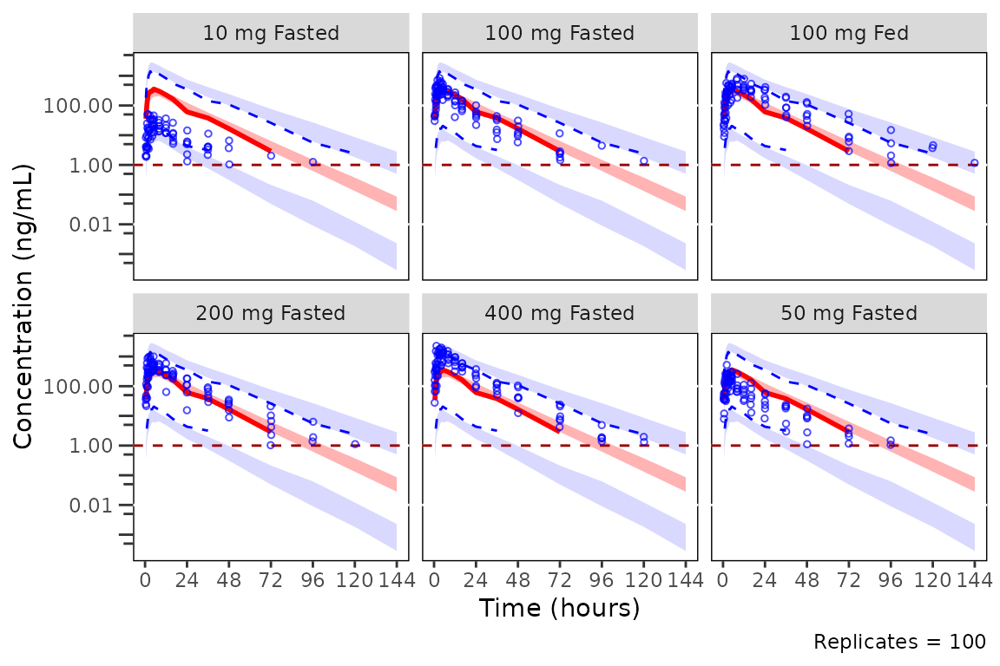

### Dropping small sample bins

There may be nominal time bins that contain only a small number of
observations that skew the simulated intervals.
[`plot_vpc_cont()`](https://ryancrass.github.io/pmxhelpr/reference/plot_vpc_cont.md)
includes the argument `min_bin_count` (default = 1), which filters out
exact bins with fewer quantifiable observations than the minimum set by
this argument. Importantly, the observed data points in these small bins
are *still plotted*; however, they do not influence the calculation of
summary statistics or summary plot elements (shaded intervals, lines).
This provides the greatest fidelity to the data visualized without
introducing visual artifacts due to small sample timepoints.

When setting `min_bin_count = 10`, summary statistics are not plotted
for the final two timepoints containing fewer than 10 quantifiable
observations; however, the observations themselves are still plotted.

``` r

plot_vpc_cont(
  data = simout,
  pcvpc = TRUE,
  min_bin_count = 10
) +
  vpc_scales_labs +
  labs(y = "Pred-corrected Conc. (ng/mL)")
```

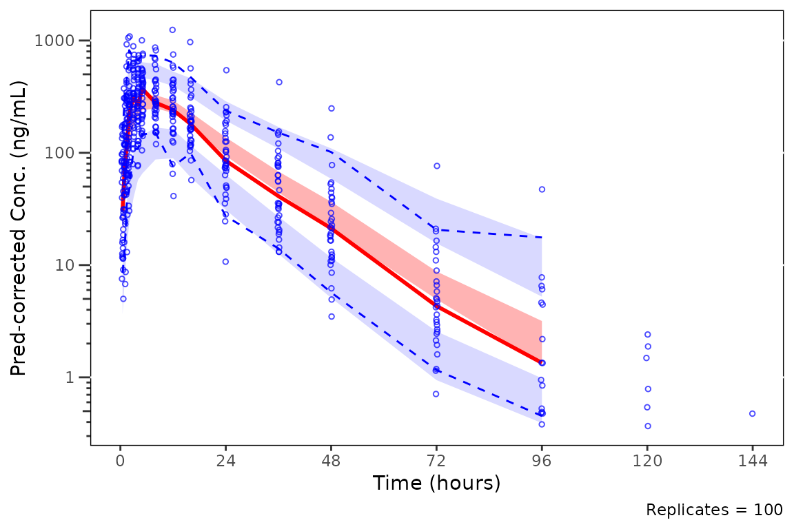

### BLQ handling

BLQ data are often ignored in population PK modeling (i.e., set as
missing; M1 method) in population. This is unlikely to introduce
appreciable bias in model parameter estimation, provided the absolute
frequency of BLQ data is low (e.g., \<10-20%) and the pattern of BLQ
censoring is in line with the expectations by dose and time.

However, the handling of BLQ data in VPCs may impact the interpretation
of these graphical model diagnostics.

Let’s generate some VPC plots to demonstrate the impact of different
approaches to BLQ handling to the visual assessment of the adequacy of
model fit and the true underlying PK profile. We will continue using the
`simout` object generated above.

Let’s start by focusing on evaluating the model fit of the 100 mg dose
level we have been exploring across Part1-SAD and Part2-FE.

``` r

sim100 <- simout %>%
  filter(DOSE == 100)
```

A common approach to plotting VPCs, especially pcVPCs, is to exclude all
`MDV=1` observations. Let’s plot using
[`plot_vpc_cont()`](https://ryancrass.github.io/pmxhelpr/reference/plot_vpc_cont.md)
filtering out `MDV=1` in the input dataset to exclude observed BLQ
timepoints.

``` r

plot_vpc_cont(
  data = filter(sim100, MDV == 0),
  pcvpc = TRUE,
  strat_var = PART
) +
  vpc_scales_labs
```

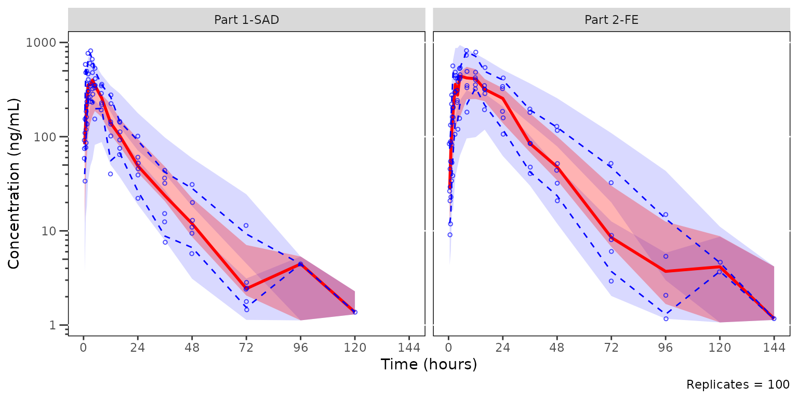

The observed median appears consistent with the exploratory
concentration-time profiles generated earlier excluding data below the
lower limit of quantification (i.e., plotting `"ODV"`). Notice that the
increasing trend in the observed quantiles at later timelines coincides
with completely overlapping simulated confidence intervals for all
quantiles. This is due to the decreasing sample size with time due to
exclusion of timepoints where `MDV=1`.

Let’s instead try specifying a new argument `loq` to
[`plot_vpc_cont()`](https://ryancrass.github.io/pmxhelpr/reference/plot_vpc_cont.md).

`loq` is the numeric value of the lower limit of quantification in the
units of the dependent variable. When specified, observed quantiles are
computed using censored quantile estimation, where values below the LLOQ
(including missing values) are treated as left-censored. If the quantile
of the observed data falls below the LLOQ, it is returned as `NA`.

``` r

vpc <- plot_vpc_cont(
  data = sim100,
  strat_var = PART,
  loq = 1
) +
  vpc_scales_labs

vpc
```


Now we see a red horizontal line depicting the LLOQ (1 ng/mL). Notice
also the increase in the y-axis range, the change in the shape of the
observed quantiles, and the greater resolution in separation between the
confidence intervals.

Specifying `loq` is the preferred method for plotting VPC diagnostics
with the `pmxhelpr` package. This is not the default method due to the
all-too-common case where the assay LLOQ is not known to the analyst.

`loq` may also be passed for prediction-corrected VPCs (`pcvpc = TRUE`).
In that case, observed and simulated values below `loq` are censored to
`NA_real_` before prediction-correction so that both data streams are
treated symmetrically, and no LOQ reference line is drawn (the LOQ has
no meaning on the prediction-corrected scale).

The unique vector of `LLOQ` values is used automatically if the variable
`"LLOQ"` is present in the input dataset. This allows for the scenario
in which there are multiple unique LLOQ values within a single pooled
analysis dataset.

``` r

plot_vpc_cont(
  data = sim100,
  strat_var = PART
) +
  vpc_scales_labs
```

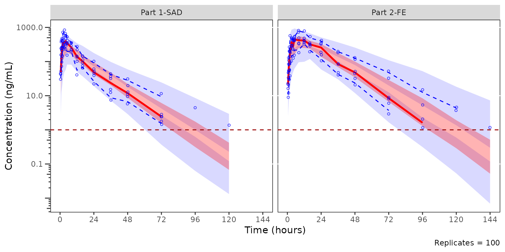

### Pooled Data with Multiple LLOQs

A common real-world scenario is a bioanalytical assay update
mid-development: an early cohort runs on the original assay (e.g., LLOQ
= 1 ng/mL) and a later cohort runs on an updated assay (e.g., LLOQ = 2
ng/mL). When the analysis dataset pools both, the `LLOQ` column carries
different values across rows. `pmxhelpr` resolves `loq` per row so each
observation is censored at its own threshold; the unique non-NA values
are surfaced via `config$loq` for plotting.

The example below mimics this scenario by re-coding `LLOQ = 2` for the
Part 2 food-effect cohort while leaving Part 1 at the original
`LLOQ = 1`.

``` r

sim100_multi_loq <- sim100
sim100_multi_loq$LLOQ[sim100_multi_loq$PART == "Part 2-FE"] <- 2
distinct(sim100_multi_loq, PART, LLOQ)
#>         PART LLOQ
#> 1 Part 1-SAD    1
#> 2  Part 2-FE    2
```

Calling
[`df_vpcstats()`](https://ryancrass.github.io/pmxhelpr/reference/df_vpcstats.md)
on this pooled dataset emits the per-row inheritance message and stores
the sorted unique values in `config$loq`. The row-aligned threshold
remains accessible on `out_multi$obs$LOQ` for any downstream code that
needs the per-observation value.

``` r

out_multi <- df_vpcstats(sim100_multi_loq, strat_var = PART)
#> Inheriting per-row `loq` from `LLOQ` column in `data`.
out_multi$config$loq
#> [1] 1 2
```

[`plot_vpc_cont()`](https://ryancrass.github.io/pmxhelpr/reference/plot_vpc_cont.md)
consumes the precomputed stats and draws one dashed reference line per
unique LLOQ value.

``` r

vpc_multi <- plot_vpc_cont(out_multi) + vpc_scales_labs
vpc_multi
```

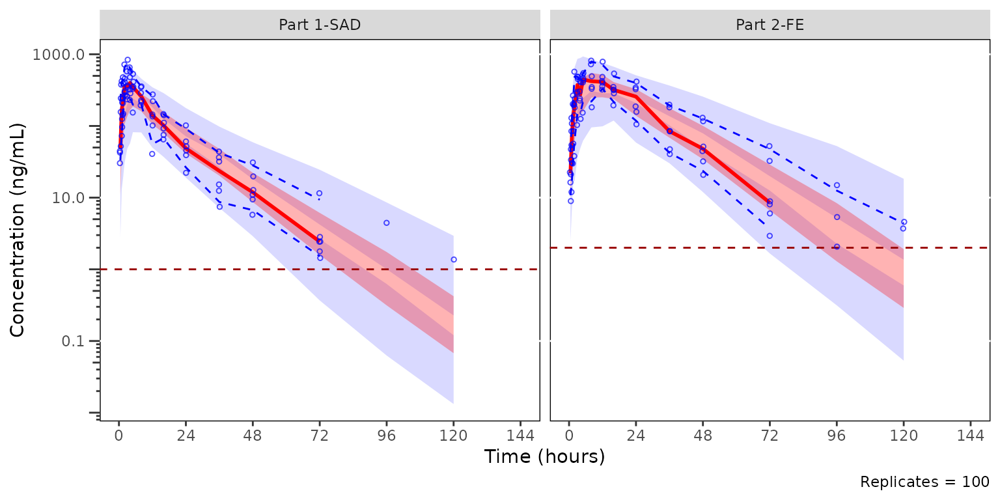

Each facet renders only the LLOQ(s) applicable to that strat-level: Part
1-SAD shows the LLOQ = 1 line and Part 2-FE shows LLOQ = 2. The ref-line
set is recomputed at plot time from the row-aligned `obs$LOQ` column
grouped by `strat_var`, so the visualization stays in sync with whatever
per-row inheritance produced. The legend (built from
`out_multi$config$loq`) still summarizes the analysis-wide set of LLOQs,
since the legend is a figure-level annotation rather than a facet-level
one.

[`plot_vpc_legend()`](https://ryancrass.github.io/pmxhelpr/reference/plot_vpc_legend.md)
accepts the same vector and registers one entry per unique LLOQ value.

``` r

vpc_multi_legend <- plot_vpc_legend(lloq = out_multi$config$loq)
vpc_multi_legend
```


Composing the plot and legend with `patchwork` yields a single figure
where both LLOQ thresholds are simultaneously labeled.

``` r

vpc_multi + vpc_multi_legend + plot_layout(heights = c(2.5, 1))
```

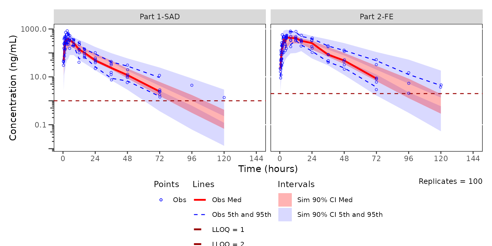

Passing `out_multi$config$loq` directly to
[`plot_vpc_legend()`](https://ryancrass.github.io/pmxhelpr/reference/plot_vpc_legend.md)
keeps the legend in sync with whatever LLOQs
[`df_vpcstats()`](https://ryancrass.github.io/pmxhelpr/reference/df_vpcstats.md)
discovered, with no need to hardcode the value set at the call site.

### Reusing precomputed stats

[`plot_vpc_cont()`](https://ryancrass.github.io/pmxhelpr/reference/plot_vpc_cont.md)
also accepts the list returned by
[`df_vpcstats()`](https://ryancrass.github.io/pmxhelpr/reference/df_vpcstats.md)
directly. This skips the preprocess + compute steps and is useful when
you want to inspect the summary statistics and then plot the same data
multiple times — for example, flipping between the standard and
prediction-corrected views, or rendering with a different
`min_bin_count`, `shown`, or `theme` — without paying the summarization
cost on every call.

The
[`df_vpcstats()`](https://ryancrass.github.io/pmxhelpr/reference/df_vpcstats.md)
return is class-tagged `"vpc_stats"` (see [Inspecting the `vpc_stats`
object](#inspecting-the-vpc_stats-object) above for
[`print()`](https://rdrr.io/r/base/print.html) /
[`summary()`](https://rdrr.io/r/base/summary.html) /
[`as.data.frame()`](https://rdrr.io/r/base/as.data.frame.html) /
[`is_vpc_stats()`](https://ryancrass.github.io/pmxhelpr/reference/is_vpc_stats.md)
usage). Use `out$stats` and `out$obs` to access the underlying frames
directly.

``` r

out <- df_vpcstats(data = simout, strat_var = DoseFood)
#> Inheriting per-row `loq` from `LLOQ` column in `data`.

# Standard VPC view from the precomputed result
plot_vpc_cont(out, pcvpc = FALSE) + vpc_scales_labs
```

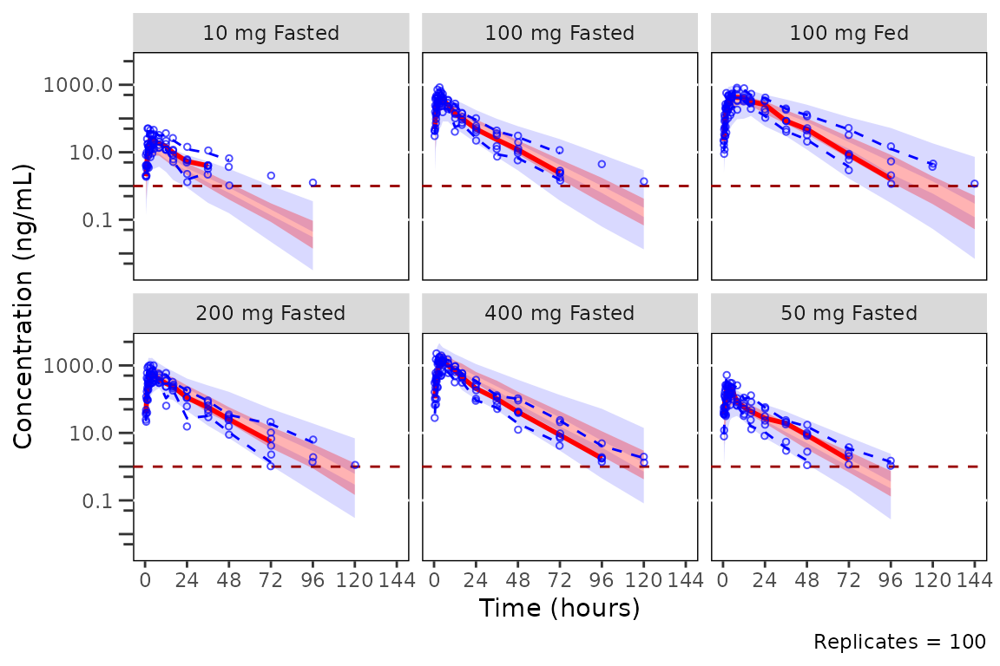

``` r


# Prediction-corrected view from the same precomputed result
plot_vpc_cont(out, pcvpc = TRUE) +
  vpc_scales_labs +
  labs(y = "Pred-corrected Conc. (ng/mL)")
```

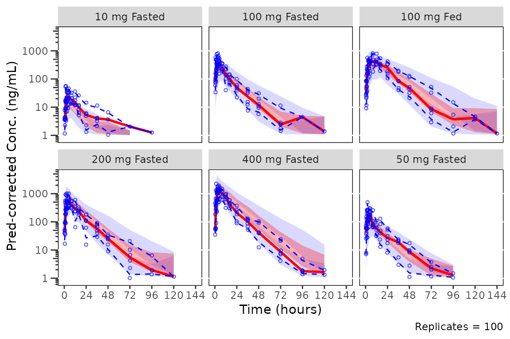

When `data` is a precomputed
[`df_vpcstats()`](https://ryancrass.github.io/pmxhelpr/reference/df_vpcstats.md)
result, the pipeline arguments (`strat_var`, `loq`, `mode`, `pi`, `ci`,
column-name args) **cannot** be honored — those decisions were already
made when
[`df_vpcstats()`](https://ryancrass.github.io/pmxhelpr/reference/df_vpcstats.md)
ran, and re-passing them on the cached path would silently shadow the
original values. Passing any of them aborts with a message pointing the
caller back at
[`df_vpcstats()`](https://ryancrass.github.io/pmxhelpr/reference/df_vpcstats.md).
Only plot-only arguments (`min_bin_count`, `show_rep`, `shown`, `theme`,
`pcvpc`) are accepted on this path; to change a pipeline setting, re-run
[`df_vpcstats()`](https://ryancrass.github.io/pmxhelpr/reference/df_vpcstats.md)
and pass the new result.

`plot_vpc_cont` censors quantiles of the observed data displayed as
lines when the corresponding quantile of observations is BLQ. This is
done automatically if the variable `LLOQ` is present in the input
simulated dataset.

### Adjusting the elements displayed

The default elements shown in the plot are controlled by the `shown`
argument in
[`plot_vpc_cont()`](https://ryancrass.github.io/pmxhelpr/reference/plot_vpc_cont.md).

The default is as follows:

``` r

plot_vpc_shown()
#> $obs_point
#> [1] TRUE
#> 
#> $obs_pi_line
#> [1] TRUE
#> 
#> $obs_median_line
#> [1] TRUE
#> 
#> $sim_pi_line
#> [1] FALSE
#> 
#> $sim_pi_ci
#> [1] TRUE
#> 
#> $sim_pi_area
#> [1] FALSE
#> 
#> $sim_median_line
#> [1] FALSE
#> 
#> $sim_median_ci
#> [1] TRUE
```

The components of the list correspond to the following vpc plot
elements:

- Observed points: `obs_point`
- Observed quantile lines: `obs_pi_line`
- Observed median line: `obs_median_line`
- Simulated prediction interval lines: `sim_pi_line`
- Simulated prediction interval CI: `sim_pi_ci`
- Simulated prediction interval area: `sim_pi_area`
- Simulated median line: `sim_median_line`
- Simulated median CI: `sim_median_ci`

One or more elements to be updated from the defaults above can be passed
as a list to the argument `shown`. Any elements not specified in `shown`
will inherit the defaults.

For example, the 90% prediction interval (i.e., 5th to 95th percentiles)
can be visualized in place of CIs of each of the 5th and 95th
percentiles with the observed and simulated medians shown as follows:

``` r

plot_vpc_cont(
  data = simout,
  pcvpc = TRUE,
  min_bin_count = 5,
  shown = plot_vpc_shown(obs_pi_line = FALSE, sim_pi_ci = FALSE, sim_median_ci = FALSE, sim_median_line = TRUE, sim_pi_area = TRUE)
) +
  vpc_scales_labs +
  labs(y = "Pred-corrected Conc. (ng/mL)")
#> Inheriting per-row `loq` from `LLOQ` column in `data`.
```

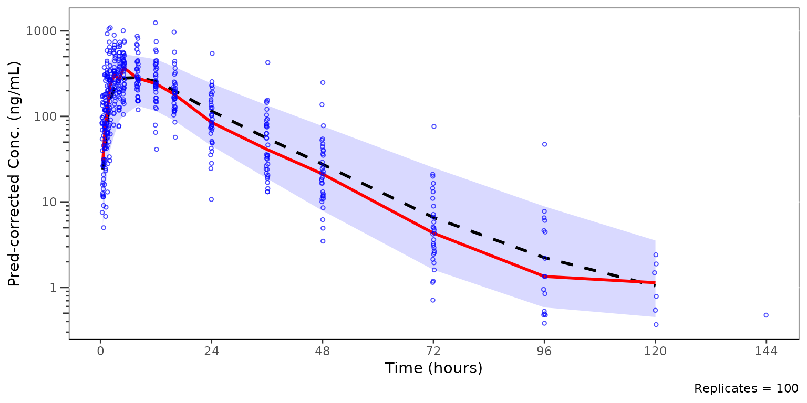

Now, let’s say we want to remove the observed data points from the plot
above to better visualize the observed quantile lines relative to their
corresponding simulated confidence intervals. This can be accomplished
with `shown`.

``` r

plot_vpc_cont(
  data = simout,
  pcvpc = TRUE,
  min_bin_count = 5,
  shown = plot_vpc_shown(obs_point = FALSE)
) +
  vpc_scales_labs +
  labs(y = "Pred-corrected Conc. (ng/mL)")
#> Inheriting per-row `loq` from `LLOQ` column in `data`.
```

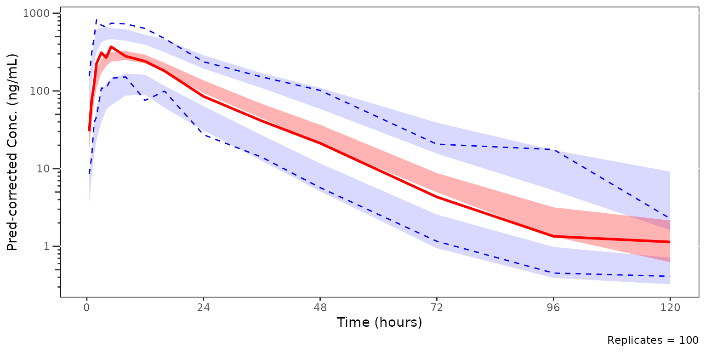

We could also take this one step further and only look at the median and
the simulated confidence interval of the median, to closely interrogate
central tendency. This is common for VPC strata which have few
observations, leading to inadequate sample size to discriminate between
the confidence intervals of the median and the extremes. This is common
scenario when evaluating VPC plots stratified by individual study arms
in early phase trials.

``` r

plot_vpc_cont(
  data = simout,
  pcvpc = TRUE,
  min_bin_count = 5,
  shown = plot_vpc_shown(obs_point = FALSE, obs_pi_line = FALSE, sim_pi_ci = FALSE)
) +
  vpc_scales_labs +
  labs(y = "Pred-corrected Conc. (ng/mL)")
#> Inheriting per-row `loq` from `LLOQ` column in `data`.
```

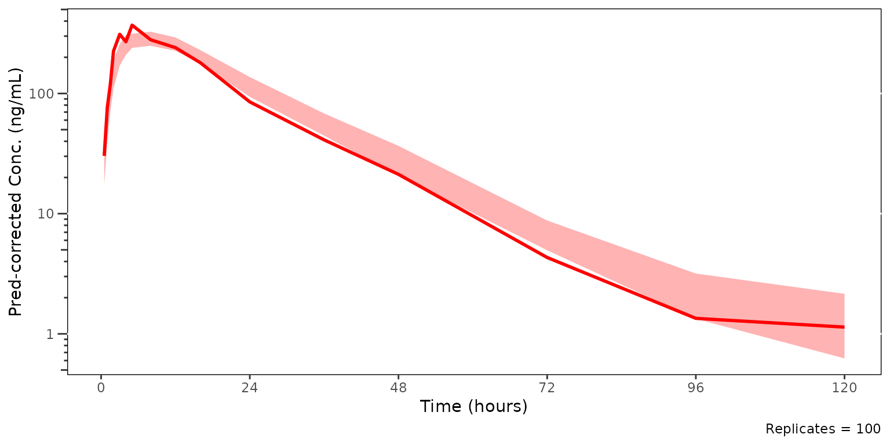

### Building plots from a `vpc_stats` object directly

For downstream code or custom workflows that produce a
`vpc_stats`-shaped object outside
[`df_vpcstats()`](https://ryancrass.github.io/pmxhelpr/reference/df_vpcstats.md)
(e.g. external preprocessing, snapshot fixtures),
[`plot_build_vpc()`](https://ryancrass.github.io/pmxhelpr/reference/plot_build_vpc.md)
is exported as the public renderer. It is the same engine that
[`plot_vpc_cont()`](https://ryancrass.github.io/pmxhelpr/reference/plot_vpc_cont.md)
uses internally and accepts the same plot-only arguments
(`min_bin_count`, `show_rep`, `shown`, `theme`, `pcvpc`). `strat_var`
and `loq` inherit from the container’s `$config` slot when not passed
explicitly.

``` r

plot_build_vpc(out, pcvpc = FALSE) + vpc_scales_labs
```


## Adjusting the Plot Theme with `plot_vpc_theme()`

The default aesthetics for VPC plots are controlled via
[`plot_vpc_theme()`](https://ryancrass.github.io/pmxhelpr/reference/plot_vpc_theme.md).
See the [Plot Themes and
Aesthetics](https://ryancrass.github.io/pmxhelpr/articles/plot-themes.md)
vignette for details on the theme system, element constructors, and
examples of customizing VPC aesthetics.

``` r

plot_vpc_theme()
#> <plot_vpc_theme>
#>   obs_point       <pmx_point>: shape = 1, size = 1, alpha = 0.7, color = #0000FF
#>   obs_median_line <pmx_line>: linewidth = 1, linetype = solid, color = #FF0000
#>   obs_pi_line     <pmx_line>: linewidth = 0.5, linetype = dashed, color = #0000FF
#>   sim_pi_line     <pmx_line>: linewidth = 1, linetype = dotted, color = #000000
#>   sim_pi_ci       <pmx_ribbon>: fill = #0000FF, alpha = 0.15
#>   sim_pi_area     <pmx_ribbon>: fill = #0000FF, alpha = 0.15
#>   sim_median_line <pmx_line>: linewidth = 1, linetype = dashed, color = #000000
#>   sim_median_ci   <pmx_ribbon>: fill = #FF0000, alpha = 0.3
#>   loq_line        <pmx_line>: linewidth = 0.5, linetype = dashed, color = #990000
```

We can define an alternative theme using a blue / grey color schema
using this function and the constructor helpers.

``` r

vpc_new_theme <- plot_vpc_theme(
  obs_point = pmx_point(color = "#000000"),
  obs_median_line = pmx_line(color = "#000000"),
  obs_pi_line = pmx_line(color = "#000000"),
  sim_median_ci = pmx_ribbon(fill = "#3388cc"),
  sim_pi_ci = pmx_ribbon(fill = "#3388cc")
)
```

Regenerating our BLQ quantile censored plot stratified by part with the
new theme yields the following plot

``` r

vpc2 <- plot_vpc_cont(
  data = sim100,
  strat_var = PART,
  loq = 1,
  theme = vpc_new_theme
) +
  vpc_scales_labs

vpc2
```

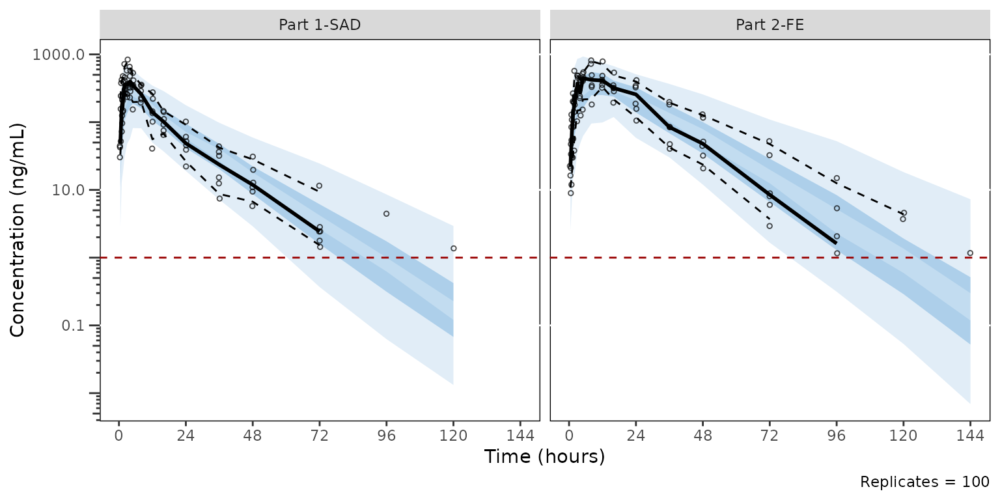

### Modifying Axes and Labels

Because
[`plot_vpc_cont()`](https://ryancrass.github.io/pmxhelpr/reference/plot_vpc_cont.md)
returns a `ggplot2` object, the y-axis can be transformed to log10 scale
by adding
[`scale_y_log10()`](https://ggplot2.tidyverse.org/reference/scale_continuous.html)
as a layer. This approach avoids any data transformation prior to
calculating summary statistics, ensuring all quantile calculations are
performed on the original scale.

Similarly, the axis labels can be controlled with `labs` and the x-axis
breaks can be set to more reasonable values for time units using
[`scale_x_continuous()`](https://ggplot2.tidyverse.org/reference/scale_continuous.html).

## VPC Plots with `plot_vpc_cens()`

[`plot_vpc_cens()`](https://ryancrass.github.io/pmxhelpr/reference/plot_vpc_cens.md)
is the companion diagnostic to
[`plot_vpc_cont()`](https://ryancrass.github.io/pmxhelpr/reference/plot_vpc_cont.md).
Where
[`plot_vpc_cont()`](https://ryancrass.github.io/pmxhelpr/reference/plot_vpc_cont.md)
evaluates whether the model reproduces the dynamic range of the data
above the LOQ,
[`plot_vpc_cens()`](https://ryancrass.github.io/pmxhelpr/reference/plot_vpc_cens.md)
evaluates whether it reproduces the proportion of BLQ observations over
time. It plots `obs_prop_blq` (the per-bin observed BLQ proportion) and
the non-parametric confidence interval of `sim_prop_blq` across
replicates.

Both quantities are already computed by
[`df_vpcstats()`](https://ryancrass.github.io/pmxhelpr/reference/df_vpcstats.md)
whenever a LOQ source (scalar `loq` or `LLOQ` column) is available, so
[`plot_vpc_cens()`](https://ryancrass.github.io/pmxhelpr/reference/plot_vpc_cens.md)
is a thin plotting wrapper over the same VPC summary pipeline used by
[`plot_vpc_cont()`](https://ryancrass.github.io/pmxhelpr/reference/plot_vpc_cont.md).

[`plot_vpc_cens()`](https://ryancrass.github.io/pmxhelpr/reference/plot_vpc_cens.md)
is standard-VPC only, as LOQ has no meaning on the prediction-corrected
scale, and the `pcvpc` argument is omitted. A LOQ source is required
(scalar `loq` or an `LLOQ` column inherited from `data`).

Like
[`plot_vpc_cont()`](https://ryancrass.github.io/pmxhelpr/reference/plot_vpc_cont.md),
[`plot_vpc_cens()`](https://ryancrass.github.io/pmxhelpr/reference/plot_vpc_cens.md)
also accepts a pre-computed list returned by
[`df_vpcstats()`](https://ryancrass.github.io/pmxhelpr/reference/df_vpcstats.md)
directly. This workflow adds efficiencies for cases where a user wants
to evaluate the continuous and censored ranges with the same binning.

``` r

plot_vpc_cens(
  data = sim100,
  strat_var = PART,
  loq = 1
) +
  vpc_cens_scales_labs
```

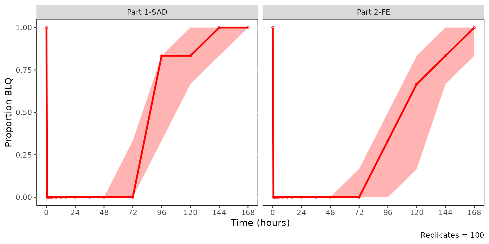

The ribbon is the non-parametric CI of the simulated BLQ proportion
across replicates (controlled by `ci`), and the solid red line and
points show the observed proportion per bin. A well-fitting model places
the observed line inside the simulated CI band. The simulated median
line is hidden by default. It can be enabled via
`shown = plot_vpc_shown(sim_median_line = TRUE)`.

[`plot_vpc_cens()`](https://ryancrass.github.io/pmxhelpr/reference/plot_vpc_cens.md)
reuses
[`plot_vpc_shown()`](https://ryancrass.github.io/pmxhelpr/reference/plot_vpc_shown.md)
and
[`plot_vpc_theme()`](https://ryancrass.github.io/pmxhelpr/reference/plot_vpc_theme.md)
— only the keys `obs_point`, `obs_median_line`, `sim_median_line`, and
`sim_median_ci` are read with other keys ignored.

### Dropping small sample bins

[`plot_vpc_cens()`](https://ryancrass.github.io/pmxhelpr/reference/plot_vpc_cens.md)
accepts the same `min_bin_count` argument as
[`plot_vpc_cont()`](https://ryancrass.github.io/pmxhelpr/reference/plot_vpc_cont.md),
but the count statistic it filters against differs by design.
[`plot_vpc_cont()`](https://ryancrass.github.io/pmxhelpr/reference/plot_vpc_cont.md)
counts **quantifiable** (non-missing, non-BLQ) observations per bin —
values that contribute to the continuous range quantiles.
[`plot_vpc_cens()`](https://ryancrass.github.io/pmxhelpr/reference/plot_vpc_cens.md)
counts **total** observations per bin, including BLQ records, because
the BLQ frequency is the diagnostic.

The practical consequence: for a bin with 12 observations and 8 BLQ
values, `plot_vpc_cont(min_bin_count = 10)` drops the bin (only 4
quantifiable observations meet the threshold) while
`plot_vpc_cens(min_bin_count = 10)` keeps it (12 total observations meet
the threshold). Set `min_bin_count` per-function rather than reusing a
single threshold across both diagnostics — the same numeric value will
not in general produce the same bin-retention behavior.

A second contrast worth noting: because `obs_n` is determined by the
protocol-specified sampling schedule (every subject in a stratum
contributes one observation per nominal time bin), `obs_n` is
effectively constant across bins within a stratum. As a result,
`min_bin_count` on a cens VPC behaves more like a stratum-level filter
than the bin-level filter it is on a cont VPC. The example below uses
the full `simout` (across all SAD dose levels) so that Part 1-SAD has 30
observations per bin (5 dose cohorts × 6 subjects) while Part 2-FE has
6. Setting `min_bin_count = 10` retains every Part 1-SAD bin and drops
the entire Part 2-FE panel.

``` r

cens_vpc <- plot_vpc_cens(
  data = simout,
  strat_var = PART,
  loq = 1,
  min_bin_count = 10
) +
  vpc_cens_scales_labs
cens_vpc
```

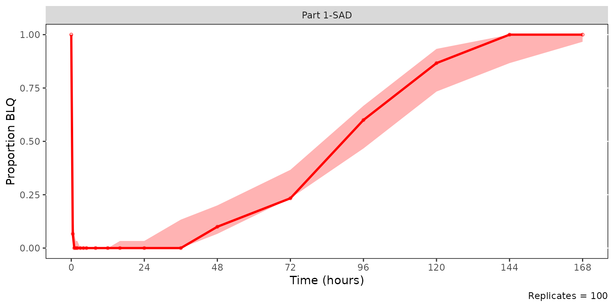

### Pairing pcVPC and cens VPC for the same strata

[`plot_vpc_cont()`](https://ryancrass.github.io/pmxhelpr/reference/plot_vpc_cont.md)
and
[`plot_vpc_cens()`](https://ryancrass.github.io/pmxhelpr/reference/plot_vpc_cens.md)
are complementary halves of a single diagnostic: the pcVPC interrogates
whether the model captures the dynamic range above LOQ, while the cens
VPC interrogates whether it captures the censoring frequency. Composed
together on a shared time axis they make one figure that summarizes both
halves of the diagnostic for the same stratification.

Build the pcVPC and cens VPC on `sim100` using `strat_var = PART`. The
bottom panel will carry the shared x-axis label, so the top panel sets
`x = NULL`.

``` r

patch_stats <- df_vpcstats(data = sim100, strat_var = PART)

pcvpc_patch <- plot_vpc_cont(
  data = patch_stats,
  pcvpc = TRUE
) +
  vpc_scales_labs +
  labs(x = NULL, y = "Pred-corrected Conc. (ng/mL)")

cens_vpc_patch <- plot_vpc_cens(
  data = patch_stats
) +
  vpc_cens_scales_labs
```

Stack the two diagnostics vertically with `patchwork`,
prediction-corrected continuous range on top and censored range below.
Both panels are built from the same `sim100` data and the same `PART`
stratification, so the time bins align across the figure.

``` r

pcvpc_patch / cens_vpc_patch + plot_layout(heights = c(2, 1))
```

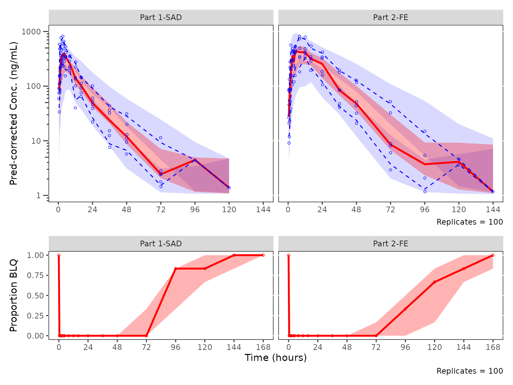

## VPC Plot Legends with `plot_vpc_legend()`

This section will review the functionality for generating legends for
VPC plots with
[`plot_vpc_legend()`](https://ryancrass.github.io/pmxhelpr/reference/plot_vpc_legend.md)

[`plot_vpc_legend()`](https://ryancrass.github.io/pmxhelpr/reference/plot_vpc_legend.md)
is a helper plotting function that creates a legend for VPC plots. These
legends can then be merged with the VPC plot into a single plot object
using the `patchwork` package.

### Defaults for Continuous Range VPCs in `plot_vpc_legend()`

To obtain a legend for a quantifiable range VPC plot using default
aesthetics, run
[`plot_vpc_legend()`](https://ryancrass.github.io/pmxhelpr/reference/plot_vpc_legend.md).
The default type argument is `type="cont"` for continuous range VPC.

Pass `lloq` to include an LLOQ entry that mirrors the reference line
drawn by
[`plot_vpc_cont()`](https://ryancrass.github.io/pmxhelpr/reference/plot_vpc_cont.md).

``` r

vpc_legend <- plot_vpc_legend(lloq = 1)
vpc_legend
```


The legend can then be combined with the ggplot object returned from
[`plot_vpc_cont()`](https://ryancrass.github.io/pmxhelpr/reference/plot_vpc_cont.md)
into a single plot object with the `patchwork` package. We pair the
default-theme legend with `vpc` (the LOQ-censored, PART-stratified plot
from the [BLQ handling](#blq-handling) section, which also uses the
default theme).

``` r

vpc_wleg <- vpc + vpc_legend + plot_layout(heights = c(2.5, 1))
vpc_wleg
```

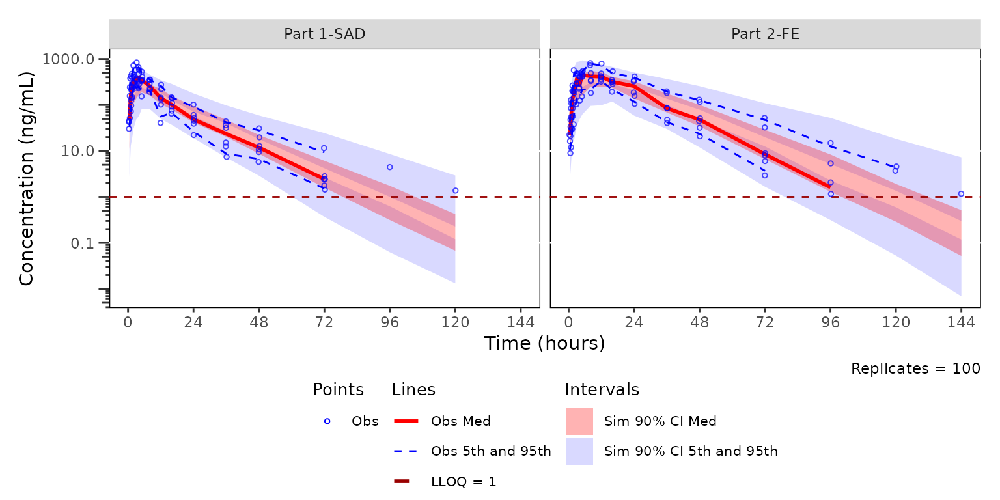

### Updating the Continuous Range Legend Elements with `plot_vpc_shown()`

The legend can be updated to remove or add elements based on `shown`
argument common to
[`plot_vpc_cont()`](https://ryancrass.github.io/pmxhelpr/reference/plot_vpc_cont.md)
and
[`plot_vpc_legend()`](https://ryancrass.github.io/pmxhelpr/reference/plot_vpc_legend.md).
The defaults list can be viewed and updated globally to be passed to all
plots in a VPC workflow using
[`plot_vpc_shown()`](https://ryancrass.github.io/pmxhelpr/reference/plot_vpc_shown.md).
Assigning the modified element set to a `shown_elements` object lets the
same configuration be reused by both the plot and the legend.

``` r

shown_elements <- plot_vpc_shown(obs_pi_line = FALSE, sim_pi_ci = FALSE)
plot_vpc_legend(shown = shown_elements)
```


### Updating the Continuous Range Legend Theme with `plot_vpc_legend()`

The legend can also be updated with the updated VPC plot theme elements.
This is easiest to do by setting a new theme object, which we did
previously when we created `vpc_new_theme` with
[`plot_vpc_theme()`](https://ryancrass.github.io/pmxhelpr/reference/plot_vpc_theme.md).
We can use this same theme list object to generate the VPC plot with
[`plot_vpc_cont()`](https://ryancrass.github.io/pmxhelpr/reference/plot_vpc_cont.md)
and the VPC legend with
[`plot_vpc_legend()`](https://ryancrass.github.io/pmxhelpr/reference/plot_vpc_legend.md),
again passing `lloq = 1` to keep the legend in sync with the LLOQ ref
line on `vpc2`.

``` r

vpc_new_legend <- plot_vpc_legend(lloq = 1, theme = vpc_new_theme)
vpc_new_legend
```


The legend can then be combined with the ggplot object returned from
[`plot_vpc_cont()`](https://ryancrass.github.io/pmxhelpr/reference/plot_vpc_cont.md)
into a single plot object with the `patchwork` package. We pair
`vpc_new_legend` (which uses `vpc_new_theme`) with `vpc2` (the same VPC
plot rendered with `vpc_new_theme` earlier).

``` r

vpc_wleg2 <- vpc2 + vpc_new_legend + plot_layout(heights = c(2.5, 1))
vpc_wleg2
```

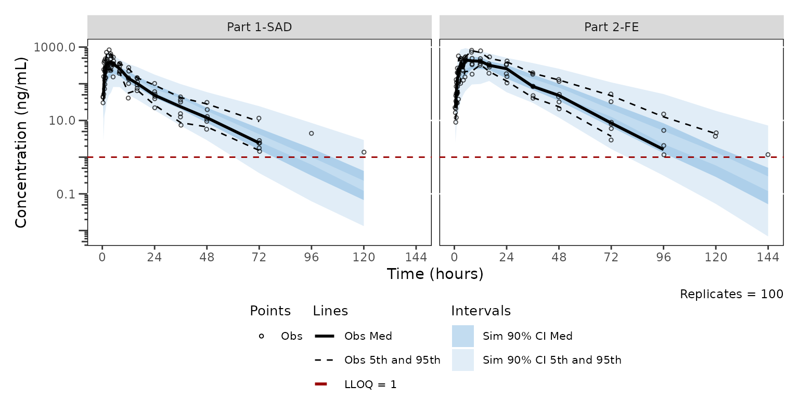

### Updating the censored range legend elements and theme with `plot_vpc_shown()` and `plot_vpc_legend(type = "cens")`

By default `sim_median_line` is hidden
([`plot_vpc_shown()`](https://ryancrass.github.io/pmxhelpr/reference/plot_vpc_shown.md)
sets it to `FALSE`) and `sim_median_ci` inherits the same red fill as
`obs_median_line` from
[`plot_vpc_theme()`](https://ryancrass.github.io/pmxhelpr/reference/plot_vpc_theme.md).
This is fine when only the ribbon is shown, but enabling the simulated
median line on top of the default theme places a black dashed line over
a red ribbon next to a red observed line. With these aesthetics, the red
observed line could easily be mistaken for a simulation element given
color homology with the simulated interval.

A practical convention is to (a) enable `sim_median_line` so the
simulated central tendency is visible alongside its CI, and (b) recolor
the simulated layers together so the line and ribbon read as one
element, with the observed layers in a contrasting color.

[`plot_vpc_cens()`](https://ryancrass.github.io/pmxhelpr/reference/plot_vpc_cens.md)
reads four `shown` keys (`obs_point`, `obs_median_line`,
`sim_median_line`, `sim_median_ci`) and the four corresponding `theme`
keys. Build matching `cens_shown` and `cens_theme` objects so the change
is explicit and reusable:

``` r

cens_shown <- plot_vpc_shown(sim_median_line = TRUE)

cens_theme <- plot_vpc_theme(
  obs_point       = pmx_point(color = "#000000"),
  obs_median_line = pmx_line(color = "#000000"),
  sim_median_line = pmx_line(color = "#3388cc", linetype = "solid"),
  sim_median_ci   = pmx_ribbon(fill = "#3388cc")
)
```

Re-render the cens VPC with both objects applied. The simulated median
sits inside its 90% CI ribbon (both blue), while the observed proportion
is drawn in black for visual separation.

``` r

cens_vpc_themed <- plot_vpc_cens(
  data = sim100,
  strat_var = PART,
  loq = 1,
  shown = cens_shown,
  theme = cens_theme
) +
  vpc_cens_scales_labs

cens_vpc_themed
```

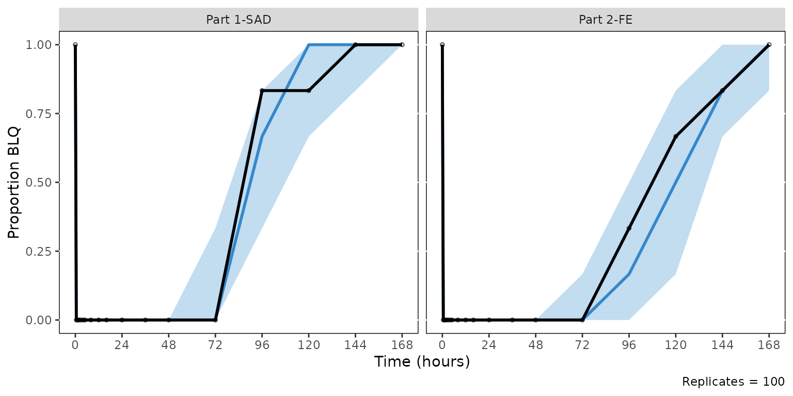

[`plot_vpc_legend()`](https://ryancrass.github.io/pmxhelpr/reference/plot_vpc_legend.md)
accepts the same `shown` and `theme` objects, so passing them alongside
`type = "cens"` keeps the legend in sync with whatever combination of
visibility toggles and aesthetic overrides was used for the panel. The
`Sim Prop BLQ` entry now appears (because `sim_median_line` is on) and
both simulated entries adopt the unified blue.

``` r

cens_legend_themed <- plot_vpc_legend(
  type = "cens",
  lloq = 1,
  shown = cens_shown,
  theme = cens_theme
)

cens_vpc_themed + cens_legend_themed + plot_layout(heights = c(2.5, 1))
```

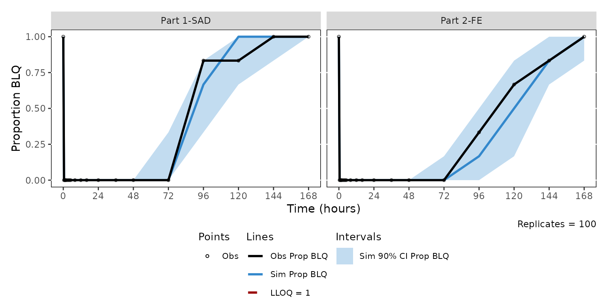

### Patchworked legend with `plot_vpc_legend(type = "cens")`

[`plot_vpc_legend()`](https://ryancrass.github.io/pmxhelpr/reference/plot_vpc_legend.md)
accepts `type = "cens"` argument to produce a legend with the default
labels for a censored data VPC (`"Obs Prop BLQ"`, `"Sim Prop BLQ"`,
`"Sim 90% CI Prop BLQ"`). Prediction-interval related entries are
suppressed regardless of `shown`.

Pass `lloq` to mirror the LOQ source the cens VPC was built against.

``` r

cens_legend <- plot_vpc_legend(type = "cens", lloq = 1)
cens_legend
```


The cens VPC and its legend can be combined into a single figure with
the `patchwork` package, using the same heights ratio established for
the cont legend pattern.

``` r

cens_vpc + cens_legend + plot_layout(heights = c(2.5, 1))
```

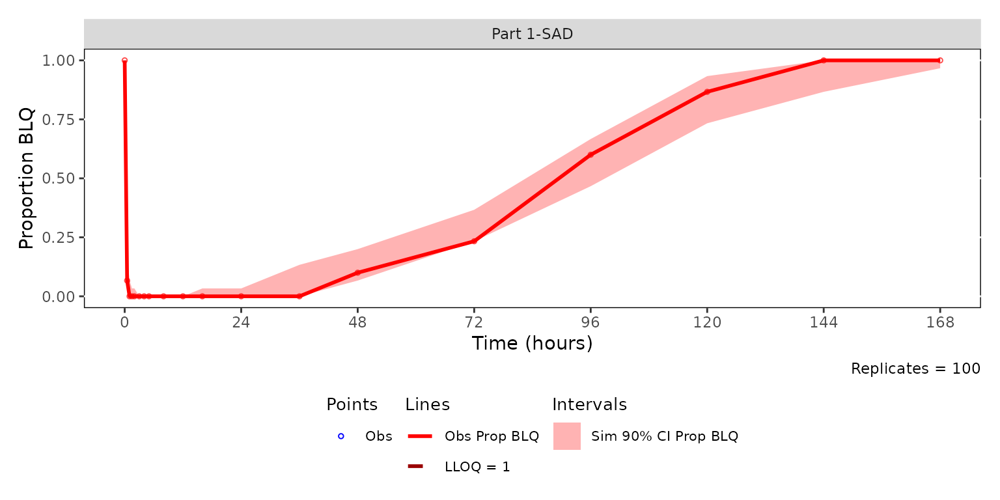

### Panel observed and censored range VPCs together with legends using `patchwork`

We can add legends to our stacked continuous data range pcVPC on top and
censored data range VPC on bottom. Both panels are built from the same
`sim100` data and the same `PART` stratification, so the time bins align
across the figure.

``` r

pcvpc_patch / vpc_legend / cens_vpc_patch / cens_legend + 
  plot_layout(heights = c(2, 0.5, 2, 0.5))
```

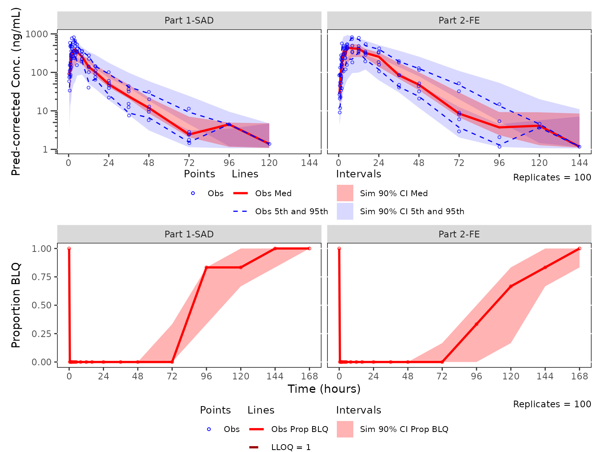

## See also

- [PK and PK/PD EDA
  workflow](https://ryancrass.github.io/pmxhelpr/articles/eda-pk-pkpd-workflow.md)
  — exploratory analysis of continuous longitudinal concentration-time
  data, response-time, and response-concentration data.
